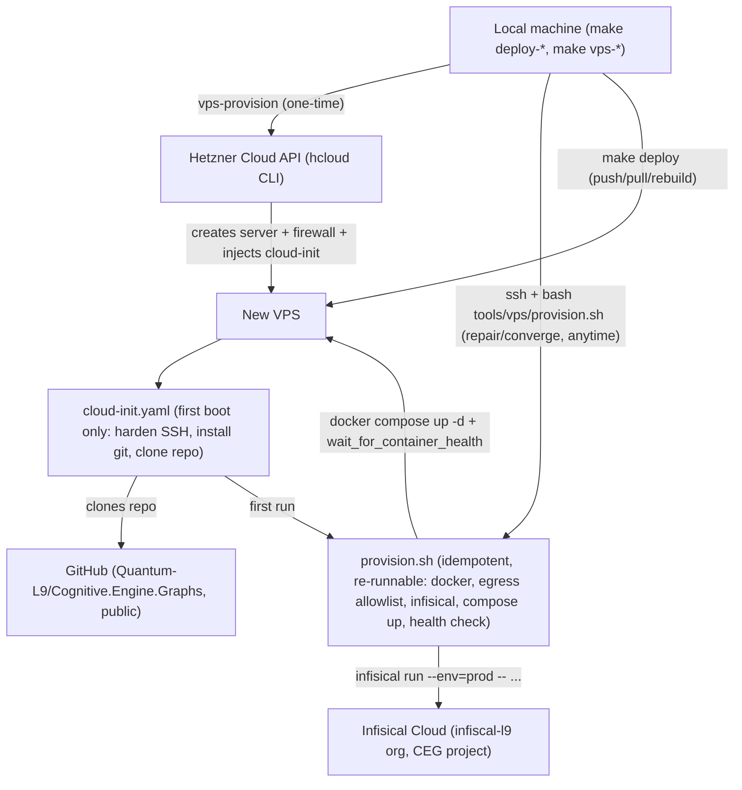

# VPS IaC + Secrets Rebuild Plan

## Why (confirmed this session)

- SSH to the current production box (`178.104.43.11`) returns `Permission denied (publickey,password)` — verified live. No `Host` entry for it exists in `~/.ssh/config`, and `hcloud` has no active context/token. From this machine, there is currently no way to control that box at all.
- `terraform/modules/health/main.tf` is a non-functional stub (real resource block commented out, targets AWS ECS/Cloud Run — wrong cloud entirely).
- `.github/workflows/k8s-deploy.yml` deploys to a Helm chart (`deploy/helm/chart`) and Kubernetes cluster that don't exist for this repo.
- [README.md](README.md) (~L134, L218-222) and [scripts/README.md](scripts/README.md) (~L15, L23) reference an `iac/` Terraform directory that does not exist in the repo.
- Production secrets (`NEO4J_PASSWORD`, `API_SECRET_KEY`, etc., per [docker-compose.prod.yml](docker-compose.prod.yml)) exist nowhere except inside `/opt/ceg/.env` on the now-inaccessible box.
- The repo's own [docs/DEPLOYMENT.md](docs/DEPLOYMENT.md) firewall table was never actually enforced on the box — it's aspirational documentation, not a real rule.
- User confirmed: destroy the old box and start fresh (nothing on it needs preserving); use a lightweight, no-Terraform-state approach; use the existing Infisical org `infiscal-l9` (org ID `3c670249-f10a-4966-8987-6b257fdbfb55`) for secrets, matching the convention already established in the `@quantum-l9/infisical-config` package (Machine Identity, Universal Auth). CEG is Python, so it uses the `infisical` CLI directly rather than that Node package.
- User pointed at `https://github.com/Quantum-L9/igorbot` (private repo, confirmed readable via `gh`) as having "a provision script that worked well" — reviewed it in full; see harvest section below.
- Repo `Quantum-L9/Cognitive.Engine.Graphs` is **public**, so the bootstrap step can `git clone` it with no deploy key.

## What was harvested from `Quantum-L9/igorbot` (and what wasn't)

Reviewed: `deploy.sh` (their root "unified provisioner"), `bin/ufw-docker-egress.sh`, `bin/secure-env.sh`, `workspace/contracts/01-agent-vps-setup.md`, `workspace/contracts/03-credential-provisioning.md`, `workspace/.brv/context-tree/infrastructure/igorbot/infrastructure_state.md`.

**Ported (mechanism, not their app logic):**

1. **Idempotent, re-runnable provisioner instead of cloud-init-does-everything.** Their `deploy.sh` is cloned onto the box and run with `sudo bash deploy.sh` — safe to re-run to *converge or repair* an existing box, not just to build a fresh one. This is a strictly better fit for "repeatable, deterministic, controlled" than doing everything in `cloud-init.yaml`, because cloud-init only ever runs once at first boot; fixing drift later means manual SSH surgery again. This plan splits provisioning into:
   - `tools/vps/cloud-init.yaml` — minimal, first-boot-only bootstrap (SSH hardening, install git/curl, clone the repo).
   - `tools/vps/provision.sh` — the real, versioned, idempotent provisioner (everything else), always re-runnable over SSH.
2. **Phase structure + error trap.** `stage()` markers, colored `log/ok/warn/die` helpers, and `trap 'on_error ${LINENO} "$BASH_COMMAND"' ERR` so any failure names the exact stage, line, and command. Ported into `provision.sh`.
3. **`wait_for_container_health()` helper.** Polls `docker inspect -f '{{.State.Health.Status}}'` in a retry loop and dumps the last 60 log lines on failure before dying, instead of a bare `curl`/timeout that hangs with no diagnostic (exactly what happened during this session's health check attempts against the old box). Ported into both `provision.sh` and the `deploy-health` Makefile target.
4. **Enforced outbound egress allowlist (`bin/ufw-docker-egress.sh`).** A named `host:port:description` allowlist resolved to IPs, inserted as `DOCKER-USER` iptables ACCEPT rules, hard `DROP` for everything else, persisted via `iptables-save`, plus a systemd oneshot unit to reapply after Docker restarts (Docker rewrites iptables on its own restart and silently drops manually-added rules otherwise). CEG's firewall story today is doc-only; this makes it real. Ported as `tools/vps/ufw-docker-egress.sh` with a CEG-specific allowlist (github.com for pulls, api.hetzner.cloud only if hcloud CLI is ever run from the box, the Infisical API host, and OpenAI's API host if embeddings are called from the VPS rather than only in CI — needs confirmation, see Open Items).
5. **Credential-provisioning doc format** (`workspace/contracts/03-credential-provisioning.md` + `01-agent-vps-setup.md`): per-service "how to obtain → where it's stored → security rules" tables, a Requirements table (spec/value/why), a Post-Conditions checklist, and a bash Acceptance Test snippet. Adopted as the structure for the rewritten `docs/DEPLOYMENT.md`, swapping their AWS Secrets Manager for Infisical.

**Deliberately not ported** (per your "not wholesale" instruction):
- `bin/secure-env.sh` (their AWS Secrets Manager loader). Infisical's own `infisical run --projectId=... --env=prod -- <command>` already injects secrets into a child process's environment natively — a bespoke loader script would be redundant complexity for CEG. `provision.sh` calls `infisical run` directly instead.
- Everything Node/OpenClaw/Telegram/systemd-gateway-specific, the PlasticOS ontology seed step, and the `botrunner` dedicated-user pattern — none of this applies to CEG's Docker-Compose-only stack. CEG's services already run as root-owned Docker containers with their own restart policies; no separate systemd gateway unit is needed for the app itself (only for the egress-allowlist reapply-on-restart, per point 4).
- Their AWS region/secret-namespace conventions, GitHub deploy-key flow (CEG is a public repo, no deploy key needed), and their multi-tier `REQUIRED_SECRET_VARS` list (CEG has its own, much smaller, secret surface — see section 4).

## Architecture after this change

## 1. SSH key: generate a fresh, documented key

- Generate a new dedicated key: `~/.ssh/ceg-vps` (ed25519), separate from all other Hetzner/L9 keys already on this machine.
- Upload it to Hetzner via `hcloud ssh-key create --name ceg-vps --public-key-from-file ~/.ssh/ceg-vps.pub`.
- Append a `Host ceg-vps` block to `~/.ssh/config` (HostName filled in once the new IP is known, `User root`, `IdentityFile ~/.ssh/ceg-vps`) — this is the single biggest gap that caused the original incident (no entry existed for the old box).

## 2. Minimal cloud-init bootstrap (new file)

New file `tools/vps/cloud-init.yaml` — intentionally thin, first-boot-only:
- Disables SSH password auth (key-only).
- Installs `git`, `curl`, `ca-certificates` only.
- `git clone https://github.com/Quantum-L9/Cognitive.Engine.Graphs.git /opt/ceg` (safe — public repo, no deploy key needed).
- Runs `bash /opt/ceg/tools/vps/provision.sh` once at the end of first boot (via `runcmd`), so a brand-new box and a `make vps-provision`-created box converge through the exact same script a human would run by hand later to repair one.
- Does **not** install Docker, UFW rules, or Infisical CLI itself, and does **not** embed any Infisical client secret (kept out of Hetzner's stored user-data — see step 4) — all of that lives in `provision.sh` so it stays versioned, re-runnable, and reviewable in normal PRs instead of frozen inside cloud-init user-data.

## 3. Idempotent provisioning script (new file, harvested structure from igorbot's `deploy.sh`)

New file `tools/vps/provision.sh` — the real provisioner, safe to re-run anytime over SSH to converge or repair the box:
- **Preflight**: root check, OS check (`/etc/os-release` must be ubuntu/debian), arch check.
- **Host dependencies**: idempotent Docker Engine + Compose plugin install (`get.docker.com`, skipped if already present), idempotent `infisical` CLI install.
- **Firewall**: enables UFW (22/tcp only inbound — Neo4j/API ports stay loopback-only, reached via the Makefile's SSH-tunneled health checks and via the reverse proxy if/when one exists), then runs `tools/vps/ufw-docker-egress.sh` (see section 3b).
- **Secrets + compose**: `infisical run --projectId=$INFISICAL_PROJECT_ID --env=prod -- docker compose -f docker-compose.prod.yml up -d --remove-orphans` (validates with `docker compose config -q` first, matching igorbot's pattern of failing fast on bad env instead of a confusing runtime error).
- **Health verification**: `wait_for_container_health()` polls `docker inspect` Health.Status per service with retry + last-60-log-lines-on-failure, then an HTTP probe against `/health` (or whatever CEG's actual health path is — confirm against [chassis/chassis_app.py](chassis/chassis_app.py)).
- **Summary**: end-of-run dashboard — which containers are up, exact verify/log commands to run next.
- Uses the same `stage()`/`log()`/`ok()`/`warn()`/`die()` + `trap ERR` scaffolding as igorbot's script, adapted to CEG's actual services (no Node, no OpenClaw, no systemd app-gateway unit).

## 3b. Enforced egress allowlist (new file, ported from igorbot's `bin/ufw-docker-egress.sh`)

New file `tools/vps/ufw-docker-egress.sh`:
- CEG-specific `host:port:description` allowlist (to confirm exact list against actual outbound calls the containers make — see Open Items): `github.com:443` (git pulls), Infisical's API host (`app.infisical.com:443` or self-hosted domain), and any LLM/embedding provider host actually called from inside the containers.
- Same mechanism as igorbot's: resolve to IPs, insert `DOCKER-USER` ACCEPT rules, append hard DROP, persist via `iptables-save`, install a `ceg-ufw-egress.service` systemd oneshot unit (`After=docker.service`) so the allowlist is reapplied whenever Docker restarts.
- Called from `provision.sh`'s firewall phase, so it's part of the same idempotent, re-runnable flow — not a separate manual step to forget.

## 4. New Makefile targets: provisioning (`Makefile`)

Added alongside the existing `deploy-*` targets:
- `vps-provision`: `hcloud server create` (image `ubuntu-24.04`, type `cx33` to match current spec, `--ssh-key ceg-vps`, `--user-data-from-file tools/vps/cloud-init.yaml`, labels `managed_by=make-deploy,role=ceg`). Prints the new IP on success.
- `vps-firewall`: `hcloud firewall create` + `hcloud firewall apply-to-resource` — the Hetzner Cloud-level firewall (SSH only inbound), separate from and in addition to the in-box UFW + Docker egress allowlist from section 3b (defense in depth: cloud firewall blocks inbound before it ever reaches the box; UFW/egress allowlist controls what containers can reach outbound).
- `deploy-health`: reworked to reuse the same container-health-check logic as `provision.sh` (SSH in, run the same `wait_for_container_health`-equivalent check) instead of the external `curl`/`nc` probes that hung earlier this session.
- These are plain scripted `hcloud` CLI calls (matching the "lightweight, no Terraform state" choice) — versioned and repeatable, but not idempotent the way Terraform apply is; re-running `vps-provision` creates a new server, which is acceptable for a "destroy and rebuild" workflow. Repair/converge of an *existing* box is instead handled by re-running `provision.sh` over SSH (section 3), not by re-running `vps-provision`.

## 5. Secrets: Infisical instead of tribal-knowledge `.env`

- One-time manual step (documented, not committed): create a "Cognitive Engine Graphs" project inside the existing `infiscal-l9` org, a `prod` environment, and a Machine Identity (Universal Auth) scoped to it. Populate secrets there: `NEO4J_PASSWORD`, `NEO4J_USERNAME`, `API_SECRET_KEY`, `OPENAI_API_KEY`, `GATE_ADMIN_TOKEN`, `CORS_ORIGINS`, and `POSTGRES_DSN`/`PACKET_STORE_DSN` if those features are enabled in prod.
- New Makefile target `deploy-bootstrap-secrets`: writes `/opt/ceg/.infisical-auth` (mode 600) on the VPS from local values (`INFISICAL_CLIENT_ID`, `INFISICAL_CLIENT_SECRET`, `INFISICAL_PROJECT_ID`) supplied via a new **local-only, gitignored** `.env.infisical` file — reusing the same backup+sha256-verify pattern already proven in `deploy-sync-env`. This keeps the Client Secret out of cloud-init/user-data permanently; it's written once, directly, over SSH.
- `provision.sh` and `deploy-rebuild` both invoke `infisical run --projectId=... --env=prod -- docker compose ... up -d` directly (reading identity from `.infisical-auth`) rather than exporting to a `.env` file on disk — this is simpler than igorbot's AWS pattern (no custom loader script needed, no secret ever touches the filesystem as plaintext). The local `.env.vps` file keeps carrying only deploy-orchestration vars (`VPS_HOST`, `VPS_REPO`, etc.), which is already its current shape.

## 6. Decommission fake IaC (requires your explicit confirmation before deletion, per repo governance)

- Delete `terraform/` (only contains the non-functional AWS ECS stub `terraform/modules/health/main.tf`).
- Delete `.github/workflows/k8s-deploy.yml` (references a Helm chart/K8s cluster that doesn't exist for this repo).
- Remove the corresponding entry in [tools/l9_template_manifest.yaml](tools/l9_template_manifest.yaml) (~L75-77, `k8s-deploy.yml`) and any matching entry for `terraform/` in [tools/l9_meta_injector.py](tools/l9_meta_injector.py).

## 7. Rewrite documentation into a real runbook (contract-style, ported structure)

- Rewrite [docs/DEPLOYMENT.md](docs/DEPLOYMENT.md) using the igorbot contract format: an explicit Requirements table (spec/value/why: provider, instance type, OS, storage, open ports), numbered Execution Steps, a Post-Conditions checklist, and a bash Acceptance Test snippet — plus: new provisioning flow (`make vps-provision` / `vps-firewall`), the new IP once created, SSH key path + `~/.ssh/config` entry, Infisical setup (org/project/environment/secret names, machine identity, never actual secret values), and an explicit "if you lose SSH access" recovery section (Hetzner console rescue mode steps, plus "re-run `tools/vps/provision.sh` first" before ever considering a rebuild).
- Add a "Credentials & Access" table (per-service: how obtained → where stored → rotation policy) naming every credential and **where it lives** (Hetzner console login, Infisical org/project, SSH key file path, which password manager entry) — never real secret values — directly answering the "documented and preserved" requirement, modeled on igorbot's `03-credential-provisioning.md`.
- Fix the dead `iac/`/Terraform references in [README.md](README.md) (~L132-222) and [scripts/README.md](scripts/README.md) (~L13-58) to describe the real `make deploy` / `make vps-provision` flow.

## Execution order (once plan is approved)

1. Generate SSH key + upload to Hetzner + add `~/.ssh/config` entry.
2. Write `tools/vps/provision.sh` (idempotent provisioner) and `tools/vps/ufw-docker-egress.sh` (egress allowlist), then the minimal `tools/vps/cloud-init.yaml` that bootstraps and calls it.
3. Add `vps-provision`/`vps-firewall` Makefile targets.
4. Run `make vps-provision` (destroys nothing automatically — old box destruction is a separate explicit `hcloud server delete` step you approve at that time) and confirm the new box boots, `provision.sh` completes, and containers reach healthy.
5. Set up the Infisical project/machine identity (manual, in the Infisical UI) and add `deploy-bootstrap-secrets` + `.env.infisical` handling to the Makefile; run it once against the new box.
6. Confirm `provision.sh`/`deploy-rebuild` pull secrets from Infisical correctly; run `make deploy` end-to-end against the new box; verify with the reworked `deploy-health`.
7. Delete the old Hetzner server via `hcloud server delete` (explicit confirmation at that moment).
8. Delete `terraform/` and `.github/workflows/k8s-deploy.yml`, clean up manifest references.
9. Rewrite `docs/DEPLOYMENT.md`, `README.md`, `scripts/README.md`.

## Open items to confirm at execution time

- Exact Hetzner region/datacenter for the new box (docs don't currently pin one).
- Exact outbound hosts CEG's containers actually call (for the `ufw-docker-egress.sh` allowlist) — needs a quick grep of the codebase for outbound HTTP clients (OpenAI, etc.) before locking the list.
- Whether Neo4j/API ports should be reachable from anywhere other than loopback+SSH-tunnel (the old doc claimed an "admin IP allowlist" that was never enforced — confirm if that's still wanted or if loopback-only is sufficient).
- Whether to also add a Neo4j backup cron (kept out of scope for this plan unless you want it added).
