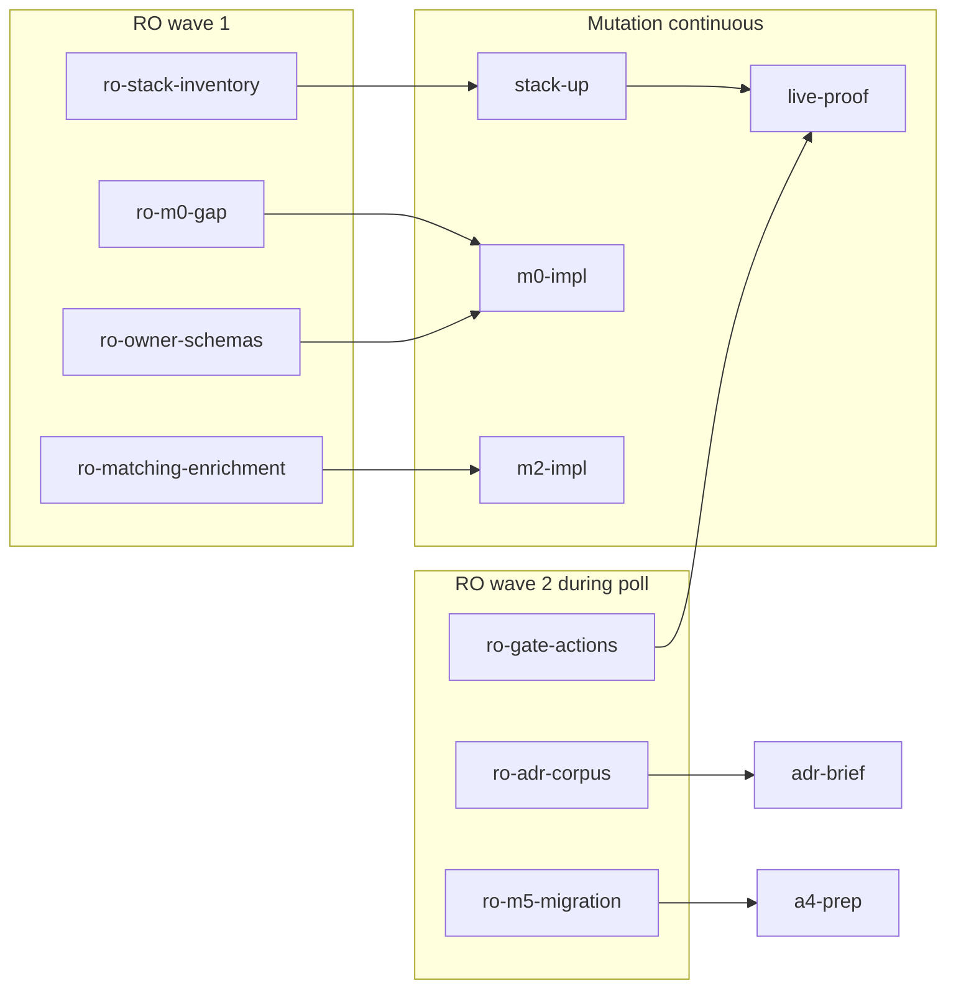
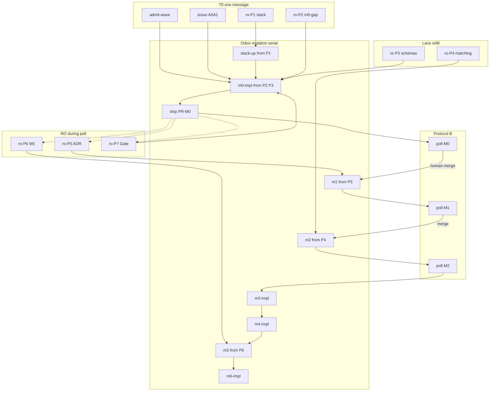

# W7 Execution Plan — Mothball Local Intelligence (autonomy-optimized)

## What is available and active (verified)

| Layer | Path | Status | Use in W7 |
|---|---|---|---|
| Cursor SOP | [`skills/l9-bounded-autonomy/`](~/.cursor-governance/skills/l9-bounded-autonomy/) | **active** (`disable-model-invocation: true` → invoke via `/autonomy` or explicit campaign) | Primary operating law for Cursor |
| Protocol B poll | [`references/pr-poll-subagent.md`](~/.cursor-governance/skills/l9-bounded-autonomy/references/pr-poll-subagent.md) | active | One background `Task` per open PR |
| Remediation | [`skills/l9-pr-remediation/`](~/.cursor-governance/skills/l9-pr-remediation/) | active (user-invocable) | Poll worker fix→verify→ONE commit→push ≤3 cycles |
| Campaign packet | [`campaign-authorization-packet.md`](~/.cursor-governance/skills/l9-bounded-autonomy/references/campaign-authorization-packet.md) | required | Authorizes remediation push; never merge |
| Claude runtime | [`environment/claude-code/autonomy/`](~/.cursor-governance/environment/claude-code/autonomy/) | **active for Claude Code**; Cursor must **not** reimplement | Doctrine source (`pr-convergence.json`) |
| Profile | [`profiles/pr-convergence.json`](~/.cursor-governance/environment/claude-code/autonomy/profiles/pr-convergence.json) | v1.1.0 | 4 lanes / 2 mutation; `autonomous_merge: false`; remediation ON |
| Env defaults | `settings.template.json` | `L9_AUTONOMY_ENABLED=true`, merge OFF, remediation skill = `l9-pr-remediation` | Authority mirror |
| Improve kernel | [`kernels/Improve.md`](~/.cursor-governance/kernels/Improve.md) | applied to this plan | Evidence-first, root-cause, no fake green, lock-safe scope |

**Cursor mapping (non-negotiable):** do not run the Python scheduler inside Cursor. Map invariants onto `Task` tools: Protocol A (parallel work), Protocol B (background poll), Protocol C (join + merge-gate report, human merges).

## Ground truth (program)

- W6 sealed; `maximum_authorized_wave = 6`.
- W7 chain: **046 → 045 → 047 → 048 → 049 → 050 → 068**.
- Contracts already authored: [`program/mothballing-cursor-contracts/M0…M6`](file:///Users/ib-mac/l9-constellation-control/program/mothballing-cursor-contracts/) — **register → claim → execute → verify; no scope re-authoring**.
- Branching (locked): single `feat/mothball-local-intelligence` in `cryptoxdog/IB-Odoo_19`, stacked PRs PR-M0…PR-M6.
- Live env (locked): local five-service docker stack for TASK-046 `live_integration_proof`.
- M5 stricter than StateDB: **T4/C5/A4** (candidate SHA + recovery receipt + single_use).

## Improve.md corrections vs prior plan

1. **Removed protocol violation:** prior plan said “implement M(n+1) on the stacked branch while PR-Mn polls.” That dual-pushes the same branch. Poll owns `pr:N` **and** the shared branch lock until join/hand-back.
2. **Remediation is autonomous inside the packet** (≤3 cycles via `l9-pr-remediation`); merge stays human-only.
3. **Continuous-feed parallelism:** independent read-only Explore agents launch in leverage order; returns are required inputs for the next mutation step — main never idles on discovery.
4. **Entropy cut:** one campaign packet; one Phase-0 table; poll prompt always from `poll_worker` template.

## Campaign authorization packet (create at Phase 0 start)

```yaml
packet_id: autonomy-w7-mothball-2026-08-02
authority: A4_CAMPAIGN_BOUNDED_EXTERNAL_WRITE
profile: pr-convergence
autonomous_merge: false
declared_prs: []          # append each PR number at open time
declared_branches: [feat/mothball-local-intelligence]
allowed_inside_packet:
  - remediate_until_green
  - commit_scoped_on_declared_branch
  - push_non_force_declared_branch
  - inspect_ci_and_comments
forbidden_inside_packet:
  - merge_pull_request
  - force_push
  - admin_merge
  - expand_scope
  - commit_secrets
  - weaken_tests_for_green
created_by: "/autonomy"
```

Update `declared_prs` when each PR-Mn opens. State the packet on the first screen of execution.

## Continuous-feed parallel read-only agents

**Law:** if two discoveries are independent and their output unblocks mutation, spawn them as parallel `Task` (`subagent_type: explore`, `mutation: false`) in **one message**, ranked by leverage. Fold each return into the mutation queue as it lands — never batch-wait; never `AwaitShell` on RO agents.

**Lane math:** cap 4. Default T0 mix: **2 mutation + 2 highest-leverage RO (P1∥P2)**. Immediately refill freed lanes with P3→P7. Empty lane while the RO queue is non-empty = protocol violation.

### Priority queue (highest leverage first)

| Pri | id | Objective | Feeds (mutation input) | Unblocks |
|---|---|---|---|---|
| P1 | `ro-stack-inventory` | Compose/ports/health/env across Gate/CEG/EIE/Odoo/SDK | bring-up sketch | `stack-up`, live-proof |
| P2 | `ro-m0-gap` | M0 `scope_lock.in_scope` vs current Odoo tree | ordered impl checklist | `m0-impl` |
| P3 | `ro-owner-schemas` | CEG/EIE owner schemas + W6 digests vs `plasticos_gate` | mismatch map | gate_contracts/builders/mappers |
| P4 | `ro-matching-enrichment` | matching/enrichment/inference module layout + crons | move/delete candidates | `m2/m3/m4-impl` |
| P5 | `ro-adr-corpus` | ADR-003, INVARIANTS, ARCHITECTURE, AGENTS, roadmap, track_b | citation pack + M1 delta | ADR brief, M1 |
| P6 | `ro-m5-migration` | migration dirs, uninstall hooks, backup surfaces | recovery-receipt checklist | A4 prep, M5 |
| P7 | `ro-gate-actions` | Gate match/converge registry + TransportPacket fixtures | e2e hooks | `live-proof` |

### Spawn waves

```text
RO-1 (T0 with 2 mutation): P1 ∥ P2 ; refill → P3 ∥ P4 as lanes free
RO-2 (during ship-M0 / poll-M0 ownership): P5 ∥ P6 ∥ P7
RO-N (every poll ownership): next unread M-contract inventory for M(n+1)/M(n+2)
```

### Feed wiring



### RO return contract (required)

```yaml
status: done | blocked | failed
priority: P1..P7
feeds: [action_ids this unblocks]
evidence: |
  <paths + key findings>
blockers: []
impl_checklist: []   # ordered next edits for mutation lane
```

## Phase-0 action graph (locks + lanes)

Lane budget: **4 total / 2 mutation**. CI wait releases compute, preserves locks.

| id | kind | depends_on | mutation | lock_keys | isolation_key |
|---|---|---|---|---|---|
| ro-P1..P4 | work | [] | false | [] | explore |
| admit-wave | work | [] | true | `controller:meta` | ctrl |
| issue-A0A1 | work | [] | true | `controller:authorizations` | ctrl-auth |
| reconcile-odoo | work | [] | true | `controller:odoo-lease` | ctrl |
| register-M0-M6 | work | [reconcile-odoo] | true | `controller:contracts` | ctrl |
| stack-up | work | [ro-P1] | true | `docker:five-service` | live |
| m0-impl | work | [admit-wave, register-M0-M6, stack-up, ro-P2, ro-P3] | true | `repo:odoo`, `branch:feat/mothball-local-intelligence` | odoo-wt |
| live-proof | work | [m0-impl, stack-up, ro-P7] | false | `docker:five-service` (read) | live |
| ship-M0 | work | [live-proof] | true | `repo:odoo`, `branch:…` | odoo-wt |
| poll-M0 | poll | [ship-M0] | false* | `pr:<N0>`, `branch:…` | poll-M0 |
| ro-P5..P7 | work | [] | false | [] | explore |
| side-adr-brief | work | [live-proof, ro-P5] | true | `controller:ledger` | ctrl |
| side-a4-prep | work | [ro-P6] | true | `controller:authorizations` | ctrl-auth |
| m1-impl | work | [poll-M0 merge, human ADR] | true | `repo:odoo`, `branch:…` | odoo-wt |
| m2-impl | work | [poll-M1 merge, ro-P4] | true | `repo:odoo`, `branch:…` | odoo-wt |
| m3..m6 + poll-Mn | … | prior poll merge | … | … | … |

\*Poll alone may remediate-push under the packet; holds branch lock until join.

**T0 one-message fan-out:** `admit-wave` ∥ `issue-A0A1` ∥ `ro-P1` ∥ `ro-P2`. On first RO return free a lane → spawn `ro-P3` then `ro-P4`. Soft-start `stack-up` as soon as P1 lands (do not wait for P2–P4). Soft-start `m0-impl` as soon as P2+P3 + admission + register complete.

## Per-PR ship protocol (velocity law, exact)

After every `make pr-check` → `make push` → draft PR:

1. Append PR number to campaign packet `declared_prs`.
2. Spawn **one** background Task (`run_in_background: true`) using `poll_worker` + packet + `lock: pr:<n>`.
3. **Main continues immediately** — never `AwaitShell` / `gh pr checks --watch` (Protocol B violation).
4. Poll: CI + review bots → `l9-pr-remediation` → local verify → ONE commit → push → recheck; **cap 3 cycles** then escalate.
5. While poll owns the branch, refill lanes from RO queue / side-lanes only (no Odoo branch writes):
   - RO-2 (P5–P7) or next M-contract inventory
   - Controller evidence under `ledger/artifacts/wave7/`
   - A4 recovery-receipt draft (consumes P6)
   - ADR decision brief (consumes P5)
   - Live-stack health (lock `docker:five-service`)
6. On `merge_eligible`: Protocol C join → **ask human to merge** → `l9cp verify` + `reconcile-remote` → reclaim branch → next M-impl using pre-fed RO checklists.

## Phase execution

### Phase 0 — Wave admission + RO-1 continuous start

1. Open `/autonomy` packet (above).
2. **One message:** spawn `ro-P1` ∥ `ro-P2` and run `admit-wave` ∥ `issue-A0A1` (2+2).
3. As lanes free: spawn `ro-P3` ∥ `ro-P4`; promote wave 6→7 with W6 digests; `reconcile-remote`; register M0–M6 mechanically.
4. On P1 return → start `stack-up` without waiting for other RO.
5. Expect TASK-046 READY; enter Phase 1 with P2/P3 checklists in hand.

### Phase 1 — TASK-046 (M0) live spike + Gate consumer harden

**Before any mothball extraction.** Consume RO feeds continuously:

- `stack-up` uses P1 inventory; register workers; record ports/SHAs.
- `m0-impl` uses P2 gap checklist + P3 schema mismatch map — exact M0 `scope_lock.in_scope` only. Hard out-of-scope unchanged.
- `live-proof` uses P7 action registry notes → e2e against live stack → `ledger/artifacts/wave7/TASK-046-live-integration.json` (`live_integration_proof`, `live_five_service_stack_exercised: true`). Never fake LIVE_INTEGRATION_PASS.
- Ship PR-M0 → spawn `poll-M0` → immediately spawn RO-2 (`P5∥P6∥P7` if not done) and begin ADR brief / A4 prep from those returns.

### Phase 2 — TASK-045 (M1) ADR — operator stop

- After PR-M0 merged: M1 impl using P5 citation pack; ship PR-M1; spawn `poll-M1`; refill RO for M2 detail if needed.
- Present decision brief (TASK-046 evidence digest). **STOP** for `PROMOTION_APPROVED`.
- On approval: `l9cp record-control-task` 045; human merges PR-M1.

### Phase 3 — TASK-047/048/049 (M2/M3/M4)

Serial on the Odoo branch. Each ship → poll; during poll ownership spawn RO inventories for the *next* M-phase so `impl_checklist` is ready before branch reclaim.

- **M2** GATE-051 — extract using P4 module map.
- **M3** GATE-050 — degraded mode (failure classes, retry states, UI, runbook, tests).
- **M4** GATE-052 — Gate-only enrichment; remove local inference/crawl.

### Phase 4 — TASK-050 (M5) A4 gate

- A4 file + recovery receipt already drafted from P6 during earlier poll windows.
- **STOP** for operator A4 (single_use, candidate SHA, recovery receipt).
- Migrations + uninstall/restore rehearsal → evidence → ship → poll.

### Phase 5 — TASK-068 (M6)

- Drift scanner, contract tests, Makefile/pre-commit/CI guards, finalize docs/ADR → ship → poll.

### Phase 6 — W7 seal

- Join all poll terminals; write `ledger/artifacts/wave7/W7-wave-summary.json`; reconcile; Graphiti-primary handoff; YNP next.

## Concurrency diagram



## Stop conditions (fail closed)

- Live stack cannot produce real match/converge → honest evidence, STOP (no faked LIVE_INTEGRATION_PASS).
- TASK-045 ADR and TASK-050 A4 are hard operator stops.
- Poll exceeds 3 remediation cycles → escalate; main does not dual-push.
- No campaign packet → poll watch-only.
- Empty compute lane while RO queue non-empty → spawn next RO (no-idle violation otherwise).
- Base SHA drift, scope expansion, or lock conflict → serialize / halt.
- Never autonomous merge, force-push, admin merge, or weaken tests for green.

## Validation surface (Improve honesty)

| Check | When | Pass criterion |
|---|---|---|
| RO feed present | before each mutation step that declares a `ro-P*` dep | checklist folded into impl |
| M-contract scope lock | every M-impl | only `in_scope` paths touched |
| `make pr-check` | before every push | exit 0 |
| Live e2e | TASK-046 | real Gate round-trip; evidence digest recorded |
| Poll terminal | every PR | `merge_eligible` or escalated with blockers |
| Merge gate | before asking human | exact head SHA + required checks + no blocking threads |
| `l9cp verify` | after each merge | task terminal in StateDB |
| No-idle | every turn | free lanes filled from RO queue or side-lanes |
