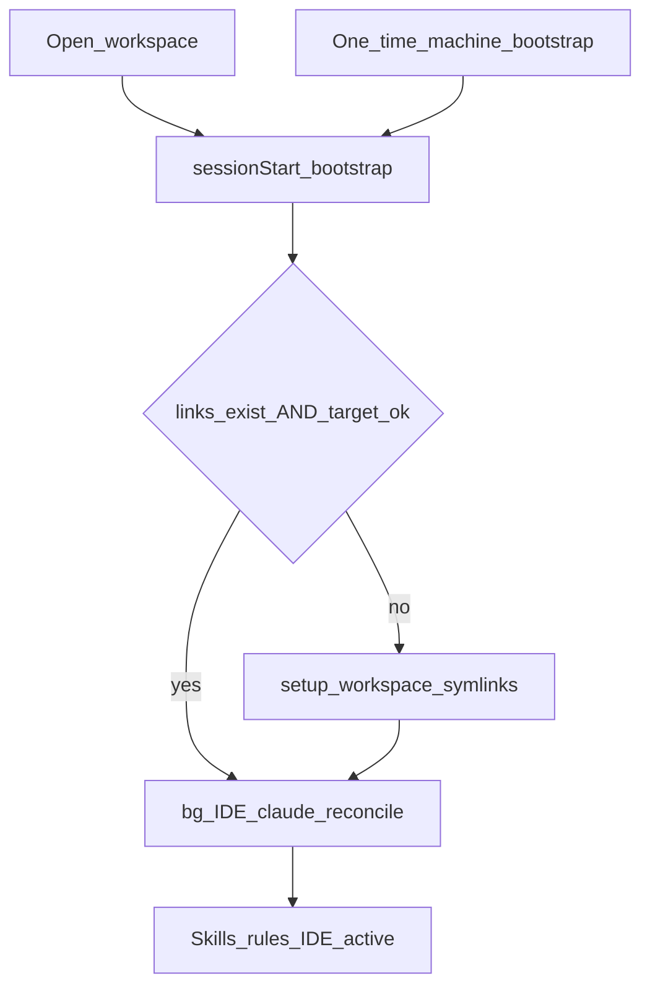

## PLAN: Zero-friction governance activation (eliminate manual `/wire`)

### Decision record (l9-structured-reasoning)

**Objective:** Opening any governed workspace must activate skills/rules/IDE/governance with no manual `/wire` or `/start-session`.

**Selected option:** Keep machine-local absolute symlinks (law-compliant), but make bootstrap **validate targets and auto-repair**; never commit `/Users/...` links into app repos. Add one-time machine bootstrap + consumer gitignore + Claude Web git-tracked `.claude/` adapter.

| Option | Reject reason |
|--------|----------------|
| Commit absolute `.cursor-commands` / `.claude/skills/*` | Breaks other machines; bootstrap `-L` skips repair; CANONICAL_LAW §7 anti-pattern |
| HOME-literal symlink targets in git | Git cannot expand `$HOME`; not portable |
| Per-repo git post-checkout hooks | Duplicates Cursor hooks; easy to miss; law channel is `~/.cursor/hooks.json` |
| Vendor governance into every repo | Second governance tree — forbidden |

**Decisive evidence:** [`session_start_bootstrap.sh`](file:///Users/ib-mac/.cursor-governance/ops/hooks/session_start_bootstrap.sh) only auto-wires when `.cursor-commands` or the plugin link is **missing** (`! -L`), not when the target is wrong. That is why a committed/stale absolute link forces manual `/wire`.

**Reversibility:** Guarded — Cursor-Governance change; consumers only gain gitignore + optional `.claude/` adapter. Rollback = revert bootstrap `needs_wire` logic.

### Objective
**Success:** After one machine bootstrap (clone SSOT + install hooks), every subsequent `clone → open in Cursor` auto-wires/repairs without `/wire`. Claude Web works from git-tracked `.claude/` + account setup. No consumer repo commits machine-absolute symlinks.

### Scope
**In:**
- Cursor-Governance: harden `needs_wire` / auto-repair; optional `make machine-bootstrap`; docs (`wire.md`, AGENTS §2)
- Consumer template surface (l9-ci-core + presets/gitignore): ignore wire artifacts; add Claude Web adapter files from governance templates
- Tests for bootstrap target validation

**Out:**
- Committing `.cursor-commands` → `/Users/ib-mac/...` into l9-ci-core
- Committing absolute `.claude/skills/*` mirrors
- Changing Core analysis CI (PR #88) beyond gitignore/adapter
- Relocating SSOT away from `$HOME/.cursor-governance`

### Pre-Validation (mandatory)
| Check | Command / action | Pass criteria |
|-------|------------------|---------------|
| P0 Target bind | Primary: `~/.cursor-governance`; dogfood: `l9-ci-core` | Two authorized roots |
| P1 Baseline | Confirm bootstrap `-L`-only gap | Gap documented |
| P2 Gates | `make -C ~/.cursor-governance` relevant tests / `check_governance_wiring` | PASS before claim done |
| P3 | No commit of absolute consumer symlinks | Policy preserved |

### TODO Plan
| # | Task | Files | Effort | Risk | Deps | Leverage |
|---|------|-------|--------|------|------|----------|
| T1 | Harden `needs_wire`: require symlink **and** `realpath` equals `$HOME/.cursor-governance` (and plugin link); on mismatch run `setup_workspace_symlinks.sh` | [`ops/hooks/session_start_bootstrap.sh`](file:///Users/ib-mac/.cursor-governance/ops/hooks/session_start_bootstrap.sh) | M | Med | — | Highest — deletes manual `/wire` for stale links |
| T2 | Extract shared `wiring_is_healthy()` used by bootstrap + `check_governance_wiring.sh` | [`ops/scripts/check_governance_wiring.sh`](file:///Users/ib-mac/.cursor-governance/ops/scripts/check_governance_wiring.sh), new small helper under `ops/scripts/` | S | Low | T1 | Shared cause |
| T3 | When auto-repair runs, also run Claude skill/rule reconcile (today only on full setup — ensure setup path always hits `reconcile_llm_skill_adapters.py`) | [`ops/scripts/setup_workspace_symlinks.sh`](file:///Users/ib-mac/.cursor-governance/ops/scripts/setup_workspace_symlinks.sh) | S | Low | T1 | Fixes `.claude/` absolute drift on repair |
| T4 | Add `make machine-bootstrap`: clone/ff SSOT if missing, run setup once for hooks.json + plugin, print “open any repo” | [`Makefile`](file:///Users/ib-mac/.cursor-governance/Makefile), short `ops/scripts/machine_bootstrap.sh` | M | Low | T1 | One-time chicken-egg |
| T5 | Docs: `/wire` = repair-only/fallback; sessionStart = primary; update [`commands/wire.md`](file:///Users/ib-mac/.cursor-governance/commands/wire.md) + AGENTS activation § | governance docs | S | Low | T1 | Stops wrong mental model |
| T6 | Consumer gitignore (l9-ci-core + preset/template guidance): `.cursor-commands`, `.cursor/governance/CANONICAL_LAW.md`, `.vscode/.l9-*-hash`, generated `.claude/skills`, `.claude/rules` mirrors; keep room for tracked `.claude/settings.json` | [`l9-ci-core/.gitignore`](/Users/ib-mac/l9-ci-core/.gitignore), docs/presets README note | S | Low | — | Prevents accidental absolute-link commits |
| T7 | Claude Web zero-friction in l9-ci-core: commit `.claude/settings.json` + `.claude/hooks/session_start_claude_governance.sh` from governance templates (not skill mirrors) | l9-ci-core `.claude/`, source templates under `environment/claude-code/` | M | Med | T6 | Cloud agents without Cursor hooks |
| T8 | Tests: unit/fixture for healthy vs dangling vs wrong-target symlink → repair triggered | governance `ops/` tests | M | Low | T1–T2 | Locks behavior |
| T9 | Dogfood: open l9-ci-core after deliberate wrong-target link; confirm auto-repair without `/wire` | manual evidence | S | Low | T1–T3 | Acceptance |

### Critical path
T1 → T2 → T3 → T8 → T4 → T5 → T6 → T7 → T9

### Depth
- Preserve CANONICAL_LAW: single SSOT at `$HOME/.cursor-governance`; workspace `.cursor-commands` is a **local** symlink, never vendored content.
- Do not expand Core’s frozen analysis workflow set for this work.
- IDE profile remains backgrounded on sessionStart; formatter ownership stays in tracked `AGENTS.md` block for cloud.

### Stress test
- **Disconfirming:** If Cursor fails to fire `sessionStart` on a platform, zero-friction fails → machine-bootstrap + `make start` remain escape hatches (documented, not primary).
- **Assumed false if:** Users relocate SSOT outside `$HOME/.cursor-governance` without updating resolvers.
- **Blast radius:** All Cursor workspaces on a machine that installs the new bootstrap; consumers get gitignore/Claude adapter only.
- **Rollback:** Revert bootstrap helper; old `-L`-only behavior returns; `/wire` still works.

### Leverage
1. T1 (target-validated auto-repair) — removes the only reason `/wire` is still needed day-to-day
2. T4 (machine-bootstrap) — removes first-machine chicken-and-egg
3. T6/T7 — stops bad commits and enables Claude Web without desktop hooks

### Doc / Root Surface Impact
| Surface | Action |
|---------|--------|
| Cursor-Governance `AGENTS.md`, `commands/wire.md` | Update — T5 |
| l9-ci-core `.gitignore`, presets README | Update — T6 |
| l9-ci-core `.claude/settings.json` (+ hook) | Add — T7 |
| l9-ci-core `AGENTS.md` | N/A unless Claude path needs a one-line pointer |

### Dependencies
Governance T1–T5/T8 first; l9-ci-core T6–T7 can ship as follow-up commit on PR #88 or a small sibling PR once governance bootstrap is released (or pin note: local bootstrap copy under `~/.cursor/hooks/` is refreshed by setup).

### Milestones
| Milestone | Outcome |
|-----------|---------|
| M1 Auto-repair | Wrong/dangling links fixed on sessionStart |
| M2 Machine bootstrap | New machine: one command → hooks active |
| M3 Consumer hygiene | Cannot accidentally commit absolute wire links; Claude Web adapter tracked |

### Checkpoints
| CP | Evidence | No-go |
|----|----------|-------|
| CP1 | Fixture: wrong-target `.cursor-commands` → setup runs → realpath OK | Keep `/wire` as primary |
| CP2 | Fresh VM/dir: `make machine-bootstrap` then open repo → healthy check | Document manual clone steps |
| CP3 | l9-ci-core clone on second account path works after bootstrap without `/wire` | |

### Checklist
- [ ] T1–T3 bootstrap repair landed and installed into `~/.cursor/hooks/session-start-bootstrap.sh` via setup
- [ ] T4 machine-bootstrap works on clean HOME fixture
- [ ] T5 docs: `/wire` = repair fallback only
- [ ] T6 gitignore in l9-ci-core
- [ ] T7 Claude Web adapter committed (no absolute skill mirrors)
- [ ] T8–T9 tests + dogfood evidence
- [ ] No `/Users/` symlinks tracked in app repos

### Risks
| Risk | Mitigation |
|------|------------|
| Repair loop if SSOT missing | Bootstrap keeps fail-open message; no infinite ln |
| Users with Dropbox-only legacy SSOT | Resolver already prefers `$HOME/.cursor-governance`; document migration |
| Hook file stale after governance pull | setup/`machine-bootstrap` refreshes `~/.cursor/hooks/session-start-bootstrap.sh` copy |

### Estimate
**Total:** 1 GMP on Cursor-Governance (M1–M2) + 0.5 GMP dogfood on l9-ci-core (M3)
**GMPs:** 2

### Final Validation
| Check | Pass criteria |
|-------|---------------|
| V1 | Wrong-target link auto-repaired on sessionStart / `make start` without `/wire` |
| V2 | `check_governance_wiring.sh` PASS after open |
| V3 | `git ls-files` shows no `.cursor-commands` / absolute `.claude/skills` in l9-ci-core |
| V4 | Claude Web adapter files present and load from template |

### Recommend next
After approval → `l9-gmp-protocol` on **Cursor-Governance** starting at **T1**; then l9-ci-core T6–T7 (gitignore + `.claude` adapter), not committing local absolute symlinks.
