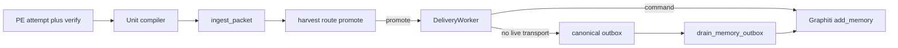

# Close SGD loop (GMP-A + GMP-B)

Press **Build**. Plan on this workspace. Execute on the unique open-PR chain tip.

- Open board now: [#425](https://github.com/Quantum-L9/Cursor-Governance/pull/425) `agent/cursor/manifest-pr-body` → `main`, [#426](https://github.com/Quantum-L9/Cursor-Governance/pull/426) `agent/cursor/pr-remediate-own` → `#425`. **Never** branch from `origin/main`. `PR_STACK=auto`. Use `ops/scripts/agent_worktree_start.sh` if this checkout is not already that tip. Sibling chains fail closed.
- Workspace bind (planning only — not a Program Lock): `/Users/ib-mac/Cursor-Governance` on `main` @ `450b7d0e` (post-`/ff` tip). Leftover plans being shelved. Hook catalog: [`.pre-commit-config.yaml`](.pre-commit-config.yaml).
- Do not run `make campaign`. Do not admit a Program Lock. Do not write `Lock: origin/main = <sha>`.
- After todos: scoped-commit (pathspecs), `l4_local.py authorize-release`, then `PR_STACK=auto PR_REMEDIATE=0 make pr`. Finish reply **must** show the opened PR URL.

This plan absorbs the unbuilt drain design in [`docs/plans/memory_outbox_drain_7c4a1e93.plan.md`](docs/plans/memory_outbox_drain_7c4a1e93.plan.md) (RC-3). Do not invent a second queue.

## Objective

The SGD pipeline has run live (~250 PE packets) and never harvested a unit or written Graphiti. Downstream harvest/route/adapter already run on empty input. Close the loop by (A) compiling schema-valid `generated_data_units` from PE evidence, and (B) mapping `MemoryCandidate` → Graphiti `add_memory` and giving `DESTINATION_SUBMITTED` an owner.

Falsifiable success: a PE outcome with real `changed_files` / validations produces harvested units; a promoted memory unit reaches Graphiti via command transport (or a fake command in tests) with `DESTINATION_ACCEPTED`; an outbox candidate is drained once, idempotently; `memory_units_persisted` stays `None` unless a real Graphiti acceptance receipt exists.

## Scope

**In**

- PE unit compiler in [`receipt_projection.py`](environment/program-execution/integrations/subagent-generated-data/receipt_projection.py) + call from [`publish_task_outcome`](environment/program-execution/scripts/run_campaign.py) (~3175–3197)
- Graphiti ingest command wrapping [`graphiti_memory_client.py`](ops/graphiti/graphiti_memory_client.py) `cmd_write` / `add_memory`
- Canonical `memory_outbox_root()` + `DeliveryWorker.drain_memory_outbox` + opportunistic drain
- Tests and RC-3 findings close

**Out**

- First-occurrence memory promotion-policy rewrite (GMP-C)
- Cursor `L9_ADMISSION_TOKEN` / `compose_start` ritual (GMP-D)
- Distill / synthesize / promote curation; retrieval/reuse/invalidate live env
- Merging [`ops/graphiti/distill_queue/`](ops/graphiti/distill_queue/) into SGD
- New scheduler, new memory SSOT, self-promote

## Why this is first-order

Live packets always have `generated_data_units: []` because [`generated_data_packet`](environment/program-execution/integrations/subagent-generated-data/receipt_projection.py) is a passthrough and `publish_task_outcome` copies the task card (empty). Processor then `LEARNING_CLOSED` with `delivery: null`.

Memory can already promote today when PE sets `independent_validation_present=True` (`PASSED_LOCAL`) — [`PromotionGate`](environment/agents/generated-data/runtime/promotion_gate.py) only defers medium-risk memory when that flag is false **and** `recurrence_count < 2`. Do not change that gate.

`MemoryCandidate` is not a Graphiti episode. [`CommandTransport`](environment/agents/generated-data/adapters/graphiti_memory.py) already sends candidate JSON on stdin; no command exists. Outbox writers disagree: ingest uses [`generated_data_outbox_root()`](environment/agents/runtime_paths.py) `/memory`; adapter/CLI default `environment/agents/generated-data/.runtime/memory-outbox`. No drain.

## GMP-A — emit units without inventing facts

Add `compile_generated_data_units(...)` next to `generated_data_packet` (same module or sibling `compile_units.py` imported by it).

1. **Pass-through** if the receipt/task already has a non-empty `generated_data_units` list (preserve provider-authored units; still fill `visibility` as today).
2. **Else compile only from observed fields:**
   - `changed_files` / `verification.observed_changed_files` → `implementation_surface` or `repository_fact`, `epistemic_status=observed`, `source_evidence` of type `repository_path`
   - `validation_results` / `verification.validations` / `gates` → `validation_procedure`, routes `[validation, evidence]`
   - `produced_evidence` → `evidence_only` or `artifact_lineage`
   - `residual_unknowns` / `unresolved_unknowns` → `unresolved_unknown`, route `[unknowns]`
   - `failure_reason` → `failure_pattern`, route `[evidence]`
3. **Required validator fields** ([`packet_validator.py`](environment/agents/generated-data/runtime/packet_validator.py)): `source_evidence` for observed/derived; non-empty `proposed_routes`; `invalidation_conditions` whenever `expected_reuse` is set; `self_promoted: false`.
4. **Route split:** `PASSED_LOCAL` memory-eligible classes (`repository_fact`, `implementation_surface`, … per [`memory.yaml`](environment/agents/generated-data/routes/memory.yaml)) get `proposed_routes: [memory]`. Failed / no-verification units go `evidence` / `validation` — do not send first-fail memory units that will only defer.
5. **Statements are literal inventories**, e.g. `Task TASK-002 changed files: a.py`. No inferred architecture claims.
6. If nothing extractable: keep `[]` and set `reuse_assessment.reason` to an explicit empty-assessment (not silent success). Also copy `changed_files` into `provenance.inspected_paths` so empty is not caused by a missing field name.
7. `publish_task_outcome` must compute `reuse_assessment` from **compiled** units, not `task.get("generated_data_units")`.

Live `demo-activate-v1` attempts that have empty `changed_files`, empty validations, and no failure still yield zero units. That is honest. Tests prove the compiler with fixtures that contain evidence.

Model units on [`valid-recon-packet.json`](environment/agents/generated-data/tests/fixtures/valid-recon-packet.json).

## GMP-B — Graphiti write + drain

**Ingest command** (new): [`environment/agents/generated-data/adapters/ingest_memory_candidate.py`](environment/agents/generated-data/adapters/ingest_memory_candidate.py)

- stdin = `MemoryCandidate` JSON (what `CommandTransport.deliver` already writes)
- Map `knowledge.statement` + provenance into `EpisodeContract` / `cmd_write` (`kind=insight`, `agent_id` from `source.agent_id`, resolved `group_id` — never `main`/`default`)
- stdout JSON: `status=accepted|deduplicated|rejected` plus `memory_id` / `write_receipt_id` so [`GraphitiMemoryAdapter.deliver`](environment/agents/generated-data/adapters/graphiti_memory.py) can set `destination_reference`
- Fail closed on unhealthy Graphiti / forbidden group / rate limit
- Point `L9_SGD_GRAPHITI_INGEST_COMMAND` and [`instantiation.example.yaml`](environment/agents/generated-data/config/instantiation.example.yaml) at locked venv + this script

**Default transport (lock this):** first delivery stays **env command > env endpoint > outbox** so pytest does not call live Graphiti. Tests that already `pop("L9_SGD_GRAPHITI_INGEST_COMMAND")` keep outbox behavior. Drain uses env command if set, else the new script as default command — **never** `FileOutboxTransport` (self-loop). Unconfigured drain: record failed attempt, leave `DESTINATION_SUBMITTED`.

**Unify path:** add `memory_outbox_root()` → `generated_data_outbox_root() / "memory"`. Wire [`FileOutboxTransport`](environment/agents/generated-data/adapters/graphiti_memory.py) `_MEMORY_OUTBOX_DIR`, [`DeliveryWorkerConfiguration.memory_outbox`](environment/agents/generated-data/orchestration/delivery_worker.py) default (today the package `.runtime` path), CLI `main()`, and ingest (already correct). Drain **adopts** leftover files from `.runtime/memory-outbox` once and logs; do not delete unread.

**Drain** (from existing plan, implement here):

- `DeliveryWorker.drain_memory_outbox(actor, limit)` + `--drain`
- For each `memcand-*.json`: job must be `DESTINATION_SUBMITTED`; reuse existing `delivery_attempt` / idempotency_key / `RetryPolicy`
- Success → `DESTINATION_ACCEPTED` + delete file after commit
- Permanent reject → `DESTINATION_REJECTED`
- Transient → `RETRY_WAIT`; ceiling → `DEAD_LETTERED`
- `recalculate_campaign_state` so a drained campaign can complete
- At start of `run_batch`, opportunistic bounded drain; drain failure must not fail the batch
- After `_run_delivery_if_configured` in ingest, if the result was `enqueued`, call the same drain once (bounded, non-fatal) so a live PE publish can finish the hop when a command is configured

**Summary:** [`campaign_summary.build_summary`](environment/program-execution/integrations/subagent-generated-data/campaign_summary.py) memory block adds `outbox_backlog_count` and `outbox_oldest_candidate_age_seconds` (`None` → UNKNOWN). `memory_units_persisted` stays `None` until a destination receipt proves Graphiti acceptance — do not treat `enqueued` as persisted.

**Tests:** adopt drain cases from the leftover plan (success, unconfigured, idempotent, retry/dead-letter, legacy adopt, campaign complete). Rewrite [`test_enqueued_is_not_reported_as_persisted`](environment/program-execution/tests/hardening/test_real_campaign_e2e.py) to keep “enqueued ≠ persisted” **and** assert the drained end state when a fake command accepts. Extend [`test_outcome_publisher.py`](environment/program-execution/integrations/subagent-generated-data/tests/test_outcome_publisher.py) and [`test_failed_result_harvest.py`](environment/program-execution/scripts/tests/test_failed_result_harvest.py) for compiler pass-through vs compile-from-evidence vs empty-assessment.

**Docs:** move RC-3 in [`docs/handoffs/PE_SWARM_MEMORY_REMEDIATION_FINDINGS.md`](docs/handoffs/PE_SWARM_MEMORY_REMEDIATION_FINDINGS.md) from ESCALATED to CLOSED with evidence. After Build, shelf [`docs/plans/memory_outbox_drain_7c4a1e93.plan.md`](docs/plans/memory_outbox_drain_7c4a1e93.plan.md) to `docs/plans/built/` or `archive/superseded/` (absorbed, not a second implementation).

## Stress test

- If PE evidence is empty, does the compiler invent units? **Must not.** Empty + explicit reason.
- If we default first delivery to the live Graphiti command, do unit tests write production memory? **Must not** — keep first-hop outbox unless env is set; tests use a fake command.
- If drain targets `FileOutboxTransport`, do we self-loop? **Forbidden.**
- If promotion still defers (failed PE, no `PASSED_LOCAL`), is the loop “failed”? **No** — those units must take `evidence`/`validation`. Memory write is for promotable units only.
- Blast radius: PE publish path, SGD delivery state machine, Graphiti episode writes (advisory). Rollback: revert the stacked PR; outbox files remain durable; no distill_queue or law edits.

## Doc / root surface

- `AGENTS.md` / `CANONICAL_LAW.md` / `ORG_INVARIANTS.yaml`: **n_a** (behavior already specified; no new doctrine).
- [`instantiation.example.yaml`](environment/agents/generated-data/config/instantiation.example.yaml): **update** (ingest command).
- RC-3 findings doc: **update**.
- Generated formatter blocks: **n_a**.

## GMP handoff (Build)

May modify: `receipt_projection.py` (+ optional `compile_units.py`), `run_campaign.py` (`publish_task_outcome` only), `runtime_paths.py`, `graphiti_memory.py`, `ingest.py`, `delivery_worker.py`, `campaign_summary.py`, new `ingest_memory_candidate.py`, listed tests, instantiation example, RC-3 findings, leftover drain plan shelf.

Must not modify: `ops/graphiti/distill_queue/`, `CANONICAL_LAW.md`, promotion-gate policy thresholds, Cursor admission/`compose_start`, `surface_profile.yaml` session_start_block.

Preserved: one Graphiti SSOT; PE never writes Graphiti itself; no self-promote; FileOutbox is enqueue-only; `memory_units_persisted` stays evidence-backed.

Validate: targeted pytest on the files above; `.pre-commit-config.yaml` via `PR_STACK=auto PR_REMEDIATE=0 make pr`.
