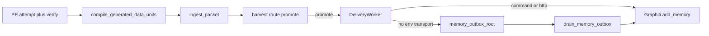

# PLAN: Close SGD loop GMP-A plus GMP-B

> **First-class SSOT (git):** `environment/contracts/execution/templates/canonical.template.executable_plan.v1.plan.md` · metadata sidecar `*.meta.md` · registered in `environment/contracts/execution/MANIFEST.yaml`. Skill path is a symlink; `.cursor/plans/_TEMPLATE.plan.md` is a local mirror only.
> **Schema:** `canonical.schema.plan_document.v1` (status: fill → `executable` only when law holds)
> **Execute:** when status is `executable`, press **Build**. Work in the current checkout on the unique open-PR chain tip. Do **not** run `make campaign`, admit a Program Lock, or free-form mutate from this markdown alone.
> **Cursor todos:** frontmatter `todos` project to Build todos. Body is the binding contract.
> **Rename to:** already `close_sgd_loop_bd6bbbff.plan.md`
> **Law:** executable only when baseline matches, capability probes pass, invariants match, and envelope is respected. Markdown completeness alone is insufficient.

## Execute via Cursor Build

Press **Build**. Plan on the current workspace. Execute on the unique open-PR chain tip.

- If any open PR exists: **never** branch from `origin/main`. Start from the unique chain tip (`PR_STACK=auto`). Use `ops/scripts/agent_worktree_start.sh` when this checkout is not already that tip. Sibling open-PR chains fail closed.
- If the board is empty: `origin/main` is allowed.
- Do not run `make campaign`.
- Do not admit a Program Lock or Controller lease.
- Do not write `Lock: origin/main = <sha>`.
- Do not open a new worktree from tip as a **planning** requirement.
- After Build todos complete: scoped-commit (pathspecs), `l4_local.py authorize-release`, then `PR_STACK=auto PR_REMEDIATE=0 make pr`. Do not skip `make pr`.
- The finish reply **must** display the opened PR URL as proof. Without that URL the Build is incomplete.

### Kernel-locked write_allow (owned_paths exclusive)

- `environment/program-execution/integrations/subagent-generated-data/receipt_projection.py`
- `environment/program-execution/integrations/subagent-generated-data/compile_units.py` (create only if the compiler is split out of receipt_projection.py)
- `environment/program-execution/scripts/run_campaign.py` (`publish_task_outcome` only)
- `environment/agents/generated-data/adapters/ingest_memory_candidate.py` (create)
- `environment/agents/generated-data/adapters/graphiti_memory.py`
- `environment/agents/generated-data/orchestration/delivery_worker.py`
- `environment/agents/generated-data/ingress/ingest.py`
- `environment/agents/runtime_paths.py`
- `environment/program-execution/integrations/subagent-generated-data/campaign_summary.py`
- `environment/agents/generated-data/config/instantiation.example.yaml`
- `environment/program-execution/integrations/subagent-generated-data/tests/test_outcome_publisher.py`
- `environment/program-execution/scripts/tests/test_failed_result_harvest.py`
- `environment/agents/generated-data/tests/` drain and ingest-command tests (create or extend)
- `environment/program-execution/tests/hardening/test_real_campaign_e2e.py`
- `docs/handoffs/PE_SWARM_MEMORY_REMEDIATION_FINDINGS.md`
- `docs/plans/memory_outbox_drain_7c4a1e93.plan.md` (shelf only)

## Metadata

| Field | Value |
|-------|-------|
| plan_id | `plan.sgd.close_loop_gmp_ab.v1` |
| name | Close SGD loop GMP-A plus GMP-B |
| overview | Close the live SGD loop by compiling PE units and delivering MemoryCandidates to Graphiti plus draining the outbox. GMP-C/D stay out. |
| schema_version | `1.0.0` |
| status | `draft` |
| is_project | `false` |
| owner | generated-data delivery plus PE outcome publisher |
| created_at | `2026-08-30` |
| updated_at | `2026-08-30` |
| kind | `simple` |
| execute_via | `cursor-build` |

## Architect framing

| Field | Value |
|-------|-------|
| planning_ssot | `environment/agents/generated-data/law/SUBAGENT_GENERATED_DATA_LAW.md` plus `docs/handoffs/PE_SWARM_MEMORY_REMEDIATION_FINDINGS.md` RC-3 |
| plan_class | `remediation_plan` |
| redesign_allowed | `false` |
| follow_on_schema_evolution_separate | `true` |
| framing_notes | Execute via Cursor Build on the unique open-PR chain tip. No pipeline redesign. No second memory SSOT. No merge of `ops/graphiti/distill_queue/` into SGD. |

## Immutable baseline

Planning bind of the current workspace. Not a Program Lock. Do not write `Lock: origin/main = <sha>`.

| Field | Value |
|-------|-------|
| captured_at | `2026-08-30T23:02:27Z` |
| repository | `Quantum-L9/Cursor-Governance` |
| workspace | `/Users/ib-mac/Cursor-Governance` |
| ssot_clone | `$HOME/.cursor-governance` (rules resolve from live SSOT; mutate this workspace checkout) |
| branch | `main` (planning bind only; Build executes on unique open-PR chain tip) |
| commit_sha | `450b7d0e1db46ad9b211b8be09dc641aae12cfaf` |
| dirty | `true` (untracked `docs/plans/` only; none overlap write_allow except this plan file) |
| artifact_hashes | see table below |
| allowed_local_dirt | `docs/plans/close_sgd_loop_bd6bbbff.plan.md`, `docs/plans/built/llm-router_owner_fix_bf6f57fc.plan.md`, `docs/plans/built/manifest_and_pr_body_65eeca89.plan.md`, `docs/plans/remediator_board_axis_a640859b.plan.md` |
| overlap_policy | `explicitly_allow_listed_paths` |
| verification_rule | `reverify_at_execution_start` |
| on_drift | `rebind_workspace_and_stack_tip` — record new HEAD and unique chain tip; do not treat as Program Lock; do not stop-and-replan as a lock |

### Artifact hashes at bind

| path | sha256 |
|------|--------|
| `environment/program-execution/integrations/subagent-generated-data/receipt_projection.py` | `sha256:f52d55c75abfca4a745ee448e2ba736df9b6bb0de7e57cc7d9b2f1f067c4ae53` |
| `environment/program-execution/scripts/run_campaign.py` | `sha256:2228b0404197b97ce328cf7922fa94e8ee013fb6fd911d8b1876f8b87b332379` |
| `environment/agents/generated-data/adapters/graphiti_memory.py` | `sha256:12bf7b90e4b55514d88ceecb984371ccf7d0b03d8deff0d58268e10d08e39040` |
| `environment/agents/generated-data/orchestration/delivery_worker.py` | `sha256:89456ebf2a02fed752af7a48f2ff33d9c85c0836625dc6773d32f2a3d68f721b` |
| `environment/agents/generated-data/ingress/ingest.py` | `sha256:e0972800aa470a32022411f74a4ff893550985feccea2333212ff4f69151d488` |
| `environment/agents/runtime_paths.py` | `sha256:8c3327d9c0df4756b15363318f3bf2f44a951f4e56851cdc4c3c36b608ee563f` |
| `environment/program-execution/integrations/subagent-generated-data/campaign_summary.py` | `sha256:dd13edadaa5525240fac54e9ff2b031d77f1b3a7fd88f02003f56abdcaa18430` |
| `docs/plans/memory_outbox_drain_7c4a1e93.plan.md` | `sha256:8c4ec8226ab74f14f98d53739937425a674cb60013231955e62fd785d91a7999` |

### Open board at bind (stack tip)

| number | head | base |
|--------|------|------|
| 425 | `agent/cursor/manifest-pr-body` | `main` |
| 426 | `agent/cursor/pr-remediate-own` | `agent/cursor/manifest-pr-body` |

Unique chain tip at bind: PR 426. Reconfirm with `PR_STACK=auto` at Build start. Sibling chains fail closed.

Hook catalog: `.pre-commit-config.yaml`.

## Objective

### Mission

The SGD pipeline has processed live PE outcomes (hundreds of ingress receipts under `~/.l9/generated-data/`) and has never harvested a reusable unit or delivered to Graphiti. Root cause is empty `generated_data_units`: `receipt_projection.generated_data_packet` is a passthrough, and `publish_task_outcome` copies the task card (empty), so the processor records `LEARNING_CLOSED` with `delivery: null`. Downstream harvest, route, promote, and adapter already run. Close the loop without inventing facts: compile schema-valid units from observed PE evidence (GMP-A), then map `MemoryCandidate` to Graphiti `add_memory` and own `DESTINATION_SUBMITTED` by draining the canonical outbox (GMP-B). Preserve one Graphiti SSOT, PE-never-writes-Graphiti, no self-promote, FileOutbox enqueue-only, and `memory_units_persisted is None` unless a real acceptance receipt exists.

### Success properties

| id | property | evidence_type | proof | blocking |
|----|----------|---------------|-------|----------|
| SP-01 | Build starts on the unique open-PR chain tip, not a fresh `origin/main` fork, when any PR is open | `repository_state` | `gh pr list` plus `PR_STACK=auto` tip equals execution HEAD | true |
| SP-02 | Planning HEAD is reverified; drift is rebound, not treated as a Program Lock | `repository_state` | `git rev-parse HEAD` recorded at start; no `Lock: origin/main` line added | true |
| SP-03 | A PE receipt with non-empty `changed_files` or validations compiles one or more PacketValidator-valid units | `structural` | `PacketValidator().validate(packet).valid is True` and `generated_data_units` non-empty | true |
| SP-04 | A PE receipt with no extractable evidence emits `[]` plus an explicit `reuse_assessment.reason`; no invented statements | `structural` | empty-assessment test asserts reason text and zero units | true |
| SP-05 | CommandTransport stdin MemoryCandidate becomes Graphiti write stdout `{status: accepted\|deduplicated\|rejected}` with a destination id | `runtime_behavior` | fake-command test; live command not required for pytest | true |
| SP-06 | Exactly one canonical memory outbox path; adapter, ingest, worker default, and drain resolve `memory_outbox_root()` | `filesystem` | all four call sites import the resolver; legacy dir adopted once | true |
| SP-07 | Drain of an outbox candidate with a real (or fake-accepting) transport advances `DESTINATION_SUBMITTED` to `DESTINATION_ACCEPTED` and removes the file after commit | `runtime_behavior` | drain test: state plus file gone | true |
| SP-08 | Drain against unconfigured or failing transport leaves `DESTINATION_SUBMITTED`, records a failed `delivery_attempt`, never marks ACCEPTED | `runtime_behavior` | drain fail-closed test | true |
| SP-09 | Second drain of the same candidate is idempotent (deduplicated or already_delivered); no second non-idempotent write | `runtime_behavior` | drain idempotency test | true |
| SP-10 | Opportunistic drain at `run_batch` start is bounded and non-fatal; a drain error does not fail the batch | `runtime_behavior` | injected drain failure still returns batch results | true |
| SP-11 | `campaign_summary` reports measured outbox backlog and oldest age; `memory_units_persisted` stays `None` unless a Graphiti acceptance receipt exists | `structural` | summary assertions plus rewritten E2E | true |
| SP-12 | No new store, queue, scheduler, memory SSOT, or distill_queue merge | `structural` | diff hygiene: no new daemon/cron/workflow for drain | true |
| SP-13 | RC-3 findings move to CLOSED and the leftover drain plan is shelved as absorbed | `filesystem` | findings text plus plan shelf path | true |
| SP-14 | Stacked PR opened; finish reply shows the PR URL | `proof_receipt` | `PR_STACK=auto PR_REMEDIATE=0 make pr` output URL | true |

`evidence_type` ∈ `filesystem` | `runtime_behavior` | `structural` | `quality_gate` | `repository_state` | `network_observation` | `proof_receipt` | `human_confirmation`

## Capability preflight

`schema_ref:` `canonical.schema.capability_preflight.v1`
`instance_binding:` `preflight.plan.sgd.close_loop_gmp_ab.v1`

| Field | Value |
|-------|-------|
| preflight_id | `preflight.plan.sgd.close_loop_gmp_ab.v1` |
| source_ref | `plan.sgd.close_loop_gmp_ab.v1` |
| phase_id | `preflight` |
| blocking | `true` |
| immutable_baseline_ref | Immutable baseline section |
| baseline_verified | pending at Build start |
| drift_detected | pending at Build start |

### Probes (min 1; failed blocking probe → status `preflight_blocked`)

| id | capability | command_or_action | pass_criteria | blocking |
|----|------------|-------------------|---------------|----------|
| CP-01 | `branch_and_HEAD_resolution` | `git rev-parse HEAD` and `git status --porcelain` | HEAD recorded; dirt only allowed_local_dirt or write_allow | true |
| CP-02 | `open_pr_chain_tip` | `gh pr list --state open` plus `PR_STACK=auto` | unique chain tip identified; no sibling-chain fork | true |
| CP-03 | `command_available` | `test -x .venv/bin/python` and `test -f .pre-commit-config.yaml` | locked interpreter and hook catalog present | true |
| CP-04 | `filesystem_write` | write_allow paths exist and are writable | parent dirs exist; no protected-root rewrite of AGENTS.md or CANONICAL_LAW.md | true |
| CP-05 | `graphiti_client_importable` | locked python can import `ops/graphiti/graphiti_memory_client.py` | import succeeds; live health is non-blocking for pytest | false |
| CP-06 | `leftover_drain_plan_present` | `test -f docs/plans/memory_outbox_drain_7c4a1e93.plan.md` | file present so shelf has a donor | true |

Failed CP-01 through CP-04 or CP-06 → status `preflight_blocked`. CP-05 fail does not block: tests use a fake command.

## Execution envelope

Mutations outside this envelope are forbidden (PLAN-SCHEMA-004).

### Filesystem

- **write_allow:** the exclusive owned_paths list under Execute via Cursor Build
- **write_deny:** `CANONICAL_LAW.md`, `AGENTS.md`, `ORG_INVARIANTS.yaml`, `ops/autonomy/surface_profile.yaml` session_start_block, `ops/graphiti/distill_queue/`, `environment/agents/generated-data/runtime/promotion_gate.py` policy thresholds, `environment/agents/lifecycle/compose_start.py`, `environment/agents/cursor-subagents/` admission ritual, secrets, `WIP/Legal Defense/`
- **delete_allow:** outbox `memcand-*.json` only after a committed terminal drain transition; leftover drain plan may be moved (not deleted without shelf)

### Commands

- **allow:** locked `.venv/bin/python` pytest on listed test modules; `l4_local.py authorize-release`; `PR_STACK=auto PR_REMEDIATE=0 make pr`; `gh pr list`; `git` read plus scoped commit of write_allow
- **deny:** `make campaign`; Program Lock / `pec.py` claim/render; live `make campaign`; force-push; hard-reset; admin-merge; secret exfil; `pre-commit install`; raw unscoped `pytest`; live Graphiti write from pytest

### Network

| Field | Value |
|-------|-------|
| mode | `existing_tunnel_only` for optional live ingest-command smoke; pytest is `none` |
| allowed_services | Graphiti MCP via existing local tunnel `127.0.0.1:8100` only when an operator sets `L9_SGD_GRAPHITI_INGEST_COMMAND` outside pytest |

### Secrets

| Field | Value |
|-------|-------|
| access | `none` (Graphiti client uses existing machine env / tunnel; do not paste tokens) |
| redaction_required | `true` |

### Autonomous merge

`autonomous_merge:` `false`

This plan publishes a stacked PR. It does not merge. `/l9-pr-remediation` is out of scope unless a human later invokes it.

## Side effects and idempotency

| todo_id | side_effects | idempotency | retry | compensation | irreversible |
|---------|--------------|-------------|-------|--------------|--------------|
| todo-01-baseline-preflight | `filesystem_read` | `safe_to_repeat` | `none` | null | false |
| todo-02-compile-units | `filesystem_mutation` | `safe_with_dedupe` | `retry_once` | `git restore` scoped paths | false |
| todo-03-compiler-tests | `filesystem_mutation` | `safe_with_dedupe` | `retry_once` | `git restore` scoped tests | false |
| todo-04-ingest-command | `filesystem_mutation` | `safe_with_dedupe` | `retry_once` | `git restore` new adapter | false |
| todo-05-unify-outbox | `filesystem_mutation` | `safe_with_dedupe` | `retry_once` | `git restore` path aliases | false |
| todo-06-implement-drain | `filesystem_mutation` | `safe_with_dedupe` | `retry_once` | `git restore` worker; leftover outbox files stay | false |
| todo-07-opportunistic-drain | `filesystem_mutation` | `safe_with_dedupe` | `retry_once` | disable opportunistic call sites | false |
| todo-08-campaign-summary | `filesystem_mutation` | `safe_with_dedupe` | `retry_once` | `git restore` summary | false |
| todo-09-prove-tests | `filesystem_mutation` | `safe_to_repeat` | `retry_once` | `git restore` tests | false |
| todo-10-docs-shelf | `filesystem_mutation` | `safe_with_dedupe` | `manual_only` | move drain plan back from shelf | false |
| todo-11-converge-publish | `network_write` | `safe_with_dedupe` | `manual_only` | abandon/close stacked PR; do not force-push | false |

`side_effects` ∈ `none` | `filesystem_read` | `filesystem_mutation` | `destructive_filesystem_mutation` | `network_read` | `network_write` | `database_read` | `database_write` | `external_state_mutation` | `human_approval`

## Architecture impact

| todo_id | bounded_context | layer | owning_contract | prohibited |
|---------|-----------------|-------|-----------------|------------|
| todo-02-compile-units | PE → SGD ingress | `runtime` | `SUBAGENT_GENERATED_DATA_LAW.md` §10 unit; `generated-data-unit.schema.json` | invent facts; set `self_promoted: true`; rewrite promotion thresholds |
| todo-04-ingest-command | SGD memory adapter | `memory` | `graphiti_memory.py` CommandTransport; `graphiti_memory_client.py` `cmd_write` | new memory SSOT; write `group_id=main` or `default`; merge distill_queue |
| todo-05-unify-outbox | SGD delivery paths | `ops` | `runtime_paths.py` `generated_data_outbox_root` | second outbox store |
| todo-06-implement-drain | SGD delivery worker | `runtime` | leftover `memory_outbox_drain_7c4a1e93.plan.md` RC-3 | FileOutboxTransport as drain target; new scheduler |
| todo-07-opportunistic-drain | SGD delivery trigger | `runtime` | same worker; no cron | GitHub Action or daemon drain |
| todo-08-campaign-summary | PE campaign observability | `assurance` | `campaign_summary.py` None→UNKNOWN | treat `enqueued` as persisted |
| todo-10-docs-shelf | findings plus plans store | `docs` | `PE_SWARM_MEMORY_REMEDIATION_FINDINGS.md` RC-3 | implement a second drain beside this plan |
| todo-11-converge-publish | publish path | `control_plane` | `AGENTS.md` `L9_PLAN_SIMPLE_STACK_PR_V1` | merge; `PR_REMEDIATE=1`; branch from `origin/main` while PRs are open |

## Rollback

`schema_ref:` `canonical.schema.rollback_contract.v1`
`instance_binding:` `rollback.plan.sgd.close_loop_gmp_ab.v1`

| Field | Value |
|-------|-------|
| rollback_id | `rollback.plan.sgd.close_loop_gmp_ab.v1` |
| source_execution_ref | `plan.sgd.close_loop_gmp_ab.v1` |
| supported | `true` |
| automatic_allowed | `false` |
| approval_required | `true` |
| trigger_conditions | envelope breach; blocking SP fail; compiler invents facts; drain marks ACCEPTED without destination receipt; live pytest Graphiti write |

### Strategies (typed — PLAN-SCHEMA-009)

| domain | mode | notes |
|--------|------|-------|
| code | `git_restore_scoped_paths` | restore write_allow only; stacked PR close or revert commit |
| data | `none` | no schema migration; pipeline.sqlite3 jobs stay; do not rewrite history |
| external_state | `corrective_append_only_record` | Graphiti episodes are append-only; do not delete; compensate with invalidate only in a follow-on plan |
| local_state | `git_restore_scoped_paths` | outbox files remain if drain did not commit a terminal transition |

### Irreversible operations

- A successful live Graphiti `add_memory` is append-only. Pytest must not perform that write. Live smoke (optional, non-blocking) is operator-gated by env command.

### Rollback verification

- `git diff --name-only` after scoped restore is empty on write_allow
- outbox `memcand-*.json` still present when drain was aborted
- `campaign_summary.memory.memory_units_persisted is None` unless a real acceptance receipt remains

## Complexity and uncertainty

| Field | Value |
|-------|-------|
| complexity | `high` |
| uncertainty | `medium` |
| blast_radius | `medium` |
| architectural_boundaries_crossed | `2` (PE outcome publish + SGD delivery + Graphiti write adapter) |
| external_systems_touched | `1` (Graphiti, advisory episodes only; pytest uses fake command) |
| migration_required | `false` |
| unknown_dependency_count | `3` |

## Inventory and classification

Activated because this plan absorbs and shelves the leftover drain plan.

| Field | Value |
|-------|-------|
| receipt_path | `docs/handoffs/PE_SWARM_MEMORY_REMEDIATION_FINDINGS.md` RC-3 |
| categories | `keep` existing SGD harvest/route/adapter; `replace` empty-unit publish path with compiler; `migrate_then_delete` leftover `docs/plans/memory_outbox_drain_7c4a1e93.plan.md` into built/archive after this plan owns the drain |
| checksum_required | `true` |
| destructive_gate_required_for | `migrate_then_delete` of the leftover plan file (shelf, do not rm without destination) |

| artifact | action | reason |
|----------|--------|--------|
| harvest / classifier / router / PromotionGate | `keep` | already run on empty input; do not retune promote policy |
| `receipt_projection.py` passthrough | `replace` | add compile-from-evidence |
| FileOutboxTransport | `keep` | first-hop durable enqueue when no env command |
| leftover drain plan | `migrate_then_delete` | absorb into this plan, then shelf |
| `ops/graphiti/distill_queue/` | `skip` | distinct transcript pipeline |

## Gated write pipeline

Activated because drain may perform an external Graphiti write.

- **gates (ordered):** PacketValidator valid → harvest → eligible memory route → PromotionGate `promote` → compile MemoryCandidate → select_transport is Command or HTTP (never FileOutbox on drain) → destination receipt with accepted/deduplicated/rejected → then delete outbox file
- **dedupe_before_non_idempotent_write:** `true` (candidate_id + existing delivery_attempt idempotency_key)
- **bounded_write_count:** drain `limit` (default 20); opportunistic drain bound separate and smaller
- **receipt_required:** `true`

## Regeneration extinguishment

Not a retirement plan. No generator currently rewrites empty units.

| id | source | required_change | validation |
|----|--------|-----------------|------------|
| RG-01 | none | N/A | do not add a regenerator that fabricates units |

## Execution DAG

`schema_ref:` `canonical.schema.dependency_topology.v1`
`instance_binding:` `dag.plan.sgd.close_loop_gmp_ab.v1`

| Field | Value |
|-------|-------|
| topology_id | `dag.plan.sgd.close_loop_gmp_ab.v1` |
| topology_kind | `execution` |
| graph_type | `directed_acyclic_graph` |

### Nodes / edges

| id | owner | layer | depends_on | outputs |
|----|-------|-------|------------|---------|
| todo-01-baseline-preflight | agent | assurance | [] | baseline_receipt, stack_tip |
| todo-02-compile-units | agent | runtime | [todo-01-baseline-preflight] | compiler + publish_task_outcome wire |
| todo-03-compiler-tests | agent | assurance | [todo-02-compile-units] | compiler pytest |
| todo-04-ingest-command | agent | memory | [todo-01-baseline-preflight] | ingest_memory_candidate.py |
| todo-05-unify-outbox | agent | ops | [todo-01-baseline-preflight] | memory_outbox_root() |
| todo-06-implement-drain | agent | runtime | [todo-04-ingest-command, todo-05-unify-outbox] | drain_memory_outbox |
| todo-07-opportunistic-drain | agent | runtime | [todo-06-implement-drain] | run_batch + ingest hooks |
| todo-08-campaign-summary | agent | assurance | [todo-06-implement-drain] | backlog fields |
| todo-09-prove-tests | agent | assurance | [todo-03-compiler-tests, todo-07-opportunistic-drain, todo-08-campaign-summary] | drain + E2E evidence |
| todo-10-docs-shelf | agent | docs | [todo-09-prove-tests] | RC-3 CLOSED + absorbed plan |
| todo-11-converge-publish | agent | control_plane | [todo-10-docs-shelf] | stacked PR URL |

**Critical path:** `todo-01-baseline-preflight` → `todo-02-compile-units` → `todo-04-ingest-command` → `todo-05-unify-outbox` → `todo-06-implement-drain` → `todo-09-prove-tests` → `todo-11-converge-publish`

`todo-03`, `todo-07`, and `todo-08` join before prove. `todo-04` and `todo-05` may run in parallel after preflight.

**Forbidden edges:** drain before path unification; publish before prove; compiler inventing units to satisfy drain tests; PE claim/render of these rows; `make campaign` as a node.

### Phase-0 action table (Build todos, not Controller Task Cards)

| id | wave | depends_on | mutation | isolation_key | kind | adapter_hint |
|----|------|------------|----------|---------------|------|--------------|
| todo-01-baseline-preflight | W0 | [] | false | `preflight` | `work` | `cursor-foreground` |
| todo-02-compile-units | W1 | [todo-01-baseline-preflight] | true | `compiler` | `work` | `cursor-foreground` |
| todo-03-compiler-tests | W1 | [todo-02-compile-units] | true | `compiler` | `work` | `cursor-foreground` |
| todo-04-ingest-command | W1 | [todo-01-baseline-preflight] | true | `ingest` | `work` | `cursor-foreground` |
| todo-05-unify-outbox | W1 | [todo-01-baseline-preflight] | true | `outbox` | `work` | `cursor-foreground` |
| todo-06-implement-drain | W2 | [todo-04-ingest-command, todo-05-unify-outbox] | true | `drain` | `work` | `cursor-foreground` |
| todo-07-opportunistic-drain | W2 | [todo-06-implement-drain] | true | `drain` | `work` | `cursor-foreground` |
| todo-08-campaign-summary | W2 | [todo-06-implement-drain] | true | `summary` | `work` | `cursor-foreground` |
| todo-09-prove-tests | W3 | [todo-03-compiler-tests, todo-07-opportunistic-drain, todo-08-campaign-summary] | true | `validate` | `work` | `cursor-foreground` |
| todo-10-docs-shelf | W3 | [todo-09-prove-tests] | true | `docs` | `work` | `cursor-foreground` |
| todo-11-converge-publish | W4 | [todo-10-docs-shelf] | true | `publish` | `work` | `cursor-foreground` |

**Spawn rules:** execute Build todos in wave order on one worktree (the unique chain tip). Do not `claim` or `render` Program Execution Task Cards. Do not run `make campaign`.

**Stop / do not execute when:** capability preflight blocked; DAG would cycle; envelope incomplete; compiler would invent facts; drain would use FileOutboxTransport; pytest would call live Graphiti; unique chain tip cannot be resolved while open PRs exist.

## Property evidence matrix

`schema_ref:` `canonical.schema.validation_evidence.v1`
`instance_binding:` `validation_evidence_refs.plan.sgd.close_loop_gmp_ab.v1`

Exit-0 alone is insufficient when a property needs structural or runtime proof (PLAN-SCHEMA-008).

| evidence_id | claim_id / SP | evidence_kind | method | command | expected_positive | status |
|-------------|---------------|---------------|--------|---------|-------------------|--------|
| EV-SP-01 | SP-01 | `repository_state_evidence` | stack tip compare | `gh pr list --state open` + `PR_STACK=auto` | execution HEAD is unique chain tip | `not_run` |
| EV-SP-02 | SP-02 | `repository_state_evidence` | rev-parse + grep | `git rev-parse HEAD`; grep plan for `Lock: origin/main` | SHA recorded; lock line absent | `not_run` |
| EV-SP-03 | SP-03 | `structural_evidence` | pytest | `.venv/bin/python -m pytest environment/program-execution/integrations/subagent-generated-data/tests/test_outcome_publisher.py` | compile-from-evidence case PASS + PacketValidator.valid | `not_run` |
| EV-SP-04 | SP-04 | `structural_evidence` | pytest | same module empty-assessment case | units `[]` and reason set | `not_run` |
| EV-SP-05 | SP-05 | `runtime_behavior_evidence` | pytest fake command | new ingest-command tests | stdout status in accepted/deduplicated/rejected | `not_run` |
| EV-SP-06 | SP-06 | `filesystem_evidence` | grep + pytest | `rg memory_outbox_root` on adapter/ingest/worker/runtime_paths | four call sites; legacy adopt test | `not_run` |
| EV-SP-07 | SP-07 | `runtime_behavior_evidence` | pytest | drain success test | SUBMITTED→ACCEPTED; file removed | `not_run` |
| EV-SP-08 | SP-08 | `runtime_behavior_evidence` | pytest | drain fail-closed test | still SUBMITTED; failed attempt; accepted==0 | `not_run` |
| EV-SP-09 | SP-09 | `runtime_behavior_evidence` | pytest | drain second pass | no second write | `not_run` |
| EV-SP-10 | SP-10 | `runtime_behavior_evidence` | pytest | run_batch with injected drain error | batch still returns | `not_run` |
| EV-SP-11 | SP-11 | `structural_evidence` | pytest | `test_campaign_summary.py` + rewritten E2E | backlog measured; persisted is None without acceptance | `not_run` |
| EV-SP-12 | SP-12 | `structural_evidence` | diff hygiene | `git diff --name-only` vs envelope | no new daemon/cron/workflow; no distill_queue edits | `not_run` |
| EV-SP-13 | SP-13 | `filesystem_evidence` | read | findings RC-3 CLOSED; drain plan under built/ or archive/superseded/ | both present | `not_run` |
| EV-SP-14 | SP-14 | `quality_gate_evidence` | catalog + publish | `.pre-commit-config.yaml` via `PR_STACK=auto PR_REMEDIATE=0 make pr` | PR URL in finish reply | `not_run` |

## Stress and disconfirm

### Disconfirming cases

- Assumption "PE receipts contain extractable evidence" is false for live `demo-activate-v1` → compiler must emit explicit empty assessment; loop is honest, not fabricated. Tests still prove compile-from-evidence with fixtures.
- Assumption "PASSED_LOCAL sets independent_validation_present" is false on a given publish path → memory units would defer. Mitigation: failed or unverified units use `evidence`/`validation` routes; do not retune PromotionGate.
- Assumption "CommandTransport stdin is MemoryCandidate JSON" is false → ingest script would fail closed; tests pin the stdin shape to `graphiti_memory.CommandTransport`.
- Probe/environment differs from baseline (workspace ff or stack tip moved) → rebind HEAD and tip; do not treat as Program Lock.
- Drain uses FileOutboxTransport → self-loop; forbidden; SP-08/SP-12 fail.
- First delivery defaults to live Graphiti command → pytest writes production memory. Forbidden. First hop stays env-command then env-endpoint then outbox.
- Promotion still defers all memory units → drain never sees SUBMITTED from those jobs. That is not a compiler defect. Prove drain with a fixture packet that already promotes (existing E2E helper `_deliver_to_outbox`).

### Assumption failure conditions

- Dirty tree overlaps write_allow with foreign bytes not in allowed_local_dirt
- Blocking success property fails after mutation
- Unknown dependency discovered mid-flight (PLAN-SCHEMA-013): new required PE receipt field not on attempt-receipt.v2
- Unique open-PR chain cannot be resolved (sibling chains)
- Graphiti group resolution would write `main` or `default`

### Blast radius notes

- PE `publish_task_outcome` is the only live producer today. Compiler bugs affect every campaign publish.
- Delivery state machine: a false ACCEPTED without a destination receipt converts a visible stall into silent loss. SP-08 exists to block that.
- Graphiti: advisory `insight` episodes only. Append-only. Pytest must not write.
- Distill queue and SessionEnd transcript ingest stay untouched.

### Rollback constraints

- No force-push / history rewrite
- Graphiti append-only → compensating record only in a follow-on plan
- Aborted drain leaves outbox files intact

## Out of scope

- First-occurrence memory promotion-policy rewrite (GMP-C)
- Cursor `L9_ADMISSION_TOKEN` / `compose_start` / `runtime.sqlite3` admission ritual (GMP-D)
- Distill / synthesize / promote curation; live `L9_SGD_GRAPHITI_SEARCH_COMMAND` / reuse / invalidate wiring
- Merging `ops/graphiti/distill_queue/` into SGD
- New scheduler, daemon, cron, or GitHub Actions drain
- New memory SSOT beside Graphiti
- Self-promote (`self_promoted: true`)
- Changing PromotionGate medium-risk thresholds
- Non-memory RouteOutboxTransport drains
- Changing ingest.py rule that missing live transport still durably enqueues
- `make campaign`, Program Lock, Controller claim/render
- Merge of the stacked PR
- Weakening scanners / gates to obtain PASS
- Follow-on schema/platform evolution (see Follow-on milestone)

## Follow-on milestone

| Field | Value |
|-------|-------|
| separate_plan_required | `true` |

| priority | change | why |
|----------|--------|-----|
| P1 | GMP-C: first-occurrence memory promote policy for observed+evidenced units without PASSED_LOCAL | failed PE tasks still defer memory; this plan routes them to evidence instead |
| P2 | GMP-D: Cursor admission-token ritual so `accepted_subagent_result` appears live | zero live Cursor SGD receipts today; result_bridge already works when a valid result exists |
| P3 | Retrieval / reuse / invalidate env commands | `instantiation.example.yaml` already names them; not required to close write-side loop |
| P4 | LearningClosureEvaluator at campaign seal | unused on the live empty-unit path; only useful after units exist |

## Convergence

`schema_ref:` `canonical.schema.convergence_contract.v1`
`instance_binding:` `conv.plan.sgd.close_loop_gmp_ab.v1`

| Field | Value |
|-------|-------|
| convergence_id | `conv.plan.sgd.close_loop_gmp_ab.v1` |
| source_ref | `plan.sgd.close_loop_gmp_ab.v1` |
| current_state | `draft` |
| implementation_ready | `false` until preflight + DAG + envelope filled at Build start |
| execute_via | `cursor-build` |

### Gates

- **executable_when:**
  - workspace rebound at Build start (HEAD + unique chain tip)
  - blocking capability probes pass
  - DAG acyclic
  - envelope + side-effect matrix complete for mutate todos
  - no blocking unknowns
- **complete_when:**
  - all blocking SP-* evidence `passed`
  - rollback contract still valid / unused-or-verified
  - out_of_scope respected (diff hygiene)
  - stacked PR URL displayed
- **blocking_conditions:**
  - `preflight_blocked`
  - envelope breach
  - invented units
  - drain ACCEPTED without destination receipt
  - pytest live Graphiti write
  - finish reply missing PR URL

### Evidence

- **required_evidence_refs:** `EV-SP-01` through `EV-SP-14`
- **observed_evidence_refs:** *(fill during execution)*
- **missing_evidence:** all `not_run` until Build

### Blockers / unknowns

| kind | id | note | resolution |
|------|----|------|------------|
| unknown | U1 | Live demo-activate campaigns may still publish empty units if attempt receipts have no changed_files, validations, evidence, or failure_reason | `accept_bounded` — compiler stays honest; fixtures prove compile-from-evidence |
| unknown | U2 | Unique chain tip may move (new PR stacked) between plan and Build | `measure` at todo-01 — `PR_STACK=auto`; never fork `origin/main` while the board is non-empty |
| unknown | U3 | Graphiti live health may be down when an operator sets the ingest command | `accept_bounded` — fail closed, leave SUBMITTED, RetryPolicy; pytest uses fake command |
| open_blocker | | none at plan time | |

### Next

| Field | Value |
|-------|-------|
| next_convergence_gate | `execution_ready` → `executing` → `converged` |
| minimum_safe_next_action | Press **Build**. Execute on unique chain tip. After todos: `PR_STACK=auto PR_REMEDIATE=0 make pr` and display the PR URL |
| execute_via | `cursor-build` |
| broader_work_requires_separate_contract | `true` |

---

## GMP-A contract (compiler)

Owner: `receipt_projection.py` (or sibling `compile_units.py` imported by it) plus `publish_task_outcome` in `run_campaign.py` (~3175–3197).

1. If `generated_data_units` on the receipt or task is already a non-empty list of mappings, keep those units (provider-authored). Still default `visibility` as today.
2. When that list is missing or empty, compile only from observed fields on attempt-receipt.v2 / verification-receipt.v2 / `failure_reason`:
   - `changed_files` or `verification.observed_changed_files` → `implementation_surface` or `repository_fact`, `epistemic_status=observed`, `source_evidence` `source_type=repository_path` with path + `base_sha`
   - `validation_results` or `verification.validations` or `gates` → `validation_procedure`, `proposed_routes: [validation, evidence]`, `source_type=test_result`
   - `produced_evidence` → `evidence_only` or `artifact_lineage`, `source_type=typed_artifact`
   - `residual_unknowns` / `unresolved_unknowns` → `unresolved_unknown`, `proposed_routes: [unknowns]`
   - `failure_reason` → `failure_pattern`, `proposed_routes: [evidence]`
3. Validator requirements (`packet_validator.py`): observed/derived units require `source_evidence`; every unit requires non-empty `proposed_routes`; `expected_reuse` requires `invalidation_conditions`; `self_promoted: false`.
4. Route split: `PASSED_LOCAL` plus a memory-accepted class from `routes/memory.yaml` may set `proposed_routes: [memory]`. Failed or unverified units use `evidence` / `validation` so first-fail memory does not sit deferred.
5. Statements are literal inventories (`Task TASK-002 changed files: a.py`). No inferred architecture claims.
6. When nothing extractable: keep `[]` and set `reuse_assessment.reason` to an explicit empty-assessment. Copy `changed_files` into `provenance.inspected_paths` so emptiness is not a missing field name.
7. `publish_task_outcome` computes `reuse_assessment` from compiled units, not `task.get("generated_data_units")`.
8. Model required unit keys on `environment/agents/generated-data/tests/fixtures/valid-recon-packet.json`.

## GMP-B contract (ingest + drain)

Owner: new `ingest_memory_candidate.py`, `graphiti_memory.py` path alias, `delivery_worker.py` drain, `ingest.py` opportunistic hook, `campaign_summary.py` backlog.

1. Ingest command reads stdin MemoryCandidate JSON (the bytes `CommandTransport.deliver` already writes). Maps `knowledge.statement` plus provenance to `cmd_write` / `add_memory` with `kind=insight`, `agent_id` from `source.agent_id`, resolved `group_id` (never `main` or `default`). Stdout JSON includes `status` and `memory_id` or `write_receipt_id`.
2. First delivery stays **env command, then env endpoint, then outbox** so existing tests that pop `L9_SGD_GRAPHITI_INGEST_COMMAND` keep outbox behavior.
3. Drain uses env command when set, otherwise the new script as default command. Drain never uses FileOutboxTransport.
4. Unconfigured drain: record failed attempt, leave `DESTINATION_SUBMITTED`.
5. `memory_outbox_root()` = `generated_data_outbox_root() / "memory"`. Alias adapter constant, worker dataclass default, CLI `main()`, ingest (already correct). Adopt leftover `environment/agents/generated-data/.runtime/memory-outbox` once and log.
6. Drain transitions: ACCEPTED / REJECTED / RETRY_WAIT / DEAD_LETTERED. Delete file only after terminal commit. `recalculate_campaign_state`.
7. Opportunistic bounded drain at `run_batch` start (non-fatal) and after ingest `_run_delivery_if_configured` when enqueued (non-fatal).
8. Summary: add `outbox_backlog_count` and `outbox_oldest_candidate_age_seconds` (`None` renders UNKNOWN). Do not treat `enqueued` as persisted.



---

## Machine stub

```yaml
schema_id: canonical.schema.plan_document.v1
schema_version: 1.0.0
metadata:
  plan_id: plan.sgd.close_loop_gmp_ab.v1
  name: Close SGD loop GMP-A plus GMP-B
  overview: "Compile PE units and deliver MemoryCandidates to Graphiti plus drain the outbox. GMP-C/D out."
  status: draft
  is_project: false
  created_at: 2026-08-30
  kind: simple
architect_framing:
  planning_ssot: environment/agents/generated-data/law/SUBAGENT_GENERATED_DATA_LAW.md
  plan_class: remediation_plan
  redesign_allowed: false
  follow_on_schema_evolution_separate: true
immutable_baseline:
  repository: Quantum-L9/Cursor-Governance
  workspace: /Users/ib-mac/Cursor-Governance
  commit_sha: 450b7d0e1db46ad9b211b8be09dc641aae12cfaf
  dirty: true
  overlap_policy: explicitly_allow_listed_paths
  verification_rule: reverify_at_execution_start
  on_drift: rebind_workspace_and_stack_tip
objective:
  mission: Close SGD write-side loop without inventing facts or a second queue.
capability_preflight_ref: preflight.plan.sgd.close_loop_gmp_ab.v1
execution_envelope:
  autonomous_merge: false
rollback_contract_ref: rollback.plan.sgd.close_loop_gmp_ab.v1
dependency_topology_ref: dag.plan.sgd.close_loop_gmp_ab.v1
convergence_contract_ref: conv.plan.sgd.close_loop_gmp_ab.v1
execute_via: cursor-build
```
