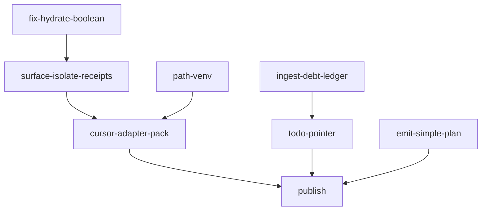

# First-class Cursor adapter (thin, Cursor-primary)

**kind:** `simple` · **execute_via:** `cursor-build` · **skill:** `l9-plan-simple`
Machine twin: [`cursor_adapter_first_class_9f3a1c2e.plan.json`](cursor_adapter_first_class_9f3a1c2e.plan.json) · Working Cursor plan: [`cursor_adapter_remediation_b929fe8b.plan.md`](cursor_adapter_remediation_b929fe8b.plan.md)

## Metadata

- Plan id: `cursor_adapter_first_class_9f3a1c2e` · schema `1.0` · mode `plan` · depth `standard`
- Workspace: `/Users/ib-mac/Cursor-Governance` (consumer checkout of Cursor-Governance)
- Date: 2026-09-02 · Author surface: `cursor`
- Upstream architect: `skills/l9-global-architect` framing settled the adapter-vs-copy decision (GAR); Recursive Leverage kernel applied to the working plan in place.

## Architect framing

**Selected:** thin Cursor adapter pack + shared ops brain. **Rejected:** copying `environment/agents/adapters/claude-code/`; a second receipt reader; hydrate/env logic under the adapter folder.

Deciding law: `CANONICAL_LAW.md` §2.1 (build inward, wrap outward — a dependent adapter never owns capability Cursor imports); `environment/agents/adapters/ADAPTER_CONTRACT.md` (adapters carry only discovery/bootstrap, memory endpoint config, identity examples — no credentials, no second resolver, no autonomy); `environment/agents/agent_registry.yaml` already declares `adapter: cursor` for a directory that did not exist. This plan creates it.

## Immutable baseline

- Branch context: open-PR chain tip (`PR_STACK=auto`); never branch from `origin/main` while any PR is open.
- Do not lock `origin/main = <sha>`; this is a simple plan, not a PE campaign.
- Untouchable bytes: `~/.cursor/graphiti.env`, the Igor-authored block in the root task queue (line 29+), all `kernels/**`, `CANONICAL_LAW.md`.
- Claude adapter scripts stay unmodified except the one guard hunk in `memory_prefetch.py`.

## Objective

One Cursor adapter pack, on par with Claude's file inventory but Cursor-native, plus removal of two observed cross-surface leaks — every fix landing in the shared `ops/` brain first, the adapter only binding it.

Success is falsifiable (full list in the machine twin):

1. Hydrate packet `degraded=false` + `close_gap=false` ⇒ no `graphiti-hydrate` line under `### Degraded`.
2. Claude `$HOME` receipt renders `stale_other_surface` under surface `cursor`, never this-session DEGRADED.
3. Zero `agent_id=claude-code` hydrate blocks in a Cursor session.
4. `make cursor-install` writes `~/.l9/cursor/bootstrap-state.json` (`l9.cursor-bootstrap.v1`); `--workspace $HOME` fails by name.
5. Fresh agent shells resolve `gh` and import `yaml` without per-command prefixes.
6. `WIP/9-2-26/cursor-remediation/` holds exactly the two ledger files, valid JSON, no zips.
7. Exactly one EOF pointer in the root task queue; Igor block untouched.

## Capability preflight

- `~/.cursor/hooks.json` registers `session-start-bootstrap` (verified — user-owned; installer verifies, never rewrites).
- `l9-governance` plugin symlink resolves to a governance root (verified).
- Locked venv (`.venv/bin/python`) imports `yaml`/`pydantic` (`make gov-python` green).
- `gh` on PATH after the Homebrew prepend (success criterion 5).
- Other agent's experience pack at `reports/environment_experience_improvement_pack.zip` — presence re-checked at Build; found and ingested.

## Execution envelope

- **cwd:** `/Users/ib-mac/Cursor-Governance` for every write and every gate.
- **write allow:** `ops/hooks/session_start_bootstrap.sh`, `ops/scripts/{classify_hydrate_state,claude_bootstrap_receipt,session_start_runtime_report}.py`, `ops/scripts/bootstrap_agent_environment.sh`, `ops/scripts/tests/**`, `environment/agents/adapters/cursor/**`, one guard hunk + test in `environment/agents/adapters/claude-code/`, `Makefile` (append-only), `environment/agents/README.md`, `WIP/9-2-26/cursor-remediation/**`, root task queue (EOF append only), `docs/plans/cursor_adapter_first_class_9f3a1c2e.*`.
- **write deny:** `~/.cursor/graphiti.env`, Claude installers, kernels, `CANONICAL_LAW.md`, any `.zip` under `cursor-remediation/`, the Igor block.
- **commands allow:** locked-venv pytest, `make cursor-install`/`cursor-install-check`/`agents-env`, scoped `git add` with pathspecs, `l4_local.py`, `PR_STACK=auto PR_REMEDIATE=0 make pr`.
- **commands deny:** do not run `make campaign`; `git add -A`; force-push; `--admin`; `pre-commit install`.

## Side effects and idempotency

- `install.sh` writes only `~/.l9/cursor/bootstrap-state.json` (or `bootstrap-check.json` in `--check` mode); re-runs overwrite the receipt atomically — idempotent.
- SessionStart PATH prepend is prepend-if-absent; repeated boots do not grow PATH.
- The ledger, README, Makefile, and task-queue edits are plain file content; re-running the Build produces the same bytes.
- No network mutation until the publish todo; no data migrations anywhere.

## Architecture impact

Cursor becomes a first-class registered surface: `agent_registry.yaml`'s `adapter: cursor` now names a real directory. The shared brain gains one classifier (`classify_hydrate_state.py`) and one parameter axis (receipt reader `--surface`), consumed by both surfaces. No new SSOT, no second activation path, no adapter-owned capability — the diagram in the working plan shows both adapters binding the same `ops/` core with disjoint receipts.

## Rollback

Every deliverable is a revertable unit: the hydrate hunk + new classifier script, the report classifier hunk, the prefetch guard hunk, one new adapter directory, appended Makefile lines, two WIP files, one task-queue line, and these plan artifacts. No migrations, no data, no remote state before publish.

## Complexity and uncertainty

- Effort: two S/M shared-brain fixes, one M adapter pack, three S doc/ledger tasks. Single-session build (confirmed by execution).
- Residual unknowns (both `accept_bounded`, ledgered in `tech_debt.json`): U-B — which parent process ran the 20:19Z Claude `$HOME` repair; U-C — what wrote `~/.cursor/graphiti.env` on 2026-06-07. Neither changes any decision in this plan; the downgrade and refusal handle every origin.

## Execution DAG

Critical path: `fix-hydrate-boolean` → `surface-isolate-receipts` → `cursor-adapter-pack` → `publish`. Checkpoints: C1 after receipt isolation (report + guard tests green, else stop); C2 after the pack (`make cursor-install` exit 0 + `agents-env` PASS, else fix before ledger/publish).

## Property evidence matrix

| Property | Evidence | Status |
|---|---|---|
| Hydrate honesty (criterion 1) | `ops/scripts/tests/test_classify_hydrate_state.py` — 11 tests | passed |
| Receipt isolation (criterion 2) | `test_session_start_runtime_report.py` surface-isolation + cursor-adapter classes | passed |
| No Claude bleed (criterion 3) | `test_memory_prefetch_guard.py` — no-marker run emits no context | passed |
| Install contract (criterion 4) | `environment/agents/adapters/cursor/tests/test_cursor_install.py` — receipt shape, `$HOME` refusal, check-mode isolation, thinness | passed |
| PATH/venv (criterion 5) | Homebrew prepend in SessionStart; hook-contract test green | passed |
| Ledger shape (criterion 6) | `tech_debt.json` parses; 19 rows, all fields present; no zips | passed |
| Task-queue pointer (criterion 7) | `git diff` shows one EOF hunk only | passed |
| Registry coherence | `make agents-env` PASS with the new directory | passed |

## Stress and disconfirm

- Feed the classifier a packet with `"degraded": false` inside the fence — any hydrate row means criterion 1 failed.
- With the Claude `$HOME` receipt on disk, run the report as `cursor` — any Degraded line naming `claude-adapter` means criterion 2 failed.
- Run `memory_prefetch.py` with no Claude markers — any stdout context block means criterion 3 failed.
- Blast-radius guards: `close_gap: true` and `"degraded": true` stay unconditional positives (a boolean parse must not hide a real close-gap); the prefetch guard mirrors the exact marker set the sibling hook already trusts (must not blind real Claude sessions).
- Assumed false if: `CURSOR_PROJECT_DIR` is not a git root in real sessions, or `hooks.json` stops being user-owned.

## Out of scope

Copying or importing any `claude-code/` script; `make campaign` / Program Lock (each is a stop, not a stretch goal); moving or printing `GRAPHITI_MCP_TOKEN` or any env value; restoring the capability broker; changing `~/.cursor/graphiti.env` bytes; any `.zip` inside `cursor-remediation/`; editing the Igor block; KERNEL/PE overlay landing.

## Convergence

Status: **converged**. All build todos executed; property matrix fully passed; residual unknowns U-B/U-C are `accept_bounded` and ledgered in `WIP/9-2-26/cursor-remediation/tech_debt.json`. Remaining work is the publish ceremony only (FV-5 executes there — a plan document cannot pre-pass the gate on its own commit). Next skill: none.

## Execute via Cursor Build

Press **Build**. Plan on this workspace. Execute on the unique open-PR chain tip (`PR_STACK=auto`); never branch from `origin/main` if any open PR exists. Do not run `make campaign`. After todos: scoped-commit (pathspecs only), `l4_local.py authorize-release`, then `PR_STACK=auto PR_REMEDIATE=0 make pr`. The finish reply must display the opened PR URL.
