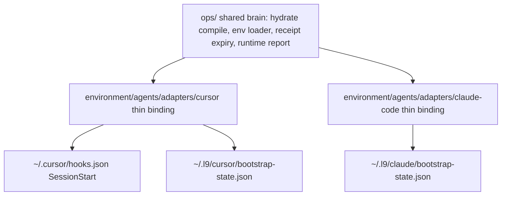

# First-class Cursor adapter (thin, Cursor-primary)

This is the surface Igor lives in daily. The bar is: a healthy day boots with an **empty Degraded section**, and every line the SessionStart banner does print is true, this-session, this-surface.

## Objective

One Cursor adapter pack, on par with Claude's file inventory but Cursor-native, plus removal of the two observed cross-surface leaks — with every fix landing in the shared `ops/` brain first and the adapter only binding it (CANONICAL_LAW §2.1).

## Success criteria (falsifiable)

1. A SessionStart whose hydrate packet has `"degraded": false` and `"close_gap": false` produces **no** `graphiti-hydrate` line under `### Degraded`. (Repro today: the JSON fence containing `"degraded": false` matches `*degraded*` at [`ops/hooks/session_start_bootstrap.sh`](ops/hooks/session_start_bootstrap.sh) lines 449–456 and flips `HYDRATE_DEGRADED=true`.)
2. With `L9_GOVERNANCE_SURFACE=cursor`, [`ops/scripts/session_start_runtime_report.py`](ops/scripts/session_start_runtime_report.py) renders a Claude receipt whose `workspace` is `$HOME` (or `surface: claude-code`) as `stale_other_surface`, never as this-session DEGRADED. (Repro today: `~/.l9/claude/bootstrap-state.json` written 2026-09-02T20:19:36Z with `workspace: /Users/ib-mac` was reported as current Cursor state.)
3. A Cursor session injects **zero** `agent_id=claude-code` hydrate blocks. (Repro today: this session's context carries two, because [`environment/agents/adapters/claude-code/hooks/memory_prefetch.py`](environment/agents/adapters/claude-code/hooks/memory_prefetch.py) has no Claude-runtime-marker guard — grep confirms no `CLAUDECODE`/`CLAUDE_CODE_*` check, unlike [`environment/agents/adapters/claude-code/hooks/session_start_claude_governance.sh`](environment/agents/adapters/claude-code/hooks/session_start_claude_governance.sh) lines 89–92.)
4. `make cursor-install WS=<repo>` exits 0, writes `~/.l9/cursor/bootstrap-state.json` (schema `l9.cursor-bootstrap.v1`), and `make cursor-install-check` re-reads it through the shared reader. Passing `--workspace $HOME` fails with a named error.
5. In a fresh agent shell: `command -v gh` and `python3 -c 'import yaml'` both succeed without a per-command PATH prefix.
6. `WIP/9-2-26/cursor-remediation/` contains exactly `TECH_DEBT.md` + `tech_debt.json` (valid JSON), no `.zip`; every row has id, source, impact, owner, traces_to, done_condition.
7. `TODO.md` gains exactly one EOF pointer; `git diff` shows no hunk inside the Igor block (line 29 onward).

## Architecture (GAR settled)

**Selected:** thin Cursor adapter pack + shared ops brain. **Rejected:** copying `environment/agents/adapters/claude-code/`; a second receipt reader; hydrate/env logic under the adapter folder.

Deciding law and evidence:

- [`CANONICAL_LAW.md`](CANONICAL_LAW.md) §2.1 — build inward (`ops/`), wrap outward; a dependent adapter never owns capability Cursor imports.
- [`environment/agents/adapters/ADAPTER_CONTRACT.md`](environment/agents/adapters/ADAPTER_CONTRACT.md) — adapters carry only discovery/bootstrap, memory endpoint config, identity examples, references. No credentials, no second resolver, no autonomy.
- [`environment/agents/agent_registry.yaml`](environment/agents/agent_registry.yaml) line 99 already declares `adapter: cursor` — the directory it names does not exist. This plan creates it.
- Claude's surfaces share one installer (`web/setup.bootstrap.sh` → `web/setup.sh` → `install.sh`); that installer writes `~/.l9/claude/bootstrap-state.json`. Cursor MUST NOT call it and MUST NOT share its receipt file.

## Deliverable 1 — shared-brain fixes (land first; highest leverage)

1. **Hydrate honesty.** [`ops/hooks/session_start_bootstrap.sh`](ops/hooks/session_start_bootstrap.sh) lines 449–456 MUST parse the packet's `degraded` / `close_gap` booleans (the JSON fence is already in `HYDRATE_MD`; extract with the same python3 already used at line 60), not shell-glob the markdown. `"degraded": true`, `close_gap: true`, and `hydrate CLI missing` remain the only positive signals. Twin test beside `ops/scripts/tests/test_session_start_runtime_report.py`: packet-false ⇒ no hydrate row; packet-true ⇒ row present.
2. **One receipt reader, surface-parameterized.** Extend [`ops/scripts/claude_bootstrap_receipt.py`](ops/scripts/claude_bootstrap_receipt.py) (or extract its core) to take a surface/path parameter instead of writing a second reader — it already owns the one expiry rule (INV-2) and the `never_ran` distinction. `session_start_runtime_report.py::classify_claude_adapter` MUST downgrade a receipt whose `workspace` is not this git root or whose `surface` is not the session surface to `stale_other_surface` (report-only, excluded from `### Degraded`).
3. **Guard the leaking Claude hook.** [`memory_prefetch.py`](environment/agents/adapters/claude-code/hooks/memory_prefetch.py) MUST no-op (observer-class exit 0, one skip-log line) when no Claude runtime marker is present — same marker set `session_start_claude_governance.sh` lines 89–92 already uses. This closes success criterion 3 at the source instead of filtering downstream.
4. **PATH + interpreter.** SessionStart (or `before-shell-execution-gate.sh`) exports `/opt/homebrew/bin` into agent shells and documents the locked-venv binding; `bootstrap_agent_environment.sh` refuses `--workspace $HOME` (a `$HOME` workspace is how the Claude receipt got poisoned — `bootstrap-repair-119d0df….log` line 1: "workspace /Users/ib-mac is the harness project directory").

## Deliverable 2 — the Cursor adapter pack

`environment/agents/adapters/cursor/` mirroring Claude's inventory shape, Cursor-native, every file thin:

| File | Content | MUST NOT |
|---|---|---|
| `README.md` | surface map (IDE-machine state persists — no ephemeral-sandbox story), activation via `~/.cursor/hooks.json` + `l9-governance` plugin, pointers to shared ops | own doctrine that lives in AGENTS.md |
| `environment.env.example` | identity trio from registry (`L9_MEMORY_AGENT_ID=cursor`, `USER_ID=cursor_agent`, surface id), `GRAPHITI_MCP_URL` | any credential, `GRAPHITI_MCP_TOKEN` |
| `mcp.template.json` | Graphiti front door per ADAPTER_CONTRACT (no bearer) | broker URL |
| `install.sh` | calls shared `bootstrap_agent_environment.sh --surface cursor`, verifies hooks.json registration + plugin symlink + `.cursor-commands`, writes `~/.l9/cursor/bootstrap-state.json` via the shared receipt writer path | cloning governance, touching `~/.l9/claude/*`, secrets |
| `SESSION_START_SPEC.md` | what the Cursor banner promises (sections, Degraded semantics, hydrate honesty) | a second activation path |
| `tests/` | install receipt shape, `$HOME` refusal, report ignores Claude receipt, hydrate boolean | copying Claude test fixtures wholesale |

Makefile gains `cursor-install` / `cursor-install-check` (append-only; the PR will touch an `additive_only` root file, so `make pr` must stamp `<!-- L9_PROTECTED_ROOT_PR -->` — expected, not a blocker). Mention the new directory in [`environment/agents/README.md`](environment/agents/README.md) layout.

## Deliverable 3 — tech-debt ledger (no zips)

Create [`WIP/9-2-26/cursor-remediation/`](WIP/9-2-26/cursor-remediation/) containing exactly two files:

- `TECH_DEBT.md` — human ledger, ranked by impact then frequency
- `tech_debt.json` — machine twin, one array of rows

Sources to ingest (read in place; never relocate archives):

- This session's pack: `/tmp/l9-env-exp-pack-20260902/` (FAIL-01…11, FRIC-01…06, IMP-01…09, U-01…04) and its zip at `WIP/9-2-26/environment_experience_improvement_pack.zip`.
- Other agent's pack: `reports/environment_experience_improvement_pack.zip` and `/tmp/environment_experience_improvement_pack.zip` — **both absent at planning time** (globbed). Build re-checks once; if still absent, write `UNKNOWN` rows naming the claimed paths. MUST NOT invent that pack's finding ids or contents.
- Resolved-this-chat evidence (record as closed/triaged, with the residual unknowns kept): hydrate DEGRADED = bootstrap substring match, not the compiler; `init_graphiti_machine_env.sh` did not create `~/.cursor/graphiti.env` (file birth 2026-06-07 predates the tracked script 2026-07-04; script never overwrites; secrets example it would create is absent); Claude `$HOME` receipt written 2026-09-02T20:19:36Z by Claude `install.sh` via a `$HOME`-workspace SessionStart, not by Cursor's hook.

Row contract: `id`, `source` (pack + file), `impact` (high|med|low), `owner` (`env`|`loader`|`bootstrap`|`adapter`), `traces_to` (FAIL/IMP/U ids or `resolved-in-chat`), `status` (`open`|`fixed-by-this-plan`|`unknown`), `done_condition`. Rows this plan fixes point at the fixing todo. No secret values, ever.

## TODO.md pointer (append-only)

[`TODO.md`](TODO.md) is `additive_only`, and the Igor-authored block from line 29 (`# Authored by IGOR - USER - Owner...`) onward is untouchable. Append exactly one item at EOF: review `WIP/9-2-26/cursor-remediation/TECH_DEBT.md` so TODO.md stays a pointer, not a findings dump.

## Scope

**In:** the four shared-brain fixes; `environment/agents/adapters/cursor/` + tests; additive Makefile targets; `environment/agents/README.md` layout line; WIP debt pair; TODO EOF pointer; official simple-plan artifacts under `docs/plans/`.

**Out (each is a stop, not a stretch goal):** copying/importing any `claude-code/` script; `make campaign` / Program Lock / `Lock: origin/main = <sha>`; moving or printing `GRAPHITI_MCP_TOKEN` or any env value (IMP-04 is a human secret-plane decision); restoring the capability broker; changing `~/.cursor/graphiti.env` bytes; any `.zip` inside `cursor-remediation/`; editing the Igor TODO block; KERNEL/PE overlay landing.

Single-ingress: not applicable — this plan produces one adapter binding and point fixes, no multi-entrypoint routing surface.

## Hook catalog and validation gates

Code in scope ⇒ [`.pre-commit-config.yaml`](.pre-commit-config.yaml) is the catalog; no `pre-commit install`. Build-time gates, in order:

1. `python3 -m pytest ops/scripts/tests/test_session_start_runtime_report.py <new hydrate/receipt tests> -q` — green.
2. `make cursor-install WS="$(pwd)"` then `make cursor-install-check` — exit 0; receipt present; `--workspace $HOME` variant exits non-zero.
3. `python3 -c "import json; json.load(open('WIP/9-2-26/cursor-remediation/tech_debt.json'))"` — parses.
4. `make agents-env` — registry + adapter validation still green with the new directory.
5. `make pr` checkers (after L4) own the rest; do not pre-run a second full gate.

## Stress test

- **Disconfirm 1:** feed the runtime report a packet with `"degraded": false` inside the JSON fence — if a hydrate row still appears, criterion 1 failed.
- **Disconfirm 2:** with the Claude `$HOME` receipt on disk, run the report as `cursor` — any `### Degraded` line naming `claude-adapter`/`shared_bootstrap` means criterion 2 failed.
- **Disconfirm 3:** run `memory_prefetch.py` with no Claude markers — any stdout context block means criterion 3 failed.
- **Assumed true:** `CURSOR_PROJECT_DIR` is a git root in real sessions; `hooks.json` stays user-owned (adapter verifies, does not rewrite).
- **Blast radius:** an over-eager boolean parse could hide a real close-gap — `close_gap: true` and `"degraded": true` remain unconditional positives, and the close-gap unit tests in `ops/graphiti/hydration/test_hydration.py` must stay green. Guarding `memory_prefetch.py` wrongly would blind real Claude sessions — the guard mirrors the exact marker set the sibling hook already trusts.
- **Rollback:** every deliverable is a revertable unit — hydrate hunk, report classifier, one new directory, appended Makefile lines, two WIP files, one TODO line. No migrations, no data.

## Leverage order (execution = todo order)

1. Hydrate boolean — one shared hunk, ends the most-seen false alarm.
2. Receipt surface isolation + `memory_prefetch.py` guard — ends cross-surface bleed at both sink and source.
3. Adapter pack — makes Cursor a first-class registered surface instead of scatter.
4. PATH/venv + `$HOME` refusal — removes the root cause that poisoned the receipt.
5. Debt ledger + TODO pointer — traceability for everything not fixed here.

Shared causes fixed once: substring-as-status (1), receipt-without-surface-identity (2), hooks-without-runtime-guard (2), `$HOME`-as-workspace (4).

## Unknown register

- U-A: other agent's zip contents — paths absent; re-check at Build, else UNKNOWN rows.
- U-B: which parent process ran the 20:19Z Claude repair (sibling Claude window vs this machine's harness) — receipt facts recorded; parent unknowable from disk.
- U-C: what wrote `~/.cursor/graphiti.env` on 2026-06-07 — predates the tracked init script; recorded as unknown provenance, file bytes stay untouched.

## Execute via Cursor Build

Press **Build**. Plan on this workspace. Execute on the unique open-PR chain tip (`PR_STACK=auto`); never branch from `origin/main` if any open PR exists. Do not run `make campaign`. After todos: scoped-commit (pathspecs only), `l4_local.py authorize-release`, then `PR_STACK=auto PR_REMEDIATE=0 make pr`. The finish reply must display the opened PR URL.
