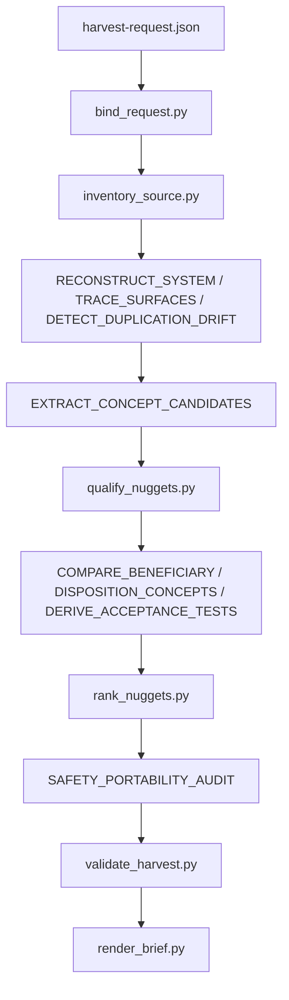

# Intelligence harvest: execution-governance to Cursor-Governance

## Execute via

`/gmp`. Do not press Build. Do not run `make campaign`. Do not admit a Program Lock.

## Scope and authority

Donor is `execution-governance/` (7 files, all under `_archived/`: `README.md`, `api/governance-api.py`, `api/registry-viewer-intelligence.py`, `dashboard/governance-dashboard.html`, `monitoring/governance-monitor.py`, `testing/governance-test-suite.py`, `validation/governance-validator.py`). Beneficiary is `https://github.com/Quantum-L9/Cursor-Governance`, the remote of this workspace, so beneficiary comparison reads live paths in this checkout.

[policies/harvest-policy.yaml](skills/l9-intelligence-harvest/policies/harvest-policy.yaml) sets `mutation.donor: forbidden`, `mutation.beneficiary: forbidden`, `mutation.beneficiary_implementation: forbidden`, and `allowed_outputs` to exactly `harvest.json`, `harvest-receipt.json`, `DONOR-HARVEST-BRIEF.md`. Nothing in `execution-governance/` or the live tree is edited, and donor code is never executed (`execute_donor_code_by_default: false`). This harvest produces analysis only; it does not authorize the Tier-A1 delete that `TODO.md` tracks for this tree.

Interpreter for every script is `"$HOME/.cursor-governance/.venv/bin/python"` (jsonschema 4.26.0 and PyYAML confirmed present). Scripts are invoked by path so `sys.path[0]` resolves their `from _common import ...`.

## Pipeline



## Step 1 — bind the request

Create `WIP/8-28-26/execution-governance-harvest/harvest-request.json`:

```json
{
  "request_id": "harvest-execution-governance-2026-08-28",
  "donor": "execution-governance/",
  "beneficiary": "https://github.com/Quantum-L9/Cursor-Governance",
  "harvest_target": "governance validation, compliance monitoring, registry query, and self-audit semantics worth preserving before the Tier-A1 delete",
  "access_mode": "read-only",
  "depth": "exhaustive",
  "secrets_policy": "redact",
  "brief": true
}
```

Run [scripts/bind_request.py](skills/l9-intelligence-harvest/scripts/bind_request.py) with that file plus a bound output path. Non-zero exit means stop.

## Step 2 — inventory and identity

Run [scripts/inventory_source.py](skills/l9-intelligence-harvest/scripts/inventory_source.py) against `execution-governance`. It emits `source_identity` plus rows of `{path, bytes, sha256, classification: "candidate"}`.

Note a real shape gap: the IR inventory item in [contracts/harvest-ir.schema.json](skills/l9-intelligence-harvest/contracts/harvest-ir.schema.json) is `additionalProperties: false` and requires `path`, `classification`, `action`, `evidence_ids` — it has no `bytes` or `sha256`. So the probe output is transformed, not pasted: drop the hash fields (keep them as evidence locators), reclassify each row off the flat `candidate` default into `archive` / `legacy` / `duplicate` per [policies/harvest-policy.yaml](skills/l9-intelligence-harvest/policies/harvest-policy.yaml) `classification`, and set `action` per row.

## Step 3 — reconstruct the system

Per [references/system-reconstruction-contract.md](skills/l9-intelligence-harvest/references/system-reconstruction-contract.md), reconstruct the donor as one Suite-6 governance subsystem rather than six independent files, and populate `system`, `surfaces`, `drift`, and `evidence`.

Load-bearing observations to resolve and record with epistemic state:

- `governance-api.py` imports its siblings through `l9_governance_root / "execution" / "validation" / ...`, a tree that no longer exists. Every internal surface is therefore unreachable — CONFIRMED, not inferred.
- `registry-viewer-intelligence.py` reads `foundation/logic/rule-registry.json`, now at `foundation/_archived/logic/rule-registry.json`.
- `governance-monitor.py` ran under the `com.cursor.governance-monitor` LaunchAgent, deliberately unloaded by [docs/plans/BUILT/disable_broken_startup_systems_920c0410.plan.md](docs/plans/BUILT/disable_broken_startup_systems_920c0410.plan.md).
- `ops/scripts/operational-oversight.py` lines 26-32 attempt `from governance_monitor import GovernanceMonitor` behind `try/except ImportError`. This is a wrapper that resolves to nothing: the module filename is hyphenated and so was never importable. Record the resolved target, not the name.

Every material claim carries `CONFIRMED`, `INFERENCE`, or `UNKNOWN` with a resolvable locator, since [scripts/validate_harvest.py](skills/l9-intelligence-harvest/scripts/validate_harvest.py) rejects any `CONFIRMED`/`INFERENCE` evidence whose locator kind is `unknown` or whose `claim` is empty, and rejects any `is_wrapper` surface without a `resolved_target`.

## Step 4 — extract concepts and compare against the beneficiary

Per [references/concept-extraction-contract.md](skills/l9-intelligence-harvest/references/concept-extraction-contract.md) and [references/beneficiary-fit-contract.md](skills/l9-intelligence-harvest/references/beneficiary-fit-contract.md), extract the semantic contract behind each donor capability, then compare against the live owner. The beneficiary side is already mapped:

- Runtime governance validation, from `governance-validator.py`, versus the live `ops/scripts/check_governance_wiring.sh`, `validate_governance_symlinks.sh`, `validate_root_file_protection.py`, `check_rules_standard.py` family wired through pre-commit and `make pr`. Beneficiary is stronger; `PORT` is forbidden here by `validate_harvest.py` and the disposition must come from `MERGE_WITH_EXISTING`, `KEEP_LOCAL`, `REJECT`, `UNKNOWN`.
- Cross-layer governance test framework, from `governance-test-suite.py`, versus the live pytest catalog behind `make pr-check`.
- Registry query, from `registry-viewer-intelligence.py`, versus `commands/COMMANDS_MANIFEST.yaml`, `ops/generated/skill-registry.json`, and the rules manifest.
- Compliance monitoring, from `governance-monitor.py`, and the REST plus dashboard surface, from `governance-api.py` and `governance-dashboard.html` — no live owner exists, so these are `STANDALONE` comparisons and the disposition turns on whether the semantics are wanted at all.
- The corpus self-audit concept in the donor `README.md`: an active-versus-orphan utilization matrix (it reported 19.5 percent, 32 of 164 files wired). This is the strongest genuinely unowned semantic in the tree, and it is adjacent to live `ops/scripts/audit_rule_references.py` and `validate_generated_allowlist.py`.

Each concept gets exactly one disposition from [policies/disposition-policy.yaml](skills/l9-intelligence-harvest/policies/disposition-policy.yaml), a `beneficiary_fit` block with all four required keys, a full `portability` block, and at least one given/when/then/must_not acceptance test expressing behavior rather than donor code shape.

## Step 5 — qualify, rank, validate, render

Run in DAG order:

1. [scripts/qualify_nuggets.py](skills/l9-intelligence-harvest/scripts/qualify_nuggets.py) — sets `nugget` only when disposition is viable and all eight closure checks pass.
2. [scripts/rank_nuggets.py](skills/l9-intelligence-harvest/scripts/rank_nuggets.py) — `leverage * 10 + compounding`, sets `highest_leverage_nugget`.
3. `validate_harvest.py <harvest.json> <harvest-receipt.json>` — schema plus evidence, portability, and authority closure. Exit 2 means fix the IR and re-run; do not advance.
4. [scripts/render_brief.py](skills/l9-intelligence-harvest/scripts/render_brief.py) — re-runs `validate()` and raises rather than writing a brief over a failing harvest.

## Step 6 — commit

Scoped commit with explicit pathspecs for `WIP/8-28-26/execution-governance-harvest/` only, per rule 49 and the commit-before-you-stop clause in `AGENTS.md`. Push and `make pr` stay ask-first.

## Deliverables

Write only these four files under `WIP/8-28-26/execution-governance-harvest/`:

- `harvest-request.json`
- `harvest.json`
- `harvest-receipt.json`
- `DONOR-HARVEST-BRIEF.md`

## Out of scope

Literal code extraction, wiring any harvested concept into the beneficiary, and the `execution-governance/` delete itself. The pack forbids all three; a follow-up would route through `l9-wire-skill-into-repo` or a normal change plan.
