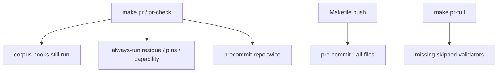

# Finish PR-gate velocity (hooks / Makefile / docs)

Pytest on `make pr-check` is **already built**. Do not recreate `select_pytest_paths.py` or add `--paths-file`. Live code is [`ops/scripts/select_pr_pytest_paths.py`](ops/scripts/select_pr_pytest_paths.py) plus `--changed-file` in [`ops/scripts/run_python_test_suites.py`](ops/scripts/run_python_test_suites.py), wired from [`ops/scripts/run_pr_gate.sh`](ops/scripts/run_pr_gate.sh) (L295–317).

This packet is only what is still fat. Build on a **new `origin/main` worktree**. `autonomous_merge: false`. Publish with `PR_REMEDIATE=0 make pr`. Do not merge.

Supersedes the pending pytest todos on [`docs/plans/pr_gate_velocity_8b9391f7.plan.md`](docs/plans/pr_gate_velocity_8b9391f7.plan.md). Sibling already landed: [`docs/plans/pr_gate_velocity_25da307a.plan.md`](docs/plans/pr_gate_velocity_25da307a.plan.md).

## Do not rebuild

- [`ops/scripts/select_pr_pytest_paths.py`](ops/scripts/select_pr_pytest_paths.py)
- [`ops/scripts/run_python_test_suites.py`](ops/scripts/run_python_test_suites.py) `--changed-file`
- [`ops/scripts/tests/test_select_pr_pytest_paths.py`](ops/scripts/tests/test_select_pr_pytest_paths.py)
- Filename pre-commit + ruff, [`resolve_changed_files.sh`](ops/scripts/resolve_changed_files.sh), [`run_pr_security.sh`](ops/scripts/run_pr_security.sh)

Follow-on (not this build): an unmapped production `.py` can still select a suite `owned_paths` root or parent `tests/` dir. Full catalog still never runs on `make pr-check`.

sessionEnd (`backup_to_github.sh`) and GitHub required checks are out of scope.

## Still fat

1. [`run_pr_precommit.sh`](ops/scripts/run_pr_precommit.sh) `SKIP_LIST` is only `sync-generated-artifacts` (+ `symlinks-check` when that skip applies). Still runs `repo-hygiene`, `legacy-doctrine-residue`, and full-corpus `rules-check` / `skills-check` when those `files:` match.
2. [`no-hardcoded-paths`](.pre-commit-config.yaml) has no `files:` — runs on every `--files` invocation.
3. Always-run in [`run_pr_gate.sh`](ops/scripts/run_pr_gate.sh) L115–130 (contract surface, doctrine residue, workflow pins, git-denial residue) plus Make `pr-check: capability-contract-validate`.
4. Duplicate pre-commit: Make `pr-check: precommit-repo` / `pr: precommit-repo` **and** `_gate_run_precommit`.
5. [`Makefile`](Makefile) `push: precommit backup` is `--all-files`.
6. [`pr-full`](Makefile) does not own the validators this build will skip.
7. [`ARCHITECTURE.md`](ARCHITECTURE.md) L57 does not name the scoped-vs-full pytest split.

## Locked

- `Makefile` and `.pre-commit-config.yaml` are `additive_only`. Overwrites need:
  - `ALLOW-ROOT-DELETION: Makefile — velocity path must change push/prereq/pr-full lines`
  - `ALLOW-ROOT-DELETION: .pre-commit-config.yaml — add files: to no-hardcoded-paths`
- Rewrite the P2-12 “always-run” comment when gating that block.
- capability-contract on `make pr` only if the change set matches `^(ops/secrets/|environment/agents/)`.
- workflow pins only if `.github/workflows/` or the pin script changed.

## Build steps

**todo-04 — SKIP + files:** Extend `SKIP_LIST` with `repo-hygiene`, `legacy-doctrine-residue`, `rules-check`, `skills-check`. Keep filename hooks + ruff. Add `files:` on `no-hardcoded-paths` for the seven SCAN_FILES in [`validate_governance_no_hardcoded_paths.sh`](ops/scripts/validate_governance_no_hardcoded_paths.sh) L15–23 plus that script itself.

**todo-05 — Makefile + always-run:** Drop Make prereqs `pr-check: precommit-repo`, `pr: precommit-repo`, and `pr-check: capability-contract-validate`. Switch `push:` to `precommit-repo backup`. Domain-gate or move the four always-run validators off the velocity path.

**todo-06 — thicken pr-full:** Keep current `precommit lint-ruff-full uv-lock-check test rules-validate`. Add `capability-contract-validate` plus `validate_legacy_doctrine_residue.py`, `validate_workflow_action_pins.py`, `validate_governance_contract_surface.py`, `validate_git_denial_residue.py`.

**todo-07 — docs:** Append-only [`AGENTS.md`](AGENTS.md): velocity = changed-file hooks + landed scoped pytest; corpus / always-run / full catalog = `make pr-full`; Makefile `push` = `precommit-repo`; sessionEnd unchanged. Correct [`ARCHITECTURE.md`](ARCHITECTURE.md) L57.

**todo-08 — prove:** Extend [`tests/ops/scripts/test_pr_lifecycle.py`](tests/ops/scripts/test_pr_lifecycle.py) for SKIP_LIST, `push: precommit-repo`, dropped Make prereqs, and thickened `pr-full`. Then `make pr-check`.

**todo-09 — publish:** Kernels, L4 authorize, `PR_REMEDIATE=0 make pr`. No merge.

## Envelope

- write_allow: `ops/scripts/run_pr_precommit.sh`, `ops/scripts/run_pr_gate.sh`, `.pre-commit-config.yaml`, `Makefile`, `tests/ops/scripts/test_pr_lifecycle.py`, `AGENTS.md`, `ARCHITECTURE.md`
- write_deny: pytest selector/runner, `.github/workflows/**`, `CANONICAL_LAW.md`, `pyproject.toml`, `python-contract.json`, sessionEnd hook, dirty WIP
