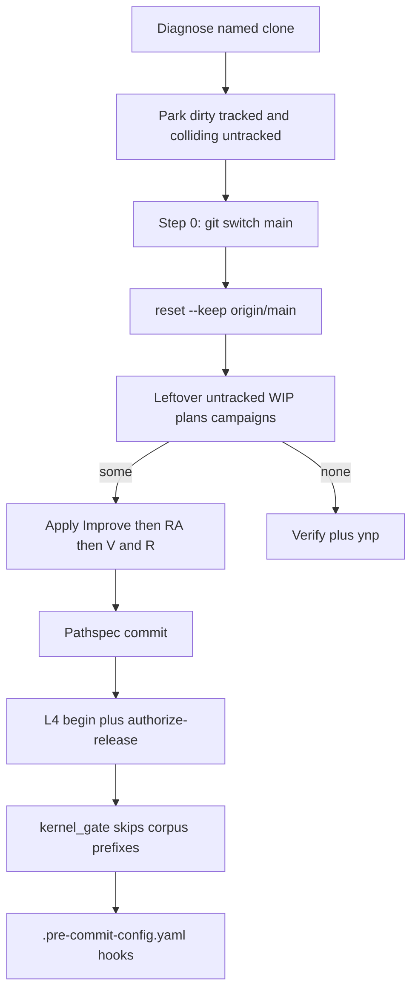

# Fix `/ff`: switch to main, then corpus kernels

Today [`skills/l9-repo-sync/scripts/ff.sh`](skills/l9-repo-sync/scripts/ff.sh) **refuses** when HEAD is not `main` (lines 50–53), and the slash protocol still tells L4 to `record-kernels` on the shelf worktree. [`ops/autonomy/kernel_gate.py`](ops/autonomy/kernel_gate.py) still demands `kernel_pass` on changed `docs/plans/*.plan.md` at precommit. That is the opposite of the intended lifecycle.

## Target flow

Two owners, no overlap:

- **`ff.sh`**: catch-up mechanics, including step 0 switch.
- **Slash / `make ff` caller**: leftover shelf + three-kernel apply. `ff.sh` stays push-off and does not run kernels or L4.

## 1. Step 0 — switch to `main` inside `ff.sh`

Do **not** ask the agent to `git switch` first. Rule 49 / [`ops/autonomy/worktree_isolation_gate.py`](ops/autonomy/worktree_isolation_gate.py) deny a dirty branch switch; [`ops/autonomy/git_guardrails.py`](ops/autonomy/git_guardrails.py) `_classify_checkout` also flags dirty switches. The agent command remains `bash skills/l9-repo-sync/scripts/ff.sh`, so the inner switch is not an agent-level `git switch`.

New order in `ff.sh`:

1. Capture gitdir, current branch, keep-list, untracked inventory (unchanged).
2. Fetch `origin/main` (need the tip before switch).
3. **If HEAD is not `main`:**
   - Park **all** dirty tracked (existing stash-create + hold + restore-from-HEAD).
   - Park untracked paths that `origin/main` already tracks (existing overwrite-untracked move), so switch is not blocked by incoming tracked files.
   - `git switch main`, or `git switch -c main --track origin/main` if no local `main`.
   - Do **not** reset the feature branch. Unique feature commits stay on that ref. Do **not** count them as `l9/ff-preserve-*` (that is why today's refuse exists: `AHEAD` on a feature branch would park then `reset --keep` would move the feature pointer).
4. Compute ahead/behind **on `main`**, then existing catch-up.
5. Identity check: **gitdir unchanged** and **`BRANCH_AFTER == main`**. Drop the current `BRANCH_BEFORE == BRANCH_AFTER` fail (that would reject a successful step 0).

Leave-at-tip dirty behavior stays for clones **already on `main`**. Feature-branch dirt stays in the hold / dirty-preserve ref; it is not restored onto `main`.

## 2. Corpus kernels live on `/ff` shelf, before precommit

After catch-up, leftover **untracked** files under these three trees are the kernel target (same skip list as today: `WIP/Legal Defense/`, secret globs, paths an open `feat/ff-shelf-*` PR already carries):

- `WIP/`
- `docs/plans/`
- `environment/program-execution/campaigns/` (new; today shelf is only WIP + plans)

In the sibling worktree, **before** `git commit` and **before** `make precommit-repo`:

1. [`kernels/Improve.md`](kernels/Improve.md)
2. [`kernels/Recursive Alignment.md`](kernels/Recursive%20Alignment.md)
3. [`kernels/Validate & Repair.md`](kernels/Validate%20&%20Repair.md)

Then pathspec-add, scoped commit. For shelved `*.plan.md`, write `kernel_pass` with those three blocks in that `ran_at` order (extend [`skills/l9-plan/scripts/validate_plan_kernel_receipt.py`](skills/l9-plan/scripts/validate_plan_kernel_receipt.py) + fixtures). WIP and campaign files get the editorial pass only; do not invent a second receipt schema.

Kernels are markdown for the agent. They stay in the slash protocol ([`commands/ff.md`](commands/ff.md) + [`skills/l9-repo-sync/references/execute.md`](skills/l9-repo-sync/references/execute.md)), not in `ff.sh`.

## 3. L4 and `kernel_gate` must not apply those kernels

Encode the skip in the gate file the user named:

[`ops/autonomy/kernel_gate.py`](ops/autonomy/kernel_gate.py) `PLAN_SKIP_PREFIXES` (rename or add `CORPUS_SKIP_PREFIXES`) must include:

- `WIP/`
- `docs/plans/`
- `environment/program-execution/campaigns/`

`verify_plans` must not emit `apply_plan_kernels_then_precommit` for those paths. If the **entire** changed set is only those prefixes, `verify_tree` is skipped too so a corpus-only shelf PR does not demand the tree RA+V&R receipt. Mixed code + corpus still runs the tree latch on the code.

L4:

- Shelf protocol: `l4_local.py begin` then `authorize-release` only. **Remove** `record-kernels` from [`commands/ff.md`](commands/ff.md) / execute.md / [`AGENTS.md`](AGENTS.md) `FF_SHELF_WIP_PLANS_V1` (append a new fragment; do not rewrite the old block).
- [`ops/autonomy/l4_local.py`](ops/autonomy/l4_local.py) `record_kernels` must not be the corpus apply path (it already only stamps tree SHAs). Note in [`ops/autonomy/surface_profile.yaml`](ops/autonomy/surface_profile.yaml) `kernel_hook` that WIP/plans/campaigns are `/ff`-owned.

Flip [`tests/ops/autonomy/test_kernel_gate.py`](tests/ops/autonomy/test_kernel_gate.py) `test_changed_plan_without_receipt_fails`: a bare `docs/plans/*.plan.md` plus tree receipt must **PASS**. Add coverage that `ops/foo.py` still fails without a tree receipt, and that a corpus-only changed-file list skips the tree latch.

Leave [`ops/hooks/plan_kernel_gate.py`](ops/hooks/plan_kernel_gate.py) campaign-execute deny as-is unless a store-plan inject still fires Improve/V&R mid-session; if it does, stop injecting for those three prefixes so `/ff` is the only apply site.

## 4. Doctrine edits (same contract, no second sync path)

- [`commands/ff.md`](commands/ff.md): EXECUTION step 0 = `ff.sh` switches to `main` after parking. Shelf step lists campaigns + three-kernel order, then L4 without `record-kernels`. FORBIDDEN: agent `git switch` still forbidden; inner `ff.sh` switch to `main` is the exception.
- [`skills/l9-repo-sync/SKILL.md`](skills/l9-repo-sync/SKILL.md): drop “refuse if not on main”. Compact Workflow matches step 0 + corpus kernels.
- [`skills/l9-repo-sync/references/diagnose-first.md`](skills/l9-repo-sync/references/diagnose-first.md): not-on-main is not a stop.
- [`skills/l9-repo-sync/references/forbidden.md`](skills/l9-repo-sync/references/forbidden.md) + [`rules/55-ff-only-ssot-sync.mdc`](rules/55-ff-only-ssot-sync.mdc): allowed catch-up primitive is `git switch` **to `main` only, inside `ff.sh` after park**. Resetting a feature branch onto `origin/main` stays forbidden.
- [`skills/l9-repo-sync/scripts/validate_pack_structure.py`](skills/l9-repo-sync/scripts/validate_pack_structure.py): allow `git switch` under execute/SKILL the same way `reset --keep` is allowed.
- [`AGENTS.md`](AGENTS.md) additive fragments only: step-0 switch; corpus kernels on `/ff` before precommit; L4/kernel_gate skip those prefixes. Do not fold `PLAN_KERNEL_AUTO_PASS_V1`.
- [`workflows/dags/pr_train_dag.py`](workflows/dags/pr_train_dag.py) `resolve_ff_clone` comment: `ff.sh` now switches to `main`; feature worktrees still catch up the SSOT clone rather than resetting the feature pointer.

## 5. Tests

- [`skills/l9-repo-sync/scripts/self_test.py`](skills/l9-repo-sync/scripts/self_test.py): new `test_feature_branch_switches_to_main` — unique feature commits remain on the old branch, clone ends on `main` at `origin/main`, dirty feature bytes are held, `.venv` stays. Existing on-`main` cases unchanged.
- Kernel-gate tests as in §3.
- Plan-receipt fixtures: passing plan includes `recursive_alignment` between `improve` and `validate_repair`; order fail if RA is missing or out of sequence.

## Out of scope

- `governance_activate_fresh.sh` / `make sync` / putting `make pr` inside `ff.sh`.
- Applying the three kernels to the whole tracked WIP/plans/campaign corpus on every `/ff` (only leftover untracked being shelved).
- Changing tree-kernel RA+V&R for ordinary code PRs.
