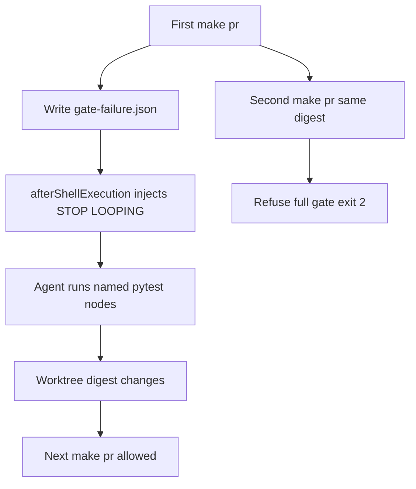

# Gate failure receipt — stop looping

## Objective

A second `make pr` / `make pr-check` on the same HEAD + worktree digest + `PR_BASE` must exit immediately and tell the agent to fix the named failures. The first failed gate must return as soon as a local suite is red. No new `AGENTS.md` paragraph. No hookify warn rule. Do not touch the dirty `main` checkout or `feat/pe-campaigns-https-close` tests.

## Branch

New branch from `origin/main` (ff-only tip). This is a governed PR-gate + hook landing (`rules/46-kernel-pack-new-branch.mdc`). Do not mix into this workspace’s dirty `main` or the HTTPS-close worktree.

## Why this works

The PASS skip already exists in [`ops/scripts/run_pr_gate.sh`](ops/scripts/run_pr_gate.sh) (`_GATE_RECEIPT` + `_gate_state_digest`). FAIL writes nothing, so a retry re-runs the full suite. [`ops/scripts/run_python_test_suites.py`](ops/scripts/run_python_test_suites.py) preserves the first nonzero code but keeps running later suites. Cursor has `beforeShellExecution` (L4) and no `afterShellExecution` today ([`ops/hooks/hooks.json.template`](ops/hooks/hooks.json.template)).

## Scope

**In**
- Fail receipt write + refuse in [`ops/scripts/run_pr_gate.sh`](ops/scripts/run_pr_gate.sh)
- Local-profile fail-fast in [`ops/scripts/run_python_test_suites.py`](ops/scripts/run_python_test_suites.py)
- New `afterShellExecution` hook + install/wiring
- Tests next to existing receipt and runner tests

**Out**
- Another “don’t retry make pr” paragraph in `AGENTS.md`
- Hookify warn-only rules (warn still starts the second gate)
- Fixing `test_until_activate_from_memo` / MANIFEST stale digests on dirty `main` or `feat/pe-campaigns-https-close`
- pytest `-x` inside a suite; CI profile still runs every suite
- Changing L4 / merge / publish path authority

## 1. Fail receipt contract

Path: `$WS/.l9/pr/gate-failure.json` (already gitignored via `.l9/`).

Schema `l9.pr_gate_failure.v1`, same digest triple as PASS (`head`, `worktree_digest`, `pr_base` from existing `_gate_state_digest`):

- `failed_at` UTC
- `failed_nodes` — pytest node ids parsed from `^FAILED ` lines
- `failed_hooks` — pre-commit hook ids when the fail is a real `- exit code:` (may be empty)
- `recheck_command` — one command, e.g. `"$GOV_ROOT/.venv/bin/pytest" <node> <node>`
- `message` must contain `STOP LOOPING`

Write on any non-success exit after validation starts. `run_pr_gate.sh` uses `set -e`, so add an EXIT/ERR path: if `_gate_failed` is still set, write the receipt from the captured gate log. On PASS: write the existing receipt and **delete** the fail receipt.

Refuse **before** the PASS skip so a stale fail file cannot mask a matching PASS receipt. Order:

1. PASS receipt matches → skip (unchanged)
2. FAIL receipt matches → print `STOP LOOPING`, list nodes, print `recheck_command`, exit 2
3. Else run the gate

Clear the fail receipt when the digest no longer matches (any real edit) or when a later gate PASS writes. Do not invent a third clear path.

## 2. Local fail-fast

In [`ops/scripts/run_python_test_suites.py`](ops/scripts/run_python_test_suites.py) `main()` loop (today lines 349–359): if `profile == "local"` and `code != 0`, `break` after recording the first nonzero. Keep the summary of suites that actually ran. CI profile unchanged (continue-all, preserve first nonzero).

## 3. afterShellExecution inject

New script [`ops/hooks/pr_gate_failure_shell.sh`](ops/hooks/pr_gate_failure_shell.sh) (same realpath + fail-open pattern as [`ops/hooks/l4-local-execution-gate-shell.sh`](ops/hooks/l4-local-execution-gate-shell.sh)):

- Trigger only when the command looks like `make pr` / `make pr-check` (any capitalization, including `make -C … pr`) **and** the shell exit is nonzero
- Resolve workspace from hook stdin cwd / `WS`
- If `gate-failure.json` exists, emit JSON with `additional_context` **and** `agent_message` (Cursor’s documented afterShell fields are thinner than sessionStart; dual emit so a ignored key still reaches the agent)
- Text: `STOP LOOPING` + exact `failed_nodes` + `recheck_command` + “next tool call is Read those test files and run that pytest command; do not AwaitShell another make pr”

Wire:

- [`ops/hooks/hooks.json.template`](ops/hooks/hooks.json.template) — new `afterShellExecution` entry, timeout 5s
- [`ops/scripts/setup_workspace_symlinks.sh`](ops/scripts/setup_workspace_symlinks.sh) install pair list (~line 283)
- [`ops/scripts/check_governance_wiring.sh`](ops/scripts/check_governance_wiring.sh) — assert template + `~/.cursor/hooks.json` register the command, and the script is installed under `~/.cursor/hooks/`
- [`environment/agents/adapters/claude-code/validate_skill_activation.py`](environment/agents/adapters/claude-code/validate_skill_activation.py) — same presence check style as the skill-router registration

Matcher: keep the first version **script-side** (no fragile JS matcher), same advice as the create-hook skill.

## 4. Tests (required)

Extend [`tests/ops/scripts/test_pr_lifecycle.py`](tests/ops/scripts/test_pr_lifecycle.py) next to `test_gate_receipt_skip_on_unchanged_state`:

- matching fail receipt → exit 2, stdout contains `STOP LOOPING` and the node ids, no full pytest
- matching PASS receipt still skips (PASS wins when both exist only if we delete fail on PASS; test that)
- digest change allows a new gate start (do not assert a full green gate)

Extend [`ops/scripts/test_python_contract.py`](ops/scripts/test_python_contract.py) `RunnerTests`:

- local profile: second suite `_run_subprocess` not called after first fail
- ci profile: later suites still run; overall exit is the first nonzero

Hook script unit test (new small pytest next to other hook tests, or a function extracted from the hook): stdin JSON with failed command + fixture receipt → stdout JSON contains `STOP LOOPING` and the recheck command. Fail-open when receipt missing.

Final validation: `make pr-check` on this branch only (no commit/push in plan execution until L4 release).

## Stress and rollback

- Disconfirm: afterShellExecution drops `additional_context` — dual `agent_message` covers it; refuse in `run_pr_gate.sh` still stops the loop without Cursor.
- Disconfirm: fail receipt written before pytest log is flushed — tee the gate log; empty `failed_nodes` still refuses with “read last-gate.log”.
- Blast radius: a forgotten fail receipt after a successful targeted pytest still blocks `make pr` until the tree is dirty. That is intended (digest changes on any edit).
- Rollback: revert the branch; delete `~/.cursor/hooks/pr-gate-failure-shell.sh` entry if a machine merged hooks.json and the template is gone. Receipts are gitignored.

## Doc / root surface

N/A for `AGENTS.md` — user forbade another paragraph; the failure loop is already there. Comment in `run_pr_gate.sh` next to the PASS skip is enough. No root-file overwrite.

## Execute via

`@environment/program-execution` → Program Lock → `@autonomy` under Program lease. Adapter: cursor-foreground. `autonomous_merge: false`. Publish later with `PR_REMEDIATE=0 make pr` from the new branch only.
