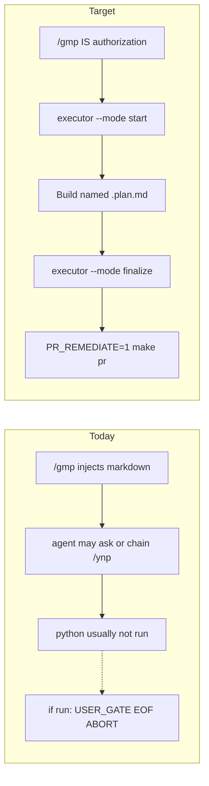

# GMP slash → executor → Build (no second confirm)

## Objective

`/gmp` is the go signal. Same turn, no ask: lock scope via the executor, Build the named `.plan.md` when a path resolved, finalize ceremony, then `PR_REMEDIATE=1 make pr`. Keep GMP as a backup pipeline beside Program Execution. Do not import PE contracts.

## What `/gmp` does today

Cursor slash commands do not run subprocesses. Typing `/gmp` injects [commands/gmp.md](commands/gmp.md) as a protocol prompt. The YAML `dag_executor:` field is not a Cursor runtime hook. The agent is supposed to Shell the python, and usually does not.

Three defects would still stop a Build if the agent did Shell it:

1. **Wrong path.** Command + skill point at `.cursor/workflows-synced/gmp_executor.py`. That tree does not exist. Live entry is [workflows/gmp_executor.py](workflows/gmp_executor.py).
2. **TTY wizard.** [`_step_user_gate`](workflows/gmp_executor.py) `input("Enter CONFIRM or ABORT")`; on EOF it ABORTs. Scope-lock and implement also block on stdin.
3. **Extra prompts.** `auto_chain: ynp` plus USER_GATE plus the model asking whether to run the command.

Implement in the executor is “press ENTER when you have edited files.” It does not apply the plan. Cursor **Build** is what executes a `.plan.md`. The last command-file step must be Build, after a non-interactive executor start.



## Locked contracts

- **Interpreter.** `GOV_PY="$HOME/.cursor-governance/.venv/bin/python"`. If that file is missing, `GOV_PY="$(pwd)/.venv/bin/python"`. If that file is missing, exit 1. Do not fall back to `/usr/bin/python3`.
- **Command YAML.** `auto_chain: null`. Delete `dag_executor`. One EXECUTION (MANDATORY) block. Last lines are the mechanical steps. Text: do not ask.
- **Plan path.** Hit 1: first `*.plan.md` path in the `/gmp` message, workspace-relative. Hit 2: the focused editor file when its name ends in `.plan.md`. Miss with a non-empty remainder: `--mode full` (no Build). Miss with an empty remainder: exit 2 `NO_TASK`. Do not ask.
- **Two run shapes.** Path hit: `--mode start` → Build that plan → `--mode finalize`. Path miss + remainder: `--mode full` runs memory + skill phases 2–6 on the main agent against the task string → `--mode finalize`. No Cursor Build on the miss path.
- **Scope lock.** `--plan PATH` reads YAML frontmatter `todos[]` (`id`, `content`). If `todos` is empty, files listed under the plan `## Files` heading. If that set is empty, `--mode start` exits 2 with `NO_SCOPE`. Do not prompt for T# lines.
- **Post-land `/gmp` authorization.** After this landing merges, a user `/gmp` authorizes local scoped commits, Build or skill implement, and `PR_REMEDIATE=1 make pr`. Do not ask again. Do not merge. L4 still forbids mid-work push; publish is the finalize step.
- **This landing’s publish.** Implementing *this* plan still asks once before `make pr` of the GMP-wiring PR. That ask is not part of the `/gmp` product contract.
- **Tests once.** On the path-hit shape, Build owns the one validation pass required by the named plan (`make pr-check` when that plan has code in scope). On the miss shape, the skill Phase 4 pass is the one pass. Finalize does not start pytest. `make pr` may receipt-skip the gate on an unchanged digest.
- **Commit-when-done.** `--commit-when-done` makes COMMIT_GATE auto-YES with explicit pathspecs (rule 49): locked todo files plus the new GMP report path. Never `git add -A`. EOF in authorized mode is not ABORT.
- **Remediates.** No `--pr-remediate` CLI flag. Finalize runs `PR_REMEDIATE=1 make pr`. That is the human override in rule 48. Merge still requires `/l9-pr-remediation` Converge.
- **L4.** `--mode start` and `--mode full` call `"$GOV_PY" ops/autonomy/l4_local.py begin --contract-id gmp-<gmp_id>` when `L9_L4_LOCAL_AUTONOMY` is on. Finalize calls `record-kernels` then `authorize-release` then `PR_REMEDIATE=1 make pr`. If L4 is off, skip begin/authorize and run `make pr` only.
- **State.** `STATE_FILE` = repo `.l9/gmp/executor-state.json` (`.l9/` is gitignored). Stop writing repo-root `.gmp_executor_state.json`.
- **Build meaning.** Cursor has no machine Build API. Command text “Build PATH” means the agent executes that `.plan.md` in the same turn, no confirm. Same outcome as the Build button.
- **TTY default.** No `--authorized-by` keeps USER_GATE and stdin TODOs for a human at a terminal.
- **Executor does not edit product files.** Build or the skill implement step applies edits. Executor owns memory read, scope lock, L4 begin, state, report, leftover ceremony commit, L4 release, and the remediates publish command.
- **Parallel Tasks.** When locked todos have two or more independent mutation items with disjoint files, obtain an opaque admission token from [autonomy/adapters/cursor/host_bridge.py](autonomy/adapters/cursor/host_bridge.py) per Task. Do not call Program Execution Controller. Do not import [environment/contracts/autonomy](environment/contracts/autonomy). If host_bridge is missing or the lease is denied, serialize on the main agent. Do not ask. PR-poll Tasks spawn only after `PR_REMEDIATE=1 make pr` opens a PR.

## Boundary (duplicate pipeline, not PE)

Keep GMP as the older backup path. Do not import or cite [environment/contracts/autonomy](environment/contracts/autonomy). Do not touch Program Execution, `make campaign`, Program Lock, or `campaign/<id>`.

GMP respects the bound in [autonomy/](autonomy/) and shared [ops/autonomy/](ops/autonomy/):

- L4 local commits, no mid-execution push ([ops/autonomy/l4_local.py](ops/autonomy/l4_local.py))
- lane / claim bounds (max 4 / 2 mutation when fanning Tasks)
- no autonomous merge ([ops/autonomy/merge_gate.py](ops/autonomy/merge_gate.py))

Reuse [skills/l9-bounded-autonomy](skills/l9-bounded-autonomy/SKILL.md) references only (`parallel-nondependent`, `pr-poll-subagent`, `join-and-merge-gate`). Do not run that skill’s PE campaign-packet, `PR_BASE=origin/campaign/...`, or `PR_REMEDIATE=0` steps. GMP authorization packet = the `/gmp` invocation.

## Same-turn last steps

Path hit (example):

```bash
GOV_PY="${HOME}/.cursor-governance/.venv/bin/python"
test -x "$GOV_PY" || GOV_PY="$(pwd)/.venv/bin/python"
test -x "$GOV_PY" || exit 1

"$GOV_PY" workflows/gmp_executor.py \
  --authorized-by slash-gmp \
  --plan docs/plans/publish_ceremony_once_d08758b6.plan.md \
  --mode start \
  --tier RUNTIME \
  "Build docs/plans/publish_ceremony_once_d08758b6.plan.md — tests once, commit-when-done, make pr remediates=1"
```

Then execute that plan now (Build). Then:

```bash
"$GOV_PY" workflows/gmp_executor.py --resume --mode finalize --commit-when-done
```

Finalize runs L4 release when L4 is on, then `PR_REMEDIATE=1 make pr`. Post-land `/gmp` already authorized that publish.

## Executor flags (TTY path stays)

In [workflows/gmp_executor.py](workflows/gmp_executor.py) only. Do not edit [commands/_archived/workflow-executors/gmp_executor.py](commands/_archived/workflow-executors/gmp_executor.py). Do not rewrite [workflows/dags/gmp/](workflows/dags/gmp/).

- `--authorized-by slash-gmp` — skip every `input()` gate
- `--plan PATH` — lock scope from the plan; no stdin TODO wizard
- `--mode start|finalize|full` — `start` = memory + L4 begin + scope lock + state + print `READY_FOR_BUILD` + exit 0; `finalize` = report + commit-when-done + L4 release + `PR_REMEDIATE=1 make pr`; `full` = memory + L4 begin + print `NO_PLAN` + exit 0 so the agent runs skill phases, then the agent calls `--mode finalize`
- `--commit-when-done` — COMMIT_GATE auto-YES, pathspecs only
- `--resume` — load `.l9/gmp/executor-state.json`

`--mode full` with empty task exits 2 `NO_TASK` and does not finalize.

## Skill + docs

- [skills/l9-gmp-protocol/SKILL.md](skills/l9-gmp-protocol/SKILL.md): drop the pasted stale command dump after the second `---`. Point invocation at `workflows/gmp_executor.py` via `GOV_PY`. Resource Map lists [commands/gmp.md](commands/gmp.md) as the trigger SSOT.
- Add [skills/l9-gmp-protocol/references/gmp-autonomy-bounds.md](skills/l9-gmp-protocol/references/gmp-autonomy-bounds.md): GMP packet, L4, remediates=1, host_bridge then serialize, no PE Controller, no merge.
- [commands/COMMANDS_MANIFEST.yaml](commands/COMMANDS_MANIFEST.yaml) description: slash that Shells executor then Builds.
- Do not append AGENTS.md or CANONICAL_LAW.md in this slice. The command file is the trigger SSOT.

## GMP modification lock

May-modify:

- [commands/gmp.md](commands/gmp.md)
- [commands/COMMANDS_MANIFEST.yaml](commands/COMMANDS_MANIFEST.yaml)
- [workflows/gmp_executor.py](workflows/gmp_executor.py)
- [skills/l9-gmp-protocol/SKILL.md](skills/l9-gmp-protocol/SKILL.md)
- [skills/l9-gmp-protocol/references/gmp-autonomy-bounds.md](skills/l9-gmp-protocol/references/gmp-autonomy-bounds.md) (create)
- [tests/commands/test_gmp_slash_contract.py](tests/commands/test_gmp_slash_contract.py) (create)
- [tests/workflows/test_gmp_executor_authorized.py](tests/workflows/test_gmp_executor_authorized.py) (create)
- [tests/workflows/fixtures/gmp_plan_with_todos.plan.md](tests/workflows/fixtures/gmp_plan_with_todos.plan.md) (create)
- [tests/workflows/fixtures/gmp_plan_empty.plan.md](tests/workflows/fixtures/gmp_plan_empty.plan.md) (create)

Must-not-modify:

- [environment/contracts/autonomy/](environment/contracts/autonomy/)
- [environment/program-execution/](environment/program-execution/)
- [workflows/dags/gmp/](workflows/dags/gmp/)
- [commands/_archived/](commands/_archived/)
- [autonomy/](autonomy/) sources (call `host_bridge`; do not edit)
- [skills/l9-bounded-autonomy/SKILL.md](skills/l9-bounded-autonomy/SKILL.md) (cite references; do not fork PE steps)
- [AGENTS.md](AGENTS.md), [CANONICAL_LAW.md](CANONICAL_LAW.md)

## Tests

Unit:

- Command file: no `auto_chain: ynp`; no `dag_executor`; no `workflows-synced`; EXECUTION block contains `gmp_executor.py`, `--mode start`, `Build`, `--mode finalize`.
- Executor: `--authorized-by slash-gmp --mode start --plan tests/workflows/fixtures/gmp_plan_with_todos.plan.md` exits 0 with stdin closed; USER_GATE is not waited; EOF does not abort; `READY_FOR_BUILD` on stdout; state lands under `.l9/gmp/`.
- `--plan tests/workflows/fixtures/gmp_plan_empty.plan.md` exits 2 `NO_SCOPE`.
- `--mode full` with empty task exits 2 `NO_TASK`.
- Authorized module import graph does not include `environment.contracts.autonomy`.

Live (not unit): after a path-hit `/gmp` Build, pytest for that worktree digest ran once before `make pr`; finalize did not start a second suite.

`make pr-check` on this change set.

## Scope out

- [environment/contracts/autonomy](environment/contracts/autonomy) and Program Execution
- Changing the global PE default `PR_REMEDIATE=0` (that is [docs/plans/publish_ceremony_once_d08758b6.plan.md](docs/plans/publish_ceremony_once_d08758b6.plan.md), which this slash must be able to launch)
- Rewriting [workflows/dags/gmp/](workflows/dags/gmp/) LangGraph DAG
- Editing [autonomy/](autonomy/) Python, policies, or compiler
- Editing [skills/l9-bounded-autonomy/SKILL.md](skills/l9-bounded-autonomy/SKILL.md)
- A Cursor product hook that auto-clicks Build
- AGENTS.md / CANONICAL_LAW.md appends
- Mixing this landing onto the dirty primary `main` checkout

## Stress

Disconfirm:

- Agent still asks “confirm scope?” after `/gmp` → command file must contain the substring `do not ask` in EXECUTION and must not contain `auto_chain: ynp`.
- Agent Shells `python3 workflows/gmp_executor.py` and USER_GATE ABORTs on EOF → `--authorized-by` is required in the EXECUTION snippet; test closes stdin.
- Named plan is [publish_ceremony_once_d08758b6.plan.md](docs/plans/publish_ceremony_once_d08758b6.plan.md) and finalize re-runs pytest → forbidden; Build owns the one pass.
- Native Task spawn without a token is denied by lifecycle hooks → serialize fallback must run without a prompt.
- `/gmp` with no plan path and no remainder hangs → empty remainder exits 2 `NO_TASK`.
- Finalize `make pr` is denied by L4 → start/full must `begin`; finalize must `authorize-release` before `make pr`.

Assumed false if: `.l9/` stays gitignored; Cursor still injects slash markdown rather than exec YAML; `host_bridge.py` remains importable as a library; rule 48 still treats a human `PR_REMEDIATE=1` as the remediates override; `L9_L4_LOCAL_AUTONOMY` default stays on.

Blast radius: every `/gmp` run; GMP reports under `reports/`; accidental `make pr` from finalize on a dirty foreign tree (rule 49 pathspecs bound the commit; overlap check still applies).

Rollback: revert the one PR. TTY invocation without `--authorized-by` stays interactive. State under `.l9/gmp/` is local and discarded.

## Leverage

Highest first: executor authorized mode (without it the slash still aborts) → command EXECUTION last steps (without them the agent will not Shell) → tests that close stdin and forbid `workflows-synced` → skill bounds file (teaching only).

Shared cause: `/gmp` was documented as a DAG trigger Cursor does not run, and the python it named is a stdin wizard.

Deletions: `dag_executor` YAML key; pasted command body inside [skills/l9-gmp-protocol/SKILL.md](skills/l9-gmp-protocol/SKILL.md); repo-root `.gmp_executor_state.json` writes.

Critical path: `executor-noninteractive` → `rewrite-gmp-command` → `gmp-skill-bounds` → `tests-gmp-pipeline`.

## Success (falsifiable)

Unit:

- `rg -n 'workflows-synced' commands/gmp.md skills/l9-gmp-protocol/SKILL.md` is empty.
- `rg -n 'auto_chain: ynp' commands/gmp.md` is empty.
- `rg -n 'dag_executor' commands/gmp.md` is empty.
- Closed-stdin `"$GOV_PY" workflows/gmp_executor.py --authorized-by slash-gmp --mode start --plan tests/workflows/fixtures/gmp_plan_with_todos.plan.md --tier RUNTIME "t"` exits 0 and prints `READY_FOR_BUILD`.
- Same with `--plan tests/workflows/fixtures/gmp_plan_empty.plan.md` exits 2.
- `"$GOV_PY" workflows/gmp_executor.py --authorized-by slash-gmp --mode full` with no task exits 2.
- `PR_REMEDIATE=1 make pr` is present in finalize’s subprocess list; `gh pr merge` is not.

Live: path-hit `/gmp` of a named plan starts pytest once for that digest before `make pr`.

## Validation

Pre: `rg -n 'workflows-synced|auto_chain: ynp' commands/gmp.md skills/l9-gmp-protocol/SKILL.md`

Final:

- `"$HOME/.cursor-governance/.venv/bin/python" -m pytest tests/commands/test_gmp_slash_contract.py tests/workflows/test_gmp_executor_authorized.py`
- `make pr-check`
- `"$HOME/.cursor-governance/.venv/bin/python" skills/l9-plan/scripts/validate_plan_kernel_receipt.py docs/plans/gmp_slash_build_pipeline_09ee2a8b.plan.md`
- Report only commands that ran

## Unknowns

- Cursor exposes no API to click Build. This slice equates Build with same-turn plan execution. A future product hook is out of scope.
- First live host_bridge lease from a GMP-only session (no PE campaign) is unproven. Serialize fallback is the bound until that lease succeeds once.

## Doc / root surface

- AGENTS.md — N/A; command + skill own the trigger. Reason: avoid additive_only root rewrite for a slash contract.
- CANONICAL_LAW.md — N/A; same reason.
- CLAUDE.md — N/A; pointer stack unchanged.

## Execute via Cursor Build

Press **Build**. Work on a **new branch from `origin/main`** (rule 46).

- Do not run `make campaign`.
- Do not admit a Program Lock.
- Do not execute on the dirty primary checkout.
- After local finish of *this* wiring PR: ask once before `make pr`. After this PR merges, `/gmp` itself is the ask for future runs.
- Do not merge.
