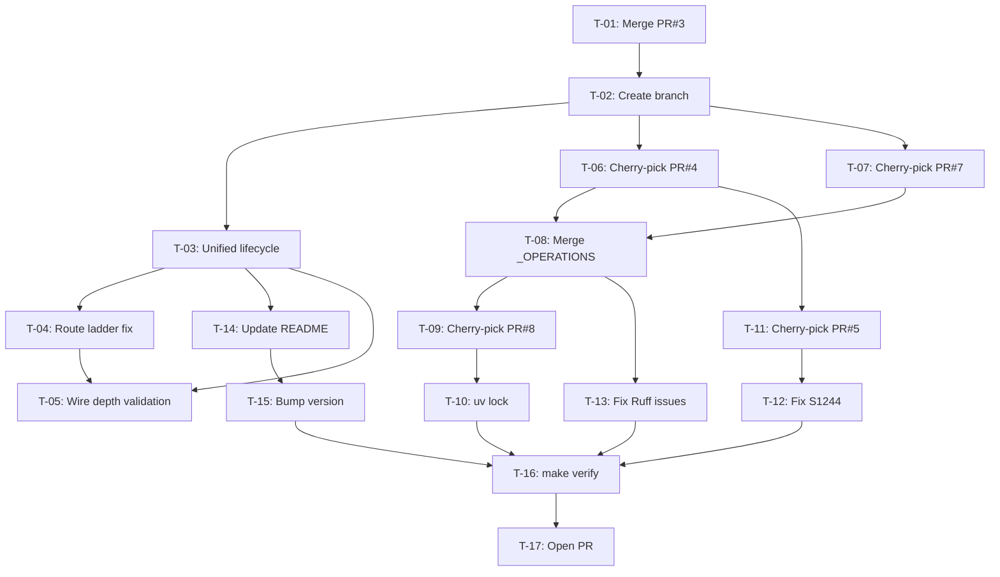

# PLAN: IdeaOS 12.0 Architecture Reconciliation

> **Superseded (2026-09-14, operator direction):** the repository `Quantum-L9/IdeaOS` is superseded by the local skills `skills/l9-idea-execute/` and `skills/l9-idea-foundry/` in Cursor-Governance. This plan is retained as archival corpus (ff-shelf) and is **not** to be built or executed against `Quantum-L9/IdeaOS`. Its branch-base, baseline, and publication instructions were corrected on the same date so the archival record is truthful (PR #563 remediation).

> **First-class SSOT:** `environment/contracts/execution/templates/canonical.template.executable_plan.v1.plan.md`
> **Schema:** `canonical.schema.plan_document.v1` (status: fill -> `executable` only when law holds)
> **Execute:** superseded — do not press **Build**. Original contract, kept for the record: stack on the unique open-PR tip if any open PR exists; after todos `PR_STACK=auto PR_REMEDIATE=0 make pr` and display the PR URL. Do not run `make campaign`.
> **Cursor todos:** frontmatter `todos` project to Build todos. Body is the binding contract.
> **Law:** executable only when baseline matches, capability probes pass, invariants match, and envelope is respected.

---

## Execute via Cursor Build

> Superseded — do not press **Build** for this plan (see banner above). The contract below is the corrected archival record.

Plan on the current workspace. Execute on the unique open-PR chain tip (this is the one branch-base rule; T-02 states the same).

- If any open PR exists: **never** branch from `origin/main`. Start from the unique chain tip (`PR_STACK=auto`). Sibling open-PR chains fail closed.
- Only when no open PR exists: start from `origin/main`.
- Do not run `make campaign`.
- Do not admit a Program Lock or Controller lease.
- Do not write `Lock: origin/main = <sha>`.
- After Build todos complete: scoped-commit (pathspecs), `l4_local.py authorize-release`, then `PR_STACK=auto PR_REMEDIATE=0 make pr`.
- The finish reply **must** display the opened PR URL as proof. Without that URL the Build is incomplete.

---

## Metadata

| Field | Value |
|-------|-------|
| plan_id | `plan.ideaos.reconciliation-12.v1` |
| name | IdeaOS 12.0 Reconciliation |
| overview | Merge three competing lifecycle visions into unified IdeaOS 12.0 |
| schema_version | `1.0.0` |
| status | `superseded` |
| is_project | `false` |
| owner | agent |
| created_at | `2026-09-13` |
| updated_at | `2026-09-14` |

---

## Architect Framing

| Field | Value |
|-------|-------|
| planning_ssot | `Quantum-L9/IdeaOS/.l9/architecture.yaml` — superseded by `skills/l9-idea-execute/SKILL.md` and `skills/l9-idea-foundry/SKILL.md` (operator direction, 2026-09-14) |
| plan_class | `remediation_plan` |
| redesign_allowed | `false` |
| follow_on_schema_evolution_separate | `true` |
| framing_notes | Superseded — archival only. Original framing: execute via Cursor Build; no redesign - reconcile existing features only |

---

## Immutable Baseline

| Field | Value |
|-------|-------|
| captured_at | `2026-09-12T20:00:00Z` |
| repository | `Quantum-L9/IdeaOS` |
| workspace | `/tmp/IdeaOS-reconcile` |
| ssot_clone | n/a |
| branch | `feat/ideaos-12-unified` |
| commit_sha | `80a84c759f227f1de45d9bfffd43b299eac9250d` (IdeaOS `main` tip from PR #2, observed 2026-09-14 via `gh api repos/Quantum-L9/IdeaOS/commits/main`; IdeaOS PR #3 is **open and unmerged**, so this baseline is *before* T-01, not after it) |
| dirty | `false` |
| artifact_hashes | `{}` |
| allowed_local_dirt | `[]` |
| overlap_policy | `stop_if_dirty_overlaps_may_modify` |
| verification_rule | `reverify_at_execution_start` |
| on_drift | `stop_and_replan` |

---

## Objective

### Mission

Reconcile three competing lifecycle visions in IdeaOS (realization depth, execution assurance, source resolution) into a single unified 12.0 architecture. Fix the missing `execution_assurance` route ladder step, merge conflicting `_OPERATIONS` registries, and consolidate 6 open PRs into one reconciliation PR. Preserve all existing schema contracts (IdeaExecutionPacket, ExpansionGateReceipt, decision node I/O).

### Success Properties

| id | property | evidence_type | proof | blocking |
|----|----------|---------------|-------|----------|
| SP-01 | Single lifecycle contract at v12.0.0 | `filesystem` | `grep -q 'version: 12.0.0' pipeline/IDEA_LIFECYCLE.yaml` | true |
| SP-02 | Route ladder includes execution_assurance | `structural` | `grep -q 'has_execution_assurance' src/ideaos/engine.py` | true |
| SP-03 | Runtime has 8+ operations registered | `runtime_behavior` | `python -c 'from ideaos.runtime import runtime_capabilities; assert len(runtime_capabilities()["operations"]) >= 8'` | true |
| SP-04 | All tests pass | `quality_gate` | `make verify` exits 0 | true |
| SP-05 | Pre-commit hooks pass | `quality_gate` | `pre-commit run --all-files --config .pre-commit-config.yaml` | true |
| SP-06 | Reconciliation PR opened | `network_observation` | PR URL displayed | true |

---

## Capability Preflight

| Field | Value |
|-------|-------|
| preflight_id | `preflight.plan.ideaos.reconciliation-12.v1` |
| source_ref | this plan_id |
| phase_id | `preflight` |
| blocking | `true` |
| immutable_baseline_ref | baseline section |
| baseline_verified | `pending` |
| drift_detected | `pending` |

### Probes

| id | capability | command_or_action | pass_criteria | blocking |
|----|------------|-------------------|---------------|----------|
| CP-01 | `gh_cli_available` | `gh --version` | version string returned | true |
| CP-02 | `repo_cloneable` | `gh repo clone Quantum-L9/IdeaOS /tmp/IdeaOS-reconcile` | exit 0 | true |
| CP-03 | `pr_3_mergeable` | `gh api repos/Quantum-L9/IdeaOS/pulls/3 --jq '{state,merged,mergeable}'` (REST; `gh pr view` is GraphQL and is unavailable on Claude surfaces) | `state: open`, `merged: false`, `mergeable: true` | true |
| CP-04 | `uv_available` | `uv --version` | version string returned | true |

---

## Execution Envelope

### Filesystem

**write_allow:**
- `pipeline/IDEA_LIFECYCLE.yaml`
- `src/ideaos/**`
- `tests/**`
- `Ideas/**`
- `README.md`, `CHANGELOG.md`, `VERSION`
- `pyproject.toml`, `uv.lock`, `src/ideaos/version.py`
- `Dockerfile`, `.l9/sdk-compatibility.yaml`

**write_deny:**
- `.github/workflows/**`
- `AGENTS.md`
- `.l9/architecture.yaml`
- Any secrets or credentials

### Commands

**allow:** `git cherry-pick`, `git commit` (explicit pathspecs), `uv lock`, `uv sync`, `make verify`, `make lint`, `make test`, `pre-commit run`, `python3 ops/autonomy/l4_local.py authorize-release`, `PR_STACK=auto PR_REMEDIATE=0 make pr` (the only publication route; it performs the push and opens the PR), `gh pr close`

**deny:** raw `gh pr create`, raw `git push` as a first publication, `make push`, force-push, secret exfiltration, CI workflow modifications

### Network

| Field | Value |
|-------|-------|
| mode | `bounded_external_write` |
| allowed_services | `github.com` (PR operations only) |

### Secrets

| Field | Value |
|-------|-------|
| access | `none` |
| redaction_required | `true` |

### Autonomous Merge

`autonomous_merge: false`

---

## Side Effects and Idempotency

| todo_id | side_effects | idempotency | retry | compensation | irreversible |
|---------|--------------|-------------|-------|--------------|--------------|
| T-01 | `network_write` | `non_idempotent` | `manual_only` | revert merge | true |
| T-02 | `filesystem_mutation` | `safe_to_repeat` | `retry_once` | delete branch | false |
| T-03 | `filesystem_mutation` | `safe_with_dedupe` | `retry_once` | git restore | false |
| T-04 | `filesystem_mutation` | `safe_with_dedupe` | `retry_once` | git restore | false |
| T-05 | `filesystem_mutation` | `safe_with_dedupe` | `retry_once` | git restore | false |
| T-06 | `filesystem_mutation` | `unsafe_blind_repeat` | `manual_only` | reset to pre-pick | false |
| T-07 | `filesystem_mutation` | `unsafe_blind_repeat` | `manual_only` | reset to pre-pick | false |
| T-08 | `filesystem_mutation` | `safe_with_dedupe` | `retry_once` | git restore | false |
| T-09 | `filesystem_mutation` | `unsafe_blind_repeat` | `manual_only` | reset to pre-pick | false |
| T-10 | `filesystem_mutation` | `safe_to_repeat` | `retry_once` | git restore | false |
| T-11 | `filesystem_mutation` | `unsafe_blind_repeat` | `manual_only` | reset to pre-pick | false |
| T-12 | `filesystem_mutation` | `safe_with_dedupe` | `retry_once` | git restore | false |
| T-13 | `filesystem_mutation` | `safe_with_dedupe` | `retry_once` | git restore | false |
| T-14 | `filesystem_mutation` | `safe_with_dedupe` | `retry_once` | git restore | false |
| T-15 | `filesystem_mutation` | `safe_with_dedupe` | `retry_once` | git restore | false |
| T-16 | `filesystem_read` | `safe_to_repeat` | `retry_once` | null | false |
| T-17 | `network_write` | `safe_with_dedupe` | `manual_only` | close PR | false |

---

## Architecture Impact

| todo_id | bounded_context | layer | owning_contract | prohibited |
|---------|-----------------|-------|-----------------|------------|
| T-03 | ideaos/pipeline | `policy` | `pipeline/IDEA_LIFECYCLE.yaml` | redesign stage order; remove existing stages |
| T-04 | ideaos/engine | `runtime` | `src/ideaos/engine.py` | change existing ladder steps |
| T-05 | ideaos/assurance | `assurance` | `src/ideaos/assurance.py` | weaken existing validations |
| T-08 | ideaos/runtime | `runtime` | `src/ideaos/runtime.py` | remove existing operations |

---

## Rollback

| Field | Value |
|-------|-------|
| rollback_id | `rollback.plan.ideaos.reconciliation-12.v1` |
| source_execution_ref | this plan_id |
| supported | `true` |
| automatic_allowed | `false` |
| approval_required | `true` |
| trigger_conditions | baseline drift; blocking property fail; envelope breach; cherry-pick conflict |

### Strategies

| domain | mode | notes |
|--------|------|-------|
| code | `revert_commit` | Revert reconciliation PR if merged |
| data | `none` | No data migrations |
| external_state | `corrective_append_only_record` | Close reconciliation PR, reopen #4-#8 |
| local_state | `git_restore_scoped_paths` | restore from origin/main on clone |

### Irreversible Operations

- T-01: Merging PR #3 cannot be undone without revert commit

### Rollback Verification

- `gh api "repos/Quantum-L9/IdeaOS/pulls?state=open"` shows PRs #4-#8 reopened
- `git log --oneline -1 origin/main` shows revert commit if reconciliation was merged

---

## Complexity and Uncertainty

| Field | Value |
|-------|-------|
| complexity | `high` |
| uncertainty | `medium` |
| blast_radius | `medium` |
| architectural_boundaries_crossed | `1` (IdeaOS only) |
| external_systems_touched | `1` (GitHub) |
| migration_required | `false` |
| unknown_dependency_count | `0` |

---

## Execution DAG

| Field | Value |
|-------|-------|
| topology_id | `dag.plan.ideaos.reconciliation-12.v1` |
| topology_kind | `execution` |
| graph_type | `directed_acyclic_graph` |

### Critical Path

`T-01 -> T-02 -> T-03 -> T-04 -> T-08 -> T-16 -> T-17`

### Nodes / Edges

| id | owner | layer | depends_on | outputs |
|----|-------|-------|------------|---------|
| T-01 | agent | control_plane | [] | PR #3 merged |
| T-02 | agent | control_plane | [T-01] | branch created |
| T-03 | agent | policy | [T-02] | unified lifecycle |
| T-04 | agent | runtime | [T-03] | route ladder fixed |
| T-05 | agent | assurance | [T-03, T-04] | depth validation wired |
| T-06 | agent | runtime | [T-02] | realization depth code |
| T-07 | agent | runtime | [T-02] | source resolution code |
| T-08 | agent | runtime | [T-06, T-07] | unified _OPERATIONS |
| T-09 | agent | runtime | [T-08] | Gate SDK integrated |
| T-10 | agent | runtime | [T-09] | lockfile updated |
| T-11 | agent | docs | [T-06] | corpus files |
| T-12 | agent | assurance | [T-11] | S1244 fixed |
| T-13 | agent | assurance | [T-08] | lint fixed |
| T-14 | agent | docs | [T-03] | README updated |
| T-15 | agent | docs | [T-14] | version bumped |
| T-16 | agent | assurance | [T-10, T-12, T-13, T-15] | all tests pass |
| T-17 | agent | control_plane | [T-16] | PR opened |

### DAG Visualization

---

## Property Evidence Matrix

| evidence_id | claim_id | evidence_kind | method | command | expected_positive | status |
|-------------|----------|---------------|--------|---------|-------------------|--------|
| EV-SP-01 | SP-01 | `filesystem_evidence` | grep | `grep -q 'version: 12.0.0' pipeline/IDEA_LIFECYCLE.yaml` | exit 0 | `not_run` |
| EV-SP-02 | SP-02 | `structural_evidence` | grep | `grep -q 'has_execution_assurance' src/ideaos/engine.py` | exit 0 | `not_run` |
| EV-SP-03 | SP-03 | `runtime_behavior_evidence` | python | runtime_capabilities assertion | assertion passes | `not_run` |
| EV-SP-04 | SP-04 | `quality_gate_evidence` | make | `make verify` | exit 0 | `not_run` |
| EV-SP-05 | SP-05 | `quality_gate_evidence` | pre-commit | `pre-commit run --all-files` | exit 0 | `not_run` |
| EV-SP-06 | SP-06 | `network_observation_evidence` | make | `PR_STACK=auto PR_REMEDIATE=0 make pr` | PR URL displayed (`.l9/pr/pr-summary.json`) | `not_run` |

---

## Stress and Disconfirm

### Disconfirming Cases

- If cherry-pick of PR #4 conflicts with unified lifecycle (T-03) -> resolve conflicts manually using T-03 as source of truth
- If cherry-pick of PR #7 conflicts with PR #4 changes -> runtime.py will need manual merge (T-08)
- If Gate_SDK has transitive dependency conflicts -> uv lock may fail (T-10)

### Assumption Failure Conditions

- PR #3 not actually mergeable (blocked by review or CI)
- `realization_modes` and `execution_assurance` semantically incompatible
- Learning gate requires running BEFORE expansion_gate (would need lifecycle redesign)

### Blast Radius Notes

- IdeaOS runtime directly affected
- Downstream consumers: `l9-idea-execute`, `l9-idea-foundry` may need updates after 12.0
- No impact on Cursor-Governance

### Rollback Constraints

- No force-push or history rewrite
- If reconciliation PR is merged, use revert commit
- PRs #4-#8 can be reopened if reconciliation abandoned

---

## Out of Scope

- New feature development beyond reconciliation
- Architecture redesign of lifecycle stages
- Modifications to `.github/workflows/**`
- Changes to `AGENTS.md` or `.l9/architecture.yaml`
- Downstream skill updates (`l9-idea-execute`, `l9-idea-foundry`)
- Weakening tests or gates to obtain PASS

---

## Follow-on Milestone

| Field | Value |
|-------|-------|
| separate_plan_required | `true` |

| priority | change | why |
|----------|--------|-----|
| P1 | Update `l9-idea-execute` skill for 12.0 lifecycle | Downstream consumer |
| P2 | Update `l9-idea-foundry` for new stages | Downstream consumer |
| P3 | Add integration tests for full 12.0 pipeline | Coverage |

---

## Convergence

| Field | Value |
|-------|-------|
| convergence_id | `conv.plan.ideaos.reconciliation-12.v1` |
| source_ref | this plan_id |
| current_state | `superseded` |
| implementation_ready | `false` |

### Gates

**executable_when:**
- baseline locked + reverified (PR #3 merged, branch created)
- blocking capability probes pass (gh, uv available)
- DAG acyclic (verified above)
- envelope + side-effect matrix complete (verified above)
- no blocking unknowns

**complete_when:**
- all blocking SP-* evidence `passed`
- rollback contract unused or verified
- out_of_scope respected

**blocking_conditions:**
- `preflight_blocked` (PR #3 not mergeable)
- envelope breach
- baseline drift
- failed blocking property

### Evidence

- **required_evidence_refs:** `EV-SP-01`, `EV-SP-02`, `EV-SP-03`, `EV-SP-04`, `EV-SP-05`, `EV-SP-06`
- **observed_evidence_refs:** *(fill during execution)*
- **missing_evidence:** all

### Blockers / Unknowns

| kind | id | note | resolution |
|------|----|------|------------|
| open_blocker | none | | |
| unknown | none | | |

### Next

| Field | Value |
|-------|-------|
| next_convergence_gate | none — `superseded`; successor work routes through `skills/l9-idea-execute` / `skills/l9-idea-foundry` |
| minimum_safe_next_action | None for this plan (superseded). Successor work: invoke `l9-idea-execute` / `l9-idea-foundry`; any publication uses `PR_STACK=auto PR_REMEDIATE=0 make pr` and displays the PR URL |
| execute_via | Cursor Build (historical; superseded) |
| broader_work_requires_separate_contract | `true` |
