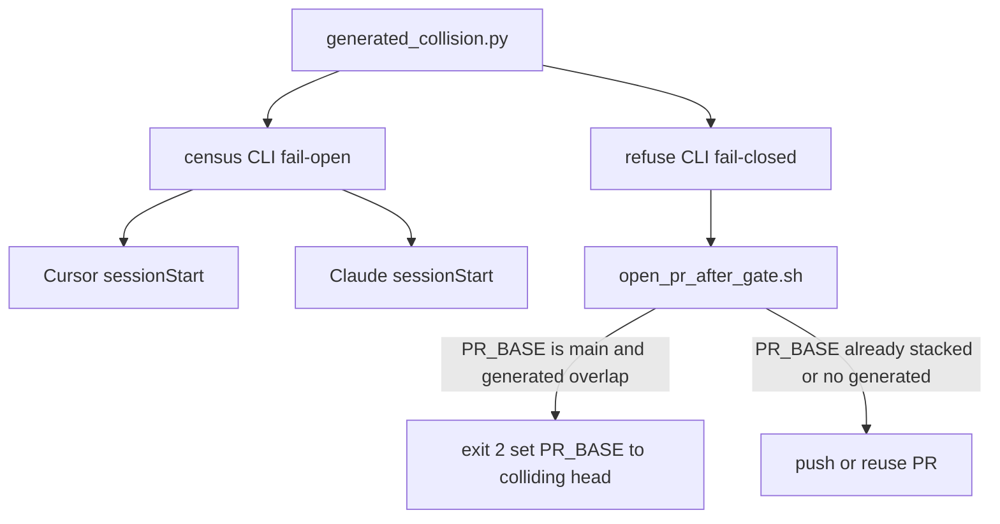

# In-flight PR census + unstacked generated-collision refuse

Governed landing: **new branch `feat/in-flight-pr-census` from `origin/main`** in a clean Cursor-Governance worktree. MUST NOT land on the dirty primary, `feat/pe-campaign-diagnose`, or `feat/collect-all-gate-errors`. MUST NOT edit `.claude/skills`. MUST NOT add an eighth Core workflow.

**Depth: deep.** SessionStart runs every chat; `make pr` is the publish lock. Wrong refuse blocks legitimate parallel PRs; missing refuse reproduces the skill-registry conflict.

## Problem (verified)

Agents cut feature branches from `origin/main` while other open PRs already rewrite the same **generated whole files**. GitHub then shows green checks and an unmergeable PR.

Rule 48 already requires stacking via [`ops/scripts/stack_pr.py`](/Users/macm2/.cursor-governance/ops/scripts/stack_pr.py). [`ops/scripts/open_pr_after_gate.sh`](/Users/macm2/.cursor-governance/ops/scripts/open_pr_after_gate.sh) still defaults `PR_BASE=origin/main` and never calls `stack_pr.py`. Policy without a gate.

Collision keys are the **whole-file prefixes** in [`sync_generated_artifacts.GENERATED_PATH_PREFIXES`](/Users/macm2/.cursor-governance/ops/scripts/sync_generated_artifacts.py) — not only skill-registry:

```
rules/RULES-MANIFEST.
environment/generated/llm-rules/
ops/generated/skill-registry.json
environment/agents/adapters/claude-code/generated/skill-registry.json
environment/agents/adapters/claude-code/settings.template.json
commands/COMMANDS_MANIFEST.yaml
skills/AUTONOMY_MANIFEST.yaml
environment/program-execution/core/MANIFEST.yaml
environment/program-execution/MANIFEST.json
```

MUST NOT treat `skills/*/SKILL.md` as a collision key (that would serialize disjoint skill PRs). Two skill-touching PRs that both run full sync **will** collide on the registry/manifest prefixes; that is intended.

Recovery is stack on the **colliding PR head** + `python3 ops/scripts/sync_generated_artifacts.py`. MUST NOT conflict-edit generated JSON.

## Recursive-leverage audit (source of the plan changes)

Highest-leverage findings against the prior draft. These are now locks, not notes.

| Finding | Severity | Correction |
|---|---|---|
| `stack_pr.py base --repo` picks the **newest** open PR head, not the PR that owns the colliding generated path. Stacking on a later docs PR still conflicts with the registry PR. | critical | Census `STACK_BASE` MUST be the head of the open PR that lists the colliding generated path. MUST NOT call `stack_pr.py` from sessionStart. |
| Census + refuse as two GraphQL clients will drift on prefix, pagination, and self-exclusion. | high | One engine module. Two thin CLIs. One predicate. |
| Refuse without excluding the current branch/PR number refuses `make pr` on an already-open PR that updates generated files. | high | Exclude current head and existing PR number. Call refuse **after** `gh pr view` / existing-PR resolve. |
| `files(first: 40)` can miss a generated path on a large PR. Census miss is fail-open; refuse miss ships a collision. | high | If `hasNextPage` and no generated hit: census prints `truncated`; refuse exits 2. |
| Two remotes × `gh repo view` + GraphQL under 1.5s + outer `timeout 2` will often print `unavailable`. | high | Parse `origin` URL in-process. One deadline for all slugs. No extra `gh` before GraphQL. |
| T5 “hook contains string” is wiring, not behavior. | medium | Prefix-drift + fixture GraphQL + self-exclude + truncation tests are the gate. Hook string check is extra, not sufficient. |
| Docs repeating “stack via stack_pr” without naming the colliding head re-teaches the wrong base. | medium | Rule 46/48 MUST say colliding-PR head, not newest-PR head. |

**Highest-leverage deletion:** do not add a sessionStart → `stack_pr.py` call. It exits 2, needs STACK.json or a newest-PR heuristic, and answers the wrong question.

**Highest-leverage contract:** one collision predicate, shared by awareness and enforcement.

**Single ingress:** applicable. Normalize once (slugs, prefixes, open-PR file sets). Validate once. Route to census (fail-open) or refuse (fail-closed). MUST NOT let sessionStart or `open_pr_after_gate.sh` re-implement GraphQL or prefix matching.



## Design locks (MUST / MUST NOT)

- **Two layers.** Census = awareness (fail-open). `make pr` refuse = enforcement (fail-closed). Census alone MUST NOT be treated as sufficient.
- **One engine.** Create [`ops/scripts/generated_collision.py`](/Users/macm2/.cursor-governance/ops/scripts/generated_collision.py) as the only owner of prefixes, GraphQL, intersection, self-exclusion, and truncation. Thin CLIs: [`in_flight_pr_census.py`](/Users/macm2/.cursor-governance/ops/scripts/in_flight_pr_census.py) and [`refuse_unstacked_generated_collision.py`](/Users/macm2/.cursor-governance/ops/scripts/refuse_unstacked_generated_collision.py). MUST NOT copy the query or prefix tuple into the census CLI, the refuse CLI, or the hooks.
- **sessionStart stays fail-open.** Timeout, missing `gh`, unauth, GraphQL miss, or deadline → `in-flight PRs: unavailable`. Always exit 0. Same budget shape as plan audit in [`session_start_bootstrap.sh`](/Users/macm2/.cursor-governance/ops/hooks/session_start_bootstrap.sh) (outer `timeout 2`, `--budget-chars 1200`, `--limit 8`, `--deadline-seconds 1.5`).
- **Hook is read-only.** MUST NOT checkout, rebase, merge, push, or regenerate in sessionStart.
- **No new `hooks.json` entry.** Insert into the existing `COMBINED` packet.
- **Two remotes.** Census both `CURSOR_PROJECT_DIR` origin and `$HOME/.cursor-governance` origin when slugs differ. Workspace-only `gh pr list` misses the governance collisions that started this.
- **One GraphQL call per slug.** MUST NOT use `gh pr list --json files` (N+1). Query `pullRequests(first: 8, states: OPEN)` + `files(first: 40)` + `pageInfo.hasNextPage`. Include draft OPEN PRs (they still hold the file).
- **stdlib only on SessionStart.** MUST NOT import `sync_generated_artifacts.py` (PyYAML + generators). Tests MAY import it for prefix-drift.
- **Refuse only when all are true:** `PR_BASE` normalizes to `main`/`master` (`origin/main`, `main`, `origin/master`, `master`, or a ref that `git rev-parse` equals that tip); this branch’s changed files vs `PR_BASE` include a whole-file generated path; an **other** open PR on the same repo already lists that path (or that PR’s file list is truncated). Exit 2 with `#N`, path, colliding head, and regenerate. Already-stacked `PR_BASE` (campaign head, other PR head) MUST pass.
- **Self-exclusion.** Refuse MUST ignore the open PR whose head equals the current branch, and MUST ignore `--exclude-pr` when `open_pr_after_gate.sh` already resolved a number. Census MAY still list that PR (awareness).
- **STACK_BASE.** When any generated whole-file appears on an other open PR: `STACK_BASE=<that PR's head>` and `COLLISION=generated path=… #N`. If several such PRs exist, use the lowest PR number (oldest holder). When none: `STACK_BASE=origin/main` and `note=no generated collision`. MUST NOT invoke `stack_pr.py` from census or the sessionStart hooks.
- **Authored same-path overlap** (non-generated): census prints `COLLISION=authored path=… #N` (advisory). Refuse this iteration is generated-only.
- **Rule 46 exception (one sentence):** KERNEL/PE still get a **new** branch; if census `COLLISION=generated`, the parent is `STACK_BASE` (colliding PR head), not `origin/main`. MUST NOT mix onto the other agent’s working tree.
- No auto-merge. No force-push. No second scheduler. No Graphiti census SSOT (`gh` is current).

## Single-ingress contract

- **request:** in-flight generated-collision check
- **mode:** `census` (fail-open, markdown/json) or `refuse` (fail-closed, exit 2)
- **inputs:** workspace root, optional governance root, `PR_BASE` (refuse), repo slug (refuse), exclude head/PR (refuse)
- **constraints:** stdlib; no PyYAML on SessionStart; no `stack_pr.py`; whole-file prefixes only
- **authority:** Rule 48 stacking + this refuse; sessionStart never mutates
- **validation_profile:** unit fixtures for GraphQL; prefix-drift vs `GENERATED_PATH_PREFIXES`; live census is observational
- **output_contract:**
  - census markdown: per-slug lines, `COLLISION=…`, `STACK_BASE=…`, or `unavailable`; ≤1200 chars
  - refuse stdout on fail: path, open `#N` + head, `PR_BASE=origin/<head>`, regenerate, do-not conflict-edit
- **reject:** unsupported routes (non-stdlib import, `gh pr list --json files`, sessionStart mutation)

## Work items

### T1 — Collision engine + thin CLIs

Files (all new, stdlib):

- [`ops/scripts/generated_collision.py`](/Users/macm2/.cursor-governance/ops/scripts/generated_collision.py) — `WHOLE_FILE_PREFIXES` (exact tuple copy of `GENERATED_PATH_PREFIXES`), `is_whole_file_generated(rel)`, `resolve_repo_slug(root)`, `fetch_open_pr_files(slug, limit=8)`, `generated_holders(prs) -> list[{number, head, paths, truncated}]`, `stack_base(holders) -> str`.
- [`ops/scripts/in_flight_pr_census.py`](/Users/macm2/.cursor-governance/ops/scripts/in_flight_pr_census.py) — argparse + format + budget + exit 0 (unless `--strict` for tests).
- [`ops/scripts/refuse_unstacked_generated_collision.py`](/Users/macm2/.cursor-governance/ops/scripts/refuse_unstacked_generated_collision.py) — argparse + exit policy only.

Census CLI (this argv is the sessionStart lock — T2 and T3 MUST copy it verbatim):

```bash
python3 ops/scripts/in_flight_pr_census.py \
  --workspace "$CURSOR_PROJECT_DIR" \
  --governance "$HOME/.cursor-governance" \
  --format markdown \
  --budget-chars 1200 \
  --limit 8 \
  --deadline-seconds 1.5
```

Engine behavior:

- Resolve `owner/name` by parsing `git remote get-url origin` (stdlib). Dedup identical slugs. MUST NOT call `gh repo view` on the SessionStart path.
- One GraphQL query per slug. On failure: that slug is `unavailable`.
- For each open PR: `#N head=… base=…` plus at most 4 colliding generated paths (or `files=n`).
- `COLLISION=generated` / `STACK_BASE` from engine `stack_base()`, not from `stack_pr.py`.
- `--format json` for tests.

### T2 — Cursor sessionStart packet

File: [`ops/hooks/session_start_bootstrap.sh`](/Users/macm2/.cursor-governance/ops/hooks/session_start_bootstrap.sh)

Mirror the plan-audit block (~374–409):

- `IN_FLIGHT_MD="in-flight PRs: skipped"`
- `timeout 2 python3 "$GC/ops/scripts/in_flight_pr_census.py"` + the locked argv, or the no-timeout fallback
- Append to `COMBINED` after `### Plan audit`:

```text
### In-flight PRs
${IN_FLIGHT_MD}
```

Keep [`test_cursor_shared_bootstrap_edge.py`](/Users/macm2/.cursor-governance/ops/scripts/tests/test_cursor_shared_bootstrap_edge.py) green: MUST NOT re-implement uv/gitleaks/infisical/`scratch_hold.py` in the hook. Calling the census CLI is allowed (same pattern as `audit_plans.py`).

MUST NOT change `hooks.json`.

### T3 — Claude SessionStart (same argv)

Files: [`session_start_claude_governance.sh`](/Users/macm2/.cursor-governance/environment/agents/adapters/claude-code/hooks/session_start_claude_governance.sh), [`SESSION_START_SPEC.md`](/Users/macm2/.cursor-governance/environment/agents/adapters/claude-code/hooks/SESSION_START_SPEC.md)

Call the same census argv (fail-open, append to `additionalContext`). Spec item 7: in-flight PR census when `gh` works; `unavailable` otherwise. Still exit 0. Script stays in `ops/scripts/` — MUST NOT add brains under the adapter dir.

### T4 — `make pr` refuse (enforcement)

Files: refuse CLI from T1, [`ops/scripts/open_pr_after_gate.sh`](/Users/macm2/.cursor-governance/ops/scripts/open_pr_after_gate.sh)

Insert **after** existing-PR resolve (`pr_url` / `pr_number` at ~155–162) and **before** push/create (~164):

```bash
python3 "$GOV_ROOT/ops/scripts/refuse_unstacked_generated_collision.py" \
  --workspace "$WS" --pr-base "$PR_BASE" --repo "$repo" \
  --exclude-head "$branch" --exclude-pr "${pr_number:-}"
```

Refuse logic (fail-closed):

1. Normalize `PR_BASE` → if not main/master tip, print `stacked: ok` and exit 0.
2. Changed files: `git diff --name-only "$PR_BASE"...HEAD` plus porcelain (staged/unstaged) so an uncommitted regenerate still counts.
3. If none of those paths are whole-file generated → exit 0.
4. Engine fetch on `--repo`. Drop PRs matching `--exclude-head` / `--exclude-pr`.
5. If any remaining holder intersects those generated paths, **or** any remaining PR is truncated with no generated hit → exit 2:

```text
FAIL: unstacked generated collision
  path: ops/generated/skill-registry.json
  open: #221 feat/other (head=feat/other)
  do: PR_BASE=origin/feat/other && python3 ops/scripts/sync_generated_artifacts.py
  do not: conflict-edit generated JSON
```

`gh` missing here is fail-closed (exit 2) — publish MUST NOT guess. Contrast sessionStart (fail-open).

MUST NOT change `PR_REMEDIATE` or merge authorization.

### T5 — Tests

- [`ops/scripts/tests/test_generated_collision.py`](/Users/macm2/.cursor-governance/ops/scripts/tests/test_generated_collision.py):
  - fixture GraphQL: two PRs, one owns `skill-registry.json` → holders + `STACK_BASE` = that head, not the newer unrelated PR
  - self-exclude current head / PR number → no refuse
  - `hasNextPage` + no generated hit → refuse 2, census `truncated`
  - `WHOLE_FILE_PREFIXES == sync_generated_artifacts.GENERATED_PATH_PREFIXES`
  - two different `skills/*/SKILL.md` without registry → not a generated collision
- [`ops/scripts/tests/test_refuse_unstacked_generated_collision.py`](/Users/macm2/.cursor-governance/ops/scripts/tests/test_refuse_unstacked_generated_collision.py): main + generated overlap → 2; `PR_BASE=origin/feat/other` → 0; disjoint authored only → 0; missing `gh` → 2
- [`ops/scripts/tests/test_in_flight_pr_census.py`](/Users/macm2/.cursor-governance/ops/scripts/tests/test_in_flight_pr_census.py): no-`gh` / timeout → `unavailable` exit 0; workspace==governance slug → one query
- Extend bootstrap edge test: live hook contains `in_flight_pr_census.py` and `### In-flight PRs` (wiring only)
- [`test_stack_pr.py`](/Users/macm2/.cursor-governance/ops/scripts/tests/test_stack_pr.py) stays green; MUST NOT change `stack_pr.py` behavior in this iteration

### T6 — Docs / root surface

- [`rules/48-make-pr-remediation.mdc`](/Users/macm2/.cursor-governance/rules/48-make-pr-remediation.mdc): sessionStart census is advisory; `make pr` refuse is the lock; `STACK_BASE` is the colliding generated-file PR head; regenerate after stack; MUST NOT conflict-edit generated JSON.
- [`rules/46-kernel-pack-new-branch.mdc`](/Users/macm2/.cursor-governance/rules/46-kernel-pack-new-branch.mdc): one sentence — new branch parent is `STACK_BASE` when census reports `COLLISION=generated`.
- [`SESSION_START_SPEC.md`](/Users/macm2/.cursor-governance/environment/agents/adapters/claude-code/hooks/SESSION_START_SPEC.md): item 7.
- MUST NOT add a Core workflow. MUST NOT edit `.claude/skills`.

### T7 — Validation on the exact final state

Mandatory checks (all against the worktree that will be handed off; no commit, no push):

```bash
python3 -m unittest ops.scripts.tests.test_generated_collision \
  ops.scripts.tests.test_in_flight_pr_census \
  ops.scripts.tests.test_refuse_unstacked_generated_collision \
  ops.scripts.tests.test_cursor_shared_bootstrap_edge \
  ops.scripts.tests.test_stack_pr
python3 ops/scripts/in_flight_pr_census.py --workspace "$PWD" --governance "$HOME/.cursor-governance" --format markdown
make pr-check
```

Regenerate PE/ops manifests only if a generator lists the new scripts.

Live census is **observational** (network/`gh` may print `unavailable`). MUST NOT report it as a Passed mandatory gate. MUST NOT claim CI, review, or merge passed. Fill the Definition of Done record below from this exact state.

## Failure modes

| Condition | Census | Refuse |
|---|---|---|
| `gh` missing / unauth / timeout | `unavailable`, exit 0 | exit 2 |
| GraphQL error on one slug | that slug `unavailable` | exit 2 |
| `files.hasNextPage` and no generated hit | print `truncated` | exit 2 |
| Current branch already has the open PR | list it | exclude, do not refuse self |
| Several generated holders | `STACK_BASE` = lowest `#` | refuse naming that `#` |
| `PR_BASE` already a non-main head | n/a | `stacked: ok`, exit 0 |
| Two remotes, same slug | one query | n/a |
| Deadline exceeded | `unavailable`, exit 0 | n/a (no deadline; publish may wait) |

## Out of scope

- Auto-checkout / auto-rebase / auto-regenerate in sessionStart.
- Hand-resolving the current conflicted PR (recovery: stack on colliding head + regenerate).
- Mixing this onto `feat/pe-campaign-diagnose` or `feat/collect-all-gate-errors`.
- Authored-overlap refuse (census-only this iteration).
- New Cursor `hooks.json` hook.
- Changing `stack_pr.py` newest-PR heuristic (campaign STACK.json path stays as-is).
- Graphiti as the census SSOT.

## Unknowns (explicit)

- Unknown: whether GitHub GraphQL `files(first: 40)` `pageInfo` is always present on `PullRequestChangedFileConnection` for this `gh` version. Engine MUST read it when present; if the field is absent, treat as not truncated (do not invent pagination). Add a fixture for both shapes.
- Unknown: whether `git rev-parse` equality is enough to treat a SHA `PR_BASE` as main. Implement tip equality only; do not invent merge-base walk unless a test proves a real caller passes a SHA.
- Unknown: whether Claude Mobile’s committed hook copy can see `ops/scripts/in_flight_pr_census.py` (script lives in governance, not the consumer copy). If the consumer clone lacks the script, census MUST print `unavailable` and still exit 0 — same as missing `audit_plans.py`.

## Stress / rollback

- Disconfirm: will refuse block two disjoint skill PRs? Only if both write whole-file generated paths (they will, if both run sync). Intended: second skill PR stacks on the first colliding head or waits for merge.
- Disconfirm: sessionStart 60s budget — census MUST stay inside outer `timeout 2`; if `gh` hangs, unavailable.
- Blast: a too-wide matcher (`skills/*/SKILL.md`) would serialize all skill work. Matcher is whole-file prefixes only.
- Rollback: revert the worktree branch; sessionStart loses the section; `make pr` returns to unstacked-main default.

## Definition of Done

Authority: [DEFINITION_OF_DONE.md](/Users/macm2/l9-ci-core/.cursor-commands/kernels/L9%20Coding%20Control%20Plane/ai-control-plane/DEFINITION_OF_DONE.md). This section is the instantiated terminal acceptance contract for this plan. Completion_state is **Done** only when every applicable area and mandatory gate is Passed or NotApplicable, no stop condition is active, convergence is verified, and the delivered worktree equals the validated worktree.

Result vocabulary: **Passed** (directly verified) | **Failed** (evaluated, not satisfied) | **Skipped** (intentionally not run, reason stated) | **NotApplicable** | **Unknown** (inconclusive). MUST NOT call structural inspection runtime validation. MUST NOT call `make pr-check` whole-repo CI.

### Target binding

- **Target:** Cursor-Governance clean worktree, branch `feat/in-flight-pr-census` from `origin/main`.
- **Objective:** one generated-collision engine; fail-open sessionStart census (Cursor + Claude); fail-closed `make pr` refuse on unstacked generated whole-file overlap.
- **Consumers:** `session_start_bootstrap.sh`, `session_start_claude_governance.sh`, `open_pr_after_gate.sh`, Rule 46/48.
- **Handoff form:** branch-ready validated worktree. Commit/push/PR only if separately authorized after Done.
- **Halt** if target, scope, or authority is still a guess.

### Authorized scope / excluded scope

**In:** `ops/scripts/generated_collision.py`, `in_flight_pr_census.py`, `refuse_unstacked_generated_collision.py`, their tests; `session_start_bootstrap.sh`; `session_start_claude_governance.sh`; `SESSION_START_SPEC.md` item 7; `open_pr_after_gate.sh` refuse call; Rule 48 + one Rule 46 sentence; PE/ops manifest regen only if a generator lists the new scripts.

**Out:** dirty primary; `feat/pe-campaign-diagnose`; `feat/collect-all-gate-errors`; `.claude/skills`; Core eighth workflow; `hooks.json`; `stack_pr.py` behavior change; sessionStart mutation; authored-overlap refuse; Graphiti census; auto-merge/force-push; resolving the current conflicted PR.

### Areas (Passed only when the complete_when line is true)

| Area | This task’s complete_when |
|---|---|
| context_and_scope | Worktree is clean-from-`origin/main`, branch name locked, unrelated dirty trees not overwritten. |
| requirements_and_contracts | Engine predicate, census fail-open, refuse fail-closed, `STACK_BASE` = oldest colliding generated holder, self-exclude, truncation, whole-file prefixes only — all judged against this plan, not invented. |
| implementation | T1–T6 complete. Zero stubs, placeholders, TODOs for in-scope behavior. Hooks call the engine; they do not re-implement GraphQL or prefixes. |
| scope_integrity | Diff contains only authorized paths. No `stack_pr.py` rewrite, no Core workflow, no skill.md collision key. |
| contract_integrity | `WHOLE_FILE_PREFIXES == GENERATED_PATH_PREFIXES`. SessionStart still exit 0. `PR_REMEDIATE` / merge auth unchanged. `stack_pr.py` tests still green. No competing prefix list. |
| correctness | Fixture cases in T5 all pass: wrong-newest-PR rejected; self-exclude; truncation; skill.md non-key; stacked `PR_BASE` passes; missing `gh` census 0 / refuse 2. |
| security | No secrets in source or census output. SessionStart does not checkout/push. Refuse does not weaken publish auth. Privilege unchanged. |
| reliability | Census deadline + outer `timeout 2` → `unavailable` exit 0. Refuse has no deadline; `gh` miss → exit 2. Failures print `#N`, path, colliding head. |
| tests_and_validation | Every mandatory check below Passed against the **exact final** worktree. Live census classified observational. |
| documentation_and_operability | Rule 48/46 and SESSION_START_SPEC match implementation. Refuse message is actionable. Docs do not claim authored refuse or auto-stack. |
| change_hygiene | No temp files, caches, debug, unrelated generated churn. Delivered tree == validated tree. |
| regression_protection | Bootstrap edge still forbids uv/gitleaks/infisical/`scratch_hold.py` in the hook. `test_stack_pr` green. Existing sessionStart packet sections still emit. |
| convergence | No Critical/High in-scope finding. No mandatory gate Failed or Unknown. Another pass would add no material in-scope value. |
| handoff | Reported paths exist on the worktree. No claimed commit/PR/CI unless actually done. |

### Mandatory validation gates

Set each to Passed / Failed / NotApplicable / Unknown with evidence (command + exit). Overall DoD Passed only if every applicable row is Passed or NotApplicable.

| Gate | Passed only when |
|---|---|
| target_and_scope_verified | Clean gov worktree from `origin/main`; not the dirty primary or the other feat branches. |
| requirements_resolved | Behavior above is implemented as specified; contradictions blocked, not papered. |
| implementation_complete | T1–T6 files exist and are wired; no required stub. |
| root_causes_resolved | Unstacked `PR_BASE=origin/main` + generated overlap is refused; `STACK_BASE` is the colliding holder, not `stack_pr.py` newest. |
| contracts_preserved_or_authorized | Prefix tuple locked; fail-open/fail-closed polarity unchanged; no unauthorized public-contract drift. |
| no_scope_drift | Final diff ⊆ authorized scope. |
| no_incomplete_artifacts | No placeholder CLIs, no empty `### In-flight PRs` wiring without a real script path. |
| security_preserved | No secret exposure; hook remains read-only; no privilege expansion. |
| validation_honest | Unit tests = behavior evidence. Hook string check = wiring only. Live census ≠ mandatory pass. No invented CI green. |
| mandatory_checks_green | The three new test modules + bootstrap edge + `test_stack_pr` + `make pr-check` all exit 0 on the final tree. |
| no_regression_detected | Those checks introduce no new failure; sessionStart still exits 0 with `unavailable` if `gh` is down. |
| final_state_hygienic | Clean diff, no residue, delivered == validated. |
| convergence_verified | No remediable Critical/High left; no extra in-scope pass objective. |
| handoff_verified | Branch-ready tree exists; reported paths are real. |
| overall_definition_of_done | All applicable gates Passed or NotApplicable **and** completion_state is Done. |

### Stop conditions (halt; do not claim Done)

- Target/scope/authority Unknown; would overwrite unrelated dirty work.
- Required work needs a stub, fake GraphQL success, validation bypass, or invented prefix.
- Any mandatory check Failed or Unknown.
- Delivered tree ≠ validated tree.
- Commit, push, merge, or PR open unless separately authorized after Done.

### Lifecycle readiness

Implementation Done ≠ merge ready.

- Highest state this iteration may claim after DoD Passed: **CommitReady** (validated tree ready to commit if the user authorizes).
- **ReviewReady** if a human review is the next authorized action and the tree is that state.
- MUST NOT claim MergeReady, ReleaseReady, or DeploymentReady (not evaluated).
- MUST NOT commit or push from plan execution unless the user separately asks.

### Completion record (required at handoff)

Fill from evidence. Do not pre-fill Passed.

```yaml
completion_state: Done | PartiallyDone | Blocked | Failed
lifecycle_readiness: ReviewReady | CommitReady | NotReady | Unknown
target_binding:
  root: <gov worktree path>
  branch: feat/in-flight-pr-census
  base: origin/main
  revision: <sha or Unknown>
authorized_scope: [T1-T6 paths]
excluded_scope: [dirty primary, other feat branches, .claude/skills, Core workflows, hooks.json, stack_pr.py]
validation_results:
  - {check: test_generated_collision, result: , evidence: }
  - {check: test_in_flight_pr_census, result: , evidence: }
  - {check: test_refuse_unstacked_generated_collision, result: , evidence: }
  - {check: test_cursor_shared_bootstrap_edge, result: , evidence: }
  - {check: test_stack_pr, result: , evidence: }
  - {check: make pr-check, result: , evidence: }
  - {check: live census, result: Skipped | observational, evidence: }
validation_gates:
  target_and_scope_verified:
  requirements_resolved:
  implementation_complete:
  root_causes_resolved:
  contracts_preserved_or_authorized:
  no_scope_drift:
  no_incomplete_artifacts:
  security_preserved:
  validation_honest:
  mandatory_checks_green:
  no_regression_detected:
  final_state_hygienic:
  convergence_verified:
  handoff_verified:
  overall_definition_of_done:
remaining_unknowns:
  - GraphQL pageInfo shape
  - SHA PR_BASE
  - Claude Mobile script visibility
residual_risks:
  - two remotes under timeout 2 may print unavailable (fail-open; intended)
handoff:
  form: branch-ready worktree
  commit: not created unless separately authorized
  pull_request: not created unless separately authorized
minimum_safe_next_action: <one action>
convergence: Converged | NotConverged | Unknown
```

## Execute after confirm

`.plan.md` → `@environment/program-execution` → Program Lock/Controller → `@autonomy` under that lease. MUST NOT free-form mutate from plan chat. Next skill after planning: `l9-ynp` or execute on a clean `feat/in-flight-pr-census` worktree from `origin/main`.

## Convergence

- **convergence_status:** converged
- **recursive_passes_run:** 10 (internal; no pass log)
- **same_output_after_final_pass:** true
- **material_improvement_remaining:** false
- **files_or_sections_improved:** problem (full prefix tuple), design locks (MUST/MUST NOT), single-ingress contract, T1 engine collapse, STACK_BASE correction, T4 self-exclude timing, T5 behavior tests, failure-mode table, unknowns register, instantiated Definition of Done
- **source_intent_preserved:** true (census + refuse, two remotes, fail-open sessionStart, fail-closed make pr, no hooks.json, no Core workflow, no skill.md key)
- **scope_drift_detected:** false
- **pack_coherence_improved:** true
- **enforceability_improved:** true
- **reuse_value_improved:** true (one engine, two CLIs)
- **execution_readiness:** pass
- **single_ingress_evaluated:** true
- **unknowns_remaining:** GraphQL pageInfo shape; SHA PR_BASE; Claude Mobile script visibility
- **validation_gates_passed:** source_available, artifact_type_identified, contract_preserved, no_unsupported_scope, no_regression, unknowns_explicit, repetition_removed, constraints_strengthened, failure_modes_explicit, single_ingress_evaluated, validation_complete, convergence_reached, no_stubs_no_placeholders_no_fake_validation
- **validation_gates_failed:** none
