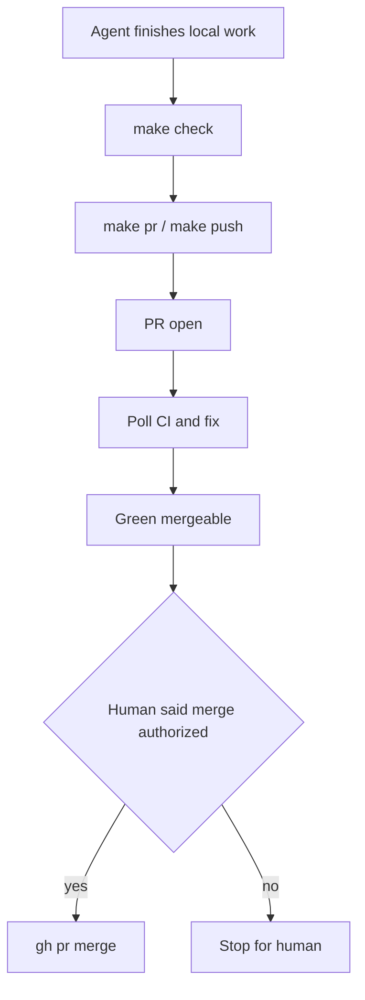

# PLAN: L4 publish-allow + phrase-merge

> First-class SSOT: `environment/contracts/execution/templates/canonical.template.executable_plan.v1.plan.md`
> Schema: `canonical.schema.plan_document.v1` — status `draft` until execute-start baseline reverify + `validate_plan_document.py` PASS on the written JSON
> Execute: `@environment/program-execution` then subordinate `@autonomy` (`/autonomy` → `l9-bounded-autonomy`) under a Program lease. Do not free-form mutate from this markdown.
> `/l9-plan`: already installed at [`~/.cursor-governance/commands/l9-plan.md`](/Users/macm2/.cursor-governance/commands/l9-plan.md). This session followed the attached skill. No install step.

## Execute via @environment/program-execution + autonomy

Authority: this plan → PE Blueprint/Lock/Controller → autonomy packet (narrow-never-widen) → `cursor-foreground`.

1. Attach PE + `/autonomy`. Instantiate under `$HOME/.l9/programs/l4-publish-allow/` — do not mutate sealed `environment/program-execution/core/`.
2. Bootstrap Controller; reconcile against the **new** worktree (not Website-Bot, not IB-Odoo, not `pe-pipeline-fixes`).
3. Admit Task Cards ⊂ envelope; `claim → prepare → render-contract`.
4. Map tasks → autonomy actions (`pes.w*.task*`).
5. Orchestrate Protocols A–D. `autonomous_merge: false`.
6. After local finish: `make pr-check` then `make pr` (push + open PR). Poll CI to green. **Stop at mergeable.** Merge only if the human says `merge authorized`.
7. `record-attempt → verify → export-handoff`. Graphiti PICKUP on close.

Landing (KERNEL pack default, no ask):

```bash
GOV="$HOME/.cursor-governance"
git -C "$GOV" fetch origin main
git -C "$GOV" worktree add "$HOME/.l9/gov-worktrees/l4-publish-allow" -b feat/l4-publish-allow origin/main
cd "$HOME/.l9/gov-worktrees/l4-publish-allow"
```

Campaign packet stub: `packet_id: autonomy-2026-08-15-l4-publish-allow`, `autonomous_merge: false`, `PR_BASE: campaign/l4-publish-allow` (or stacked predecessor), `allowed: make check / make pr / make push / non-force push / CI poll+fix`, `forbidden: gh pr merge` unless phrase receipt, force-push, admin-merge, secrets, widen ceiling.

## Metadata

- plan_id: `plan.ops.l4-publish-allow.v1`
- depth: `deep` (router: risk=high/irreversible autonomy law, evidence=sufficient)
- owner: igor_beylin
- created_at: 2026-08-15
- planning_ssot: [`ops/autonomy/surface_profile.yaml`](/Users/macm2/.cursor-governance/ops/autonomy/surface_profile.yaml) + [`CANONICAL_LAW.md`](/Users/macm2/.cursor-governance/CANONICAL_LAW.md) §6.2 / §6.2.2
- plan_class: `bounded_execution_contract`
- redesign_allowed: false

## Architect framing

L4 today denies `git push` / `gh pr create` / `make pr` / `make push` until a workspace-bound release receipt exists. The hook resolves workspace from **session cwd**, so a Website-Bot Claude window cannot see a receipt in `$HOME/.l9/gov-worktrees/pe-pipeline-fixes`.

That cwd bug is real (PE plan todo-06). It is **not** the product. Desired done-state:

- Agents are encouraged to run `make check`, `make pr`, `make push`
- Done = PR open, green, clean, **mergeable**
- Stacked PRs merge bottom-up with no rebase and no inter-merge conflicts
- Merge stays closed until the human says exactly `merge authorized`

`make check` is already unblocked. Cursor `beforeShellExecution` has L4 but **no merge_gate** — removing the remote deny without adding a Cursor merge hook would let `gh pr merge` through on Cursor.

## Immutable baseline

- repository: Cursor-Governance (`~/.cursor-governance`)
- workspace at plan time: IB-Odoo_19-1 (wrong tree — execute must not mutate it)
- ssot_clone: `$HOME/.cursor-governance`
- branch at plan time: `main`
- commit_sha: `dbc0bde0f3bbbf646f0da96dd36531198f379567`
- dirty: UNKNOWN in this clone (hooks reported match to origin/main)
- overlap_policy: `require_clean_tree` on the new worktree
- on_drift: `stop_and_replan`
- Do not land in `pe-pipeline-fixes` or Website-Bot. This program **supersedes** PE-pipeline todo-06’s “keep L4 deny, only fix cwd” for the remote-deny contract. Keep the cwd parser for isolation + merge-receipt binding.

## Objective

Stop the L4 remote gate from blocking agent publish. Agents complete work when a stacked PR is open, locally clean, CI-green, and mergeable. Humans merge by saying `merge authorized` (or `L9_MERGE_AUTHORIZED`). Force-push, hard-reset, and admin-merge stay denied.

### Success properties

- SP-01: Execute-start `git rev-parse HEAD` on the worktree equals locked `origin/main` SHA (or replan). Evidence: repository_state. Blocking.
- SP-02: PreToolUse + Cursor shell allow `make pr` / `make push` / non-force `git push` with **no** L4 receipt. Evidence: runtime_behavior (unit tests). Blocking.
- SP-03: Same hooks deny `gh pr merge` and merge MCP until phrase receipt or `L9_MERGE_AUTHORIZED`. L4 receipt still does not authorize merge. Evidence: runtime_behavior. Blocking.
- SP-04: Exact phrase `merge authorized` on UserPromptSubmit / beforeSubmitPrompt writes a human-only session receipt; agents cannot write it. Evidence: runtime_behavior. Blocking.
- SP-05: Command `cd` / `git -C <path>` roots are used for isolation + merge-receipt binding (fail-closed on `$(...)`). Evidence: runtime_behavior. Blocking.
- SP-06: `make pr-check` PASS on the worktree. Evidence: quality_gate. Blocking.
- SP-07: Publish PR open, CI green, `mergeable_state` mergeable/clean; no merge without phrase. Evidence: network_observation + human_confirmation. Blocking.

## Capability preflight

- CP-01: `git -C "$HOME/.cursor-governance" rev-parse origin/main` equals `dbc0bde0f3bbbf646f0da96dd36531198f379567` or replan
- CP-02: `python3` 3.11+, `gh`, `make` present
- CP-03: `$HOME/.l9/gov-worktrees/` writable; new worktree create succeeds
- CP-04: `pytest tests/ops/autonomy/` collectable from worktree
- CP-05: Claude `settings.template.json` still registers UserPromptSubmit + PreToolUse merge/L4 wraps; Cursor `hooks.json.template` still has `beforeSubmitPrompt` + `beforeShellExecution`

## Locked contract (do not reopen)

- Allow: `make check`, `make pr`, `make push`, non-force `git push`, `gh pr create` via `make pr`
- Soft L4: kernels + `l4_local.py` remain optional quality; **not** a remote deny
- Done: PR open + clean + CI green + mergeable
- CI poll + fix to green is allowed; `gh pr merge` is not
- Merge override: exact phrase `merge authorized` (case-insensitive) **or** `L9_MERGE_AUTHORIZED=<reason>`
- Stack: each PR `PR_BASE` = previous branch / `campaign/<id>`; merge oldest first; no rebase of open PR branches
- Cursor ask-first (`99-no-auto-commit`) is waived for `make check` / `make pr` / `make push` on all surfaces
- IB-Odoo overlay is out of scope



## Execution envelope

Write-allow (governance worktree only):

- `ops/autonomy/local_execution_gate.py`
- `ops/autonomy/l4_local.py`
- `ops/autonomy/merge_gate.py`
- `ops/autonomy/surface_profile.yaml`
- `ops/autonomy/worktree_isolation_gate.py` (shared command parser only)
- `ops/scripts/open_pr_after_gate.sh`
- `ops/hooks/hooks.json.template`
- `ops/hooks/l4-local-execution-gate-shell.sh` (wire merge check or sibling)
- `environment/agents/adapters/claude-code/hooks/` (new phrase hook + wraps)
- `environment/agents/adapters/claude-code/settings.template.json`
- `environment/program-execution/campaigns/CAMPAIGN_EXECUTION_POLICY.yaml`
- `rules/88-l4-local-autonomy.mdc`
- `rules/99-no-auto-commit.mdc`
- `CANONICAL_LAW.md` §6.2 / §6.2.2
- `skills/l9-bounded-autonomy/SKILL.md` + `references/doctrine-map.md`
- `environment/generated/llm-rules/zz-autonomy-surface-override.md` via `make sync-generated` only
- `tests/ops/autonomy/`
- `Makefile` help text for L4 / `PR_REMEDIATE`
- `AGENTS.md` autonomy rows that still say “no mid-execution push”

Write-deny: IB-Odoo, Website-Bot, `pe-pipeline-fixes` worktree, secrets, sealed PE `core/` templates, `pipeline_v2.py`.

Commands allow: pytest autonomy suite, `make sync-generated`, `make pr-check`, `make pr`, `make autonomy-validate` / `autonomy-contracts-validate` if present.
Commands deny: force-push, hard-reset, `gh pr merge` unless phrase receipt, `L9_L4_LOCAL_AUTONOMY=0` as the standing “fix”.

Network: `bounded_external_write` (GitHub PR create/update/checks only).
Secrets: none.
`autonomous_merge: false`.

## Todos / DAG

Critical path: `todo-01` → `todo-02` → `todo-03` + `todo-04` (serialize: **do not merge todo-03 without todo-04**) → `todo-05` → `todo-06` → `todo-07` → `todo-08` → `todo-09`.

- **todo-01-baseline-preflight** — Lock SHA, create `feat/l4-publish-allow` worktree from `origin/main`, run CP-01..05. Files: worktree only. Risk: low. Deps: none. Leverage: 9.
- **todo-02-doctrine-ssot** — Rewrite standing prose so agents are told to publish. `l4_local_autonomy.phases.executing/kernels_recorded` become `allow_scoped_push_and_pr`. `post_push.merge_requires` stays never. Campaign `remediate` becomes allow-until-green-no-merge. Update §6.2 table, §6.2.2, 88, 99 precedence, bounded-autonomy MUST/MUST NOT, Makefile help. Files: `surface_profile.yaml`, `CANONICAL_LAW.md`, `88-l4-local-autonomy.mdc`, `99-no-auto-commit.mdc`, `l9-bounded-autonomy/SKILL.md`, `doctrine-map.md`, `CAMPAIGN_EXECUTION_POLICY.yaml`, `Makefile`, `AGENTS.md`. Risk: high. Deps: todo-01. Leverage: 1.
- **todo-03-ungate-publish** — Stop remote deny for publish commands. Remove or no-op `REMOTE_BASH_PATTERNS` for `make pr` / `make push` / `git push` / `gh pr create|edit` (keep force-push in merge_gate). Drop `open_pr_after_gate.sh` L4 `check-remote` hard-fail (warn-only optional). Invert `test_l4_local.py` deny-without-receipt / deny-git-push / CLI exit-2 cases; keep merge-receipt-does-not-merge tests. Files: `local_execution_gate.py`, `open_pr_after_gate.sh`, `l4_local.py` (docs only), `tests/ops/autonomy/test_l4_local.py`, `test_surface_profile.py`. Risk: high. Deps: todo-02. Leverage: 2.
- **todo-04-phrase-merge** — Human phrase override + close the Cursor merge hole. New hook writes `$HOME/.l9/sessions/<session_id>/merge-authorized.json` (`actor=human`, `issued_at`, prompt excerpt). `merge_gate.py` allows if env **or** valid session receipt. Register on Claude `UserPromptSubmit` and Cursor `beforeSubmitPrompt`. Add merge_gate to Cursor `beforeShellExecution` (missing today). Deny agent writes to that receipt path. Files: new `ops/autonomy/merge_phrase_hook.py`, `merge_gate.py`, `settings.template.json`, `hooks.json.template`, `tests/ops/autonomy/test_merge_gate.py` + new phrase tests. Risk: high. Deps: todo-02. Leverage: 3.
- **todo-05-workspace-resolve** — Parse static `cd` / `git -C` roots (quote-aware; share parser with isolation). Resolve symlink + `git rev-parse --show-toplevel`. Bind isolation + merge-receipt to **that** root. Dynamic `$(...)` stays session-cwd fail-closed. Absorbs PE todo-06 without restoring remote deny. Files: `local_execution_gate.py`, `l4_local.py` `workspace_from_event`, `worktree_isolation_gate.py` if parser is shared, `tests/ops/autonomy/`. Risk: medium. Deps: todo-03, todo-04. Leverage: 4.
- **todo-06-stack-policy** — Encode stacked no-rebase: `PR_BASE` = predecessor / campaign branch; deny `git rebase` / `git pull --rebase` on branches with an open PR; docs that merge is oldest-first and file-disjoint lanes avoid conflicts. Files: `surface_profile.yaml` `campaign_execution`, `CAMPAIGN_EXECUTION_POLICY.yaml`, isolation gate patterns, doctrine. Risk: medium. Deps: todo-02. Leverage: 5.
- **todo-07-sync-generated** — `make sync-generated` so `zz-autonomy-surface-override.md` and RULES-MANIFEST match. Files: generated llm-rules + manifest. Risk: low. Deps: todo-02..todo-06. Leverage: 6.
- **todo-08-prove** — `pytest tests/ops/autonomy/`, `make autonomy-contracts-validate`, `make pr-check`. Files: tests only if fixtures fail. Risk: medium. Deps: todo-07. Leverage: 7.
- **todo-09-converge** — `make pr` from the worktree (session cwd **is** the worktree). Poll CI to green. Stop at mergeable. Do not merge unless user says `merge authorized`. Files: PR only. Risk: medium. Deps: todo-08. Leverage: 8.

## Side effects

- todo-01: filesystem (worktree). Idempotent if worktree exists.
- todo-02..07: filesystem mutation. Safe with dedupe (re-apply same prose/hook).
- todo-08: read + local test. Safe to repeat.
- todo-09: network_write (PR). Compensation: close/abandon PR. Irreversible: false unless merged (merge is human-only).

## Architecture impact

Control-plane / policy / ops. Owning contract: Autonomy Surface Profile + CANONICAL_LAW §6.2. Prohibited: standing `L9_L4_LOCAL_AUTONOMY=0` as the fix; weakening force/hard-reset; implementing in IB-Odoo; restoring mid-exec remote deny after ungate.

## Rollback

- Code: revert the feature-branch commits or close the PR; `git worktree remove` the landing tree.
- Doctrine: restore previous `surface_profile.yaml` + regenerate.
- Phrase receipts: delete `$HOME/.l9/sessions/*/merge-authorized.json`.
- External: unmerged PR can be closed. Merged PR is human-authorized — no automatic unmerge.
- Verify rollback: old tests `test_denies_remote_without_release` + `test_gate_denies_git_push` pass again; `gh pr merge` still denied without env.

## Complexity and uncertainty

- complexity: high (law + two adapter hook graphs + tests)
- uncertainty: medium (Cursor hook payload shape for prompt text; session_id availability)
- blast_radius: high (every Claude/Cursor session on this machine)
- boundaries crossed: policy + ops + adapters
- unknown_dependency_count: 2 (accepted bounded)

## Stress and disconfirm

Disconfirming questions:

1. If Cursor `beforeSubmitPrompt` does not include the raw user prompt, can the phrase hook fire? If no, Cursor merge stays env-only — fail-closed, document it, do not invent a model-written receipt.
2. If we ungate publish before Cursor merge_gate is wired, can a Cursor agent `gh pr merge` today? Yes — todo-03 must not land without todo-04.
3. If “green” requires `l9-pr-remediation` but that skill is `user-invocable-only`, will agents stall short of mergeable? Then doctrine must allow a non-merge poll/fix loop without requiring the explicit-only skill, or flip that skill to auto for CI-fix only.
4. If stacked PRs touch the same files, can any gate prevent conflicts? No — file-disjoint lanes are a planning constraint, not a hook.

Assumed false ifs:

- Session cwd will be the campaign worktree (it will not; do not rely on launch contract).
- Saying “merge authorized” in chat already works (it does not; only env does).
- L4 receipt equals merge authority (it must not).

Blast radius: every agent session; accidental mid-task PRs; Cursor merge hole if todo-04 slips.

## Out of scope

- IB-Odoo_19-1 product/modules
- Website-Bot
- Completing `pe-pipeline-fixes` compiler/acceptance/evidence todos
- Installing `/l9-plan` (already present)
- Auto-merge, force-push, admin-merge
- Disabling worktree-isolation (scoop/revert/switch)
- Turning off Graphiti / memory gates
- Changing DeepSeek / Claude wrapper

## Doc / root surface impact

- update: `CANONICAL_LAW.md` §6.2 / §6.2.2 (todo-02)
- update: `AGENTS.md` autonomy / L4 rows (todo-02)
- update: `rules/88-l4-local-autonomy.mdc`, `rules/99-no-auto-commit.mdc` (todo-02)
- update: generated `zz-autonomy-surface-override.md` via sync (todo-07)
- n_a: IB-Odoo `AGENTS.md` / CLAUDE.md — consumer inherits global rules; no repo overlay rewrite

## GMP handoff

- may_modify: envelope write-allow list above
- must_not_modify: IB-Odoo, Website-Bot, PE sealed core, secrets, `pipeline_v2.py`, unrelated campaigns
- preserved_contracts: `autonomous_merge: false`; merge_gate force/hard-reset deny; L4 receipt ≠ merge; isolation scoop/revert/switch deny; fail-closed dynamic paths
- validation_commands: `pytest tests/ops/autonomy/ -q`; `make autonomy-contracts-validate`; `make sync-generated`; `make pr-check`

## Convergence

- status: **partial**
- remaining: PLAN_DOCUMENT JSON not written to disk (Plan mode / CreatePlan projection only). First execute action: write JSON in the worktree and `python3 skills/l9-plan/scripts/validate_plan_document.py` until PASS, then set status `executable`.
- next_skill: `/autonomy` + `@environment/program-execution` (then `l9-ynp` after handoff)
- stop_reason: planning complete; no product mutation from this turn

## Pre / final validation

Pre: CP-01..05 at execute start; `route_plan.py --risk high --evidence sufficient` → depth=deep (already applied).
Final: autonomy pytest + `make pr-check` + PR green/mergeable + merge still denied without phrase.

## Devil's Advocate

Ungating mid-task `make push` can open half-finished PRs. `make pr` already runs checkers — keep that as the quality floor; do not add a second deny. The load-bearing control is todo-04 (phrase + Cursor merge hook). Shipping todo-03 alone is a regression.
