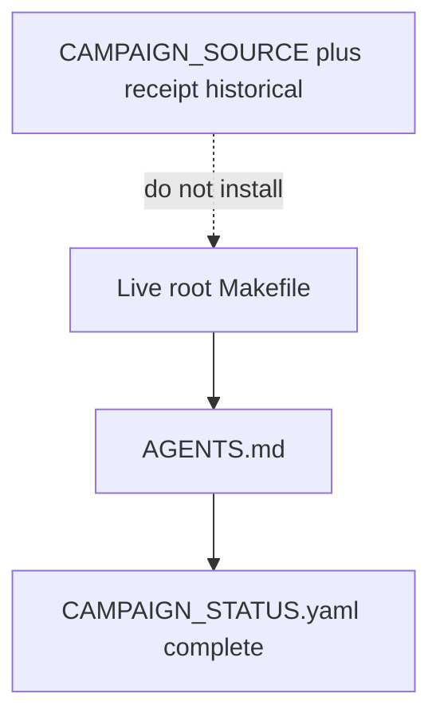

# Shadow-authority closeout for level3-make-pr-single-path

## Live authority (this surface)

Only these are live for Make / publish / campaign next-id:

| Surface | Path | Role |
|---|---|---|
| Command surface | [`Makefile`](Makefile) | Sole Make API SSOT |
| Operating doctrine | [`AGENTS.md`](AGENTS.md) | Teaches `pr-check` and `PR_REMEDIATE=0 make pr` |
| Campaign ledger | [`environment/program-execution/campaigns/CAMPAIGN_STATUS.yaml`](environment/program-execution/campaigns/CAMPAIGN_STATUS.yaml) | `level3-make-pr-single-path` is `complete` |
| Next-campaign order | [`environment/program-execution/campaigns/CAMPAIGN_EXECUTION_POLICY.yaml`](environment/program-execution/campaigns/CAMPAIGN_EXECUTION_POLICY.yaml) | Policy list; do not launch this id |

Do not treat as live: deleted pack files, Aug 16 INTENT/source as a next install, leftover worktree `Makefile`, `WIP/8-15-26/makefile` (already gone).

## Decision (locked)

**Delete the shadow inputs. Keep the live Makefile. Close the ledger in place.**

The defect was agents reading pack leftovers as the next install. It was not a missing byte-replace of today's Makefile.

| Action | Status | Evidence |
|---|---|---|
| Delete `Makefile.candidate` | Done 2026-08-28 | File absent under `environment/program-execution/campaigns/level3-make-pr-single-path/` |
| Delete `Prompt - Start Campaign.md` | Done 2026-08-28 | Same directory; file absent |
| Keep `CAMPAIGN_SOURCE.yaml` + `source-integrity-receipt.json` | Kept | Historical seed only |
| Stamp `INTENT.yaml` | Done | Header says CLOSED; do not replace live Makefile |
| Close ledger without archive | Done | `close_campaign()` then notes; campaign dir still present |
| Touch live `Makefile` | Forbidden / not done | Root Makefile unchanged |

Do not run `close_campaign.py close` on the CLI: `cmd_close` also calls `archive_completed()` and would move the whole pack to `COMPLETED/`.

## Historical evidence (not a live fork)

- [#187](https://github.com/Quantum-L9/Cursor-Governance/pull/187) merged 2026-08-16 into `campaign/level3-make-pr-single-path` (`e5a3f9f6564974f84f2ab06926491f8897e6ed4f`). That SHA is not an ancestor of `origin/main`.
- Candidate digest was `9ecb01de…` (~81 targets). Live Makefile digest was `7dc89ffa…` (~111 targets). Byte-replace would delete `campaign`, `pr-preflight`, `pr-check`, `improve`, `ff`, Claude projection, capability-broker, `wip-hygiene`, `gov-python`.
- `eie-inference-isolation-v1` is `in_progress`. Do not mix this hygiene onto that campaign.
- Policy still lists this id at execute_order 9. `next_campaign()` still returns `l9-ecosystem-fix-plan` first. Host pack `HOST_REGISTRATIONS.yaml` is not a launch.

## Leftover worktree (report only)

`$HOME/.l9/program-worktrees/level3-make-pr-single-path` exists.

- Branch: `feat/level3-make-pr-single-path` @ `1d491481`
- Upstream `origin/feat/level3-make-pr-single-path` is gone
- Dirty: `CAMPAIGN_STATUS.yaml` modified; untracked `handoff/`
- Do not `git switch` on the dirty primary clone
- Do not delete this dirty worktree from the primary checkout

## Out of scope

- Any edit to repository [`Makefile`](Makefile)
- Replaying W0–W3 or the deleted start prompt
- `compile_activation_files.py`
- Re-applying `HOST_REGISTRATIONS.yaml` as a start
- Touching `eie-inference-isolation-v1`
- `make campaign` / Program Lock
- Archiving the campaign dir into `COMPLETED/`
- A new one-pass-PR redesign against today's Makefile

## Remaining Build todo

1. **Validate** — `make pr-check` on ledger / handoff / INTENT / this plan only. No Makefile. No push.

## Stress test

- **Disconfirm:** If `Makefile.candidate` or the start prompt reappear, delete them again; do not stamp and keep.
- **Assumed false if:** An operator still wants today's `main` Makefile replaced with the 2026-08-16 candidate bytes. That intent is rejected; open a new plan against today's Makefile.
- **Blast radius if wrong:** A `complete` ledger row hides a campaign someone still wanted on `main`. Mitigation: verdict is `CONVERGED_WITH_NON_BLOCKING_RISKS` and notes name the missing main absorb plus the deleted shadows.
- **Rollback:** Revert the ledger/INTENT commit. Do not restore the candidate as live SSOT.

## Execute via Cursor Build

Current checkout. No `make campaign`. No Program Lock. No new tip worktree for this hygiene pack.
