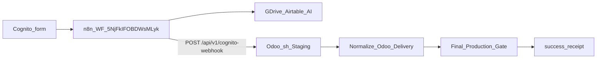

# PLAN: n8n Odoo staging wire

> **Improve.md applied 2026-08-13** (discovery + contract hardening). Prior draft gaps closed: PE Phase-0 table, campaign packet, evidence matrix, SP-06 rollback backups, staging URL derivation (`/odoo` strip), AWS VersionId non-clobber, prove dedupe gate.
> **SSOT template:** [environment/contracts/execution/templates/canonical.template.executable_plan.v1.plan.md](environment/contracts/execution/templates/canonical.template.executable_plan.v1.plan.md)
> **Schema:** `canonical.schema.plan_document.v1` — status `preflight_blocked` until CP-03 staging-up + baseline law → `executable`
> **Execute:** [@environment/program-execution](environment/program-execution/) → Program Lock → [@autonomy](commands/autonomy.md) / `l9-bounded-autonomy`. No free-form mutate.
> **Supersedes:** earlier `n8n_odoo_staging_wire_740b9f7a` body (same intent; this revision is binding)

## Improve pass log

| Pass | Result |
|------|--------|
| 1 bind/inventory | Bound plan + PE template + prior n8n/Odoo outage evidence |
| 2 issue discovery | Gaps: incomplete PE tables; AWS clobber hazard; `/odoo` path confusion; missing EV matrix; weak frontmatter |
| 3 contract harden | URL derivation, secret backup, node-name vs URL-only check, prove dedupe |
| 4–5 remediate | Full PE-shaped rewrite below |

## Decisions (closed)

| Topic | Decision |
|-------|----------|
| Primary env | **Staging-only** (prod formality) |
| Workflow | Retarget Odoo hop on `5NjFkIFOBDWsMLyk`; Cognito webhook unchanged |
| Node name | Keep `POST Raw Cognito to Production Odoo`; **SP-03 checks URL host only** |
| Auth | Named credential (Bearer create; Header-auth fallback); **no inline Authorization values** |
| AWS | Upsert staging into `openclaw-igorbot/odoo-web-lead` **after** SM VersionId backup |
| Normalizer | Keep `decodePossiblyBufferedJson` (root cause of false gate fails) |
| Branch | Cut `fix/n8n-odoo-staging-wire` from **clean** tip — never dirty scratch-hold |

### Staging URL derivation (normative)

```text
ODOO_SH_STAGING_URL may be https://HOST/odoo
API_URL := https://HOST/api/v1/cognito-webhook
HOST from ODOO_SH_STAGING_SSH (user@HOST) or strip scheme+path from UI URL
```

Re-resolve HOST at W0 (planning ref `…-staging-36097692…` may churn).

### Preserved root-cause contracts

1. Bearer must match `plasticos.web.lead.config.api_key` on the **same** DB the URL hits
2. n8n may emit IncomingMessage-shaped body → normalizer recovers JSON from buffer
3. Draft edits inert until publish updates active `versionId`



## PE + autonomy

Authority: plan → Program Controller lease → `@autonomy` packet (subordinate) → `cursor-foreground`.

**Campaign packet (fill digests at execute):** `A4_CAMPAIGN_BOUNDED_EXTERNAL_WRITE`, `autonomous_merge: false`, branch `fix/n8n-odoo-staging-wire`, allow n8n WF + AWS SM named + SSH staging config; forbid force-push, secret commits, production key overwrite, AWS clobber without VersionId backup, widen ceilings.

### Phase-0 ↔ Task Cards

| id | pe_task | wave | depends_on | mutation | autonomy_action_id | kind |
|----|---------|------|------------|----------|--------------------|------|
| todo-01-baseline-preflight | TASK-001 | W0 | [] | false | `pes.w0.task001` | work |
| todo-02-staging-key | TASK-002 | W1 | [todo-01] | true | `pes.w1.task002` | work |
| todo-03-n8n-retarget | TASK-003 | W1 | [todo-02] | true | `pes.w1.task003` | work |
| todo-04-aws-registry | TASK-004 | W1 | [todo-02] | true | `pes.w1.task004` | work |
| todo-05-prove | TASK-005 | W2 | [todo-03, todo-04] | true | `pes.w2.task005` | work |
| todo-06-converge | TASK-006 | W2 | [todo-05] | true | `pes.w2.task006` | work |

**Critical path:** 01 → 02 → 03 → 05 → 06 (04 parallel after 02).

## Metadata / framing

| Field | Value |
|-------|-------|
| plan_id | `plan.ops.n8n_odoo_staging_wire.v1` |
| plan_class | `integration_plan` |
| status | `preflight_blocked` |
| redesign_allowed | `false` |
| owner | igor_beylin |
| updated_at | `2026-08-13` |

## Immutable baseline (W0)

| Field | Value |
|-------|-------|
| repository | `Quantum-L9/Cursor-Governance` |
| branch | `fix/n8n-odoo-staging-wire` |
| commit_sha | full 40-char at W0 |
| dirty | false on write_allow overlap |
| overlap_policy | `stop_if_dirty_overlaps_may_modify` |
| on_drift | `stop_and_replan` |
| external_baseline | n8n `versionId` + Staging HOST |

## Success properties

| id | property | blocking |
|----|----------|----------|
| SP-01 | HEAD == locked SHA | true |
| SP-02 | Staging cognito-webhook Bearer → ok/success + web_lead_id | true |
| SP-03 | Published POST URL host = Staging HOST; no inline Bearer in workflow JSON | true |
| SP-04 | Fresh exec success + `odooStatus=success` | true |
| SP-05 | SM `odoo-web-lead#api_url` = Staging HOST; resolve --check; pr-check if registry committed | true |
| SP-06 | W0 receipt has prior n8n versionId + AWS VersionIds | true |

## Capability preflight

| id | probe | pass | blocking |
|----|-------|------|----------|
| CP-01 | clean HEAD | matches lock | true |
| CP-02 | n8n GET WF | 200 + versionId | true |
| CP-03 | `https://HOST/web/login` | 200 | true |
| CP-04 | SSH staging | config readable (prefix only) | true |
| CP-05 | AWS describe secrets | ARNs + VersionIds | true |

**Blocker:** CP-03 failed 2026-08-12 (staging connect-fail). Re-probe at execute.

## Envelope

- **write_allow:** `ops/secrets/openclaw-igorbot.registry.yaml`, this plan path, gitignored receipts
- **write_deny:** secrets in git; `CANONICAL_LAW.md`; PE core templates; production key overwrite; app code (Staging key via SSH/UI only)
- **network:** `bounded_external_write` — n8n Cloud, AWS SM, Staging HOST
- **secrets:** named resolve; redaction required
- **autonomous_merge:** false

## Side effects

| todo | side_effects | idempotency | compensation |
|------|--------------|-------------|--------------|
| 02 | external_state_mutation | safe_with_dedupe | restore staging key from SM backup |
| 03 | external_state_mutation | safe_with_dedupe | republish prior versionId |
| 04 | external + filesystem | safe_with_dedupe | SM VersionId + git revert |
| 05 | network_write (non_idempotent) | manual_only; **bounded_write_count=1** (+1 retry max) | mark test lead |
| 06 | network_write | safe_with_dedupe | close PR |

## Prove gate (todo-05)

Ordered: SP-02 → SP-03 on published WF → single webhook → terminal status → SP-04. Dedupe Entry.Number. Receipt = execution id + redacted odoo fields.

## Rollback

n8n prior versionId; SM previous VersionId; git revert registry. Irreversible: staging/Airtable prove rows (test residue).

## Stress

- Build-id churn → stop_and_replan HOST
- Strip normalizer → false SP-04
- Cred attach 403 → header-auth fallback still no inline secrets
- AWS clobber without backup
- Published URL still production host

## Out of scope

Prod as active destination; Cognito redesign; Airtable/Agent prompts; PlasticOS code beyond Staging config; dual routers; cosmetic node renames; force-push; PE core edits.

## Follow-on (separate)

Prod cutover; delete orphan n8n creds; optional Cognito sandbox webhook.

## Convergence

- **executable_when:** CP-01..05; DAG acyclic; envelope+SE matrix; SP-06 backups defined
- **complete_when:** EV-SP-01..06 passed
- **minimum_safe_next_action:** Bring Staging HTTPS up → clean branch → PE + `/autonomy` W0

## Handoff

- **may_modify:** n8n WF, AWS SM named, registry YAML, plan, Staging web-lead config
- **must_not_modify:** prod-as-primary, PE core, secrets in git
- **validate:** staging probe; n8n GET/publish/exec; resolve --check; make pr-check
- **next:** PE + l9-bounded-autonomy execute (not free-form)
