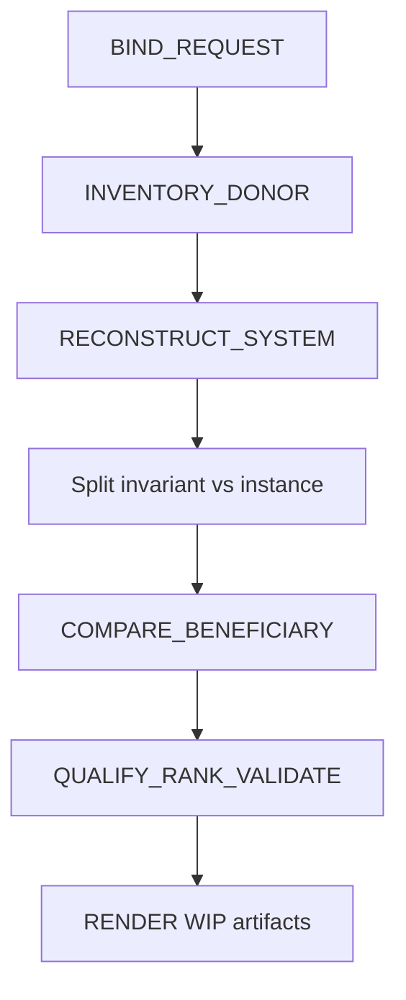

# Harvest no-regression invariants (not hardcoded paths)

## Binding

- **Donor:** [docs/plans/novel_remainder_no-regress_0429bc04.plan.md](docs/plans/novel_remainder_no-regress_0429bc04.plan.md) (same bytes as `~/.cursor/plans/novel_remainder_no-regress_0429bc04.plan.md`)
- **Beneficiary:** [skills/l9-git-work-preserve](skills/l9-git-work-preserve) — harvest / extract / prune already own this surface. Not `l9-repo-sync` (`/ff` parking stays there).
- **Harvest target:** portable leftover-work no-regression invariants
- **Request id:** `no-regress-git-work-preserve-2026-08-28`
- **Outputs only:** `harvest.json`, `harvest-receipt.json`, `DONOR-HARVEST-BRIEF.md` under [WIP/8-28-26/intelligence-harvest/no-regress-git-work-preserve/](WIP/8-28-26/intelligence-harvest/no-regress-git-work-preserve/)
- **Forbidden this pass:** edit `skills/l9-git-work-preserve/**`, copy donor file lists into the skill, implement `/gmp`, commit/push, run donor harvest/extract/prune

Skill law: donor is evidence; beneficiary mutation is forbidden ([policies/harvest-policy.yaml](skills/l9-intelligence-harvest/policies/harvest-policy.yaml)). Implementation of qualified nuggets is a later `/gmp`.

Do **not** use [harvest_plan_invariants.py](skills/l9-plan-audit/scripts/harvest_plan_invariants.py) as the extractor. It only pulls `| SP-xx |` table rows plus overview; this donor’s classifier lives in prose. Run the full intelligence-harvest DAG.

## Instance vs invariant (hard reject as KEEP_LOCAL / REJECT)

Treat these as donor incidentals. They must not appear as nugget destinations, semantic contracts, or acceptance-test path literals:

- Kernel filenames, `prompts/10X Kernels`, commit SHAs, branch names, worktree/ref counts
- Named plan files, fixture paths, bak-clone commit ids
- “three themed PRs” as a count; “five new kernels” as a set

Those are *instances* of the invariants below (path-absent copy, path-union, foreign-overlay skip).

## Concepts to qualify (expected dispositions)

Compare against live beneficiary behavior, not the plan’s “Preserve SSOT” citation. Observable scripts outrank the donor.

**PORT_WITH_HARDENING (likely nuggets)**

1. **Path-absent copy** — copy a path iff `git cat-file -e <baseline>:<path>` fails. Path-absent, not blob-absent-only. Beneficiary already does this for porcelain dirt in [harvest_worktree_dirt.py](skills/l9-git-work-preserve/scripts/harvest_worktree_dirt.py) `path_on_baseline`; donor is stronger because it also applies to committed trees on `keep_push` / preserve tips (classifier does not scan those).
2. **Allowlist gate** — durable copy/skip/reason artifact; extract consumes only the copy set; empty copy set is a valid stop. Harvest JSON has `harvestable`/`skipped` but no gate or empty-stop contract.
3. **Path-union, never whole-branch cherry-pick** — mixed refs carry deletes/overwrites of baseline names. [extract-workflow.md](skills/l9-git-work-preserve/references/extract-workflow.md) still says “Cherry-pick or path-limited commits.” This is the highest-leverage gap (it is what the 10X-kernel instance was protecting).
4. **Add-only exception** — default skip dirty-on-baseline; copy only if the diff deletes zero lines that still exist on baseline. Today `already_on_baseline` is a hard No.
5. **Layout-native prefixes** — copy only prefixes the baseline tree uses; skip generated prefixes, secret globs, and trees absent from baseline layout. Do not bake `src/` / `drizzle/` into the skill; those are this-repo instances. Prefer CONFIGURE if a prefix list belongs in declarative config rather than prose.
6. **Named dangling recover** — recover a lost object only when it has a path name *and* that path passes the allowlist; unnamed blobs stay dangling. Absent from the pack today.
7. **Bytes-before-delete** — do not drop a unique path until a committed copy exists at the destination (generic shelf rule). Not the named `fix_ff_slash_command_*.plan.md`.

**MERGE_WITH_EXISTING (strengthen docs, do not duplicate ownership)**

- Dedicated worktree from fetched `origin/main`; never scoop the dirty shared clone — already in [harvest-workflow.md](skills/l9-git-work-preserve/references/harvest-workflow.md)
- Regen generated artifacts from copied sources; never copy stale generated files — already there
- One theme per PR; do not mix `unique_product`; do not stack onto an unrelated open PR — fold `PR_STACK=auto` + no-merge into Publish, not a new theme-count
- Prune last; `prune_candidate` or `archive_ref` + `redundancy_basis: patch_id` only; never delete `keep_push` or `content_superset` — already in [prune-policy.md](skills/l9-git-work-preserve/references/prune-policy.md); add explicit re-diagnose after extract

**KEEP_LOCAL / REJECT**

- Skip live SSOT / bak unless the path is missing from the workspace extract → clone-map / this-machine, not this skill
- “Building this plan is push authorization” → surface-profile authority, not harvest
- Census, SHAs, named kernels/plans → incidental

Acceptance tests must be behavior-shaped (Given/When/Then/Must-not) with baseline/`cat-file`/allowlist language. No donor filenames.

## Deterministic execution (Build)

1. Write request JSON (`depth: exhaustive`, `access_mode: read-only`, `secrets_policy: redact`, `brief: true`).
2. `bind_request.py` → `inventory_source.py` on the donor plan file.
3. Reconstruct the donor as classify → allowlist → dedicated worktree → themed publish → prune-last. Mark claims CONFIRMED (plan text + beneficiary scripts), INFERENCE (gap vs extract cherry-pick), UNKNOWN (whether keep_push path-union should be a new script vs extract-workflow only).
4. Fill concepts with portability + beneficiary_fit; run `qualify_nuggets.py`, `rank_nuggets.py`, `validate_harvest.py`. Renderer is forbidden until validate is clean.
5. `render_brief.py` into the WIP dir. Status will likely be PARTIAL (MERGE concepts + KEEP_LOCAL instances).
6. Stop. Report highest-leverage nugget. Do not edit the skill.

Scripts: [bind_request.py](skills/l9-intelligence-harvest/scripts/bind_request.py), [inventory_source.py](skills/l9-intelligence-harvest/scripts/inventory_source.py), [qualify_nuggets.py](skills/l9-intelligence-harvest/scripts/qualify_nuggets.py), [rank_nuggets.py](skills/l9-intelligence-harvest/scripts/rank_nuggets.py), [validate_harvest.py](skills/l9-intelligence-harvest/scripts/validate_harvest.py), [render_brief.py](skills/l9-intelligence-harvest/scripts/render_brief.py). Locked interpreter: `$HOME/.cursor-governance/.venv/bin/python`.
