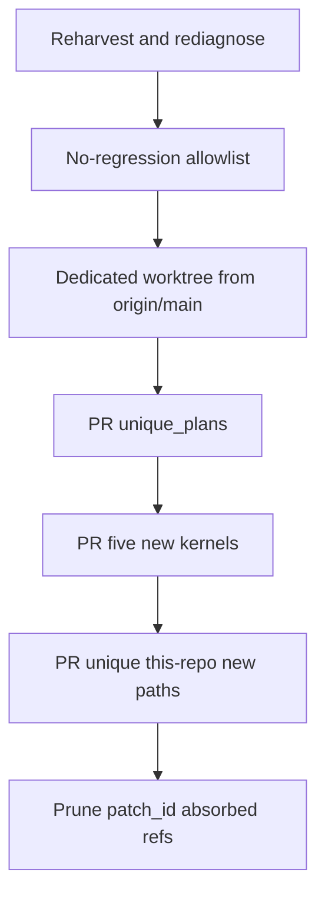

# Novel remainder: harvest, publish, prune

**Skill:** `l9-plan-simple` (Cursor Build). Do not run `make campaign`. Do not admit a Program Lock. Do not write `Lock: origin/main = <sha>`.

**Depth:** `deep` (`route_plan.py --risk high --evidence sufficient`). Gates are not omitted.

**Hook catalog:** [`.pre-commit-config.yaml`](.pre-commit-config.yaml)

**Preserve SSOT:** [`skills/l9-git-work-preserve/SKILL.md`](skills/l9-git-work-preserve/SKILL.md) + [`harvest-workflow.md`](skills/l9-git-work-preserve/references/harvest-workflow.md) + [`extract-workflow.md`](skills/l9-git-work-preserve/references/extract-workflow.md) + [`prune-policy.md`](skills/l9-git-work-preserve/references/prune-policy.md)

## Architect framing

The live SSOT clone (`~/.cursor-governance`) is clean and shallow. Unique work lives in the workspace git dir (84 worktrees, 97 `keep_push` tips, uncommitted plans, five new kernel files, dangling objects). The last pack skipped catalog overwrites on purpose. This plan lands **only bytes that cannot regress `origin/main`**, then prunes refs whose patch-ids are already upstream.

## Immutable baseline (workspace bind, not a Program Lock)

- Repo: `/Users/ib-mac/Cursor-Governance`
- Branch at plan time: `feat/pr-train-pack-overlap` @ `bb0f18cd` (dirty plans-store shelf)
- Compare tip: fetched `origin/main`
- Re-run inventory at Build start; the primary clone dirt has already changed since the census

Do not harvest onto `feat/pr-train-pack-overlap`. Extract uses a **dedicated worktree** as an execution step ([`ops/scripts/agent_worktree_start.sh`](ops/scripts/agent_worktree_start.sh)), not as a planning lock.

## Objective + success properties

**Objective:** Stage and push every leftover unique path that is absent from `origin/main` (this-repo trees only), without changing any file that already exists on `origin/main`, then locally prune refs that diagnose as absorbed.

**Success (falsifiable):**

- SP-01: For every harvested path, `git cat-file -e origin/main:<path>` fails before copy and succeeds after the extract commit (new path on the extract branch).
- SP-02: `git diff origin/main -- AGENTS.md CANONICAL_LAW.md Makefile kernels/Recursive\ Alignment.md prompts/10X\ Kernels` is empty on the extract branch (no overwrites, no 10X deletes).
- SP-03: Themed PRs open via `PR_REMEDIATE=0 make pr` (pathspecs only; rule 49). `git diff --name-only origin/main...HEAD` contains no `ops/generated/`, `rules/RULES-MANIFEST.*`, or `src/` / `drizzle/` foreign overlay.
- SP-04: `prune-execute` deletes only refs whose latest diagnosis is `prune_candidate` or `archive_ref` with `redundancy_basis: patch_id`, tip SHA recorded first. `content_superset` and `keep_push` refs remain.

## No-regression classifier (shared root cause)

Copy **iff** all of:

1. Path is `unique_plans` / `unique_wip` / `unique_product` from [`harvest_worktree_dirt.py`](skills/l9-git-work-preserve/scripts/harvest_worktree_dirt.py), **or** `git cat-file -e origin/main:<path>` fails on a `keep_push` tip / identifiable dangling blob.
2. Prefix is this repo: `docs/plans/`, `WIP/` (not Legal Defense / secret globs), `kernels/` **new names only**, `skills/`, `ops/` (non-generated), `commands/`, `environment/` (non-generated), `tests/`, `learning/`.
3. Not generated: prefixes owned by [`sync_generated_artifacts.py`](ops/scripts/sync_generated_artifacts.py) (`ops/generated/`, `rules/RULES-MANIFEST.*`, `environment/generated/`, adapter `skill-registry.json`).
4. Not `additive_only` root overwrite ([`ops/config/root-file-protection.json`](ops/config/root-file-protection.json)). Append-only unique lines only if a path is already on main **and** the worktree diff deletes zero lines that still exist on `origin/main`. Default for dirty-on-main files: **skip** (harvest `already_on_baseline`).
5. Not foreign overlay: `src/`, `drizzle/`, `packages/`, `client-snippets/`, `.github/ci.yml` and sibling product trees that `origin/main` does not use as this repo’s layout.
6. A behind-main worktree is never applied wholesale (`stale_apply_risk`).

**10X kernels:** `origin/main` already has `prompts/10X Kernels/*` and `kernels/Recursive Alignment.md` (and Improve/Leverage/Recursive Leverage). HEAD added five **new** names only — copy those blobs, do **not** cherry-pick `8bef83ab`/`bb0f18cd` (those delete `prompts/10X Kernels` and would collide with existing kernels):

- [`kernels/Build.md`](kernels/Build.md)
- [`kernels/Flawless Victory.md`](kernels/Flawless Victory.md)
- [`kernels/Recursive Improvement (L9).md`](kernels/Recursive Improvement (L9).md)
- [`kernels/Validate & Eliminate Stubs.md`](kernels/Validate & Eliminate Stubs.md)
- [`kernels/Validate & Fill Gaps.md`](kernels/Validate & Fill Gaps.md)

**Plans shelf:** do not drop [`docs/plans/fix_ff_slash_command_49d066b7.plan.md`](docs/plans/fix_ff_slash_command_49d066b7.plan.md) unless the `built/` copy is committed first (bytes preserved). Untracked [`docs/plans/fleet_issues_diagnose_ee5fa300.plan.md`](docs/plans/fleet_issues_diagnose_ee5fa300.plan.md), [`docs/plans/dag_authoring_convert_4d8d80c4.plan.md`](docs/plans/dag_authoring_convert_4d8d80c4.plan.md), fixture [`skills/l9-pe-campaign-activate/scripts/fixtures/cursor-plan-todos.plan.md`](skills/l9-pe-campaign-activate/scripts/fixtures/cursor-plan-todos.plan.md).

Harvest forbids mixing `unique_product` themes in one PR: **three stacked PRs** (`PR_STACK=auto`). Do not stack onto unrelated open PRs.

## Capability preflight

- `git fetch origin` in workspace **and** `$HOME/.cursor-governance` (SSOT stays read-only; do not copy bak dirt unless a path is absent from the workspace extract).
- [`inventory_git_work.py --fetch`](skills/l9-git-work-preserve/scripts/inventory_git_work.py), [`harvest_worktree_dirt.py --include-wip --json`](skills/l9-git-work-preserve/scripts/harvest_worktree_dirt.py), [`diagnose_ref_value.py`](skills/l9-git-work-preserve/scripts/diagnose_ref_value.py) on unique tips, [`triage_preserved_refs.py --fetch`](skills/l9-git-work-preserve/scripts/triage_preserved_refs.py).
- Skip live SSOT (zero unique). Skip `Cursor-Governance-main` backup commit `c2efb231`. Skip Aug 14 bak 185-file dirty tree unless a path fails the allowlist **and** is missing from workspace refs.

## Execution envelope

- fs: extract worktree + pathspec copies; source worktrees/refs **intact**
- commands: git (pathspecs), harvest/extract scripts, `make precommit-repo`, `PR_REMEDIATE=0 make pr`, prune-execute with `L9_GIT_PRUNE_AUTHORIZED`
- network: `git fetch` / `make pr` push
- secrets: none; skip secret globs and `WIP/Legal Defense/`
- `autonomous_merge: false`

## Side effects + idempotency

- Mutating todos copy files and commit on the extract branch only. Re-run is skip-if-path-already-on-extract-HEAD.
- Prune is not idempotent; receipts + tip SHAs are the restore path: `git branch <name> <sha>`.
- Never `git add -A`, never reset the shared primary clone, never delete a worktree that still has unique dirty.

## Architecture impact

None. No new activation path, no PE overlay, no kernel-pack landing branch rule (rule 46 N/A). Five kernel files are additional prompt files, not a pack rewrite.

## Rollback

- Extract branch: leave source refs; delete extract worktree/branch if publish fails.
- After push: revert PR, do not force-push.
- After prune: `git branch <name> <recorded-tip>` from prune receipt. No `git push --delete`.

## Complexity and uncertainty

- 97 `keep_push` tips share overlapping unique paths; extract by **path union vs origin/main**, not by cherry-picking whole branches.
- Dangling 90 blobs may lack paths; recover only with a name from `git fsck --lost-found` + allowlist, else leave dangling.
- Dirty-on-main skill trees (`l9-ff-only-sync`, `l9-pe-campaign-activate`) stay unharvested unless a diff is add-only (zero deleted main lines).

## Execution DAG

1. **T0** Re-inventory both clones; write receipts under the extract worktree `.l9/` or a dated `WIP/` harvest receipt (not `/tmp`).
2. **T1** `agent_worktree_start.sh` from fetched `origin/main`; branch `feat/novel-remainder-no-regress`.
3. **T2** Emit allowlist JSON (paths to copy / skip / reason). Empty copy set is a valid stop.
4. **T3** Copy unique_plans + fixture; scoped commit.
5. **T4** Copy the five unique kernel files from `bb0f18cd` blobs; scoped commit.
6. **T5** Union of keep_push / ff-preserve / preserved-branch paths that pass T2; copy; scoped commit(s) split if themes collide.
7. **T6** Optional dangling recover (named unique blobs only).
8. **T7** `sync_generated_artifacts.py --force` only if a copied source requires regen; **do not copy stale generated files**. Then `make precommit-repo`.
9. **T8** `PR_REMEDIATE=0 make pr` per theme (stack children). Building this plan is push authorization for those `make pr` invocations.
10. **T9** `prune-propose` then `L9_GIT_PRUNE_AUTHORIZED=novel-remainder-plan prune-execute` for local `prune_candidate` + `archive_ref`/`patch_id` only. Re-diagnose after T5. Do not prune `keep_push` or `content_superset`. Do not drop stashes.

## Property evidence matrix

- SP-01: allowlist + `git cat-file` before/after
- SP-02: empty diff on protected/kernel/10X paths
- SP-03: PR file list vs skip prefixes
- SP-04: prune receipt classes + restored SHA list

## Stress and disconfirm

- If a “unique” path on a keep_push tip is an older copy of a file later added to main under a new name, copy would duplicate — require path-absent, not blob-absent-only.
- If T5 copies `feat/plan-skills-precommit-catalog` new files that rewrite behavior via **new** files imported from old `AGENTS.md` splits, that can still regress — skip new files that are generated manifests or protected-root dumps.
- If prune runs before T5, unique commits disappear. Prune is last.
- Assumed false if: `origin/main` fetch is stale; another agent dirties the shared clone during copy (rule 49: pathspecs, dedicated worktree).

**Blast radius:** wrong copy overwrites landed governance; wrong prune loses the only SHA of unlanded work.

## Out of scope

- Live SSOT mutation; bak-clone wholesale restore
- Dirty overwrites of files already on `origin/main` (the 84-path set), including `/ff` skill dirt and generated registries
- Cherry-picking `feat/plan-skills-precommit-catalog` (51 commits) or 373/375 squash residue
- Deleting `prompts/10X Kernels/`; overwriting existing `kernels/*.md` on main
- Foreign overlay trees; secret globs; Legal Defense
- Remote branch delete; worktree delete; stash drop; merge; `make campaign`

## Doc / root surface impact

- `AGENTS.md` / `CANONICAL_LAW.md` / `Makefile` / `pyproject.toml`: N/A (no overwrite; no append unless T2 proves add-only, which is not the default)
- Plans store: update via unique_plans copies only
- Five new `kernels/*.md`: additive files, not root-doc doctrine

## Convergence

- `execute_via: cursor-build`
- `kind: simple`
- `status: executable` only after this file’s kernel_pass deltas are filled by Improve then Validate & Repair (plan kernel latch)
- Next skill after Build publish: none required; optional `l9-ynp` if leftover `keep_push` unique paths remain skipped

## Execute via Cursor Build

Press **Build**. Work starts from the **current checkout** only to spawn the extract worktree; mutations happen there.

- Do not run `make campaign`.
- Do not admit a Program Lock or Controller lease.
- Do not write `Lock: origin/main = <sha>`.
- Do not treat a new worktree as a planning requirement; it is the harvest execute path (rule 49).
