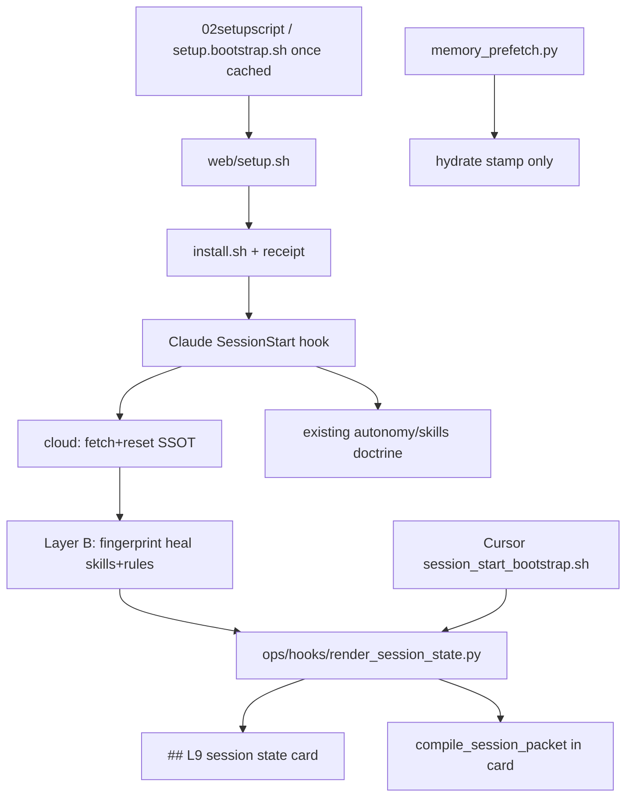

# Claude SessionStart parity (A+B)

> **plan_id:** plan.claude-code.session-parity.v1
> **status:** draft until t0 emits `docs/plans/claude_session_parity.plan.json` and `validate_plan_document.py` PASSes
> **Execute:** `make -C "$HOME/.cursor-governance" campaign INTENT=` this file. Frontmatter `todos` are the work items. Do not invent a substitute memo.

Align Claude Code startup with Cursor `/start-session`: the same **load verdict** (Layer A) and the same **loaded payload** (Layer B: governance tip, autonomy, skills, rules). Do **not** call `make start` / `session_start_bootstrap.sh` from the cloud setup paste.

**Doctrine:** `CANONICAL_LAW` §2.1 — shared brain in `ops/`, Claude wraps it. `SESSION_START_SPEC.md` already forbids new brains under the adapter.

**Depth:** deep (session-start, Graphiti, fail-open hooks, two surfaces). Router: `route_plan.py --risk high --evidence sufficient` → `deep`.

**Branch:** new worktree from `origin/main` @ `577c482cac657403fb6fb66f7f7d89e2ad6994e1`. Suggested: `feat/claude-session-parity`. Do not mix onto an unrelated dirty checkout.

## Immutable baseline

- Repository: Quantum-L9/Cursor-Governance
- SSOT lock: `origin/main` = `577c482cac657403fb6fb66f7f7d89e2ad6994e1`
- Workspace for execute: new wired worktree; do not mutate a mixed-WIP primary checkout
- On drift: stop and replan
- Overlap: stop if dirty overlaps `may_modify`

## Objective

Claude sessions open with a Cursor-shaped `## L9 session state` card (tip match, this-workspace wiring PASS/FAIL, venv, Graphiti health, hydrate `packet`/`next=`, skills/rules/autonomy loaded). After a cloud tip refresh, skill and rule mirrors heal from the new SHA so READY is not a week-old install receipt. Cursor keeps plan audit, IDE, plugins, tunnel, `.cursor-commands`. Claude omits those.

## Success properties

- SP-01: Execute worktree HEAD starts at locked `577c482…` (`repository_state`)
- SP-02: Shared renderer emits identical card **keys** for both surfaces; Claude omits plan-audit / IDE / tunnel / `.cursor-commands` (`structural`)
- SP-03: Claude hook stdout is the SessionStart JSON envelope and **starts** with `## L9 session state`; doctrine (Velocity Doctrine, skill count, receipt) still follows (`runtime_behavior`)
- SP-04: Live wiring FAIL when hook/settings/skills/rules missing **or** `receipt.workspace != CLAUDE_PROJECT_DIR`; silent `exit 0` with empty context is a test fail (`runtime_behavior`)
- SP-05: Hydrate `packet=` / `next=` or explicit `DID NOT RUN` appears **in the card**; prefetch does not become a second competing hydrate story (`runtime_behavior`)
- SP-06: Layer B heal is fingerprint-cached on `gov HEAD + skill-registry + llm-rules + workspace`; second session is no-op; does **not** call `reconcile_claude_settings.py`; fail-open; stays inside hook timeout (`filesystem` + `runtime_behavior`)
- SP-07: `python3 environment/agents/adapters/claude-code/validate_claude_env.py` PASS; `make pr-check` PASS (`quality_gate`)

## Capability preflight

- CP-01: `git rev-parse origin/main` equals locked SHA
- CP-02: locked interpreter `$HOME/.cursor-governance/.venv/bin/python3` exists
- CP-03: `ops/graphiti/hydration/compile_session_packet.py` `compile_and_format` importable
- CP-04: `worktree_add_wired.sh` available; if the worktree already exists, `ensure_workspace_wired.sh`

## Execution envelope

Write allow:
- `ops/hooks/render_session_state.py` (new) + tests under `tests/ops/hooks/`
- `ops/hooks/session_start_bootstrap.sh` (call renderer; keep Cursor-only sections)
- `environment/agents/adapters/claude-code/hooks/session_start_claude_governance.sh`
- `environment/agents/adapters/claude-code/hooks/SESSION_START_SPEC.md`
- `environment/agents/adapters/claude-code/hooks/memory_prefetch.py` (stamp-only or thin)
- `environment/agents/adapters/claude-code/hooks/session_heal_mirrors.sh` (new, or inline bounded call)
- `environment/agents/adapters/claude-code/settings.template.json` (timeout only if proven)
- `environment/agents/adapters/claude-code/web/setup.bootstrap.sh` (land WIP 8-21.2)
- `environment/agents/adapters/claude-code/validate_claude_env.py` + existing hook tests
- `environment/agents/adapters/claude-code/README.md`
- `AGENTS.md` **append-only** (Claude card pointer; no overwrite)
- `docs/plans/` plan artifacts only if execute writes them

Write deny:
- `CANONICAL_LAW.md`, `ops/hooks/session_start_bootstrap.sh` rewrite of Graphiti/tunnel brains
- `install.sh` full re-run from SessionStart
- `reconcile_claude_settings.py` from SessionStart
- `pyproject.toml` overwrite
- consumer product trees; `WIP/` except reading the 8-21.2 stub as source
- `make start` / Cursor hook invoked from setup paste

Commands allow: locked python tests, `validate_claude_env.py`, `make pr-check`, git in the isolated worktree.

Network: Graphiti HTTPS / existing tunnel for hydrate tests only. Secrets: none.

`autonomous_merge: false`

## Architecture

**Layer A — shared card.** New `ops/hooks/render_session_state.py` (locked interpreter). Inputs: surface (`cursor` | `claude-code`), workspace, gov root. Outputs markdown `## L9 session state` with:

- Governance: tip SHA, `action`/`detail`, remote match, `L9_STUB_REVISION` + `L9_GOVERNANCE_REF_STATE` when set
- Wiring: Cursor keeps `check_governance_wiring.sh`; Claude probes **this** repo: `.claude/settings.json`, committed hook file, skills mount, rules mount, `bootstrap-state.json` workspace == this project. Missing hook → `FAIL` text, not empty context
- Runtime: venv locked; Graphiti CLI `health` (HTTPS on cloud, no tunnel require); broker host resolve if URL set
- Hydrate: `ops.graphiti.hydration.compile_session_packet.compile_and_format` (same as prefetch)
- Loaded: receipt `settings`/`skills`/`rules` + “autonomy profile injected” if profile_loader returned text
- Omit on Claude: plan audit, IDE, plugins, tunnel, `.cursor-commands`, code-graph
- Keep on Cursor: existing extra sections (plan audit stays in bootstrap, not the shared core)

`session_start_bootstrap.sh` calls the renderer for the shared core, then appends Cursor-only sections.

`session_start_claude_governance.sh` emits card **first**, then existing doctrine (authority, surface profile, bounded autonomy, execution profile, skill-router, receipt block). Envelope unchanged.

**Layer B — heal after refresh.** Only when `CLAUDE_CODE_REMOTE=true` and clone refresh succeeded. Fingerprint stamp `~/.l9/claude/mirror-heal.<workspace-id>` of `gov HEAD + ops/generated/skill-registry.json + environment/generated/llm-rules + workspace`. On miss, run on locked python, quiet, fail-open:

- `ops/scripts/reconcile_claude_l9_skills.py --scope project --workspace "$CLAUDE_PROJECT_DIR"`
- `ops/scripts/project_llm_rules.py` + `ops/scripts/reconcile_llm_rule_adapters.py`

Never `reconcile_claude_settings.py`. Generated `.claude/skills/` and `.claude/rules/` are already in git `info/exclude`. Budget: default 8s; on expiry skip and print `heal: SKIPPED budget` (do not background-write into a repo the agent is using). Pattern: [`session_deps_cloud.sh`](environment/agents/adapters/claude-code/hooks/session_deps_cloud.sh) fingerprint, **not** its detach-to-background.

**Hydrate de-dupe.** Card owns the human hydrate lines. `memory_prefetch.py` keeps the memory-enforcement receipt stamp; if it also formats context, make it identical keys or stamp-only so two hooks do not contradict.

**Timeout.** First SessionStart hook is 30s in [`settings.template.json`](environment/agents/adapters/claude-code/settings.template.json). Card + optional heal must fit; raise timeout only with a measured budget note. Prefetch stays a second hook (25s).

**Setup paste.** Land [`WIP/8-21-26/claude code environment/02setupscript.sh`](WIP/8-21-26/claude code environment/02setupscript.sh) into [`web/setup.bootstrap.sh`](environment/agents/adapters/claude-code/web/setup.bootstrap.sh) so `L9_STUB_REVISION` / `L9_GOVERNANCE_REF_STATE` exist for the card. Repo bootstrap today has **no** revision stamp (older than both WIP files).

## Side effects / idempotency

- Renderer: read-mostly; hydrate may write Graphiti (same as today)
- Heal: writes excluded mirrors + stamp file; second identical fingerprint is no-op
- Cursor bootstrap: behavior-preserving except shared-core extraction
- Stub land: paste-field copy only; no live link

## Doc / root surface

- `SESSION_START_SPEC.md` — **update** (card required; hydrate via ops; heal after refresh; reconcile-settings stays install-time)
- Adapter `README.md` — **update** (card + heal)
- `AGENTS.md` — **append-only** pointer that Claude SessionStart projects the shared card (do not fold/overwrite)
- `CANONICAL_LAW.md` — N/A
- `pyproject.toml` — N/A
- Plan audit / Cursor §16 — N/A (Claude omits)

## Stress and disconfirm

- Does a 30s timeout truncate the card to empty? → budget + FAIL text if renderer missing
- Does heal rewrite tracked `.claude/settings.json` and dirty every consumer? → settings reconciler forbidden on SessionStart
- Does mobile break if renderer needs `~/.cursor`? → no Cursor paths on `surface=claude-code`
- Does double hydrate show two different `next=` values? → one formatter
- Does a READY receipt from another workspace pass the card? → wiring FAIL
- Does Cursor lose plan audit / tunnel / wiring PASS? → golden-section test on bootstrap output
- Assumed false-ifs: fail-open never hides a missing hook; fingerprint prevents rewrite storms; `compile_and_format` stays the hydrate SSOT
- Blast radius: every Claude Web/Mobile/CLI session context + Cursor sessionStart card shape
- Rollback: revert the feature branch; cloud sessions keep cached install until next environment rebuild; heal stamps are disposable under `~/.l9/claude/`

## Risks

- SessionStart fail-open + missing hook → empty load: mitigate with card FAIL and validate_claude_env asserting hook registration
- Hook timeout: fingerprint + 8s heal cap
- Adapter grows a Graphiti client: only `ops` import, `validate_claude_env.py` stays green
- KERNEL mixed with current WIP: isolated worktree from `origin/main` only

## Unknowns (bounded)

- U1: Exact timeout headroom after card+heal — **probe** on first implement worktree; raise settings timeout only if measured
- U2: Whether prefetch must remain a second `additionalContext` for the memory gate receipt — **accept_bounded**: keep hook, stamp-only if card already hydrated

## Out of scope

- Calling `/start-session` or `make start` from the setup script
- Plan audit on Claude
- IDE profile, Cursor plugins, SSH tunnel, `.cursor-commands` on Claude
- Full `install.sh` every session
- Merging PRs; force-push; `CANONICAL_LAW` rewrite
- Mixing this onto a mixed-WIP `Cursor-Governance` checkout

## Execution DAG

- W0 t0: isolate worktree + lock SHA + capability probes + emit `docs/plans/claude_session_parity.plan.json`
- W1 t1: create shared renderer + unit tests (card keys, Claude omissions)
- W1 t2: Cursor bootstrap calls renderer (depends t1)
- W1 t3: Claude hook emits card first (depends t1)
- W1 t4: Claude live wiring probe (depends t1)
- W1 t5: hydrate in card; prefetch stamp-only/align (depends t1)
- W2 t6: Layer B fingerprint heal (depends t3)
- W2 t7: land 8-21.2 stub; card projects stub/ref_state (depends t3)
- W2 t8: SPEC, validate_claude_env, hook tests (depends t3, t4, t5, t6)
- W3 t9: append-only AGENTS.md + adapter README (depends t8)
- W3 t10: `make pr-check` in worktree (depends t8, t9)

Critical path: t0 → t1 → t3 → t6 → t8 → t10

## Convergence

- status: `partial` (plan hardened; implementation not run)
- next_skill: `@environment/program-execution` via the campaign Makefile target
- stop_reason: dual-artifact JSON still required at t0; no product mutation from plan mode
- execute_via: this `.plan.md` as campaign INTENT; `autonomous_merge: false`; publish only after L4 via the Makefile PR target

## Final validation (at execute)

- `python3 skills/l9-plan/scripts/validate_plan_document.py` on the emitted JSON
- New renderer unit tests PASS
- `validate_claude_env.py` PASS
- Hook fixture: Claude stdout JSON contains `## L9 session state` and `Autonomy Velocity Doctrine`
- Cursor bootstrap still contains plan-audit / wiring / tunnel sections
- `make pr-check` PASS
