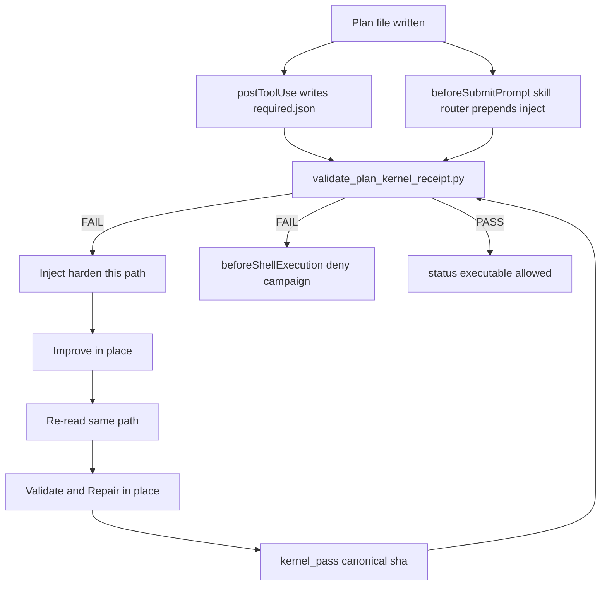

# Plan kernel auto-pass (hook + receipt)

**plan_id:** `plan.governance.plan-kernel-auto-pass.v1`
**plan_class:** `bounded_execution_contract`
**status:** `draft`
**planning_ssot:** live [`skills/l9-plan/SKILL.md`](skills/l9-plan/SKILL.md) v4 + [`ops/hooks/hooks.json.template`](ops/hooks/hooks.json.template) + [`ops/scripts/lib/cursor_plans_store.sh`](ops/scripts/lib/cursor_plans_store.sh)
**Branch:** new from `origin/main` (ff-only). KERNEL pack / hook / skill-contract landing ([`rules/46-kernel-pack-new-branch.mdc`](rules/46-kernel-pack-new-branch.mdc)). Do not mix into the dirty shared checkout.

Kernel pass: `Validate & Repair` on this plan (not on product code). Defects below were verified against `origin/main` artifacts and repaired in this document.

## Execute via @environment/program-execution + autonomy

```text
this .plan.md
  → @environment/program-execution (Blueprint → Program Lock → Controller)
  → @autonomy (/autonomy → l9-bounded-autonomy)  [subordinate]
  → PE adapter (cursor-foreground)
```

`autonomous_merge: false`. Publish only via `PR_REMEDIATE=0 make pr` after L4 kernels on the **code** tree (Alignment + Validate & Repair). Those L4 kernels are not this feature.

## Why (verified)

Live `/l9-plan` Compact Workflow stops at JSON validate + project markdown. It never applies kernels. [`docs/plans/BUILT/l9-plan_kernel_pipeline_33bef316.plan.md`](docs/plans/BUILT/l9-plan_kernel_pipeline_33bef316.plan.md) marked a five-kernel pipeline complete; [`skills/l9-plan/references/kernel-pass-pipeline.md`](skills/l9-plan/references/kernel-pass-pipeline.md) does not exist. v4 PE rewrite dropped that path.

[`validate_plan_document.py`](skills/l9-plan/scripts/validate_plan_document.py) is format/schema. It misses `etc.` and unresolved exclusive locks. Manual `Validate & Repair` on a plan finds those. Skill sentences will be skipped.

L4 analog: kernels are LLM procedures; what **fires** is [`beforeShellExecution`](ops/hooks/l4-local-execution-gate-shell.sh) + deny without receipt. Copy that pattern. Do **not** copy honor-system [`record_kernels`](ops/autonomy/l4_local.py) (`passed` asserted by the agent).

## Defects this kernel found in the prior plan (repaired)

- **Self-invalidating digest.** `body_sha256` of the whole file including `kernel_pass.*.body_sha256` changes when the receipt is written. Same class of defect as a kernel digest checked before writers. **Repair:** canonical sha is SHA-256 of UTF-8 file bytes after every `body_sha256` scalar is replaced with the 64-character zero digest `0000000000000000000000000000000000000000000000000000000000000000`. Checker uses the same canonicalize. Writing the receipt does not invalidate itself. Any other edit does.
- **`pec.py` deny.** Live [`pec.py`](environment/program-execution/core/program-execution-controller-template/scripts/pec.py) is the PE controller worker inside an admitted campaign. Denying it would fail admitted tasks. Live publish/execute front door is Makefile `campaign` → [`run_campaign.py`](environment/program-execution/scripts/run_campaign.py). **Repair:** deny `make campaign` and `run_campaign.py` only. Never deny `pec.py`.
- **Newest-unbuilt execute latch.** SessionStart already lists many unbuilt plans in a 7-day window. Denying campaign because an unrelated plan is unhardened blocks honest campaign work. `make campaign` takes `INTENT=`, not a `.plan.md`. **Repair:** deny only when `$WS/.l9/plan/kernel-pass-required.json` names a path that still FAILs, or when argv contains a `.plan.md` that FAILs. Otherwise allow.
- **`postToolUse` inject.** No live `postToolUse` hook emits `additional_context`. [`before_submit_skill_router.py`](ops/hooks/before_submit_skill_router.py) already does, and Cursor’s documented beforeSubmitPrompt fields are `continue` / `user_message` / `additional_context`. A second beforeSubmitPrompt emitter can overwrite the first. **Repair:** `postToolUse` writes `kernel-pass-required.json` only. Inject is prepended onto the existing skill-router `additional_context`. Do not add a second beforeSubmitPrompt command.
- **Required `kernel_pass` on PLAN_DOCUMENT JSON.** [`plan-document.schema.json`](skills/l9-plan/schemas/plan-document.schema.json) is `additionalProperties: false` and fixtures have no `kernel_pass`. Requiring it breaks `self_test.py`. **Repair:** receipt lives on `.plan.md` frontmatter only. Do not add required `kernel_pass` to that JSON schema.
- **`G_PLAN_DIGEST_WRITER` regex.** No deterministic pattern detects digest-vs-writer contradictions in arbitrary prose without false positives (fake validation). **Repair:** drop that gate ID. Canonical sha is the digest-writer repair.
- **Placeholder examples.** Receipt samples used `…` and `<RFC3339>`, which this feature’s own `G_PLAN_ETC` would fail. **Repair:** samples below use concrete values.
- **Same-slug both FAIL.** Audit already treats the older same-slug file as `superseded`. Failing the newer file because a sibling exists blocks the live target. **Repair:** older same-slug file is superseded and ignored by execute/inject; newer file is the bound target.
- **“This session” mtime.** Session start is not a machine clock the hook has. **Repair:** unbuilt `*.plan.md` under the plans store with mtime within 120 minutes that fail the checker. Newest failing path only.

## Locked contracts

- **Kernel pair:** `kernels/Improve.md` then independently `kernels/Validate & Repair.md`. Not Alignment. Not a five-kernel pipeline.
- **One artifact:** the bound Cursor `.plan.md`. Plans store is `realpath($HOME/.cursor/plans)` (today that is this repo’s [`docs/plans/`](docs/plans/) via [`cursor_plans_store.sh`](ops/scripts/lib/cursor_plans_store.sh)). Draft, Improve, and V&R overwrite that path. Forbidden: `_v2`, `_improved`, a second CreatePlan, chat-only revised plan, JSON as a second SSOT.
- **Independent bind:** after Improve writes, V&R re-reads the file from disk and binds the same path.
- **Enforcement:** hooks plus machine receipt. SKILL.md may point at the gate in one line. Pointer is not the gate.
- **Receipt:** frontmatter `kernel_pass` on that same file. Checker PASS requires canonical V&R sha == canonical current file sha.
- **Fake stamp:** empty `deltas` is FAIL.
- **`status: executable` illegal** when the checker FAILs.
- **Do not** rewrite `environment/program-execution/core/`. Do not edit `kernels/*`.
- **Cursor Build** is not a shell command. Build-path control is inject plus illegal `executable`. That limit is accepted.
- **`make campaign` without a plan path** is not plan-Build. Execute deny is the required.json latch plus argv `.plan.md`. That limit is accepted.



## Exclusive owned_paths

| Area | Paths |
|---|---|
| Receipt + quality | new [`skills/l9-plan/scripts/validate_plan_kernel_receipt.py`](skills/l9-plan/scripts/validate_plan_kernel_receipt.py), [`skills/l9-plan/scripts/self_test.py`](skills/l9-plan/scripts/self_test.py), [`skills/l9-plan/references/plan-quality-gates.md`](skills/l9-plan/references/plan-quality-gates.md), new fixtures under [`skills/l9-plan/fixtures/`](skills/l9-plan/fixtures/) |
| Template | [`environment/contracts/execution/templates/canonical.template.executable_plan.v1.plan.md`](environment/contracts/execution/templates/canonical.template.executable_plan.v1.plan.md) and `.meta.md` version bump only |
| Skill / command pointer | [`skills/l9-plan/SKILL.md`](skills/l9-plan/SKILL.md), [`skills/l9-plan/references/plan-workflow-pe-autonomy.md`](skills/l9-plan/references/plan-workflow-pe-autonomy.md), [`commands/l9-plan.md`](commands/l9-plan.md) |
| Detect | new `ops/hooks/plan_kernel_gate.py`, [`ops/hooks/before_submit_skill_router.py`](ops/hooks/before_submit_skill_router.py) |
| Execute deny | new `ops/hooks/plan-kernel-execute-gate.sh` |
| Install | [`ops/hooks/hooks.json.template`](ops/hooks/hooks.json.template), [`ops/scripts/setup_workspace_symlinks.sh`](ops/scripts/setup_workspace_symlinks.sh), [`ops/scripts/check_governance_wiring.sh`](ops/scripts/check_governance_wiring.sh) |
| Audit | [`skills/l9-plan-audit/scripts/audit_plans.py`](skills/l9-plan-audit/scripts/audit_plans.py), [`skills/l9-plan-audit/references/staleness-rules.md`](skills/l9-plan-audit/references/staleness-rules.md), [`skills/l9-plan-audit/scripts/self_test.py`](skills/l9-plan-audit/scripts/self_test.py) |
| Docs | [`AGENTS.md`](AGENTS.md) append-only |

Do not edit [`skills/l9-plan/scripts/validate_plan_document.py`](skills/l9-plan/scripts/validate_plan_document.py) or [`skills/l9-plan/schemas/plan-document.schema.json`](skills/l9-plan/schemas/plan-document.schema.json). Do not edit `kernels/`, PE `core/`, [`ops/autonomy/l4_local.py`](ops/autonomy/l4_local.py), or [`ops/autonomy/local_execution_gate.py`](ops/autonomy/local_execution_gate.py).

## Receipt schema (frontmatter on the one file)

```yaml
kernel_pass:
  bound_path: docs/plans/example_aaaaaaaa.plan.md
  improve:
    kernel: kernels/Improve.md
    ran_at: 2026-08-21T05:14:00Z
    body_sha256: "0000000000000000000000000000000000000000000000000000000000000000"
    deltas: ["no material delta"]
  validate_repair:
    kernel: kernels/Validate & Repair.md
    ran_at: 2026-08-21T05:17:00Z
    body_sha256: "0000000000000000000000000000000000000000000000000000000000000000"
    deltas: ["no material delta"]
```

Template stub uses these keys with empty `deltas` omitted and both `body_sha256` unset. Unset sha is FAIL. Do not ship `passed` or `Applied` in the template.

Checker FAIL unless:

- `bound_path` basename equals this filename
- both passes present
- Improve `ran_at` < V&R `ran_at`
- canonical V&R sha equals canonical current file sha
- each `deltas` has at least one nonempty string
- `status` is not `executable` when any rule above fails
- no older same-slug sibling is treated as the live target (newer mtime wins)

Deterministic content gates in the same script:

- `G_PLAN_ETC`: `etc.`, Unicode ellipsis, or `and similar` in a line that also matches `owned_paths` or `exclusive`
- `G_PLAN_EITHER_OR`: `either`, `drop or keep`, or `fold or exempt` in the body without a following `blocker`

## Hook wiring (must fire)

Reuse events already in [`ops/hooks/hooks.json.template`](ops/hooks/hooks.json.template). [`setup_workspace_symlinks.sh`](ops/scripts/setup_workspace_symlinks.sh) appends unknown template commands into `~/.cursor/hooks.json`.

1. **`postToolUse`** matcher `Write|StrReplace|search_replace|ApplyPatch` → `plan_kernel_gate.py`. If the written path is `*.plan.md` under `realpath($HOME/.cursor/plans)`, run the checker. On FAIL write `$WS/.l9/plan/kernel-pass-required.json` with that single path. Do not emit `additional_context` here.
2. **`beforeSubmitPrompt`** (existing [`before_submit_skill_router.py`](ops/hooks/before_submit_skill_router.py), not a new command): if `kernel-pass-required.json` names a failing path, or the newest unbuilt store plan with mtime younger than 120 minutes fails the checker, prepend the inject block to `additional_context`, then append the route text. Routing exceptions stay fail-open. Checker exception prepends `kernel_pass checker degraded; treat plan as unhardened` and still `continue: true`.
3. **`beforeShellExecution`** → `plan-kernel-execute-gate.sh`. Deny `{"permission":"deny","user_message":"..."}` when the command matches `make campaign` or `run_campaign.py` and (`kernel-pass-required.json` path FAILs or argv contains a `.plan.md` that FAILs). Allow `make pr-check`, `make campaign-check-input`, and `pec.py`.
4. **`sessionStart` plan audit** (already runs [`audit_plans.py`](skills/l9-plan-audit/scripts/audit_plans.py)): add flag `kernel_unfired`. Stay fail-open for bootstrap. Display-only. Do not auto-Build.

Install pairs in the `for pair in` loop in [`setup_workspace_symlinks.sh`](ops/scripts/setup_workspace_symlinks.sh):

- `plan_kernel_gate.py:plan-kernel-gate.py`
- `plan-kernel-execute-gate.sh:plan-kernel-execute-gate.sh`

Assert those two commands in [`check_governance_wiring.sh`](ops/scripts/check_governance_wiring.sh) the same way `before-submit-skill-router.py` is asserted. Do not add a third beforeSubmitPrompt command.

Inject text is fixed:

> Apply `kernels/Improve.md`, overwrite this path, re-read it, apply `kernels/Validate & Repair.md`, overwrite the same path, write `kernel_pass` into this file. Do not create another plan.

## Skill / command (pointer only)

In Compact Workflow, after project, add one step: ready only when `validate_plan_kernel_receipt.py` PASS on the bound `.plan.md`. Resource Map + Validation fenced block must list that script so [`self_test.py`](skills/l9-plan/scripts/self_test.py) `INVOKED` parity holds. [`commands/l9-plan.md`](commands/l9-plan.md) mirrors the same one-liner. Do not restore a five-kernel pipeline or `ccp-plan-patterns.md`.

Hook tests: `python3` fixtures next to `ops/hooks/plan_kernel_gate.py` (stdin JSON → writes required.json / no additional_context) and a unit function in `before_submit_skill_router.py` that prepends inject. No new pytest tree under `tests/ops/hooks/` (none exists on `origin/main`).

## Out of scope

- Running Improve or V&R as a Python subprocess
- Five-kernel pipeline / Recursive Alignment on plans
- Changing L4 tree kernels or `l4_local.py` or `local_execution_gate.py`
- PE Controller core / `pec.py` / campaign runner rewrite
- Making Cursor Build a shell-deny
- Dual-artifact JSON as a second human deliverable
- Requiring `kernel_pass` on `plan-document.schema.json`
- Auto-Build from sessionStart audit
- Editing `kernels/*`
- Denying campaign because an unrelated 7-day unbuilt plan exists

## Stress and disconfirm

- Disconfirm: a plan written only by Cursor Plan UI (no Write tool) still gets beforeSubmitPrompt inject when mtime is within 120 minutes and the checker FAILs.
- Disconfirm: agent stamps `kernel_pass` without a matching canonical sha → FAIL.
- Disconfirm: writing `kernel_pass` with canonical sha does not FAIL (sha fields zeroed before hash).
- Disconfirm: older same-slug file is ignored; newer file can PASS.
- Disconfirm: `make campaign INTENT=foo.md` with no required.json and no argv `.plan.md` is allowed.
- Disconfirm: `pec.py claim` is allowed during an admitted campaign.
- Assumed false if: Cursor drops `additional_context` on beforeSubmitPrompt (then required.json + shell deny still hold).
- Blast radius: new and recently edited plans in the store; existing unbuilt plans get `kernel_unfired` at next sessionStart; campaign denied only when this feature has latched a failing path.
- Rollback: revert the two new hook template entries, the skill-router prepend, and the install pairs. Checker unused. Old plans remain valid documents, flagged only.

## Success properties

- A Write of a store `.plan.md` without a valid `kernel_pass` writes `.l9/plan/kernel-pass-required.json` (fixture test of `plan_kernel_gate.py` stdin JSON).
- `beforeSubmitPrompt` with that required.json prepends the inject block even when no tool wrote the file this turn.
- `make campaign` / `run_campaign.py` is denied when required.json names a failing path; `make pr-check` and `pec.py` are not.
- Checker FAIL on `etc.` in an owned_paths line, `drop or keep` without blocker, empty deltas, sha mismatch.
- Checker PASS when the only change from a prior PASS is filling `body_sha256` via canonicalize.
- `audit_plans.py` emits `kernel_unfired` for failing unbuilt plans.
- `make pr-check` PASS on this change set. `git diff -- kernels` empty.

## Doc / Root Surface Impact

- [`AGENTS.md`](AGENTS.md): append-only — plan kernel pass is hook-enforced; audit flag `kernel_unfired`; one-file in-place rule; canonical sha definition.
- Skill + `/l9-plan` command: pointer + Validation list parity.
- Template SSOT: pending `kernel_pass` keys in frontmatter. Re-run [`sync_cursor_plan_template.py`](skills/l9-plan/scripts/sync_cursor_plan_template.py) so `_TEMPLATE.plan.md` matches.

## Final validation

- `python3 skills/l9-plan/scripts/validate_plan_kernel_receipt.py` on pass/fail fixtures
- `python3 skills/l9-plan/scripts/self_test.py`
- `python3 skills/l9-plan-audit/scripts/self_test.py`
- Hook fixtures: required.json write; skill-router prepend; execute-gate deny/allow cases
- `make pr-check` (changed files only)

## Handoff

After local finish: L4 Alignment + Validate & Repair on the **implementation tree**, `l4_local.py record-kernels` → `authorize-release` → `PR_REMEDIATE=0 make pr`. Do not merge from this path.
