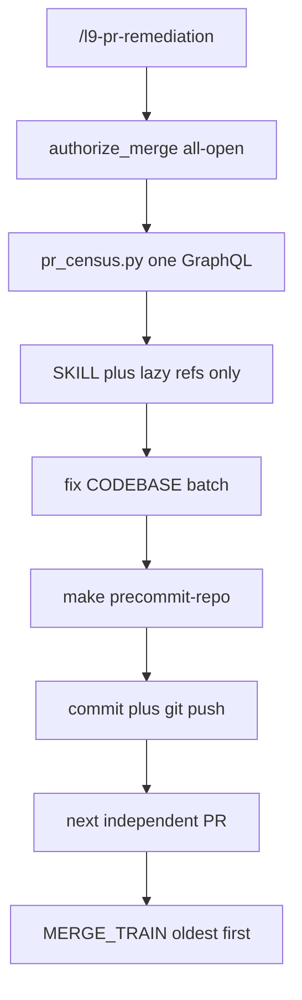

# Remediator remaining speed (4.4.0)

**kind:** `simple` · **execute_via:** `cursor-build` · **skill:** `l9-plan-simple`

## Execute via Cursor Build

Press **Build**. All mutation, commits, `self_test`, and `make pr-check` run in the **existing** worktree:

`/Users/ib-mac/.l9/gov-worktrees/cursor__stop-gen-snap-v2`

Branch: `agent/cursor/stop-gen-snap-v2` @ `8f20b186` (already contains remediator 4.3.0 / `#348`). `git worktree list` first; reuse that path. Do not `git worktree add`. Do not open a tip worktree from `origin/main`. Do not run `make campaign`. Do not admit a Program Lock. Do not write `Lock: origin/main = <sha>`.

**Collision lock (hard).** Other agents just updated the same skill elsewhere. This Build MUST NOT write these trees:

- `/Users/ib-mac/Cursor-Governance` (primary clone)
- `$HOME/.l9/gov-worktrees/pr-remediator-speed`
- `$HOME/.l9/gov-worktrees/stop-generated-merge-conflicts`

Read and edit `skills/l9-pr-remediation/**` and `commands/l9-pr-remediation.md` only under `cursor__stop-gen-snap-v2`. Do not copy bytes from the primary clone onto this branch. Do not merge `main` into this branch as a planning step.

## Reasoning (why this plan, not another 4.3.0)

**Abductive.** [`docs/plans/built/pr_remediator_speed_c4b0d4ae.plan.md`](docs/plans/built/pr_remediator_speed_c4b0d4ae.plan.md) already removed `make pr` / `make pr-check` / CI poll from Converge. Live pack is 4.3.0. Remaining stall is not the Makefile ceremony. It is (1) leftover **positive** “gate is `pr-check`” in files that 4.3.0 did not rewrite, (2) 8+ serial `gh` calls per PR before the first edit, (3) SKILL.md telling the agent to Load five+ refs (~2.9k reference lines) before first CODEBASE work.

**Deductive.** If [`skills/l9-pr-remediation/references/fix-engine.md`](skills/l9-pr-remediation/references/fix-engine.md) still says “When a Makefile exists, the public local gate **is** `pr-check`,” an agent that follows that file violates SKILL 4.3.0 Law 7. GraphQL `reviewThreads` already carries author/path/line/`isResolved` — REST reviews + comments + issue comments are redundant for Converge ingest. Merge authorization on `/l9-pr-remediation` is not a stall; stripping it would be the same mistake Improve already rejected.

**Inductive.** Two prior speed landings (v4 run-contract, 4.3.0 remediator verbs) both won by deleting duplicated ceremony copy and adding one contract. The repeating defect is leftover copies in files that were not in that commit’s pathspec. Deterministic fetchers already exist (`sonar_fetch.py`, `codeql_fetch.py`, `debt_audit.py`); census is the missing one.

**Confidence:** high on leftover-copy and serial-ingest (text is in tree). Timing of live runs is Unknown — optimize the documented waste paths, do not invent a minute-budget.

**Locked:** merge stays on. Ceremony Makefile stays out. Pytest/conformance stay on CI.



## Immutable baseline

- **Exclusive workspace:** `/Users/ib-mac/.l9/gov-worktrees/cursor__stop-gen-snap-v2`
- Branch: `agent/cursor/stop-gen-snap-v2`
- Commit: `8f20b186fa0459a5fdc97042b54b93abfe042576` (`Stop sibling PRs colliding on the full generated snapshot.`)
- Skill on this tree: `l9-pr-remediation` **4.3.0**, ancestor of `#348`, no local dirty on the pack
- Dirty: false on the remediator pack. Overlap policy: `stop_if_dirty_overlaps_may_modify`. Pathspecs only.
- Do not lock `origin/main`. Do not switch this worktree to another branch. Do not use the primary clone as the Build cwd.

## Objective

Cut remediator **time-to-first-useful-action** and token load without changing merge authority, codebase-only edits, or the 4.3.0 verify/publish verbs.

Success is falsifiable:

- No live (unnegated) “public local gate is `pr-check`” in the pack.
- Converge ingest for inventory + unresolved threads is one scripted GraphQL census, not 8 serial `gh` commands.
- SKILL.md 4.4.0 names required vs lazy refs; Sonar/CodeQL/debt/review-angles load only when that check is failing or the user asked.
- `scripts/self_test.py` PASS on 4.4.0 needles.
- `make pr-check` PASS on this change set (this plan’s quality gate, not the remediator path).

## Scope in

- [`skills/l9-pr-remediation/SKILL.md`](skills/l9-pr-remediation/SKILL.md) → 4.4.0
- Leftover ceremony-as-positive: [`references/fix-engine.md`](skills/l9-pr-remediation/references/fix-engine.md), [`references/signal-ingestion.md`](skills/l9-pr-remediation/references/signal-ingestion.md), diagnose completeness checklist
- New [`skills/l9-pr-remediation/scripts/pr_census.py`](skills/l9-pr-remediation/scripts/pr_census.py) + stdlib tests in `self_test.py` (fixture JSON, no live GitHub)
- Diagnose + run-contract + code-review-agents: census is ingest SSOT; REST comment/review fetches are fallback only when GraphQL is incomplete
- Short independent-PR recipe (reuse `git worktree list`; serialize merge)
- [`commands/l9-pr-remediation.md`](commands/l9-pr-remediation.md) one-line census step
- `sync_generated_artifacts.py --force` for skill-registry companions after version/description change

## Scope out

- Makefile `pr` / `pr-check` rewrite; ceremony phase two
- Stripping merge=true / FIRST_MERGE_GATE / any-author thread resolve
- Weakening CI, workflows, ruff, or conversation resolution
- Loading kernels mid-run
- Remediating leftover open PRs in this Build
- [`docs/plans/built/pr_remediator_speed_c4b0d4ae.plan.md`](docs/plans/built/pr_remediator_speed_c4b0d4ae.plan.md) (already built)
- AGENTS.md (already has `L9_PR_REMEDIATE_SPEED_V1`); CLAUDE.md / CANONICAL_LAW.md / README.md
- Any edit on the primary clone, `pr-remediator-speed`, or `stop-generated-merge-conflicts`
- Creating a new worktree / branch for this plan

## Pack edits

**Kill leftover ceremony-as-positive.** [`fix-engine.md`](skills/l9-pr-remediation/references/fix-engine.md) lines 49–68 still say the public gate **is** `pr-check` and cache a `name: "pr-check"` command that runs `make precommit-repo`. Replace with remediator verify=`make precommit-repo`. Delete `cat .github/workflows/*.yml` as a default step in [`signal-ingestion.md`](skills/l9-pr-remediation/references/signal-ingestion.md). Completeness checklist must not require recording ceremony `pr-check` / `pr` as this skill’s verbs. Workflow YAML parse stays leftover-only when no Makefile `precommit-repo` exists.

**Census script.** One stdlib Python CLI, same pattern as `sonar_fetch.py`:

```bash
"${GOV_PY:-$PWD/.venv/bin/python}" skills/l9-pr-remediation/scripts/pr_census.py \
  --repo {owner}/{repo} --output "$PWD/.l9/pr/census.json"
```

One GraphQL query (paginate PRs and `reviewThreads`): number, createdAt, base/head, files[].path, stack parent/child, unresolved threads (id, isResolved, author, path, line, body). Cap documented (e.g. 50 open PRs, 100 threads/page). Do not print tokens. Do not download patches. `gh pr checks` stays per-PR and only for the PR about to be edited, and only when rollup is already red.

**SKILL 4.4.0 load-order.** Add a table, not a dump:

- Always: SKILL.md + `pr_census.py` + `run-contract.md` (or the census JSON filling RUN_CONTRACT) + ownership when about to edit
- Per edited PR: finding-classifier + fix-engine (after dispositions)
- After publish: review-replies
- Lazy: sonar / codeql / debt / review-angles / generated-heal — only when that check is failing, marker present, or user asked
- Diagnose-only: census + diagnose-workflow output; stop

Hot path 0: authorize → census → emit RUN_CONTRACT from the JSON. Do not `gh pr view --json files` in a loop. Do not Load merge-advise before MERGE_TRAIN.

**Independent PRs.** After overlap matrix: empty file overlap and not stacked → may remediate on separate already-wired worktrees (Task spawn allowed). Merge stays serial, oldest `createdAt` first. Do not invent a scheduler.

## Doc / root

- AGENTS.md / CLAUDE.md / README.md / CANONICAL_LAW.md: N/A
- Command file: add census as step 3 (before venv fingerprint is fine; venv stays once)

## Stress / leverage

- Disconfirm: if agents still run `make pr-check` after leftover copy is gone, the load-order table failed — thicken SKILL hot path 1, not the Makefile.
- If census GraphQL complexity-fails, paginate; do not fall back to `cat` all workflows.
- Assumed false if: merge=true is removed “for speed”; census prints secrets; foreign dirty on this tree is staged; Build writes the primary clone or a sibling remediator worktree.
- Blast radius: `/l9-pr-remediation` / `/pr` Diagnose ingest only, and only on `agent/cursor/stop-gen-snap-v2`. Ceremony publish unchanged. Sibling skill PRs stay untouched.
- Rollback: revert the skill pack, command, generated registries **in this worktree only**.
- Shared cause: leftover ceremony-as-positive + serial hand-rolled `gh` + mandatory ref Load. Rank: stale copy > census script > load-order table > parallel recipe.
- Deletions: default workflow-YAML dump; duplicate REST comment/review/issue-comment fetches when GraphQL succeeded.

## Critical path

`bind-existing-worktree` → `kill-stale-ceremony` → `census-script` → `load-order-skill` → `self-test-wire` → `prove`

## Envelope

- **cwd:** `/Users/ib-mac/.l9/gov-worktrees/cursor__stop-gen-snap-v2` for every write and every gate
- **write_allow:** `skills/l9-pr-remediation/**`, `commands/l9-pr-remediation.md`, generated skill-registry companions after `--force` (paths relative to that worktree)
- **write_deny:** Makefile, `.github/workflows/**`, AGENTS.md, kernels, leftover open-PR branches, foreign dirty paths, the primary clone, sibling worktrees listed above
- **commands allow:** pack `self_test.py`, `sync_generated_artifacts.py --force`, `make pr-check` (all with that worktree as cwd)
- **commands deny:** `make pr` as remediator, `gh run watch`, force-push, `--admin`, `git add -A`, `git worktree add`, `git switch` on this tree

## Final validation

- `pwd` / `git rev-parse --show-toplevel` equals `/Users/ib-mac/.l9/gov-worktrees/cursor__stop-gen-snap-v2`
- `python3 skills/l9-pr-remediation/scripts/self_test.py` → PASS (in that tree)
- `make pr-check` PASS on this change set (plan quality gate, same tree)
- No live `make campaign` / Program Lock in this plan file
- Primary clone and sibling remediator worktrees have no new remediator-pack dirt from this Build
