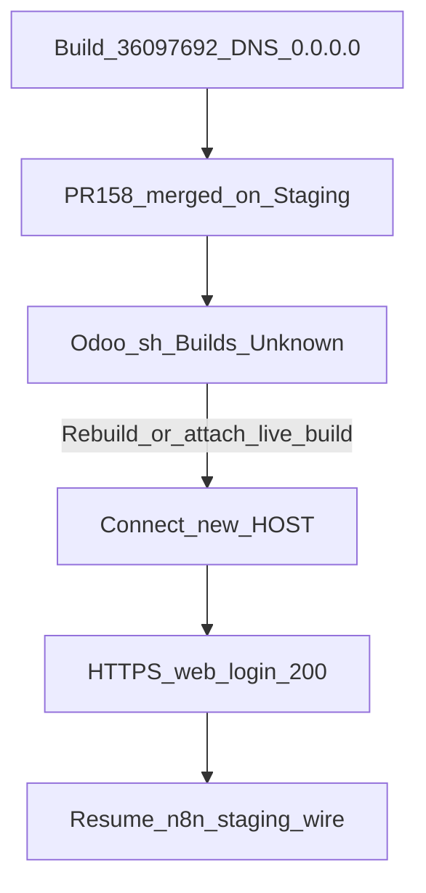

# PLAN: Staging wake + HOST re-resolve (then n8n wire)

> **Diagnose First applied** — evidence below is binding; do not re-poll tombstone host as “warming up.”
> **Execute via Cursor Build** — current checkout. Do not run `make campaign`. Do not admit a Program Lock. Do not write `Lock: origin/main = <sha>`. Do not require a new tip worktree.
> **kind:** `simple` · **execute_via:** `cursor-build`
> **Unblocks:** [docs/plans/n8n_odoo_staging_wire_68fb4a6a.plan.md](docs/plans/n8n_odoo_staging_wire_68fb4a6a.plan.md) (CP-03)

## Diagnosis (trusted evidence)

| Fact | Evidence |
|------|----------|
| Staging tip is wake merge | `Staging` @ `fb50133` — “chore: wake Odoo.sh Staging… (#158)” merged 2026-08-29T03:45:41Z |
| Build `36097692` is dead | A=`0.0.0.0`; HTTPS connect fail (not HTTP 5xx) |
| Production alive | `https://cryptoxdog-ib-odoo-19.odoo.com/web/login` → 200 |
| `.env.local` still points at tombstone | `ODOO_SH_STAGING_*` → `…-staging-36097692…` ([IB-Odoo `.env.local`](file:///Users/ib-mac/IB-Odoo_19%20(LOCAL)/IB-Odoo_19/.env.local)) |
| Odoo.sh staging status missing on wake SHA | `GET …/commits/fb50133…/status` → `total_count: 0` (no `ci/odoo.sh (staging)`). Per [IB-Odoo AGENTS.md](file:///Users/ib-mac/IB-Odoo_19%20(LOCAL)/IB-Odoo_19/AGENTS.md) that context should appear on Staging commits **unless** status token was cleared — so **Unknown**: webhook silent vs statuses disabled |
| Prior agent bug | 12 min poll of `36097692` treated `0.0.0.0` as warm-up; build IDs rotate on rebuild ([`98-odoo-sh-staging.mdc`](file:///Users/ib-mac/IB-Odoo_19%20(LOCAL)/IB-Odoo_19/.cursor/rules/98-odoo-sh-staging.mdc)) |

**Root cause (verified):** Live Staging endpoint is not the tombstone hostname. Merge of #158 did **not** produce a verified reachable Staging HTTPS endpoint on `36097692`. Whether a **new** build exists under another build id is **Unknown until Builds/Connect is read**.

**Causal chain:** Dropped/stopped staging build → DNS `0.0.0.0` → empty-commit merge assumed wake → poll old HOST forever → CP-03 never passes → n8n wire blocked.

## Decisions (closed)

| Topic | Decision |
|-------|----------|
| Wake method | **Odoo.sh UI Rebuild / Connect** at `https://www.odoo.sh/project/cryptoxdog-ib-odoo-19` — **not** another empty-commit PR until Builds shows no build for tip |
| `0.0.0.0` meaning | **DEAD_BUILD** — fail closed after ≤2 probes; never sleep-loop |
| HOST SSOT | Update gitignored IB-Odoo `.env.local` from Connect; optionally sync snapshot table in `98-odoo-sh-staging.mdc` |
| SSH on `0.0.0.0` | Skip — localhost false positive |
| After Staging up | Resume n8n Cognito→Staging wire (same Build session): named cred, staging URL, AWS backup+upsert, one prove |
| Secrets | No values in git/chat; AWS SM + n8n API via machine IAM / redacted scripts |

## Success properties

| id | property |
|----|----------|
| SP-01 | Odoo.sh Staging has a **non-dropped** build for tip (or Rebuild completed) with Connect host ≠ `36097692` **or** proven same id with real A record |
| SP-02 | `dig` A for Connect HOST ≠ `0.0.0.0`; `https://HOST/web/login` → **200** |
| SP-03 | `.env.local` `ODOO_SH_STAGING_SSH` / `URL` match Connect; API URL = `https://HOST/api/v1/cognito-webhook` |
| SP-04 | n8n WF `5NjFkIFOBDWsMLyk` published POST URL host = Staging HOST; **no** inline `Bearer ` in workflow JSON; `decodePossiblyBufferedJson` kept |
| SP-05 | Staging cognito-webhook Bearer → ok/success + `web_lead_id`; one fresh n8n exec `odooStatus=success` |
| SP-06 | AWS `openclaw-igorbot/odoo-web-lead` VersionId backed up then upserted for staging `api_url`/`environment` |

## Todos (Build)

1. **todo-01-diagnose-builds** — Open Odoo.sh project Staging → Builds for tip `fb50133` (or latest Staging). Record build id, status (building/success/failed/dropped), Connect host. If `ci/odoo.sh (staging)` statuses are disabled, rely on UI only. **No mutation.**

2. **todo-02-rebuild-or-attach** — If no live success/building build: click **Rebuild** on Staging (or start stopped DB). Wait until Connect shows a host. Do **not** open another wake PR unless UI shows zero builds and Rebuild is unavailable.

3. **todo-03-resolve-host** — Write Connect into IB-Odoo `.env.local` (`ODOO_SH_STAGING_SSH`, `ODOO_SH_STAGING_URL`). Derive `API_URL=https://HOST/api/v1/cognito-webhook` (strip `/odoo`). Prove SP-02. Sync `98-odoo-sh-staging.mdc` snapshot if build id changed.

4. **todo-04-staging-key** — On Staging SSH/DB: ensure `plasticos.web.lead.config.api_key` exists; prove Bearer cognito-webhook → success + `web_lead_id` (prefix-only logs). Backup prior AWS VersionId first when writing SM.

5. **todo-05-n8n-retarget** — Publish WF hop to Staging API URL; named credential (Header Auth fallback); remove inline Authorization; keep normalizer.

6. **todo-06-aws-prove-converge** — Upsert `openclaw-igorbot/odoo-web-lead` for staging after VersionId backup; one deduped webhook prove; scoped-commit registry if needed; `make precommit-repo` on gov paths touched. Cursor: stop before `make pr` unless human typed it.

## Envelope

- **may_modify:** Odoo.sh Staging build state (Rebuild), IB-Odoo `.env.local` (gitignored), `98-odoo-sh-staging.mdc` snapshot, n8n WF `5NjFkIFOBDWsMLyk`, AWS `openclaw-igorbot/odoo-web-lead`, Cursor-Governance registry YAML if keys change
- **must_not:** Production as active Cognito destination; force-push; secrets in git; strip `decodePossiblyBufferedJson`; poll `36097692` as warm-up; another empty Staging PR while Builds is unread
- **rollback:** Odoo.sh prior build if listed; SM previous VersionId; n8n prior `versionId` `f56ead2c-b617-4299-87c8-4827204ea083`; revert `.env.local` from backup copy

## Stress

- Statuses disabled → UI is SSOT (do not infer “no deploy” from empty GitHub statuses alone)
- Rebuild rotates build id → must update `.env.local` before n8n publish
- Publishing Staging URL while HOST still `0.0.0.0` → breaks live Cognito form — gate on SP-02 first
- Cred attach 403 → header-auth named cred, still no inline secrets

## Out of scope

Prod cutover; Cognito redesign; PE/campaign; Cosmetic n8n node renames; Fixing IB-Odoo `Regenerate repo-index` failure on merge commit unless it blocks Staging.

## Handoff

After SP-02..SP-06: Staging is the sole active Odoo hop for WF `5NjFkIFOBDWsMLyk`; n8n staging wire plan CP-03 cleared. Next human step only if Odoo.sh login is unavailable to the Build agent — then paste Connect string and re-run from todo-03.
