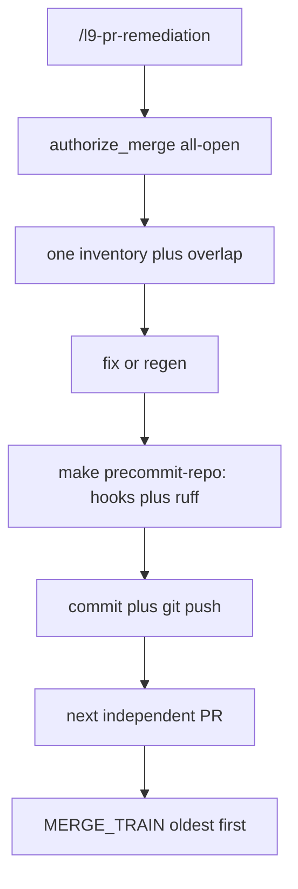

# PR remediator speed contract

**kind:** `simple` · **execute_via:** `cursor-build` · **skill:** `l9-plan-simple`

Press **Build**. Current checkout. Do not run `make campaign`. Do not admit a Program Lock. Do not write `Lock: origin/main = <sha>`. Do not open a tip worktree as a planning requirement. Do not touch leftover open PRs in this Build. Do not implement [`docs/plans/ceremony_phase_two_9d8aa92f.plan.md`](docs/plans/ceremony_phase_two_9d8aa92f.plan.md).

## Why the last draft was wrong

Improve against the user's correction: the previous revision of this same file treated merge as a second verb and kept `make pr` for source fixes. That is the ceremony the remediator must not run.

`/l9-pr-remediation` **keeps merge=true**. Campaigns and `make pr` stay no-merge. Remediation is a different animal, and merge authority is the distinction. Do not strip it.

Local remediator verify is **not** `make pr-check` and **not** `make pr`. It is the basic changed-file precommit pipeline that already includes ruff: [`ops/scripts/run_pr_precommit.sh`](ops/scripts/run_pr_precommit.sh) via `make precommit-repo`. That run is hooks on changed files plus locked `ruff check` and `ruff format --check`. It does not run pytest. It does not run peer-execution conformance. CI owns those.

Then: one commit, `git push` the existing PR branch, next independent PR, then `MERGE_TRAIN` (already authorized). No wait for CI.

The live skill **forbids** that path today:

- Law 7 + hot path 5: `make pr-check` blocks commit (pytest, security, wiring)
- Law 8 + [`skills/l9-pr-remediation/references/convergence-loop.md`](skills/l9-pr-remediation/references/convergence-loop.md): poll 15s, max 8 minutes, `gh run watch`
- [`skills/l9-pr-remediation/references/run-contract.md`](skills/l9-pr-remediation/references/run-contract.md) `P_cmd`: remediator `git push` is a skill defect
- Hot path 6: publish is `PR_REMEDIATE=0 make pr` (L4, overlap, full gate)

Those sentences are the stall. Delete them from the remediator pack. Leave the ceremony Makefile alone.



## Locked contracts

1. **Merge stays on.** Slash invoke writes `authorize_merge.py --all-open --reason "l9-pr-remediation invoked"` and, after remediations are pushed, runs `stack_safe_merge.py --run` oldest-first. `/pr` stays Diagnose, no merge. Campaigns and `make pr` stay no-merge. Force-push and `--admin` stay denied.
2. **One remediator publish path, every PR.** Fix source or regenerate generated companions. Run `PR_BASE=origin/main make precommit-repo`. If hooks rewrite files, commit the rewrite and re-run once. Then one planned commit and `git push` of the already-open PR branch. Pathspecs only.
3. **Forbidden on the remediator path.** `make pr`. `make pr-check`. `make pr-full`. pytest. `make program-execution-conformance` / peer-execution conformance. L4 `begin` / `record-kernels` / `authorize-release`. `gh run watch`. `sleep` polling `UNKNOWN` / `BEHIND` / CodeQL. File-by-file architecture audit unless `git diff --name-only --diff-filter=U` lists a path that is not in `GENERATED_PATH_PREFIXES`.
4. **Generated conflicts.** Same publish path. Merge `origin/main`, run `sync_generated_artifacts.py --force`, and when `environment/program-execution/MANIFEST.json` is in the set run `generate_manifest.py` plus `validate_manifest.py`. Then `make precommit-repo`, commit, push. A non-generated unresolved path is a real conflict: diagnose that file, still publish via precommit-repo plus `git push`, not via `make pr`.
5. **Reuse worktrees.** `git worktree list` first. Use the worktree that already holds the branch. `worktree_add_wired.sh` only when none exists.
6. **No babysit.** After push, record the head SHA and continue. Snapshot `gh pr view` once per PR at diagnose. Re-read CI only when a later snapshot already shows a red required check that names a source file this PR owns. If `MERGE_TRAIN` is blocked by required checks, record the blocker and finish. Do not poll it green.
7. **Opening a new PR is not this skill's default.** Converge remediates the open set. A missing-PR baseline case (skill already allows opening one) still uses remediator publish once a branch exists: precommit-repo plus `git push`, then `gh pr create` only if no PR number exists. That create is the exception, not `make pr`.
8. **Out of scope.** Ceremony phase two. Makefile `pr` / `pr-check` rewrite. Leftover open-PR remediations. The bash 3.2 `_pytest_repo_root_args` abort (ceremony / 340). Weakening CI, workflows, or ruff.

## Surfaces that must say the same thing

| Surface | Keep | Change |
|---|---|---|
| [`skills/l9-pr-remediation/SKILL.md`](skills/l9-pr-remediation/SKILL.md) v4.2.0 → 4.3.0 | Diagnose; merge-on-Converge; stack-safe helper; codebase-only; max_cycles 3 | Laws 6–8 and hot path 5–9: verify=`make precommit-repo`, publish=`git push`, no poll |
| [`commands/l9-pr-remediation.md`](commands/l9-pr-remediation.md) | “Invoking this command **is** merge authorization” | Replace “Local verify is make pr-check / publish is make pr” with precommit-repo plus `git push` |
| [`AGENTS.md`](AGENTS.md) §3.2 | Merge-on-`/l9-pr-remediation` | **Append** `L9_PR_REMEDIATE_SPEED_V1`: remediator publish is not `make pr`. Do not rewrite the old merge bullet. |
| [`rules/48-make-pr-remediation.mdc`](rules/48-make-pr-remediation.mdc) | Campaign / `make pr` never merge; slash invoke still merges | Remediator carve-out: `make pr` is not the remediator publish path |
| [`skills/AUTONOMY_MANIFEST.yaml`](skills/AUTONOMY_MANIFEST.yaml) ~95–96 and ~253 | Merge-on-Converge | Same remediator publish sentence |

Regenerate companions after rule 48 / skill frontmatter edits: `ops/scripts/sync_generated_artifacts.py --force` for `ops/generated/skill-registry.json`, `environment/agents/adapters/claude-code/generated/skill-registry.json`, `environment/generated/llm-rules/48-make-pr-remediation.md`.

## Pack edits

**[`SKILL.md`](skills/l9-pr-remediation/SKILL.md)** — `version: 4.3.0`. Replace the Makefile table so remediator PUBLIC verify is `make precommit-repo` and remediator PUBLIC publish is `git push` of an existing PR branch. `make pr` / `make pr-check` remain named as the **ceremony** path that this skill must not invoke. Keep law 12 MERGE_TRAIN. Delete law 8 short-poll. Defaults yaml: drop `poll_interval_seconds` and `max_wait_per_cycle_minutes`; set `verify: make precommit-repo`, `publish: git push` (existing PR), `merge_on_converge: true`.

**[`references/run-contract.md`](skills/l9-pr-remediation/references/run-contract.md)** — `P_verify` = `make precommit-repo`. `P_cmd` caches remediator publish as `git push` and forbids `make pr` / `make pr-check` during Converge. Keep “raw `git push` is a defect” for **campaign / feature** work that is not this skill. `P_wire`: reuse existing worktree.

**[`references/convergence-loop.md`](skills/l9-pr-remediation/references/convergence-loop.md)** — Delete Wait Protocol, `gh run watch`, and “CI status is success” as a remediator gate. After push: next PR, then MERGE_TRAIN. Local verify Passed means precommit-repo Passed.

**Generated heal** stays a **section** in SKILL.md or a short [`references/generated-heal.md`](skills/l9-pr-remediation/references/generated-heal.md). It is not a second publish path. Same precommit-repo plus `git push`.

**[`scripts/self_test.py`](skills/l9-pr-remediation/scripts/self_test.py)** — needle `4.3.0`. Require `make precommit-repo`, remediator `git push`, `merge_on_converge`. Forbid live `8 minutes`, `gh run watch`, and “Local verify is `make pr-check`”. `make pr-check` / `PR_REMEDIATE=0 make pr` may remain as **negated** ceremony strings (“do not run”).

## Doc / root

- [`AGENTS.md`](AGENTS.md): append-only. Protected-root stamp on the later publish PR. No `ALLOW-ROOT-DELETION`.
- [`CLAUDE.md`](CLAUDE.md) / [`README.md`](README.md) / [`CANONICAL_LAW.md`](CANONICAL_LAW.md): N/A. Law §6.2.4 already allows `git push`; the skill was stricter.

## Stress / leverage

- Shared cause: the remediator pack copy-pastes ceremony verbs (`make pr-check`, `make pr`, poll). Replace them once in SKILL, run-contract, command, rule 48, AUTONOMY_MANIFEST, and the AGENTS append, in one commit.
- If merge=true is removed “for speed”, this plan is wrong again. Speed is verify/publish, not merge authority.
- If `self_test` still requires a live `make pr-check` success path, the pack is red. Update the test in the same change.
- Blast radius: agent behavior on `/l9-pr-remediation` only. Ceremony Makefile and leftover PRs unchanged.
- Rollback: revert the skill pack, command, rule 48, AGENTS append, and generated companions.

## Validation (Build)

```bash
"$PWD/.venv/bin/python" skills/l9-pr-remediation/scripts/self_test.py
```

PASS required. Falsifiable read-backs after the edit:

- `rg -n "8 minutes|gh run watch" skills/l9-pr-remediation/` → no live instruction
- `rg -n "is merge authorization" commands/l9-pr-remediation.md skills/l9-pr-remediation/SKILL.md` → still present and not negated
- `rg -n "make precommit-repo" skills/l9-pr-remediation/SKILL.md` → present as remediator verify
- `rg -n "do not run \`make pr\`|must not invoke \`make pr\`|not the remediator publish" skills/l9-pr-remediation/SKILL.md` → present
- AGENTS.md still has the §3.2 merge bullet and a later `L9_PR_REMEDIATE_SPEED_V1` append

`make pr-check` is not a completion gate for this skill-pack edit.

## Execute via Cursor Build

Press **Build**. Current checkout. Do not run `make campaign`. Do not admit a Program Lock. Do not write `Lock: origin/main = <sha>`. Do not open a new worktree from tip. Do not resume remediating 341–347 until this pack lands.
