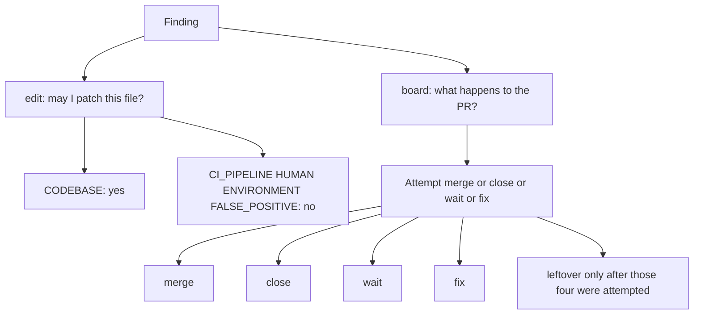

# Two-axis remediator board (edit vs board)

## Objective

Stop `/l9-pr-remediation` from treating **edit ownership** as a **board leftover**. One enum (`CODEBASE | CI_PIPELINE | HUMAN | ENVIRONMENT`) answers who may patch a file. Agents currently use it as what happens to the PR. That factory produced the false first-run leftovers (auto-seed do-not-merge, `CONFLICTING` on generated SHA, optional GitGuardian `UNSTABLE`) that emptied on the second run.

Fix the contract once, upstream. Do not encode GitGuardian, auto-seed, or any other scanner as doctrine.

**Mission:** `open_prs=0` — empty `gh pr list --state open` on the target repo (same shape as issue remediator `open_issues=0`).

## Immutable baseline (current workspace — not a Program Lock)

- Workspace: [`/Users/ib-mac/Cursor-Governance`](/Users/ib-mac/Cursor-Governance) on `main` @ `450b7d0e` (post-`/ff` tip). Leftover plans being shelved.
- Open PRs (unique chain): **#425** `agent/cursor/manifest-pr-body` ← **#426** `agent/cursor/pr-remediate-own` (v4.4.0 own-until-merged). Tip is **#426**.
- Route: `python3 skills/l9-plan/scripts/route_plan.py --risk medium --evidence sufficient` → `depth=standard`, `omit_gates=[]`.
- Hook catalog for code in scope: [`.pre-commit-config.yaml`](.pre-commit-config.yaml).
- Do **not** write `Lock: origin/main = <sha>`. Do **not** run `make campaign`. Do **not** admit a Program Lock.

## Two-axis contract (do not invent a third)

- **edit** stays today’s ownership enum. Never edit `.github/workflows/**`, required-check names, or secrets because a check is red.
- **board** is decided by an **actual merge attempt** plus **required-check identity**, not `mergeStateStatus` alone, and not `edit=CI_PIPELINE`.
- `edit=CI_PIPELINE` is not `board=leftover`.
- `leftover` only after merge / close / wait / fix was attempted and one of: a **required** check failed for a pipeline you cannot fix without editing CI, or a **named** HUMAN decision (product / architecture / legal / security-exception). Optional / invalid-key scanners are not leftovers.
- Conflicted **paths** (from `git merge-tree`) are the veto unit, not a PR-level `CONFLICTING` stamp. Generated SHA-only conflict → `board=fix` (regen), then merge.

Examples (tests encode these; they are not new laws):

- Optional scanner `UNSTABLE` with empty API key, check not required → `board=merge`.
- `CONFLICTING` only on `MANIFEST.sha256` → regen, then `board=merge`.
- Stale auto-seed “do not merge” with no named HUMAN decision → `board=close`, not leftover.
- Named HUMAN architecture decision after reply + resolve → `board=leftover` for that PR; continue every other open PR.

## Scope in

- Skill pack [`skills/l9-pr-remediation/`](skills/l9-pr-remediation/) (live tip is #426 @ 4.4.0; this work is **4.5.0**).
- Additive [`AGENTS.md`](AGENTS.md) fragment only.
- Companions: `agents/meta.yaml`, `skills/AUTONOMY_MANIFEST.yaml`, both `skill-registry.json` copies via `sync_generated_artifacts.py`.

## Scope out

- Per-product laws (GitGuardian, Dependabot, auto-seed scanners named as doctrine).
- Rewriting [`ops/autonomy/surface_profile.yaml`](ops/autonomy/surface_profile.yaml) `session_start_block` (already `converge_all_open_prs_then_merge`).
- Changing merge-method logic in [`ops/autonomy/stack_safe_merge.py`](ops/autonomy/stack_safe_merge.py) beyond optional path-level conflict reporting if a one-function helper already exists; default is a **new** skill script, not a squash/merge rewrite.
- Issue remediator, Odoo, `make campaign`, Program Lock, stale plugin-backup skill rewrite.
- Weakening never-edit CI surfaces, `--admin`, force-push, or Diagnose merge.

## Success criteria (falsifiable)

- Pack version is `4.5.0` and `scripts/self_test.py` PASS.
- Pack contains `board=merge|close|wait|fix|leftover` and `open_prs=0` / empty `gh pr list --state open`.
- Pack does **not** treat `CI_PIPELINE` or `HUMAN` ownership alone as leftover. Forbidden leftover factory strings (exact needles in self_test): `HUMAN / CI_PIPELINE leftovers still stop that PR` and `Only \`CI_PIPELINE\` / \`HUMAN\` / \`ENVIRONMENT\` blockers remain`.
- `P_blockers` no longer lists ownership classes as merge blockers.
- `self_test.py` still forbids `8 minutes`, `gh run watch`, `Wait Protocol`.
- After Build: stacked PR on #426 tip; finish reply shows the opened PR URL.

## Execute via Cursor Build

Press **Build**. Plan on this workspace. Execute on the unique open-PR chain tip.

- Open PRs exist: **never** branch from `origin/main`. Start from #426 (`PR_STACK=auto`). Use `agent_worktree_start.sh` if this checkout is not already that tip. Sibling chains fail closed.
- Do not run `make campaign`. Do not admit a Program Lock. Do not write `Lock: origin/main = <sha>`.
- After todos: scoped-commit (pathspecs), `l4_local.py authorize-release`, then `PR_STACK=auto PR_REMEDIATE=0 make pr`. Display the opened **PR URL**.

## TODOs (Build DAG)

**T1 — Two-axis in classifier (leverage 1)**
Files: [`skills/l9-pr-remediation/references/ownership-boundary.md`](skills/l9-pr-remediation/references/ownership-boundary.md), [`skills/l9-pr-remediation/references/finding-classifier.md`](skills/l9-pr-remediation/references/finding-classifier.md)
Add a **Board** section beside Ownership. Keep edit table; add board values `merge | close | wait | fix | leftover`. Rewrite the HUMAN / CI_PIPELINE **Action** cells so they no longer say “do not merge that PR” from ownership alone. Decision Test stays edit-only. Bump ref versions.

**T2 — Ledger field**
File: [`skills/l9-pr-remediation/references/remediation-plan.md`](skills/l9-pr-remediation/references/remediation-plan.md)
Add `board:` on each finding (and/or per-PR). Keep `ownership` + `disposition`. Plan gate: every finding has both axes + evidence.

**T3 — SKILL laws + done predicate**
File: [`skills/l9-pr-remediation/SKILL.md`](skills/l9-pr-remediation/SKILL.md)
Bump `4.4.0` → `4.5.0`. Law 8 / Law 12 / finish / cycle-4: delete leftover-from-ownership sentences (Law 12 currently: “HUMAN / CI_PIPELINE leftovers still stop that PR”). Done = `open_prs=0`. Skip-edit for HUMAN / CI_PIPELINE / ENVIRONMENT stays. Own-until-merged and poll-until-CLEAN stay.

**T4 — Run contract + loop stop**
Files: [`skills/l9-pr-remediation/references/run-contract.md`](skills/l9-pr-remediation/references/run-contract.md), [`skills/l9-pr-remediation/references/convergence-loop.md`](skills/l9-pr-remediation/references/convergence-loop.md)
`P_blockers`: note edit-class only; continue CODEBASE work; **do not** treat those classes as board leftover. Replace stop “Only CI_PIPELINE / HUMAN / ENVIRONMENT blockers remain → emit partial; do not merge” with: attempt merge/close/wait/fix; leftover only after that attempt. Bump run-contract past 1.4.0.

**T5 — Mechanical board helper**
File: `skills/l9-pr-remediation/scripts/board_action.py` (new, stdlib)
Inputs: `gh pr view --json` (mergeable, statusCheckRollup, reviewDecision, mergeStateStatus), required-check names (ruleset or `branchProtectionRule`), `git merge-tree` conflicted **paths**. Output: `{board, reason, conflicted_paths}`. Rules: required-check identity wins; optional/invalid-key check is not leftover; generated-only path conflict → `fix`; no named HUMAN → not leftover. Do not call `gh pr merge` here. `stack_safe_merge.py --run` stays the only merge executor.

**T6 — self_test examples of the rule**
File: [`skills/l9-pr-remediation/scripts/self_test.py`](skills/l9-pr-remediation/scripts/self_test.py)
Require `4.5.0`, `board=`, `open_prs=0`, `board_action.py` exists. Forbid the leftover-factory sentences. Keep existing speed / merge-train / Diagnose-never-merge needles. Add fixture cases as comments or tiny JSON next to the helper — examples, not scanner laws.

**T7 — Doctrine fragment + companions**
Files: [`AGENTS.md`](AGENTS.md) (append only), [`skills/l9-pr-remediation/agents/meta.yaml`](skills/l9-pr-remediation/agents/meta.yaml), [`skills/AUTONOMY_MANIFEST.yaml`](skills/AUTONOMY_MANIFEST.yaml), generated registries
Append `L9_PR_REMEDIATE_BOARD_AXIS_V1` superseding the leftover sentence in `L9_PR_REMEDIATE_OWN_UNTIL_MERGED_V1` (line “HUMAN / CI_PIPELINE leftovers still stop that PR”) and any leftover-as-blocker sentence in `L9_PR_REMEDIATE_SPEED_V1`. Historical paragraphs stay. `make pr` injects `<!-- L9_PROTECTED_ROOT_PR -->`. After skill edits: `sync_generated_artifacts.py` and commit both `ops/generated/skill-registry.json` copies.

## Critical path

T1 → T2 → T3 → T4 → T5 → T6 → T7

## Stress test

- Disconfirming: Would a named HUMAN architecture hold still become leftover? Yes. Would a required lint failure on source still be `board=fix`? Yes. Would we edit `.github/workflows` to green an optional scanner? No.
- Assumed false if: GitHub required-check names are discoverable; `gh` works; #426 is still the unique tip at Build.
- Blast radius: remediator merges PRs that old text would have parked. Mitigation: leftover remains for **named** HUMAN and **required** unfixable pipeline; Diagnose still never merges; `--admin` denied.
- Rollback: revert the 4.5.0 skill PR; #426 own-until-merged remains.

## Leverage

- Ranked: T1, T5, T3, T4, T2, T6, T7
- Shared cause: one enum used as two questions
- Deletions: leftover-from-ownership sentences; early `partial` stop that parks mergeable PRs

## Doc / root surface

- `AGENTS.md`: **update** (T7). Additive fragment only.
- `CLAUDE.md` / `CANONICAL_LAW.md` / `README.md`: **n_a** — remediator live pack + AGENTS fragment is enough.

## Risks

- Merging a PR that still needs a named HUMAN decision — require leftover when the reply names a decision and the thread is resolved.
- Weakening CI never-edit — edit axis unchanged; self_test keeps workflow-edit forbids.
- #426 self_test needles broken — keep `Own until merged`, `Poll workers never merge`, `Never gh pr update-branch after a squash of a parent`.

## Final validation

- `python3 skills/l9-pr-remediation/scripts/self_test.py` → PASS
- Helper dry-run on a fixture: optional-not-required → `merge`; generated-sha conflict → `fix`; named HUMAN → `leftover`
- After todos: `PR_STACK=auto PR_REMEDIATE=0 make pr`; finish reply includes the PR URL

## Convergence

status: converged. next_skill: none (Build is the execute path). stop_reason: two-axis contract and land sites are specified from verified #426 pack text.
