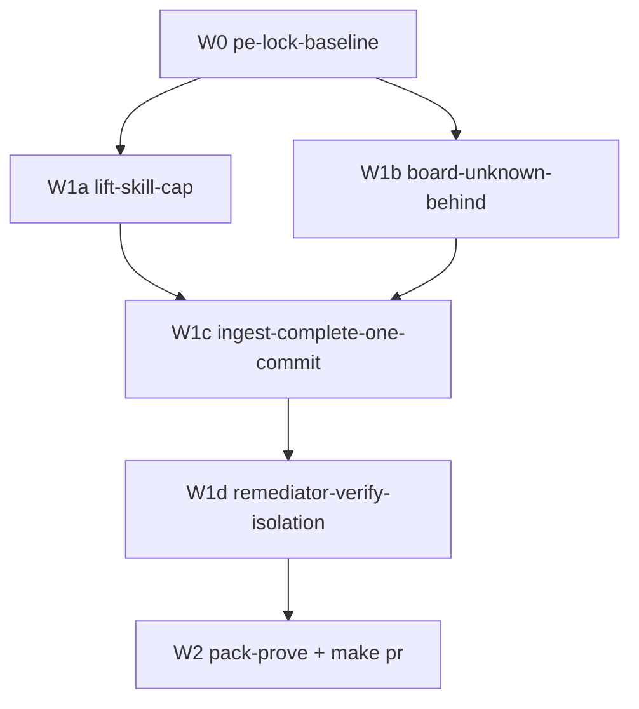

# Remediator one-commit max-velocity

## How this plan is executed

This is a **PE+autonomy landing**, not a remediator run and not a chat-mutate. The remediator *runtime* stays no-campaign. **This change** is a skill-pack + autonomy-brain landing on a **new branch from `origin/main`**.

```text
this plan
  -> make campaign isolates ONE host worktree off fetched origin/main
     ($HOME/.l9/gov-worktrees/<campaign_id>, branch feat/<campaign_id>)
  -> @environment/program-execution  (Blueprint -> Program Lock -> Controller)
  -> subordinate @autonomy / l9-bounded-autonomy under that lease
  -> adapter cursor-foreground
  -> scoped commits on feat/<campaign_id> inside that worktree
  -> L4 authorize-release (inside that worktree)
  -> PR_BASE=origin/campaign/<campaign_id> PR_STACK= PR_REMEDIATE=0 make pr (inside that worktree)
  -> stop (do not merge; do not invoke /l9-pr-remediation on leftover PRs)
```

**Campaign identity (derived, not chosen):** this plan declares no `plan_id`, so `compile_brief.extract_plan_campaign_id` slugifies the filename: `campaign_id = remediator-max-velocity-ca77e43f`. `run_campaign.py` then isolates the host worktree `$HOME/.l9/gov-worktrees/remediator-max-velocity-ca77e43f` on `feat/remediator-max-velocity-ca77e43f` from fetched `origin/main` and creates the integration branch `campaign/remediator-max-velocity-ca77e43f`. No preliminary `agent_worktree_start.sh` worktree: it would be a second, unused checkout that the release commands could target by mistake.

**Live PE command (do not hand-run pec / inner compile scripts):**

```bash
GOV="$HOME/.cursor-governance"
make -C "$GOV" campaign \
  INTENT="$GOV/docs/plans/remediator_max-velocity_ca77e43f.plan.md"
```

If the user presses **Build**, follow the same envelope, file lists, DAG, and verify/publish verbs. Do not invent a third path.

**Branch:** `feat/remediator-max-velocity-ca77e43f` (= `feat/<campaign_id>`), created by `make campaign` in `$HOME/.l9/gov-worktrees/remediator-max-velocity-ca77e43f`. PR base is `origin/campaign/remediator-max-velocity-ca77e43f` (AGENTS.md §3.3). Never mix onto `chore/wip-corpus-*` or the dirty primary clone.

**Publish (every command runs inside the campaign worktree, never the original checkout):**

```bash
CAMPAIGN_ID=remediator-max-velocity-ca77e43f
GOV_PY="$HOME/.cursor-governance/.venv/bin/python"
cd "$HOME/.l9/gov-worktrees/$CAMPAIGN_ID"
"$GOV_PY" ops/autonomy/l4_local.py begin --contract-id remediator-max-velocity
"$GOV_PY" ops/autonomy/l4_local.py authorize-release
PR_BASE="origin/campaign/$CAMPAIGN_ID" PR_STACK= PR_REMEDIATE=0 make pr
```

`PR_STACK=` is explicit so no open-PR tip or `origin/main` can be re-resolved as the base; the PR targets the campaign integration branch only.

**Stop / do not execute when:** shared dirty clone; Program Lock drift; capability preflight blocked; a forbidden path is required; Build would edit `.github/workflows/**` or `stack_safe_merge.py`.

## Must do

- New branch from fetched `origin/main`: `make campaign` creates `feat/<campaign_id>` in its own worktree plus the `campaign/<campaign_id>` integration branch; the PR base is `origin/campaign/<campaign_id>`, never a stack tip. Rule 46. Pathspecs only.
- Caps = execution profile (`max_parallel>=480`, `max_mutation_lanes>=128`). Safety is `claim_scopes_conflict` + `waves()`, not 10.
- One-and-done is mechanical: complete ingest before first edit; Gate E reads `git log`; cycle 2 rejected for plan-time finding ids.
- `pr_board.decide` is fail-closed on merge_state: green required + `UNKNOWN` → `wait` ("GitHub has not finished computing mergeability"); the watch loop re-polls until the fact resolves — polling, not conversion. Failing required checks **before** BEHIND → FIX naming the check.
- Verify is exactly `L9_REMEDIATOR=1 PR_STACK= PR_BASE=origin/main make precommit-repo`.
- `L9_REMEDIATOR=1` skips `pr_stack_apply_publish_base`.
- After `plan --board`, first status line is `merge_order` + `merge_now` + wave sizes.
- AGENTS.md append-only. Regen via `sync_generated_artifacts.py --force`.
- `autonomous_merge: false`. Do not merge this landing PR. Do not remediator-merge 571/576/580.

## Must not do

- Keep `SKILL_SUBAGENT_CAP = 10`. Invent a second scheduler. Edit `stack_safe_merge.py`, `execution_profile.py`, `resolve_pr_stack.sh`, Makefile, workflows, `CANONICAL_LAW.md`.
- Teach `git merge origin/main` as a CI fix. Convert an `UNKNOWN` merge_state into `merge` under any check evidence — UNKNOWN resolves only by re-poll. Flip or weaken `test_unknown_merge_state_waits`; weaken tests to keep first-wave=10.
- Remediator-push leftover PRs. `--admin`, force-push, `--no-verify`. Implement on `rem-pr-*` worktrees.

## Files to touch

The `files:` list on each frontmatter todo is the compiled write set (`compile_brief.extract_plan_todos` reads only `files`/`depends_on`); the lists below mirror it, todo by todo.

### W0 — baseline

- `environment/program-execution/campaigns/remediator-max-velocity-ca77e43f/`: the campaign source + integrity receipt `make campaign` materializes inside the worktree (the Program Lock footprint). No product edits.

### W1a — cap lift

- [ops/autonomy/pr_fleet.py](ops/autonomy/pr_fleet.py): delete `SKILL_SUBAGENT_CAP = 10`; `skill_caps()` pass-through; `_objective` verify gets `PR_STACK=`; watch until `board=merge`; `assign --record` fail-closed if `.l9/pr/assignments/` missing
- [ops/scripts/validate_max_velocity.py](ops/scripts/validate_max_velocity.py): fail if remediator clamps below profile floors
- [tests/ops/autonomy/test_pr_fleet.py](tests/ops/autonomy/test_pr_fleet.py): 12 independent PRs → 12 remediations
- [skills/l9-pr-remediation/SKILL.md](skills/l9-pr-remediation/SKILL.md) bump past 5.4.0; delete `skill_subagent_cap: 10`; delete poll-until-CLEAN
- [skills/l9-pr-remediation/references/fleet-waves.md](skills/l9-pr-remediation/references/fleet-waves.md), [run-contract.md](skills/l9-pr-remediation/references/run-contract.md), [self_test.py](skills/l9-pr-remediation/scripts/self_test.py), [expertise_model.yaml](skills/l9-pr-remediation/expertise_model.yaml), [skill_intelligence_report.yaml](skills/l9-pr-remediation/skill_intelligence_report.yaml)
- [AGENTS.md](AGENTS.md) append-only fragment

### W1b — board

- [ops/autonomy/pr_board.py](ops/autonomy/pr_board.py) `decide()`: failing required before BEHIND → FIX naming the check; UNKNOWN merge_state + green required → WAIT with reason "GitHub has not finished computing mergeability" (fail-closed; the watch loop re-polls)
- [tests/ops/autonomy/test_pr_board.py](tests/ops/autonomy/test_pr_board.py): keep `test_unknown_merge_state_waits` (UNKNOWN → wait is the contract); add red-CI+BEHIND → FIX naming the check; keep `test_no_evidence_at_all_waits`

### W1c — census + one commit

- [ingest_signals.py](skills/l9-pr-remediation/scripts/ingest_signals.py): auto Sonar when `sonar-project.properties` exists
- [validate_plan.py](skills/l9-pr-remediation/scripts/validate_plan.py) + [protocol.py](skills/l9-pr-remediation/scripts/protocol.py): `--findings` required; cycle-2 reject plan-time ids; Gate E `git log`
- [gate_receipt.py](skills/l9-pr-remediation/scripts/gate_receipt.py), [remediation-plan.md](skills/l9-pr-remediation/references/remediation-plan.md), [signal-ingestion.md](skills/l9-pr-remediation/references/signal-ingestion.md), [activation_cases.json](skills/l9-pr-remediation/scripts/activation_cases.json), [test_protocol.py](tests/skills/l9_pr_remediation/test_protocol.py)

### W1d — remediator verify

- [ops/scripts/run_pr_precommit.sh](ops/scripts/run_pr_precommit.sh): skip stack-tip when `L9_REMEDIATOR=1`
- [generated-heal.md](skills/l9-pr-remediation/references/generated-heal.md), [fix-engine.md](skills/l9-pr-remediation/references/fix-engine.md), [merge-advise.md](skills/l9-pr-remediation/references/merge-advise.md)

### W2

- Generated companions only via `sync_generated_artifacts.py --force`: [ops/generated/skill-registry.json](ops/generated/skill-registry.json), [environment/agents/adapters/claude-code/generated/skill-registry.json](environment/agents/adapters/claude-code/generated/skill-registry.json)

## Files not to touch

- `ops/autonomy/stack_safe_merge.py`, `merge_gate.py`, `first_publication_gate.py`, `execution_profile.py`, `claude-execution-profiles.json`
- `ops/scripts/lib/resolve_pr_stack.sh`, `ops/scripts/resolve_stack_tip.py`
- `Makefile`, `ops/autonomy/surface_profile.yaml`, `CANONICAL_LAW.md`, `.github/workflows/**`
- `environment/program-execution/core/**`, `pyproject.toml`, `requirements.txt`, `conftest.py`, `.pre-commit-config.yaml`
- `skills/l9-repo-birth/**`, leftover remediator worktrees/PRs, `WIP/**`, `TODO.md`, historical AGENTS.md paragraphs

## Commands allowed vs denied

**Allowed:** isolated worktree; scoped commit; gov venv python; pack self_test / validate_skill_pack / validate_exemplary_skill; targeted pytest listed above; sync_generated_artifacts --force; l4 begin/authorize-release inside the campaign worktree; `PR_BASE=origin/campaign/remediator-max-velocity-ca77e43f PR_STACK= PR_REMEDIATE=0 make pr` once after prove, from the campaign worktree; `make campaign INTENT=<this plan>`.

**Denied:** mid-todo `make pr` / `make pr-check`; remediator push/merge of 571/576/580; `gh pr merge`; `--admin`; force-push; `git merge origin/main` on leftover branches; `--no-verify`; `uv pip install` past lock.

## Execution DAG



- W0: no product mutation.
- W1a and W1b: parallel Tasks. W1b does not edit SKILL.md. W1a removes cap-10 needles; W1c writes remaining Law 15 / ingest / verify sentences.
- W2: verify + ceremony publish. `autonomous_merge: false`.

## Capability preflight (W0)

Isolated clean worktree; HEAD is authorized base; gov venv imports yaml; MEMORY_PREFETCH cited; `.pre-commit-config.yaml` named not rewritten.

## Why (kept short)

User corrections: one-line CI loops; no parallelism; merge order invisible; sitting on green 570 through UNKNOWN without re-polling it to a decision; catch-up on 576 instead of fixing the test.

Code owners: `SKILL_SUBAGENT_CAP=10`; Gate E self-attested; ingest scanners opt-in; `decide()` orders BEHIND before failing checks (UNKNOWN→wait itself is correct and stays); remediator verify inherits `PR_STACK=auto`; generated-heal teaches `git merge origin/main`.

Previous speed plan already removed `make pr` from remediator publish. Do not redo that.

## Success properties

- SP-01: `skill_caps()` parallel ≥ 480 and mutation ≥ 128. Twelve independent PRs launch twelve remediations.
- SP-02: green required + `UNKNOWN` merge_state → `board=wait` ("GitHub has not finished computing mergeability") and the watch loop re-polls to a decision; `merge` needs a computed mergeable state. Red required + `BEHIND` → FIX naming the check, not catch-up.
- SP-03: ingest without `--sonar` still emits Sonar ids when `sonar-project.properties` exists. Converge `validate_plan` without `--findings` is FAIL.
- SP-04: Gate E FAIL on two remediator commits whose finding ids ⊆ plan-time ingest.
- SP-05: `L9_REMEDIATOR=1 make precommit-repo` does not call `pr_stack_apply_publish_base`.
- SP-06: W2 commands Passed. Landing PR URL printed.

## Envelope

- fs write: the frontmatter todo `files:` lists only (mirrored under Files to touch)
- worktree: `$HOME/.l9/gov-worktrees/remediator-max-velocity-ca77e43f` only; PR base `origin/campaign/remediator-max-velocity-ca77e43f`
- fs deny: Files not to touch
- `autonomous_merge: false`

## Rollback

Revert the feature branch.

## After this PR merges — not this Build

Re-invoke `/l9-pr-remediation` for leftover open PRs.

## Campaign packet stub

```yaml
packet_id: autonomy-2026-09-14-remediator-max-velocity
authority: A4_CAMPAIGN_BOUNDED_EXTERNAL_WRITE
autonomous_merge: false
plan_ref: docs/plans/remediator_max-velocity_ca77e43f.plan.md
declared_branches: [feat/remediator-max-velocity-ca77e43f, campaign/remediator-max-velocity-ca77e43f]
forbidden_inside_packet:
  - merge_outside_l4_plan_build_stack
  - force_push
  - admin_merge
  - expand_scope
  - remediate_leftover_open_prs
```
