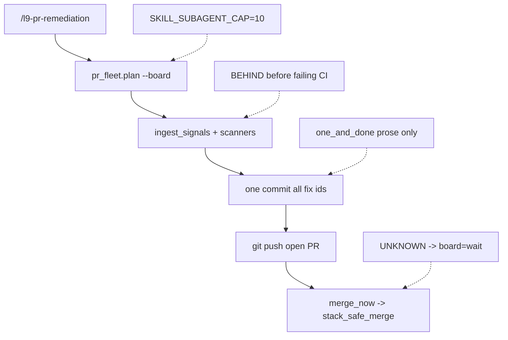

# Remediator one-commit max-velocity

## What this remediator run proved

The pack already says the right things in prose: one plan, one commit, one CI run; launch the whole wave; merge as soon as `merge_now` is non-empty; do not wait for REMEDIATE_ALL. The previous speed plan ([docs/plans/BUILT/pr_remediator_speed_c4b0d4ae.plan.md](docs/plans/BUILT/pr_remediator_speed_c4b0d4ae.plan.md)) already deleted `make pr` from the remediator path. **That is not what burned this session.**

User corrections, in order:

1. Stop fixing one line and re-running CI.
2. Parallelize; time matters.
3. State the merge order immediately.
4. Do not sit on a green PR until GitHub reports a conflict or UNKNOWN.
5. Fix the failing test; do not `git merge origin/main` as a substitute.

What the agent actually did: serial generated-artifact then wait; poll 570 until GitHub UNKNOWN / already-merged; catch-up on 576 instead of the `l9-repo-birth` self_test; in-session recon; `PR_STACK=auto` fail-closed remediator verify; memory-prefetch blocked writes; a second agent overwrote `rem-pr-576`; `pr_fleet accept` failed because `.l9/pr/assignments/` was never written.

Doctrine already forbids most of that. Code does not.

## Root causes (owners, not vibes)

- **Cap is real, max-velocity is not.** [ops/autonomy/pr_fleet.py](ops/autonomy/pr_fleet.py) `SKILL_SUBAGENT_CAP = 10` clamps `skill_caps()` to `min(profile, 10)`. Profile is already `maximum_velocity` (480 / 128). [ops/scripts/validate_max_velocity.py](ops/scripts/validate_max_velocity.py) does not see the remediator clamp. [rules/07-max-velocity-research.mdc](rules/07-max-velocity-research.mdc) forbids inventing a lower cap.
- **One-and-done is prose.** `one_and_done` is never read. [skills/l9-pr-remediation/scripts/protocol.py](skills/l9-pr-remediation/scripts/protocol.py) `validate_plan` only requires `commit_policy.commits == 1`. Gate E only checks a self-authored `publish_count_this_cycle: 1`. Nothing runs `git log`. Cycle-2 “skipped plan-time finding is not a new cycle” in [skills/l9-pr-remediation/references/remediation-plan.md](skills/l9-pr-remediation/references/remediation-plan.md) is not enforced.
- **Ingest is thin unless the agent remembers flags.** [skills/l9-pr-remediation/scripts/ingest_signals.py](skills/l9-pr-remediation/scripts/ingest_signals.py) always pulls CI + threads + reviews. Sonar / Semgrep / CodeQL / debt join only if `--sonar` / `--semgrep` / `--codeql` / `--debt` are passed. Default Converge therefore plans an incomplete batch, then “discovers” Sonar/review leftovers on the next CI loop.
- **UNKNOWN parks merge.** [ops/autonomy/pr_board.py](ops/autonomy/pr_board.py) `decide()` (~817): every named required check green + `merge_state` not in `{CLEAN, UNSTABLE, HAS_HOOKS}` → `WAIT`. That is exactly the 570 stall. `merge_now` only admits `board=merge`.
- **BEHIND outranks failing required checks.** Same `decide()` (~745) returns catch-up FIX before `fixable_failing`. That is the 576 “merge main instead of fix the test” teaching.
- **Remediator verify inherits `PR_STACK=auto`.** [ops/scripts/run_pr_precommit.sh](ops/scripts/run_pr_precommit.sh) always calls `pr_stack_apply_publish_base`. Sibling chains targeting main exit 2. Skill verify is `L9_REMEDIATOR=1 PR_BASE=origin/main make precommit-repo` with no `PR_STACK=` opt-out.
- **Generated heal still teaches `git merge origin/main`.** [skills/l9-pr-remediation/references/generated-heal.md](skills/l9-pr-remediation/references/generated-heal.md) and [skills/l9-pr-remediation/references/run-contract.md](skills/l9-pr-remediation/references/run-contract.md). That is how catch-up became a remediator reflex.

## Design (locked)

Keep the existing planner. Do not add a scheduler, lease store, or campaign to remediator *runtime*. This plan itself executes through PE+autonomy because the user invoked `/l9-plan`; the remediator pack stays “straight line, no PE.”

1. **Caps = execution profile.** Delete the `min(..., 10)` clamp. `waves()` + claim isolation remain the only safety. Mutation lanes follow `max_mutation_lanes` (128). Independent remediations and merge trains launch in one message.
2. **Census is complete before the first edit.** Converge ingest always includes unresolved threads, reviews, failing checks, and — when `sonar-project.properties` exists — Sonar. Semgrep/CodeQL/debt stay lazy unless the check is red or findings are present. `validate_plan --findings` is mandatory, not optional.
3. **One commit is measured.** Gate E runs `git log` on the remediator worktree (one new commit vs assignment `base_sha`, plus allowed hook-rewrite). A second remediator commit whose finding ids existed at plan time is `REJECTED` by `pr_fleet.accept` / `validate_plan` cycle-2.
4. **UNKNOWN + green required = MERGE.** Attempt `stack_safe_merge.py --run`. If GitHub 405/409, re-plan. Empty required + empty merge_state stays WAIT. BLOCKED stays FIX.
5. **Failing required checks beat BEHIND.** Catch-up language is emitted only when required checks are green. Red CI → patch source. `git merge origin/main` / `gh pr update-branch` are remediator-forbidden except generated-only conflict after a landed parent (rebase `--onto` after parent squash).
6. **`L9_REMEDIATOR=1` skips stack-tip rewrite.** Verify command becomes `L9_REMEDIATOR=1 PR_STACK= PR_BASE=origin/main make precommit-repo`.
7. **Lane isolation.** Assignment records to `.l9/pr/assignments/` before Task launch. One worktree per branch; head-moved → `blocked` + re-plan, never catch-up on a foreign dirty tree. Cursor remediator does not wait on Claude `memory_prefetch` mid-edit (prefetch once at fleet start if the gate is live).
8. **Status is immediate.** First user-visible line after `plan --board` is `merge_order` + `merge_now` + wave sizes. No narrative wait on a `board=merge` PR.

## Scope

In:

- [ops/autonomy/pr_fleet.py](ops/autonomy/pr_fleet.py) `SKILL_SUBAGENT_CAP` / `skill_caps` / `_objective` / assignment record
- [ops/autonomy/pr_board.py](ops/autonomy/pr_board.py) `decide()` UNKNOWN + BEHIND order
- [ops/scripts/run_pr_precommit.sh](ops/scripts/run_pr_precommit.sh) remediator skip
- [skills/l9-pr-remediation/](skills/l9-pr-remediation/) SKILL.md (bump past 5.4.0), fleet-waves, run-contract, generated-heal, remediation-plan, fix-engine, ingest_signals, protocol, gate_receipt, self_test, activation_cases
- [tests/ops/autonomy/test_pr_fleet.py](tests/ops/autonomy/test_pr_fleet.py) and [tests/ops/autonomy/test_pr_board.py](tests/ops/autonomy/test_pr_board.py)
- AGENTS.md **append-only** fragment superseding `skill_subagent_cap: 10` and “poll until CLEAN”
- After-use capture: new activation prompts + one Graphiti lesson (operator write after land)

Out:

- Leftover open PRs from this session (571 / 576 / 580) — invoke remediator after this lands
- Ceremony `make pr` / L4 / `stack_safe_merge.py` method selection
- A second scheduler or remediator campaign at runtime
- Folding AGENTS.md / rewriting `surface_profile.yaml` `max_cycles: 5` (append a note; do not fold)
- Raising `FETCH_WORKERS` as a fake substitute for the cap lift

## Execution envelope

- New branch from fetched `origin/main` (rule 46). Do not mix onto the current dirty / WIP checkout.
- `autonomous_merge: false`. Publish with `PR_STACK=auto PR_REMEDIATE=0 make pr` after L4 `authorize-release`.
- Execute: this `.plan.md` → `@environment/program-execution` (Blueprint → Program Lock → Controller) → subordinate `@autonomy` / `l9-bounded-autonomy` under the Program lease. Cursor adapter: `cursor-foreground`. Do not free-form mutate from chat.
- Quality gate names [`.pre-commit-config.yaml`](.pre-commit-config.yaml). Local verify on the landing PR is the ceremony path (this change *is* a feature PR, not a remediator run).

## Success properties (falsifiable)

- SP-01: `pr_fleet.skill_caps()` equals the execution-profile floors (parallel ≥ 480, mutation ≥ 128). `test_skill_cap_limits_the_first_wave_to_ten` is gone or inverted. `self_test.py` no longer requires the string `skill_subagent_cap: 10`.
- SP-02: Fixture: green required checks + `merge_state=UNKNOWN` → `board=merge`. Fixture: red required + `BEHIND` → FIX reason names the failing check and does not say “catch up”.
- SP-03: `ingest_signals` without scanner flags still emits Sonar ids when `sonar-project.properties` exists in the repo under test. `validate_plan` without `--findings` is FAIL on Converge.
- SP-04: Gate E FAIL when `git log assignment.base_sha..HEAD --oneline` has more than one remediator commit whose trailer finding-ids ⊆ plan-time ids (hook-rewrite amendment still one commit).
- SP-05: `L9_REMEDIATOR=1` `make precommit-repo` does not call `pr_stack_apply_publish_base` (unit or script test).
- SP-06: Pack `self_test.py` + `validate_skill_pack.py` + `validate_exemplary_skill.py` + `pytest -q tests/ops/autonomy/test_pr_fleet.py tests/ops/autonomy/test_pr_board.py tests/skills/l9_pr_remediation` PASS.

## Stress / disconfirm

- A 12-PR independent board must launch 12 remediations in wave 1 (under 128), not 10 + `blocked_cap`.
- Overlapping non-generated paths still serialize via `claim_scopes_conflict`. Cap lift must not put two mutation lanes on one path.
- UNKNOWN with *no* required-check evidence must stay WAIT (`test_no_evidence_at_all_waits`).
- Generated-only conflict after a parent merge may still rebase/regen; it may not become “merge main to hide a red test.”
- If Cursor host admission denies >N Tasks, that is a gate defect to report — not permission to restore cap 10.

## Rollback

Revert the feature branch. Caps, board, and ingest are independent enough to revert per commit if a test pins an old UNKNOWN-wait contract that CI still needs — prefer flipping the test, not keeping the wait.

## MEMORY_PREFETCH

Not written this turn (plan-mode no-write). On Build, run `ops/hooks/plan_memory_prefetch.py` and cite `.l9/memory/plan-prefetch.json` (`namespace`, `snapshot_digest`, `checked_record_count`, `conflicts`, `policy_version`) before the first mutate.

## After land — not this Build

Re-invoke `/l9-pr-remediation` on Quantum-L9/Cursor-Governance so 571 / 576 / 580 run under the new contract: full census, one commit, merge_now without UNKNOWN wait.
