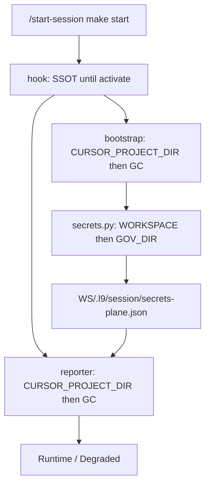

# SessionStart report truth

## Mission

`/start-session` (`make -C $HOME/.cursor-governance start WS=<repo>`) must print one Runtime/Degraded view that matches measured session state. No hardcoded `bound`/`unbound`/`armed`/`locked`/`ok — retired` slogans, and no second secrets probe that contradicts the plane.

Stay on current workspace branch `feat/bootstrap-f3-f4-f6-f8` (`4e730af4` plus uncommitted reporter work). Do not lock `origin/main`. After Build: scoped-commit, `l4_local.py authorize-release`, `PR_STACK=auto PR_REMEDIATE=0 make pr`, show the PR URL.

## Architect (GAR)

Architecture is settled — do not invent a second SessionStart brain.

- **Derived view (one):** [`ops/scripts/session_start_runtime_report.py`](ops/scripts/session_start_runtime_report.py)
- **Secrets plane (one owner):** [`ops/secrets/session_start_secrets.py`](ops/secrets/session_start_secrets.py) invoked only from [`ops/scripts/bootstrap_agent_environment.sh`](ops/scripts/bootstrap_agent_environment.sh). Reporter must not call `run_plane()` or `capability_bind.bind_status` (SESSIONSTART_SECRETS_PLANE_V1).
- **Memory proof:** hook forwards diagnostics JSON; reporter classifies `binding_status` / `ok` / `artifact_provenance` / `reasons` (already on this branch).
- **Two-clone (two hops, both required):**
  1. Hook today hard-sets `SHARED_BOOTSTRAP="$GC/ops/scripts/bootstrap_agent_environment.sh"` ([`ops/hooks/session_start_bootstrap.sh`](ops/hooks/session_start_bootstrap.sh) ~195).
  2. Even the **workspace** bootstrap still runs `"$GOV_PY" "$GOV_DIR/ops/secrets/session_start_secrets.py"` (lines 369–371). The hook always passes `--governance "$GC"`, so G1 alone still binds the SSOT plane.

Rejected: pinning `installed_record_digest`; treating `compatible` as `unbound`; inventing a conversation_id for TTY `make start`; a third secrets resolver outside bootstrap; reporter fallback to `bind_status` or `probe_aws_cli` / `probe_secrets_bind` when the receipt is absent; a default receipt path inferred from cwd (bootstrap cwd / `GOV_DIR` may be the SSOT clone).

Official `/start-session` always executes the **SSOT** hook (`commands/start-session.md`). That hook also self-heals `~/.cursor/hooks/session-start-bootstrap.sh` from `$GC`. Workspace-only hook edits are invisible to official `make start` until the PR lands and `governance_activate_fresh` moves SSOT. Build proof is the **same-revision chain** without running the full hook (the hook foreground-runs `governance_activate_fresh.sh` at lines 117–124).

## Evidence already in hand (2026-09-11 `make start`)

- SSOT hook still sends `memory-detail` starting `unbound:` and `memory-healthy=false`. Workspace reporter re-probed: `compatible` / `ok=true` / `unproven`.
- Bootstrap stderr: `SEMGREP_APP_TOKEN=unbound …`. Runtime: `…=infisical`.
- `cursor-adapter: degraded — unknown — receipt expired (764027s)` — reader `unknown` is TTL/revision, not this-session fail.
- `tunnel: ok — retired …` is a constant, never probed.
- `backup: ok — armed` is “no `.governance-build-lock`” ([hook](ops/hooks/session_start_bootstrap.sh) 221–226).
- `venv: ok — locked (uv.lock)` is “`.venv/bin/python3` exists” (237–240). `ensure_uv_environment.sh check` writes `UV: …` to **stderr** only; exit 1 means sync required, not a Runtime FAILED. `classify_simple(..., fail_tokens=absent|missing|fail)` would leave `UV: unavailable` and `UV: environment synchronization required` as OK.
- Hydrate packet `status=OK` with `continuation_stale` / `STALE` in the hydrate block only. [`classify_hydrate_state.py`](ops/scripts/classify_hydrate_state.py) already treats packet `degraded` and `close_gap`. `hydrate_stats.continuation_stale` is `true` / `false` / `None` ([`compile_session_packet.py`](ops/graphiti/hydration/compile_session_packet.py) 204). Classify only `is True`. [`collect()`](ops/scripts/session_start_runtime_report.py) 650–654 folds hydrate into memory and omits `memory-hydrate` when memory is already degraded. [`test_unhealthy_memory_folds_hydrate`](ops/scripts/tests/test_session_start_runtime_report.py) **asserts that fold** — invert it.
- [`collect()`](ops/scripts/session_start_runtime_report.py) 610–611: `aws_cli if … else probe_aws_cli()` and the same for `probe_secrets_bind()`. [`main()`](ops/scripts/session_start_runtime_report.py) 769–785 passes neither, so today’s Runtime always live-probes. Receipt-only is a lie until that fallback is removed.
- Route locator `unresolved: hook payload carried no conversation_id` is true for TTY `make start` — leave it.

## Pre-validation

- Workspace: `/Users/ib-mac/Cursor-Governance` on `feat/bootstrap-f3-f4-f6-f8`.
- Hook catalog: [`.pre-commit-config.yaml`](.pre-commit-config.yaml).
- Uncommitted (keep, then strip debug `#region agent log` before commit): cursor `unknown` → `n/a`, tunnel `retired` → `n/a`. Debug writers still present at three sites in the reporter (`debug-eb0fc6.log`).
- Already committed: memory live-proof (`4e730af4`), Infisical bind (`b2e64562`).
- Existing tests to extend (do not invent a parallel suite): [`ops/scripts/tests/test_session_start_runtime_report.py`](ops/scripts/tests/test_session_start_runtime_report.py), [`ops/secrets/test_session_start_secrets.py`](ops/secrets/test_session_start_secrets.py), [`ops/scripts/tests/test_classify_hydrate_state.py`](ops/scripts/tests/test_classify_hydrate_state.py), [`ops/scripts/tests/test_cursor_shared_bootstrap_edge.py`](ops/scripts/tests/test_cursor_shared_bootstrap_edge.py), [`tests/ops/hooks/test_session_start_memory_binding.py`](tests/ops/hooks/test_session_start_memory_binding.py).

## Prior kernel fills (kept)

Validate & Fill Gaps G1–G8 and Recursive Improvement I1–I6 stay in force. This pass repairs plan defects those fills left executable-unsafe.

## Validate & Repair (this kernel)

Target: this plan document. Mode: bounded_repair of the plan only. No implementation this turn.

| ID | Type | Severity | Confidence | Evidence | Remediation in this plan | Status |
|---|---|---|---|---|---|---|
| R1 | incomplete / alignment | High | Confirmed | `collect()` 610–611 live-falls back; `main()` does not pass aws/binds. | `main()` reads `$workspace/.l9/session/secrets-plane.json`. Pass `aws` + `binds` into `collect()`. Delete `else probe_*()`. `None` → existing unread classifiers. | Filled |
| R2 | execution blocker / safety | High | Confirmed | Prove todo ran the full hook. Hook lines 117–124 run `governance_activate_fresh.sh` (ff/swap SSOT). | Prove = targeted pytest + `bash $WS/ops/scripts/bootstrap_agent_environment.sh --surface cursor --governance $GC --workspace $WS --quiet`. Do not invoke `session_start_bootstrap.sh` as Build proof. | Filled |
| R3 | contract | Medium | Confirmed | A default receipt path from cwd writes under SSOT when bootstrap’s cwd is `$GC`. | `--receipt-out` is required to write. Omit → no file. Bootstrap always passes `$WORKSPACE/.l9/session/secrets-plane.json`. | Filled |
| R4 | alignment | Medium | Confirmed | `classify_aws_cli` uses `summary`; probe already has it ([`aws_cli_preflight.py`](ops/secrets/aws_cli_preflight.py) 59–60). Receipt `{ok, code}` only would print a generic “authorized”. | Receipt `aws` is `{ok, code, summary}`. No account ids. `--json` / file are the same object: `{ok, login, aws, binds}`. | Filled |
| R5 | correctness | Medium | Confirmed | `classify_simple` venv tokens miss `UV: unavailable` and `synchronization required`. | `classify_venv`: `UV:` line; exit 0 → ok; nonzero → DEGRADED (not FAILED). | Filled |
| R6 | observability | Low | Confirmed | Unread copy still says `capability_bind` / `aws_cli_preflight`. | Unread = `secrets-plane receipt unread` / `aws-cli receipt unread`. | Filled |

Forbidden (unchanged): conversation_id synthesis, `installed_record_digest` pin, Makefile secrets targets, AGENTS.md rewrite, backup **execution**, new test frameworks, full-hook Build proof, live-probe fallback.

## Scope in

- Land cursor-adapter stale_receipt + tunnel n/a; remove debug-eb0fc6 writers.
- Hook: resolve `bootstrap_agent_environment.sh` from `$CURSOR_PROJECT_DIR` then `$GC` (same function shape as `resolve_runtime_reporter`).
- Bootstrap: resolve `session_start_secrets.py` from `$WORKSPACE` then `$GOV_DIR`. Unlink `$WORKSPACE/.l9/session/secrets-plane.json`, then `"$GOV_PY" "$SECRETS_PY" --receipt-out <that path>`. `--quiet` does not skip the write (it only gates `log`/`say`).
- Plane: write only when `--receipt-out` is set. Always write (including `plane_ok=false`). `--json` prints `{ok, login, aws:{ok, code, summary}, binds:[{name, bound, source}]}`. Live SessionStart does not pass `--json` (stdout is the hook envelope).
- Reporter: `main()` loads that file; `collect()` classifies from the passed dicts only. Remove `probe_aws_cli` / `probe_secrets_bind` fallbacks (and the functions if nothing else calls them). Absent/invalid file → unread / DEGRADED, never invent `ok`.
- Backup: if `$GC/.governance-build-lock` exists, keep that measured SKIPPED line. Else `BACKUP_NOTE=$(backup_gate.sh "$GC" </dev/null || true)` — hook is `set -uo pipefail` (no `-e`); exit 10 is skip. `classify_backup`: `PROCEED` → ok; `SKIP` → ok/n/a + reason; missing script → unread. Do not invent a sessionEnd payload. Do not use `classify_simple` `fail_tokens=error`.
- Venv: `VENV_NOTE=$(ensure_uv_environment.sh "$GC" check 2>&1 || true)`. `classify_venv` as R5.
- Hydrate: `continuation_stale is True` → degraded + existing STALE rationale. `None` / `False` are not stale. `collect()` always emits `memory-hydrate` when hydrate is degraded; invert the fold test. Extend `_packet(..., continuation_stale=)`.
- Ratchet tests on existing files listed above.

## Scope out

- Official `make -C $HOME/.cursor-governance start` as Build acceptance.
- Running [`ops/hooks/session_start_bootstrap.sh`](ops/hooks/session_start_bootstrap.sh) as Build proof (`activate_fresh`).
- Inventing a conversation_id for `/start-session`.
- Pinning `installed_record_digest` or changing binding taxonomy.
- Reporter fallback to `capability_bind.bind_status` or `aws_cli_preflight.probe`.
- C1/VPS, Infisical project inventory, capability broker.
- AGENTS.md rewrite (additive_only). Tests + in-file comments only unless a pointer is actually wrong.
- `make campaign` / Program Lock.

## Todos

1. **Strip debug + land cursor/tunnel** — Remove `#region agent log` from [`ops/scripts/session_start_runtime_report.py`](ops/scripts/session_start_runtime_report.py). Keep `classify_cursor_adapter` `state==unknown` → `n/a` / `stale_receipt` and `classify_tunnel` retired → `n/a`. Tests already in the same test module.

2. **Resolve shared bootstrap (G1)** — [`ops/hooks/session_start_bootstrap.sh`](ops/hooks/session_start_bootstrap.sh): `resolve_shared_bootstrap` = `$CURSOR_PROJECT_DIR/ops/scripts/bootstrap_agent_environment.sh` then `$GC/…`. Extend [`test_cursor_shared_bootstrap_edge.py`](ops/scripts/tests/test_cursor_shared_bootstrap_edge.py) with the same order assertion as `test_hook_reporter_resolve_prefers_worktree_over_gc`. Keep `test_live_hook_delegates_before_exit`.

3. **Secrets single writer (I1/R1/R3/R4)** — [`ops/scripts/bootstrap_agent_environment.sh`](ops/scripts/bootstrap_agent_environment.sh): prefer `$WORKSPACE/ops/secrets/session_start_secrets.py` else `$GOV_DIR/…`; unlink receipt; invoke with `--receipt-out` only. [`ops/secrets/session_start_secrets.py`](ops/secrets/session_start_secrets.py): write only if `--receipt-out` is set; `--json` is the same object including `aws.summary`. Reporter `main()` reads the file; `collect()` has no `probe_*` fallback. Extend [`ops/secrets/test_session_start_secrets.py`](ops/secrets/test_session_start_secrets.py). Ratchet reporter tests: no `bind_status`, no `else probe_`.

4. **Backup + venv measured (I6/R5)** — Keep the build-lock SKIPPED line when the file exists. Else empty-stdin `backup_gate.sh "$GC"`. `classify_backup` / `classify_venv` as above.

5. **Hydrate STALE always visible (I5)** — Classifier: `continuation_stale is True` only. `collect()` always emits `memory-hydrate` when hydrate is degraded. Invert `test_unhealthy_memory_folds_hydrate`.

6. **Prove (R2)** — Targeted pytest on the files above, plus hook ratchet (`MEMORY_HEALTH="$HEALTH_JSON"`, no `bound ($BINDING_STATUS)`, no `{"status":"unbound"}`). Narrow proof: workspace `bootstrap_agent_environment.sh --surface cursor --governance "$HOME/.cursor-governance" --workspace <this repo> --quiet`, then assert the receipt exists and reporter `secrets-bind` matches `binds`. Do not run the full sessionStart hook. Official `make start` remains Unknown. Then scoped-commit, `l4_local.py authorize-release`, `PR_STACK=auto PR_REMEDIATE=0 make pr`.

## Success (falsifiable)

Same-revision chain (Build):

- Runtime memory is `compatible (provenance unproven)` not `unbound`/`bound`.
- Plane `binds` **match** Runtime `secrets-bind` (one receipt; `collect()` has no live probe).
- Degraded does **not** list cursor-adapter for TTL `unknown`.
- Tunnel is `n/a`, not `ok — retired`.
- Backup and venv summaries quote a probe (`SKIPPED — .governance-build-lock` / `PROCEED:` / `SKIP:` / `UV:…`), not constants `armed` / `locked (uv.lock)` unless that is the probe output. `UV: unavailable` / `synchronization required` are DEGRADED, not OK.
- When hydrate is degraded (including `continuation_stale is True`), Runtime includes `memory-hydrate` **even if** memory is already degraded.
- No `debug-eb0fc6` path in the tree.

Official SSOT `make start`: Unknown until activate after merge. Disconfirm on the narrow bootstrap proof only: if workspace bootstrap still writes SSOT slogans while the receipt disagrees, the secrets-script resolve failed — stop, do not add a third resolver.

## Stress / leverage

- Shared cause: two hops still pin SSOT (hook → GC bootstrap, bootstrap → GOV_DIR plane), and `collect()` still re-binds. Fix all three; the receipt is the reporter contract.
- Assumed true: Infisical machine profile remains the bind path; `.l9/*` stays gitignored; empty-stdin `backup_gate` is decision-only (script header: no side effects); `--quiet` does not skip the plane.
- Blast: SessionStart text only. Wrong/missing receipt fail-closes to unread / DEGRADED. Stale receipt cannot survive unlink-then-write. Full-hook proof would mutate SSOT — out of Build.
- Rollback: revert the commit on this branch.

## Doc / root surface

N/A for AGENTS.md / CANONICAL_LAW unless a pointer is proven wrong. No Makefile targets.

## Validation honesty

| Check | Result | Evidence |
|---|---|---|
| Plan vs hook `SHARED_BOOTSTRAP` | Passed (structural) | Line ~195 hard-sets `$GC` |
| Plan vs bootstrap secrets path | Passed (structural) | Lines 369–371 use `$GOV_DIR` |
| Plan vs `--json` drop | Passed (structural) | Prints `{ok, login}` only |
| Plan vs `collect()` live fallback | Passed (structural) | 610–611; `main()` omits aws/binds |
| Plan vs reporter hydrate collapse | Passed (structural) | `collect()` 650–654; fold test asserts it |
| Plan vs debug writers | Passed (structural) | three `debug-eb0fc6.log` sites |
| `backup_gate` empty-stdin | Passed (structural) | no payload → debounce/quiet → PROCEED/SKIP; exit 10 |
| `ensure_uv` check stream | Passed (structural) | `UV:` on stderr; check exit 1 = sync required |
| Full hook as proof | Failed (plan defect, repaired) | `activate_fresh` at 117–124 |
| Official `make start` | Unknown | SSOT hook not this checkout |
| Narrow bootstrap proof | Unknown | Build |
| Targeted pytest after fills | Unknown | Build |
| `make pr` | Unknown | Build |

Kernel readiness for **this plan document**: PartiallySucceeded — confirmed plan defects R1–R6 filled; implementation and runtime re-check remain Unknown until Build. Convergence of the plan: Converged (no remediable high-severity plan hole left; next pass is implementation).

## Execute via Cursor Build

Press **Build**. Plan on this workspace. Execute on the unique open-PR chain tip (`PR_STACK=auto`). Never branch from `origin/main` if any open PR exists. Do not run `make campaign`. Do not admit a Program Lock. After todos: scoped-commit, `l4_local.py authorize-release`, `PR_STACK=auto PR_REMEDIATE=0 make pr`. Finish reply must show the PR URL.
