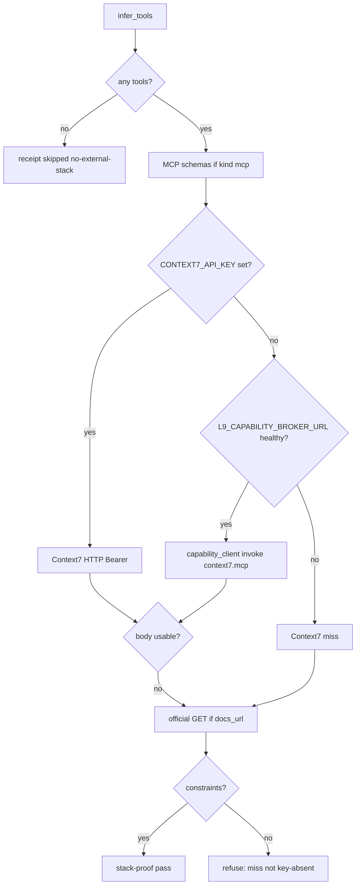

# Unblock campaign stack-proof without a raw Context7 key

## Decision

Do **not** export or resolve `CONTEXT7_API_KEY` into this Cursor agent. [`ops/secrets/surface_trust.py`](ops/secrets/surface_trust.py) classifies Cursor as model-controlled; [`docs/DEGRADED_MODE_CONTRACT.md`](docs/DEGRADED_MODE_CONTRACT.md) forbids pasting credentials to “fix” a degraded capability.

The live refuse at [`context7_fetch`](environment/program-execution/scripts/context7_stack_proof.py) is the wrong failure: a missing key is a **Context7 miss**, not an admission skip. Official GET / MCP schemas must still run. A truly inferred tool that cannot be proven still refuses.



## Evidence already in hand

- Campaign log: `FAIL: CONTEXT7_API_KEY missing on the live stack-proof path` after brief compile of `plan-ops-pr-gate-changed-files-velocity-v1`.
- This shell: no `CONTEXT7*` env names, `L9_CAPABILITY_BROKER_URL` unset.
- [`context7_fetch`](environment/program-execution/scripts/context7_stack_proof.py) raises before `_headers()` / official GET (lines 254–255).
- Workspace `API_RE` matches bare `api`, `https://`, `payload`, `sdk`. `plan_to_seed` sets `problem_statement` to the **entire** `.plan.md`, so almost every PE plan infers `upstream-api` and hits the key raise.
- Locked admission law ([`docs/plans/pe_context7_stack_proof_168778d9.plan.md`](docs/plans/pe_context7_stack_proof_168778d9.plan.md)): no live skip env; Context7 miss then official GET; missing key must not become a silent skip of the whole stage.
- Broker invoke already exists: [`ops/secrets/capability_client.py`](ops/secrets/capability_client.py) `invoke("context7.mcp", params=...)`. Registry paths are `/v1/libraries` and `/search`, not `/api/v2/libs/search`.

## Implementation (current checkout, Cursor Build)

Land on a **new feature branch** so this does not mix with dirty `main` WIP. Not a Program Lock. No `make campaign` as the execute path for *this* fix.

### 1. Treat missing key as miss

In [`environment/program-execution/scripts/context7_stack_proof.py`](environment/program-execution/scripts/context7_stack_proof.py):

- If `CONTEXT7_API_KEY` is empty and broker is not usable: `return None` (do not raise).
- If broker URL is set: `_context7_via_broker(name, query)` using `CapabilityClient.invoke("context7.mcp", {"query": ...})`. `DEGRADED` / `BLOCKED_BY_PLATFORM` / unreachable → `None`. Never log invoke bodies that could contain secrets; reuse `SECRET_RE` on any receipt field.
- Keep Bearer HTTP when the env key is already present (trusted-operator / test).
- `fetch_one_tool` already falls through to `official_docs_fetch`. Final error text: `Context7 miss and no validated official docs for {name}` (may mention key-absent / broker-unavailable as *detail*, not as the only cause).
- Do **not** honor any offline/skip env.

### 2. Tighten infer

Same file, `infer_tools` / `API_RE` / `seed_text`:

- Infer from `title`, `objective`, `tasks`, `stack_tools`, `docs_url` only. Do not scan the full `problem_statement` dump.
- `API_RE` must require a real API signal (`REST API`, `GraphQL`, `OpenAPI`, `vendor API`, `HTTP client`). Drop bare `api`, `https://`, `payload`, `sdk`, `endpoint`.
- Keep existing negation / in-repo product tests (`test_negated_and_inrepo_mentions_are_not_external_stack`).

### 3. Tests

Update [`environment/program-execution/scripts/tests/test_context7_stack_proof.py`](environment/program-execution/scripts/tests/test_context7_stack_proof.py):

- Replace `test_missing_key_refuses_on_live_fetch`: missing key + REST-API seed + no `docs_url` + no broker → refuse with **miss** wording, not the current key-only sentence.
- New: missing key + `docs_url` + injected 200 GET → `status=pass`, source `docs_url`.
- New: plan-shaped `problem_statement` with `https://github.com/...` and `make pr` / “API” in prose → `infer_tools == []` and `skipped=no-external-stack` without a key.
- New: `L9_CAPABILITY_BROKER_URL` set + stubbed `invoke` returning a constraint-bearing body → pass with a broker/context7 source; stub raising `BLOCKED_BY_PLATFORM` → miss, then official GET if provided.
- Keep: live path still ignores skip/offline env; injected `Hooks.context7_stack` remains the test seam.

### 4. Hygiene

- Remove the `#region agent log` blocks from **SSOT** [`~/.cursor-governance/environment/program-execution/scripts/context7_stack_proof.py`](/Users/ib-mac/.cursor-governance/environment/program-execution/scripts/context7_stack_proof.py) and [`run_campaign.py`](/Users/ib-mac/.cursor-governance/environment/program-execution/scripts/run_campaign.py). Those are not in this workspace copy; they must not ship.
- Do not edit `AGENTS.md` / `ARCHITECTURE.md` (no claim that pytest or stack-proof already hydrates a key).

### 5. Prove

```bash
"$HOME/.cursor-governance/.venv/bin/python" -m pytest \
  environment/program-execution/scripts/tests/test_context7_stack_proof.py -q
make pr-check
```

After the unit tests pass, `make campaign` of `pr_gate_velocity_8b9391f7.plan.md` should get past stack-proof with `skipped=no-external-stack` (no Context7 key required). That campaign re-run is verification, not this plan’s execute path.

## Out of scope

- Pasting or `resolve_secret` of `CONTEXT7_API_KEY` on Cursor
- Deploying `broker.quantumaipartners.com` or changing `surface_trust`
- Changing the PE campaign file-set or adding a skip env
- Implementing the PR-gate velocity todos themselves
