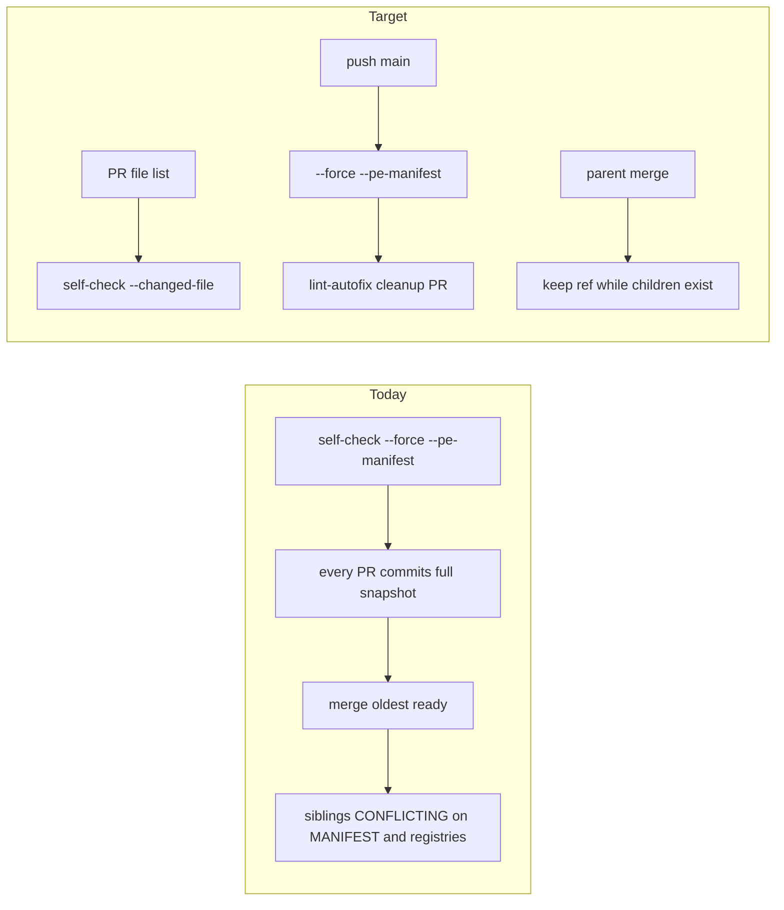

# Stop generated snapshot collisions (PE+autonomy)

Companion machine SSOT already exists: [`docs/plans/stop_generated_merge_conflicts_b8e41c2a.plan.json`](docs/plans/stop_generated_merge_conflicts_b8e41c2a.plan.json) (`validate_plan_document.py` previously PASS). The kernel-passed `.plan.md` of the same stem is **gone**. This `/l9-plan` re-projects that work onto the first-class PE template and binds it to live code.

Remediator 4.4.0 already merges oldest-ready. That is **not** this plan. After any land, siblings still go `CONFLICTING` because every PR must commit the whole generated snapshot.



## Verified ground truth

- [`.github/workflows/governance-self-check.yml`](.github/workflows/governance-self-check.yml) lines 52–77: both `pull_request` and `push` to `main` run `python3 ops/scripts/sync_generated_artifacts.py --force --pe-manifest --check --json`, then `git diff --quiet` on `RULES-MANIFEST.*`, both `skill-registry.json` trees, `AUTONOMY_MANIFEST.yaml`, `COMMANDS_MANIFEST.yaml`, `llm-rules`, PE core `MANIFEST.yaml`, and `environment/program-execution/MANIFEST.json`.
- [`ops/scripts/sync_generated_artifacts.py`](ops/scripts/sync_generated_artifacts.py) already has `--changed-file` and `should_run(changed, prefixes)`. `--force` sets `changed=None` so every generator runs. `--pe-manifest` is opt-in and required for PE `MANIFEST.json`.
- [`.github/workflows/lint-autofix.yml`](.github/workflows/lint-autofix.yml) already opens a draft cleanup PR via `peter-evans/create-pull-request` and never pushes to protected `main`. It only runs ruff today.
- [`ops/autonomy/stack_safe_merge.py`](ops/autonomy/stack_safe_merge.py) `_execute` DELETE's `refs/heads/<head>` after a REST merge when `delete_branch` is true, even when `selection["children"]` is nonempty. Proven: #343 deleted `claude/dag-skill-consolidation-5ne7g1` and GitHub closed #349.
- [`tests/ops/autonomy/test_stack_safe_merge.py`](tests/ops/autonomy/test_stack_safe_merge.py) covers method selection only. No parent-ref-keep test. No scoped self-check fixture yet.

## Execute authority

```text
.plan.md
  → @environment/program-execution  (Blueprint → Program Lock → Controller)
  → @autonomy (/autonomy → l9-bounded-autonomy)  [subordinate]
  → PE adapter cursor-foreground
```

- New branch from fetched `origin/main` (rule 46). Do not mix onto this dirty primary checkout.
- `autonomous_merge: false`. Campaign / `make pr` end green + merge-ready. Merge stays `/l9-pr-remediation`.
- After local finish: kernels, L4 authorize-release, `PR_REMEDIATE=0 make pr`.
- AGENTS.md is `additive_only`. Append a stamp. Do not fold. Protected-root template if AGENTS.md is in the PR.

## Locked contracts

1. `push` to `main` still fail-closes if the **full** snapshot is stale (`--force --pe-manifest --check`).
2. `pull_request` self-check uses `--changed-file` and **no** `--force`. If any `environment/program-execution/` source is in the PR file list, pass `--pe-manifest` and require `MANIFEST.json` in the diff set.
3. lint-autofix is the only generated janitor. It opens a cleanup PR. It does not push to `main`. Do not add a second workflow.
4. `_execute` skips `delete_ref_argv` when `selection["children"]` is nonempty. Omit CLI `--delete-branch` in that case. Extend the existing test module. Do not invent a second test path.
5. Generated-only overlap is not INVENTORY_GATE-blocking. After MERGE_OLDEST_READY + `git merge origin/main`, regen. No file-by-file audit. Do not rewrite remediator timing (already 4.4.0).
6. GitHub has no `l9-generated` merge driver. Do not pursue `.gitattributes` as a GitHub fix.
7. Do not ship unbuilt `.plan.md` on the feature PR. `kernel_gate` still requires `kernel_pass` when a plan is in the PR.
8. Do not edit [`docs/plans/pr_remediator_speed_c4b0d4ae.plan.md`](docs/plans/pr_remediator_speed_c4b0d4ae.plan.md) or `kernels/`.

## Implementation DAG

**todo-01 scope-pr-self-check** (leverage 1)
In `governance-self-check.yml`, split the generated step by event:
- `pull_request`: write the PR file list, call `sync_generated_artifacts.py --changed-file <list> --check --json`. Add `--pe-manifest` only when a PE source is listed.
- `push` to `main` / `workflow_dispatch`: keep `--force --pe-manifest --check`.
Do not change `should_run()` prefixes unless a missing prefix is proven.

**todo-02 keep-parent-ref** (parallel with todo-01)
In `stack_safe_merge.py` `_execute` and `merge_argv`: skip DELETE / omit `--delete-branch` when `selection["children"]` is nonempty. Extend [`tests/ops/autonomy/test_stack_safe_merge.py`](tests/ops/autonomy/test_stack_safe_merge.py).

**todo-03 janitor-main-generated** (after todo-01)
Add one step to `lint-autofix.yml` after ruff: `--force --pe-manifest` (no `--check`). Include generated paths in the existing "Check For Changes" + `create-pull-request` path. Same draft-PR contract. Update the PR body to name generated heal.

**todo-04 generated-heal-law** (after todo-01)
Align [`skills/l9-pr-remediation/references/run-contract.md`](skills/l9-pr-remediation/references/run-contract.md) `generated_output_overlap` with INVENTORY_GATE (non-blocking). Confirm [`generated-heal.md`](skills/l9-pr-remediation/references/generated-heal.md) already says regen-after-oldest-ready. Run remediator `self_test.py`.

**todo-05 doctrine-owners** (after todo-02)
One owner per shared clause (remediator publish, unscoped pytest, kernel hook). Later PRs **append a named fragment**. They do not rewrite `session_start_block` or the whole `run_pr_gate.sh`. AGENTS append-only stamp only.

**todo-06 tests-docs + closeout** (after todo-01, todo-02, todo-03)
- New fixture: a non-PE Python-only file list does not dirty PE `MANIFEST.json` or `skill-registry.json`.
- PE-source file list still requires `MANIFEST.json`.
- Parent-with-children skips DELETE.
- `make pr-check` on the Build worktree vs `PR_BASE=origin/main`.
- Refresh the companion JSON + project the missing PE `.plan.md` via `skills/l9-plan/scripts/render_plan_pe_autonomy.py` so `validate_plan_document.py` and `validate_plan_kernel_receipt.py` both PASS on the bound path. Do not leave the feature PR carrying an unbuilt plan.

## Success properties

- Two sibling PRs that do not share **source** files do not both list PE `MANIFEST.json` or `skill-registry.json`.
- A PR that only changes `ops/scripts/foo.py` does not fail self-check because PE `MANIFEST.json` is stale.
- A PR that changes `environment/program-execution/**` still fails if `MANIFEST.json` is omitted.
- `push` to `main` is the only `--force` snapshot **check**. lint-autofix is the only generated janitor.
- `stack_safe_merge.py --run` of a parent with an open child does not DELETE the parent ref.
- `make pr-check` PASS.

## Stress / disconfirm

- A PE-source PR that omits `MANIFEST.json` must still fail (do not weaken main).
- Janitor and scoped PR check must not fight: main holds the full snapshot; PRs omit unrelated generated files.
- After the last child retargets or lands, the parent ref may be deleted. Do not keep it forever.
- `kernel_gate` must still require `kernel_pass` when a `.plan.md` is actually in the PR.

## Out of scope

- GitHub merge drivers / `.gitattributes` as a GitHub fix
- Weakening self-check on `main`
- Folding AGENTS.md / CANONICAL_LAW.md
- Ceremony / `make pr` rewrite
- Remediator merge-timing rewrite
- Mixing onto the dirty primary checkout

## Rollback

Revert the one PR. Self-check returns to `--force --pe-manifest` on every event. `stack_safe_merge` returns to always-delete.

## Planning artifacts after confirm (before product edits)

Plan mode cannot write files. On execute, first refresh [`docs/plans/stop_generated_merge_conflicts_b8e41c2a.plan.json`](docs/plans/stop_generated_merge_conflicts_b8e41c2a.plan.json) (INVENTORY_GATE / MERGE_OLDEST_READY, `execute_via` PE+autonomy, `convergence.status=executable` only after kernel receipt), then project `.cursor/plans/stop_generated_merge_conflicts_<8hex>.plan.md` from the canonical template. That projection is the PE lease document. Product edits start only after that receipt PASSes.

## YNP

Highest-leverage next action after this plan is confirmed: `/autonomy` + Program Execution on a **new** `origin/main` worktree, starting at todo-01 and todo-02 in parallel. Do not Build on the dirty primary clone.
