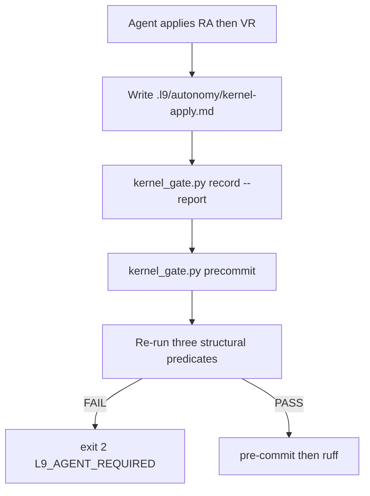

# Tighten kernel latch evidence

## Objective

Close the hole where `python3 ops/autonomy/kernel_gate.py record` then `make precommit-repo` PASSes with no kernel apply. Keep the latch. Do not turn kernels into code. Do not make `l9-recursive-optimization` the gate.

Agent path stays: Read [`kernels/Recursive Alignment.md`](kernels/Recursive%20Alignment.md), then [`kernels/Validate%20&%20Repair.md`](kernels/Validate%20&%20Repair.md), write the apply report, `record --report`, re-run `make precommit-repo`.

This file is the Cursor Build artifact. Do not run `make campaign`.

## Current hole (do not keep)

[`ops/autonomy/kernel_gate.py`](ops/autonomy/kernel_gate.py) `record()` writes `.l9/autonomy/kernel-receipt.json` (`l9.kernel_receipt.v1`) with kernel-file SHAs only. `verify_tree()` accepts that. [`tests/ops/autonomy/test_kernel_gate.py`](tests/ops/autonomy/test_kernel_gate.py) `test_record_then_precommit_passes_without_plans` is the documented cheat.

[`ops/autonomy/l4_local.py`](ops/autonomy/l4_local.py) `record_kernels()` calls the same bare `record()` inside try/except. That is a second stamp path. After this change, that call must fail the stamp and be swallowed. It must not synthesize a report.

Plan files already require non-empty `deltas` plus hashed `body_sha256` in [`skills/l9-plan/scripts/validate_plan_kernel_receipt.py`](skills/l9-plan/scripts/validate_plan_kernel_receipt.py). Leave that checker as-is. This work is the **tree** receipt.

## Target flow



## Evidence the stamp cannot fake

Three fail-closed checks. They do not prove judgment. They prove the agent produced a real artifact whose hash and paths still hold at verify.

**1. Path-confined report.** Apply report is workspace `.l9/autonomy/kernel-apply.md` (root `.gitignore` already ignores `.l9/`). YAML frontmatter plus body. Schema `l9.kernel_apply.v1`. Required fields:

- `kernels`: both `recursive_alignment` and `validate_repair`
- `deltas`: non-empty list of `{path, kernel, note}`
- `convergence_status`: `converged` | `partial` | `blocked`
- Body headings: `Recursive Alignment` and `Validate & Repair`

`kernel` on each delta must be `recursive_alignment` or `validate_repair`. `note` must be non-empty after strip.

`record --report` defaults to `.l9/autonomy/kernel-apply.md`. After resolve, the report realpath must stay under `workspace/.l9/autonomy/`. A missing file, a path that escapes that directory, or a report outside `.l9/autonomy/` is exit 2. Do not stamp from empty argv. Do not accept a report committed in the git tree as a substitute for the workspace apply file.

**2. Non-empty tree deltas.** Every delta `path` must exist on disk as a workspace-relative path. When RA/V&R made no source edits, the report itself is the allowed sole delta (`path: .l9/autonomy/kernel-apply.md`). Invented paths fail. Empty `deltas: []` fails (same rule as plan `G_PLAN_DELTAS`). Plan-path deltas stay in the plan file; do not duplicate that checker here.

**3. Cheap predicates re-run on verify.** New helper [`ops/autonomy/kernel_predicates.py`](ops/autonomy/kernel_predicates.py). `verify_tree` / `precommit` **re-run** them. Receipt may list `predicate_ids`; that list is not a pass bit.

Mandatory predicate set (always, including when `--changed-file` is empty):

- `report_structure` — file exists, confined path, frontmatter, headings, both kernels
- `report_sha` — live SHA-256 equals receipt `report_sha256`
- `delta_paths_exist` — every delta path exists

Do not add a PacketEnvelope grep as a fourth peer. That residue is not the honor-system hole and is skip-listed in the only places it appears. Do not re-run ruff, pytest, or corpus hooks here. Those already run after this latch. Predicates must stay sub-second.

## Receipt schema bump

`SCHEMA = "l9.kernel_receipt.v2"`. `verify_tree` rejects `v1` (forces one re-record with evidence). Receipt fields: existing `kernel_shas` / `head` / `applied_at` / `agent_id` plus `report_rel`, `report_sha256`, `deltas`, `predicate_ids`. Still bound to kernel-file SHAs, not HEAD — a later rewrite commit does not force a second LLM apply if the report file and its hash still match.

Python signature: `record(root, *, gov, report: Path)`. Callers that omit `report` must raise. CLI supplies the default path.

## Close the other stamp

`l4_local.record_kernels` must stop producing a passing tree receipt. Keep the existing try/except: call `record` without a report (TypeError) or call a new explicit refuse. Do **not** write `.l9/autonomy/kernel-apply.md` from L4. Do **not** change `authorize_release` to require a tree receipt. Kernels are not an L4 phase.

These tests keep calling `record_kernels` and must keep passing because they assert L4 remote allow, not tree verify:

- [`tests/ops/autonomy/test_l4_local.py`](tests/ops/autonomy/test_l4_local.py)
- [`tests/ops/autonomy/test_merge_gate.py`](tests/ops/autonomy/test_merge_gate.py)
- [`tests/ops/autonomy/test_gate_named_roots.py`](tests/ops/autonomy/test_gate_named_roots.py)
- [`tests/ops/autonomy/test_kernel_gate.py`](tests/ops/autonomy/test_kernel_gate.py) `test_authorize_release_without_record_kernels`

## Agent-facing text only (routing, not a gate)

Update `_agent_required_tree()`:

1. Apply RA then V&R on the finished tree
2. Write `.l9/autonomy/kernel-apply.md` (required shape)
3. Commit any source revisions; report stays local under `.l9/`
4. `python3 ops/autonomy/kernel_gate.py record --workspace <this workspace> --report .l9/autonomy/kernel-apply.md`
5. Re-run `make precommit-repo`

Optional one-liner: if the bound target is a pack, plan, or prompt group, Read `l9-recursive-optimization` first, then still write the same report and `record --report`. The skill does not stamp. The hook does not invoke the skill.

Update the `kernel_hook.note` in [`ops/autonomy/surface_profile.yaml`](ops/autonomy/surface_profile.yaml) to say receipt is v2 plus report plus re-run predicates.

## Out of scope (explicit)

- No kernel VM, no LLM call inside the hook, no `beforeSubmitPrompt` inject (already removed on purpose)
- No `make kernels` verb, no Makefile edit, no `AGENTS.md` edit (additive_only / protected root)
- No edit to [`ops/scripts/run_pr_precommit.sh`](ops/scripts/run_pr_precommit.sh); `precommit` argv is unchanged
- No Pre-flight / Leverage / Improve on the tree velocity path
- No tracked report in git
- Plan `kernel_pass` checker unchanged

## Tests (replace the cheat)

Edit [`tests/ops/autonomy/test_kernel_gate.py`](tests/ops/autonomy/test_kernel_gate.py). Add a helper that writes a minimal valid apply report under the stacked repo `.l9/autonomy/`.

- `record()` without `report=` raises; missing file / escaped path / empty deltas → no valid receipt; `precommit` stays 2
- Valid report plus `record(..., report=)` → `precommit` 0
- Delete or edit report after stamp → `verify_tree` fails (`report_sha`)
- Delta path that does not exist → `record` fails
- Report-only delta (no source edits) → allowed
- `record_kernels` without a v2 report → `verify_tree` still fails
- Keep: HEAD move does not require a second apply when report plus hash still match
- Keep: plan-without-`kernel_pass` still fails after a valid tree receipt
- Keep: authorize-release still does not require kernels

Targeted prove (fixed list, all exist):

```bash
.venv/bin/python -m pytest \
  tests/ops/autonomy/test_kernel_gate.py \
  tests/ops/autonomy/test_l4_local.py \
  tests/ops/autonomy/test_merge_gate.py \
  tests/ops/autonomy/test_gate_named_roots.py \
  -q
```

## Doc / root surface

N/A for `AGENTS.md` / `Makefile`. Hook stderr plus `surface_profile.yaml` are the contract. `.pre-commit-config.yaml` is the hook catalog; this latch stays first in `run_pr_precommit.sh` `_run_kernel`.

Build write_deny: pathspecs only. Do not stage `Makefile`, `AGENTS.md`, or foreign dirty on this checkout. If HEAD is `main`, open a feature branch before the first edit.

## Stress / leverage

- Disconfirming: an agent can still write a vacuous “no findings” report. Accepted. This plan closes *stamp-without-artifact*, not *judgment*.
- Assumed false if: predicates grow into a second catalog (reject; keep the three ids).
- Blast radius: every existing v1 `.l9/autonomy/kernel-receipt.json` FAILs until one evidence `record`. Local only; gitignored. L4 authorize tests stay green without a tree receipt.
- Rollback: revert [`ops/autonomy/kernel_gate.py`](ops/autonomy/kernel_gate.py), [`ops/autonomy/kernel_predicates.py`](ops/autonomy/kernel_predicates.py), [`ops/autonomy/l4_local.py`](ops/autonomy/l4_local.py), [`ops/autonomy/surface_profile.yaml`](ops/autonomy/surface_profile.yaml), and the autonomy tests listed above. Leftover v2 receipts are local.
- Leverage: one `record()` signature change closes both the CLI cheat and the L4 bypass without teaching L4 to forge the report.

## Execute via Cursor Build

Press **Build**. Work in the **current checkout** on a feature branch (do not mix onto unrelated WIP).

- Do not run `make campaign`.
- Do not admit a Program Lock or Controller lease.
- Do not write `Lock: origin/main = <sha>`.
- Do not open a new worktree from tip as a planning requirement.
- Do not edit `AGENTS.md` or `Makefile`.
