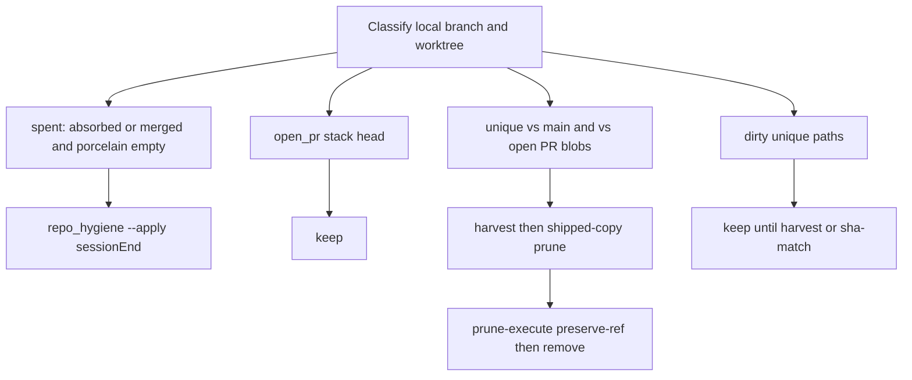

# PLAN: Worktree prune-execute and shipped-copy close

> Skill: `l9-plan-simple`. Press **Build**, then lock the same todos with `/gmp`. Do not run `make campaign`. Do not admit a Program Lock. Do not write `Lock: origin/main = <sha>`.
> Hook catalog: [`.pre-commit-config.yaml`](.pre-commit-config.yaml)
> Kernels applied to this plan: [`kernels/Improve.md`](kernels/Improve.md) then [`kernels/Validate & Repair.md`](kernels/Validate & Repair.md). Implementation turn follows [`kernels/Build.md`](kernels/Build.md) (one complete pack, no stub scripts) under GMP Phases 0–6.

## Execute via Cursor Build

Press **Build**. Work in the **current checkout**.

- Do not run `make campaign`.
- Do not admit a Program Lock or Controller lease.
- Do not write `Lock: origin/main = <sha>`.
- Do not open a new worktree from tip as a planning requirement.
- After Build starts implementation, invoke `/gmp` against this plan so Phases 0–6 lock the todos below.

## Architect framing

91 registered worktrees is not “no delete tool.” SessionEnd already deletes **spent, clean** residue via [`ops/scripts/repo_hygiene.py`](ops/scripts/repo_hygiene.py) ([`ops/scripts/REPO_HYGIENE.md`](ops/scripts/REPO_HYGIENE.md)): preserve ref under `refs/l9/preserved/`, then `git worktree remove`, then local branch delete. It never touches dirty trees, open PR heads, `campaign/*`, or branches whose content is not on `origin/main`.

[`skills/l9-git-work-preserve`](skills/l9-git-work-preserve/SKILL.md) already **names** `prune-execute` (`L9_GIT_PRUNE_AUTHORIZED` + high-confidence receipt) and forbids `git branch -D` / `worktree remove` without it. There is **no** `scripts/prune_execute.py`. That is the missing close.

**Do not** widen sessionEnd to force-delete 91 trees. Auto-delete stays `merged`/`absorbed` + clean porcelain. Auth-gated prune-execute removes `[gone]` locals whose work is already on **main or an open PR** by `patch_id` / blob identity, not by ahead-count.

## Improve deltas (applied to this plan)

- Two owners, one evidence language: hygiene = automatic spent; preserve prune-execute = explicit leftover refs/worktrees.
- Spent is content identity (`content_in_main`, `git cherry` `patch_id`, open-PR blob match), never “N commits ahead.”
- Paginate GitHub PR list: [`GH_LIMIT = 200`](ops/scripts/repo_hygiene.py) cannot see ~320 PRs; `pr_index` must page until exhausted or document fail-closed.
- Preserve-ref before every worktree or branch delete (same `refs/l9/preserved/` as hygiene).
- Never delete open stack heads (#379–#384 today) or `campaign/*`.
- Harvest close is untracked **shipped copies** (sha256 match), not `unlink` of tracked files in a PR checkout.

## Validate and Repair deltas (applied to this plan)

- `prune-execute --apply` fail-closes if `git fetch --prune origin` fails. Hygiene sessionEnd may stay fail-soft on network (existing comment at `ensure_origin_head`).
- `content_superset` never authorizes `git branch -D` ([`references/prune-policy.md`](skills/l9-git-work-preserve/references/prune-policy.md)).
- Any porcelain that is not a sha-match shipped copy blocks `worktree remove`.
- Receipts go to `.l9/hygiene/` (gitignored), not `WIP/_receipts/` (those re-enter harvest).
- Remote `git push --delete` still requires `remote_delete=1` in the auth reason plus a second explicit user confirmation. Default is local only.
- First live cleanup is `report` then human-authorized `--apply` of **spent** plus prune-execute of **receipt-backed** leftovers. Not a silent sessionEnd expansion.

## Immutable baseline (workspace bind, not Program Lock)

- Workspace: `/Users/ib-mac/Cursor-Governance` (dirty primary clone is fine; do not mix this work onto `feat/pr-train-pack-overlap` residue if that branch is still the checkout — Build may use a dedicated worktree as an **execution** step under rule 49, not as a planning lock).
- SSOT `~/.cursor-governance`: stay read-mostly; do not prune SSOT as if it were a leftover agent worktree.
- Re-verify HEAD and dirty set at execution start (`on_drift: stop_and_replan` for write_allow overlap).

## Objective

Make leftover worktrees and `[gone]` local branches deletable with the same diagnose-first law as harvest: report first, preserve-ref, delete only when unique value is proven absent (on `origin/main` or already on an **open** PR). Keep the live PR stack. Keep unique dirty bytes.

### Success properties

- SP-01: `repo_hygiene.py` PR index includes every GitHub PR for the repo (page `gh pr list`, no silent 200 cap). Fixture or recorded `gh` JSON with more than 200 heads proves the extra heads are classified.
- SP-02: `python3 skills/l9-git-work-preserve/scripts/prune_execute.py --repo <fixture> --json` reports removable worktrees/branches; without `L9_GIT_PRUNE_AUTHORIZED` and `--apply`, zero `git worktree remove` / `git branch -D`. With both, preserve-ref exists, then worktree gone, then local branch gone; `git branch recovered <preserve-ref>` restores the tip.
- SP-03: Open-PR head worktrees stay. Dirty unique files stay. Untracked file whose sha256 equals an open-PR blob at the same path (or casefold `docs/plans/built` vs `BUILT`) is unlinked; tracked file on that path in a checkout that has it at HEAD is never unlinked.
- SP-04: `pack_self_test.py` and `tests/ops/scripts/test_repo_hygiene.py` cover the new branches; `validate_pack_structure.py` requires the new scripts. `.pre-commit-config.yaml` is the hook catalog for the publish checkout.

## Capability preflight

- CP-01: `git` + locked `.venv` python
- CP-02: `gh` for PR paging (fail-closed on `--apply` if required for open-PR blob index)
- CP-03: write_allow paths writable

## Execution envelope

**write_allow:** `skills/l9-git-work-preserve/**`, `ops/scripts/repo_hygiene.py`, `ops/scripts/REPO_HYGIENE.md`, `tests/ops/scripts/test_repo_hygiene.py`, `AGENTS.md` only if an **append-only** fragment is required (prefer skill + REPO_HYGIENE.md).

**write_deny:** `CANONICAL_LAW.md`, secrets, `WIP/Legal Defense/`, live PR branch files except via preserve-ref recovery, force-push.

**Commands allow:** git (no force-push/hard-reset), `gh pr list`, pytest targeted, `pack_self_test.py`, `validate_pack_structure.py`, `make precommit-repo`.

**Commands deny:** `git push --delete` unless `remote_delete=1` + second user confirm; `git stash drop`; deleting `campaign/*`; unlinking tracked files in open-PR worktrees.

**Network:** `named_services_only` — GitHub `gh` for PR list.

**Autonomous merge:** false.

## Execution DAG

Critical path: `todo-01-report` → `todo-02-gh-page` → `todo-03-prune-execute` → `todo-04-shipped-copies` → `todo-05-skill-docs` → `todo-06-tests` → `todo-07-first-apply`

Forbidden: prune-execute `--apply` before SP-02 tests; sessionEnd auto-delete of `open_pr` or `unmerged_no_pr`; mixing this onto an unrelated dirty primary branch without a dedicated worktree at execute time.

## Todos (Build / GMP lock)

1. **todo-01-report** — Run [`ops/scripts/repo_hygiene.py`](ops/scripts/repo_hygiene.py) `--json` (no `--apply`) on the workspace clone; count worktrees by `spent` / `dirty` / `open_pr` / `active` / `missing`. This is the census the delete tool will be measured against.
2. **todo-02-gh-page** — Replace single `--limit 200` in `pr_index` with pagination (or `--limit` high enough and a test that 201+ heads are not dropped). Keep “most recent PR per head” merge. Fail-closed on `--apply` when `gh` cannot answer if open-PR classification is required.
3. **todo-03-prune-execute** — Add [`skills/l9-git-work-preserve/scripts/prune_execute.py`](skills/l9-git-work-preserve/scripts/prune_execute.py): default JSON report; `--apply` requires `L9_GIT_PRUNE_AUTHORIZED`; consume diagnose receipts (`prune_candidate` high, or `archive_ref` + `redundancy_basis: patch_id` only); preserve-ref; remove worktrees before branches; local delete only unless `remote_delete=1`. Reuse hygiene preserve-ref helper if extracting would duplicate — prefer calling shared functions over a second preserve namespace.
4. **todo-04-shipped-copies** — Add `scripts/prune_open_pr_copies.py`: report-only default; `--apply` unlinks **untracked** sha-matches across sibling worktrees; restore ` M` overlays that match an open-PR blob to that leftover worktree’s HEAD (drop duplicate dirt, keep unique committed); never `unlink` if `HEAD:path` exists. Index open PR ACMR vs `origin/main` after fetch.
5. **todo-05-skill-docs** — Update SKILL compact workflow (harvest → publish → shipped-copy prune → prune-execute last), [`references/prune-policy.md`](skills/l9-git-work-preserve/references/prune-policy.md), [`references/harvest-workflow.md`](skills/l9-git-work-preserve/references/harvest-workflow.md) post-publish, [`references/output-receipt.schema.yaml`](skills/l9-git-work-preserve/references/output-receipt.schema.yaml) if a new mode string is needed, [`ops/scripts/REPO_HYGIENE.md`](ops/scripts/REPO_HYGIENE.md) pointing at preserve prune-execute for non-spent leftovers. Do not fold AGENTS.md unless an append-only pointer is necessary.
6. **todo-06-tests** — Extend [`scripts/pack_self_test.py`](skills/l9-git-work-preserve/scripts/pack_self_test.py) and [`tests/ops/scripts/test_repo_hygiene.py`](tests/ops/scripts/test_repo_hygiene.py); add scripts to [`scripts/validate_pack_structure.py`](skills/l9-git-work-preserve/scripts/validate_pack_structure.py) REQUIRED. Fixture: clean absorbed worktree removed; dirty unique kept; open_pr kept; untracked clone of PR blob removed; tracked PR checkout untouched.
7. **todo-07-first-apply** — After tests PASS: `repo_hygiene.py --apply` for **spent** only (existing SAFE_TO_DELETE). Then prune-execute `--apply` only for receipt-backed leftovers. Record before/after worktree counts. Do not delete the #379–#384 stack. Ask before any `remote_delete=1`.

## Side effects

- todo-01: filesystem_read, safe_to_repeat
- todo-02–06: filesystem_mutation, safe_with_dedupe
- todo-07: destructive_filesystem_mutation (local refs/worktrees only), compensate via `refs/l9/preserved/`

## Rollback

- Code: scoped restore / revert on write_allow
- Local git: `git worktree add` / `git branch recovered refs/l9/preserved/...`
- No force-push; no remote branch delete unless explicitly authorized twice

## Stress and disconfirm

- If `content_in_main` is true while unique commits still matter (binary/mode-only): keep; do not delete (existing MAX_DIFF_PATHS already refuse wide diffs).
- If `gh` pages lie (duplicate heads): keep open_pr when **any** open PR uses that head.
- If 91 trees are mostly `dirty` not `spent`: shipped-copy + harvest first; prune-execute will not empty the machine in one apply — that is correct.
- Blast: deleting a worktree that still held unique uncommitted files. Mitigation: porcelain gate + sha-match-only for untracked.

## Out of scope

- Auto-deleting all 91 worktrees at sessionEnd
- Stash drop
- Force-push / hard-reset / admin-merge
- Remote branch delete as default
- Harvesting remaining unique product (`resolve_pr_stack.sh`, mismatched plans) in this PR
- Inventing a second skill besides `l9-git-work-preserve` + existing `repo_hygiene.py`

## Follow-on (separate plan)

- Drain leftover unique dirt (sha-mismatch plans, ceremony-align scripts) via harvest onto the open stack
- Optional: raise sessionEnd to call shipped-copy prune report-only

## Convergence

- executable_when: envelope + DAG filled; no blocking unknowns
- complete_when: SP-01–SP-04 evidence recorded; first apply counted; pack_self_test PASS
- execute_via: `cursor-build` then `/gmp`

## kernel_pass (stamp on the bound `.plan.md` at write time)

Improve ran in this planning turn: split auto vs auth delete; evidence not ahead-count; page gh; preserve-ref; never unlink tracked PR checkouts.
Validate and Repair ran in this planning turn: fetch fail-closed on apply; content_superset never -D; porcelain gate; receipts not under WIP/; remote_delete extra confirm; tests before first apply.

`body_sha256` must be the canonical SHA of the saved plan file (all `body_sha256` scalars zeroed) per `skills/l9-plan/scripts/validate_plan_kernel_receipt.py`. Empty `deltas` is FAIL.
