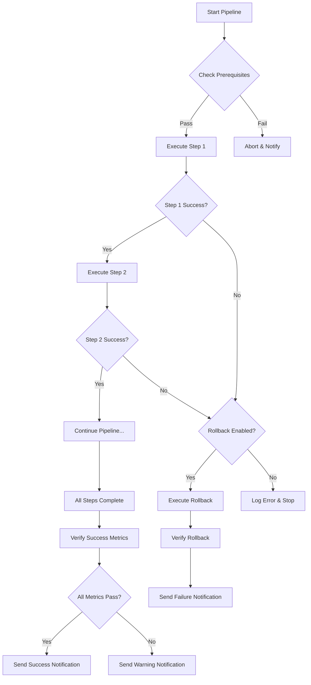

# 🎭 Pipeline Orchestrator
**Version:** 1.0.0  
**Category:** Framework  
**Last Updated:** 2025-10-01

---

## 🎯 Purpose
Execute predefined command sequences with automatic error handling, rollback capabilities, and progress tracking. The orchestrator combines multiple commands into reliable, repeatable workflows.

---

## 📚 Available Pipelines

### 1️⃣ DEPLOY_TO_PRODUCTION

**Purpose:** Complete production deployment with full validation and safety checks.

**Pipeline Steps:**
```yaml
pipeline: deploy_to_production
steps:
  1. audit-full                    # Pre-deployment audit
  2. backup-versioned              # Create safety backup
  3. workflow-validate             # Validate all workflows
  4. credentials-manage            # Verify credentials
  5. security-audit                # Security check
  6. workflow-deploy               # Deploy to production
  7. performance-profile           # Post-deployment health check

rollback_on_error: true
notify_on_complete: whatsapp
estimated_duration: 15-20min
risk_level: high
```

**When to Use:**
- Deploying new workflows to production
- Major version updates
- After significant changes

**Success Criteria:**
- All validation steps pass
- Zero security vulnerabilities
- All workflows active and healthy

---

### 2️⃣ EMERGENCY_ROLLBACK

**Purpose:** Immediate recovery to last known good state.

**Pipeline Steps:**
```yaml
pipeline: emergency_rollback
steps:
  1. workflow-validate (current)   # Check current state
  2. backup-versioned (emergency)  # Emergency backup of broken state
  3. restore-from-backup           # Restore last good backup
  4. workflow-validate (restored)  # Verify restoration
  5. performance-profile           # Confirm health

notify_on_complete: whatsapp (urgent)
estimated_duration: 2-5min
risk_level: high
```

**When to Use:**
- Production system failure
- Critical bugs discovered
- Emergency recovery needed

---

### 3️⃣ WEEKLY_MAINTENANCE

**Purpose:** Automated weekly maintenance routine.

**Pipeline Steps:**
```yaml
pipeline: weekly_maintenance
steps:
  1. backup-versioned              # Weekly backup
  2. cleanup-workspace             # Remove temp files
  3. archive-legacy                # Archive old files
  4. node-update                   # Update deprecated nodes
  5. security-audit                # Weekly security check
  6. dependency-map                # Update architecture docs
  7. performance-profile           # Performance report

schedule: "Sunday 2:00 AM"
rollback_on_error: false
notify_on_complete: slack
estimated_duration: 10-15min
risk_level: safe
```

**When to Use:**
- Scheduled weekly (automated)
- Manual maintenance windows
- Before major sprints

---

### 4️⃣ NEW_WORKFLOW_SETUP

**Purpose:** Setup and validate new workflow before integration.

**Pipeline Steps:**
```yaml
pipeline: new_workflow_setup
steps:
  1. workflow-validate             # Validate JSON structure
  2. dependency-map                # Check dependencies
  3. security-audit                # Check for vulnerabilities
  4. sticky-generate               # Add documentation
  5. credentials-manage            # Verify required credentials
  6. backup-versioned              # Backup before integration

estimated_duration: 5-10min
risk_level: moderate
```

---

### 5️⃣ RAPID_ANALYSIS

**Purpose:** Quick comprehensive analysis of current workspace state.

**Pipeline Steps:**
```yaml
pipeline: rapid_analysis
steps:
  1. workspace-scan                # Structure analysis
  2. dependency-map                # Workflow relationships
  3. performance-profile           # Performance metrics
  4. security-audit                # Security status
  5. audit-full                    # Complete audit

estimated_duration: 5-8min
risk_level: safe
```

---

### 6️⃣ PROJECT_INITIALIZE

**Purpose:** "First Day Protocol" - Comprehensive project discovery and initialization.

**Pipeline Steps:**
```yaml
pipeline: project_initialize
nickname: "First Day Protocol"
steps:
  1. backup-versioned              # Create safety net
  2. workspace-scan                # Get 30,000-foot view
  3. dependency-map                # Understand architecture
  4. workflow-validate             # Health check
  5. credentials-manage            # Security validation
  6. audit-full                    # Production readiness
  7. pattern-extract               # Learn successful patterns

estimated_duration: 12-18min
risk_level: safe
creativity_level: HIGH 🎨
```

**When to Use:**
- First day on new project
- Returning after long break
- Post-clone setup
- Onboarding team members
- Pre-major refactor

**Success Criteria:**
- Complete understanding of project architecture
- All documentation generated
- Safety backup created
- Confidence to make changes

**Philosophy:** "Understand before you touch, backup before you understand"

---

## 🚀 How to Execute Pipelines

### Method 1: Direct Call
```
PIPELINE_EXECUTE deploy_to_production
```

### Method 2: With Options
```
PIPELINE_EXECUTE deploy_to_production --dry-run --skip-step=6 --notify=slack
```

### Method 3: Custom Pipeline
```
PIPELINE_CUSTOM [audit-full, backup-versioned, workflow-deploy]
```

---

## 🎛️ Pipeline Options

### Global Flags
- `--dry-run` - Simulate without executing
- `--skip-step=N` - Skip specific step number
- `--start-from=N` - Start from step N
- `--stop-after=N` - Stop after step N
- `--notify=[whatsapp|slack|none]` - Notification preference
- `--no-rollback` - Disable automatic rollback
- `--verbose` - Detailed output
- `--parallel` - Run independent steps in parallel

---

## 📊 Pipeline Execution Flow



---

## 🔧 Creating Custom Pipelines

### Simple Custom Pipeline
```yaml
name: my_custom_pipeline
description: "My specific workflow"
steps:
  - command: workflow-validate
    on_error: stop
  - command: backup-versioned
    on_error: continue
  - command: workflow-deploy
    on_error: rollback
    
notifications:
  on_success: slack
  on_failure: whatsapp
  on_warning: email
```

### Advanced Custom Pipeline
```yaml
name: advanced_deployment
description: "Advanced deployment with parallel steps"
steps:
  - stage: validation
    parallel: true
    commands:
      - workflow-validate
      - security-audit
      - performance-profile
    on_error: stop
    
  - stage: backup
    commands:
      - backup-versioned
    on_error: stop
    
  - stage: deployment
    commands:
      - workflow-migrate
      - workflow-deploy
    on_error: rollback
    rollback_to: backup
    
  - stage: verification
    parallel: true
    commands:
      - dependency-map
      - performance-profile
    on_error: warn

retry_policy:
  max_retries: 3
  retry_delay: 30s
  exponential_backoff: true
```

---

## 📈 Pipeline Monitoring

### Real-Time Progress
```
Pipeline: DEPLOY_TO_PRODUCTION
Status: In Progress (Step 4/7)

✅ Step 1: audit-full (completed in 2m 15s)
✅ Step 2: backup-versioned (completed in 45s)
✅ Step 3: workflow-validate (completed in 1m 30s)
🔄 Step 4: credentials-manage (in progress...)
⏸️  Step 5: security-audit (waiting)
⏸️  Step 6: workflow-deploy (waiting)
⏸️  Step 7: performance-profile (waiting)

Estimated Time Remaining: 8-12 minutes
```

---

## 🚨 Error Handling & Rollback

### Automatic Rollback Triggers
1. **Critical Error:** Step fails with exit code != 0
2. **Validation Failure:** Success metrics not met
3. **Timeout:** Step exceeds maximum duration
4. **Manual Abort:** User cancels pipeline

### Rollback Procedure
```yaml
rollback_steps:
  1. Stop current execution immediately
  2. Identify last successful backup point
  3. Execute restore-from-backup command
  4. Validate restoration success
  5. Send notification with details
  6. Log incident for analysis
```

---

## 📊 Pipeline Reports

### Post-Execution Report
```markdown
# Pipeline Execution Report
**Pipeline:** DEPLOY_TO_PRODUCTION
**Execution ID:** 2025-10-01-143052
**Status:** ✅ SUCCESS
**Duration:** 18m 42s

## Step Summary
| Step | Command | Duration | Status |
|------|---------|----------|--------|
| 1 | audit-full | 2m 15s | ✅ Pass |
| 2 | backup-versioned | 45s | ✅ Pass |
| 3 | workflow-validate | 1m 30s | ✅ Pass |
| 4 | credentials-manage | 52s | ✅ Pass |
| 5 | security-audit | 3m 10s | ✅ Pass |
| 6 | workflow-deploy | 8m 20s | ✅ Pass |
| 7 | performance-profile | 1m 50s | ✅ Pass |

## Success Metrics
✅ All workflows deployed successfully
✅ Zero security vulnerabilities detected
✅ Performance within acceptable thresholds
✅ All credentials validated

## Notifications Sent
- WhatsApp to +1-980-266-9595 (SUCCESS)
- Slack #deployments channel (DETAILED REPORT)

## Artifacts
- Backup: backups/BACKUP_20251001_143052.tar.gz
- Logs: logs/deploy_20251001_143052.log
- Report: reports/deploy_20251001_143052.md
```

---

## 💡 Best Practices

### 1. Always Run Dry-Run First
```bash
PIPELINE_EXECUTE deploy_to_production --dry-run
```

### 2. Create Backups Before Risky Operations
Always include `backup-versioned` before high-risk commands.

### 3. Use Parallel Execution for Independent Tasks
Speeds up pipelines by 40-60% when applicable.

### 4. Set Up Notifications
Configure both success and failure notifications.

### 5. Schedule Maintenance Pipelines
Automate weekly/monthly maintenance routines.

### 6. Log Everything
Keep detailed logs for auditing and troubleshooting.

---

## 🔗 Pipeline Combinations

### Common Sequences
1. **Daily:** rapid-analysis
2. **Before Deploy:** new-workflow-setup → deploy-to-production
3. **Weekly:** weekly-maintenance
4. **Emergency:** emergency-rollback
5. **After Major Changes:** deploy-to-production → rapid-analysis

---

## 📚 Related Commands
- All commands in `/commands/` directory can be used in pipelines
- See `meta.yaml` for complete command registry
- See `standards.md` for command creation guidelines

---

*Orchestrator Version: 1.0.0*  
*Supports: Sequential & Parallel Execution*  
*Max Concurrent Steps: 5*

