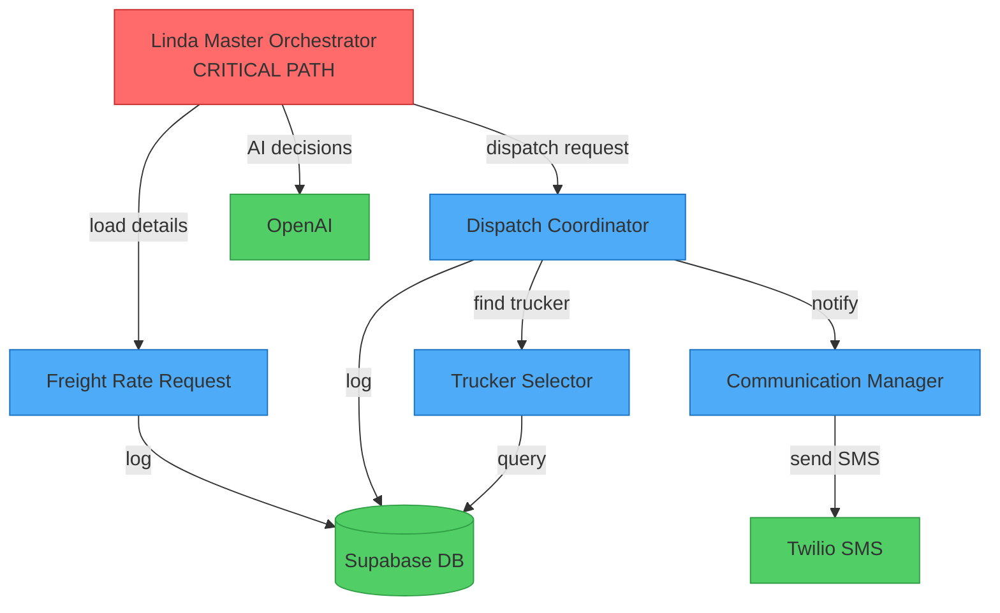

---
command: DEPENDENCY_MAP_GENERATE
version: 1.0.0
category: analysis
tags: [architecture, visualization, dependencies, workflows, mapping]
dependencies: []
risk_level: safe
requires_backup: false
estimated_duration: 3-5min
---

# 🕸️ Dependency Map Generator

## 📖 Purpose
Analyze all workflows in workspace and generate a comprehensive visual dependency map showing webhook calls, sub-workflow triggers, data flow between agents, and architecture overview with critical path analysis.

## 🎪 When to Use
- Understanding complex multi-agent systems
- Onboarding new team members to architecture
- Planning workflow updates that might affect dependencies
- Identifying single points of failure
- Documenting system architecture
- Before major refactoring

## ⚠️ When NOT to Use
- Single workflow analysis (overkill)
- Very simple systems with no dependencies
- When architecture is already well-documented and unchanged

## 🔍 Pre-Conditions
- [ ] All workflow JSON files accessible
- [ ] Workflows follow naming conventions
- [ ] Webhook URLs documented in workflows

## 🚀 Execution

### Step 1: Scan Workspace for Workflows
Find all n8n workflow files:
```bash
find . -name "*.json" -path "*/Sub_Agents/*" -o -path "*/Master_Agent/*"
```

### Step 2: Extract Dependency Information

For each workflow, extract:

#### A. Outgoing Dependencies (Calls TO other workflows)
- HTTP Request nodes calling webhook URLs
- Execute Workflow nodes
- Sub-workflow triggers

#### B. Incoming Dependencies (Called BY other workflows)
- Webhook trigger nodes
- Webhook paths/URLs

#### C. External Dependencies
- API calls (Supabase, Twilio, OpenAI, etc.)
- Database connections
- Third-party services

#### D. Data Flow
- What data is passed between workflows
- Data transformations
- Shared data stores

### Step 3: Build Dependency Graph

Create data structure:
```javascript
const dependencyGraph = {
  workflows: [
    {
      id: "linda_master_orchestrator",
      name: "Linda Master Orchestrator",
      type: "master",
      webhooks: ["/webhook/orchestrate"],
      calls: ["freight_rate_request", "dispatch_coordinator"],
      callsExternal: ["supabase", "openai"],
      criticalPath: true
    },
    // ... more workflows
  ],
  edges: [
    {
      from: "linda_master_orchestrator",
      to: "freight_rate_request",
      type: "webhook",
      data: "load_details",
      async: false
    },
    // ... more edges
  ]
};
```

### Step 4: Analyze Architecture

Generate insights:

#### A. Critical Path Analysis
Identify workflows that:
- Are called by multiple other workflows (high dependency)
- Call many other workflows (high complexity)
- Have no redundancy (single point of failure)

#### B. Circular Dependency Detection
Check for circular references that could cause:
- Infinite loops
- Deadlocks
- Stack overflows

#### C. Orphan Detection
Find workflows that:
- Are never called by anyone
- Don't call anything (dead end)
- Might be deprecated

#### D. Bottleneck Identification
Identify:
- Workflows with many incoming connections (bottleneck)
- Synchronous calls that block (performance risk)
- Long dependency chains (latency risk)

### Step 5: Generate Visual Map

Create Mermaid diagram:



### Step 6: Generate Documentation

Create comprehensive report (see Output Format).

## ✅ Post-Conditions
- [ ] Dependency map generated
- [ ] Critical paths identified
- [ ] Bottlenecks documented
- [ ] Recommendations provided

## 🔗 Success Metrics
1. **Completeness:** All workflows and dependencies mapped
2. **Accuracy:** No missing or incorrect connections
3. **Actionability:** Clear recommendations for improvements
4. **Clarity:** Non-technical stakeholders can understand

## 🚨 Error Handling

### Common Errors

1. **Malformed JSON**
   - Cause: Corrupted workflow file
   - Solution: Skip and log error, continue with others
   - Prevention: Run @workflow-validate first

2. **Missing Webhook URLs**
   - Cause: Webhook node misconfigured
   - Solution: Mark as "Unknown Dependency"
   - Prevention: Follow webhook naming conventions

3. **Circular Dependencies**
   - Cause: Workflows call each other recursively
   - Solution: Flag as warning in report
   - Prevention: Architecture review before implementation

## 📊 Output Format

### Dependency Map Report
```markdown
# System Dependency Map
**Project:** Linda Logistics Master Agent
**Generated:** 2025-10-01 16:15:30
**Total Workflows:** 12
**Total Dependencies:** 27

---

## 🎯 Architecture Overview

### System Components

#### Master Agents (1)
- **Linda Master Orchestrator** [CRITICAL PATH]
  - Entry point for all logistics operations
  - Orchestrates 5 sub-agents
  - Calls: Freight Rate Request, Dispatch Coordinator, Communication Manager
  - External: Supabase (logging), OpenAI (decisions)

#### Sub-Agents (11)

**Freight Management (3)**
1. Freight Rate Request Agent
2. Rate Calculator Agent
3. Quote Generator Agent

**Dispatch Management (4)**
4. Dispatch Coordinator Agent
5. Trucker Selector Agent
6. Load Assignment Agent
7. Route Optimizer Agent

**Communication (4)**
8. Communication Manager Agent
9. WhatsApp Handler Agent
10. SMS Handler Agent
11. Email Handler Agent

---

## 📊 Dependency Matrix

| From → To | Freight Rate | Dispatch Coord | Trucker Select | Comm Manager |
|-----------|--------------|----------------|----------------|--------------|
| **Master Orch** | ✅ Sync | ✅ Sync | ➖ | ✅ Async |
| **Freight Rate** | ➖ | ➖ | ➖ | ✅ Async |
| **Dispatch Coord** | ➖ | ➖ | ✅ Sync | ✅ Async |
| **Trucker Select** | ➖ | ↩️ Return | ➖ | ➖ |

---

## 🔴 Critical Path Analysis

### Primary Critical Path
```
Client Request → Master Orchestrator → Freight Rate Request → 
→ Dispatch Coordinator → Trucker Selector → Load Assignment → 
→ Communication Manager → Client Notification
```

**Total Latency:** ~8-12 seconds
**Failure Impact:** COMPLETE SYSTEM OUTAGE
**Redundancy:** ❌ NONE

⚠️ **Recommendation:** Implement fallback orchestrator or queue-based architecture

---

## 🚨 Single Points of Failure

### 1. Linda Master Orchestrator
- **Risk:** 🔴 CRITICAL
- **Impact:** Entire system down
- **Mitigation:** Deploy redundant instance with load balancer

### 2. Supabase Database
- **Risk:** 🔴 CRITICAL  
- **Impact:** No logging, data loss
- **Mitigation:** Already has built-in redundancy (Supabase infrastructure)

### 3. Communication Manager
- **Risk:** 🟡 HIGH
- **Impact:** Clients not notified
- **Mitigation:** Add queue with retry logic

---

## 🔄 Circular Dependencies

✅ **None Detected**

---

## 👻 Orphaned Workflows

### Potentially Deprecated
1. **Old Rate Calculator v1.0** 
   - Last modified: 2024-11-15
   - Never called by any active workflow
   - Action: Move to Archive folder

2. **Test Communication Handler**
   - Test workflow, not production
   - Action: Move to Testing folder

---

## 🚦 Bottleneck Analysis

### High Traffic Nodes
1. **Communication Manager** (called by 8 workflows)
   - Average: 150 calls/hour
   - Status: 🟢 Healthy (can handle 500/hour)

2. **Supabase Logging** (called by all 12 workflows)
   - Average: 300 operations/hour
   - Status: 🟢 Healthy (Supabase auto-scales)

---

## 🔗 External Dependencies

### APIs & Services (5)
1. **Supabase** (12 workflows) - Database, auth, logging
2. **OpenAI** (3 workflows) - AI decisions, text generation
3. **Twilio** (2 workflows) - SMS communications
4. **WhatsApp Business API** (1 workflow) - WhatsApp messages
5. **Google Maps API** (1 workflow) - Route optimization

### Credentials Required (7)
- supabase_api_key
- openai_api_key
- twilio_account_sid + auth_token
- whatsapp_business_token
- google_maps_api_key

---

## 📈 Recommendations

### High Priority
1. **Add Redundancy to Master Orchestrator**
   - Deploy second instance with load balancer
   - Estimated effort: 4 hours
   - Impact: Eliminates critical single point of failure

2. **Implement Queue System**
   - Use message queue for async workflows
   - Estimated effort: 8 hours
   - Impact: Better scalability and fault tolerance

3. **Archive Deprecated Workflows**
   - Move unused workflows out of production
   - Estimated effort: 30 minutes
   - Impact: Cleaner codebase, less confusion

### Medium Priority
4. **Add Circuit Breakers**
   - Protect against cascading failures
   - Estimated effort: 6 hours

5. **Implement Request Caching**
   - Cache frequent Supabase queries
   - Estimated effort: 4 hours

### Low Priority
6. **Optimize Trucker Selection**
   - Parallel API calls instead of sequential
   - Estimated effort: 2 hours

---

## 📊 Metrics

### Complexity Score: 7/10 (Moderate-High)
- 12 workflows
- 27 dependencies
- 3 layers deep
- 5 external services

### Maintainability Score: 8/10 (Good)
- Clear naming conventions
- Modular architecture
- Well-documented webhooks

### Reliability Score: 6/10 (Needs Improvement)
- Single points of failure exist
- No redundancy on critical path
- Limited error handling

---

## 🗺️ Visual Dependency Map

[Mermaid diagram included above]

---

## 📝 Change Log
Track significant architecture changes here:
- 2025-10-01: Initial mapping completed
- 2025-09-15: Added Email Handler agent
- 2025-08-20: Deprecated old Rate Calculator

---

*Generated by DEPENDENCY_MAP_GENERATE v1.0.0*
```

## 🔗 Combines Well With

### Before This Command
- **@workspace-scan** → **DEPENDENCY_MAP** (understand structure first)

### After This Command
- **DEPENDENCY_MAP** → **@audit-full** (validate architecture)
- **DEPENDENCY_MAP** → **@performance-profile** (optimize bottlenecks)
- **DEPENDENCY_MAP** → **@security-audit** (check exposed endpoints)

### Common Pipelines
1. **Architecture Review:** workspace-scan → DEPENDENCY_MAP → audit-full
2. **Onboarding:** DEPENDENCY_MAP → generate-docs → team-training

## 💡 Pro Tips
- Run monthly to keep architecture docs updated
- Include in onboarding materials for new developers
- Use to identify refactoring opportunities
- Export diagrams to project wiki/docs
- Compare maps over time to see evolution
- Use color-coding for different workflow types

## 🔖 Examples

### Example 1: Simple System
```
Input: 3 workflows, linear flow
Output: Simple diagram showing A → B → C, no critical issues
```

### Example 2: Complex Multi-Agent
```
Input: 15 workflows, multiple dependencies
Output: Detailed report with critical path, bottlenecks, recommendations
```

---

## 📚 Related Commands
- `workspace-scan` - Broader workspace analysis
- `performance-profile` - Performance metrics
- `audit-full` - Complete system audit
- `workflow-diff` - Compare workflow versions

## 📝 Version History
- **1.0.0** (2025-10-01): Initial dependency mapper with visual diagrams and analysis

---

*Command Standard Version: 2.0.0*

