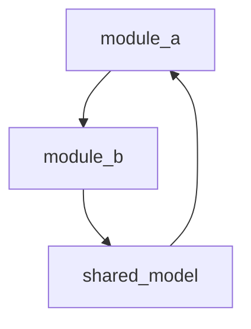

<!--
--- SKILL_META ---
skill_schema: 1
origin: l9-code-analysis
layer: reference
role: analysis_kernel
tags: [analysis, dependency, graph, circular, impact]
owner: igor_beylin
status: active
version: 1.0.0
updated: 2026-06-06
sources:
  - harvested: analysis-dependency-map (Suite-5 legacy, adapted from n8n workflows to code/modules)
--- /SKILL_META ---

Purpose:
Structured dependency analysis for codebases, modules, and services — not n8n workflows.
-->

# Dependency Analysis

Load when mapping module wiring, import graphs, blast radius, or architecture before refactors.

## Workflow

```text
1. Enumerate targets (modules, packages, services, entrypoints)
2. Extract outgoing deps (imports, manifest depends, API calls, shared models)
3. Extract incoming deps (who imports / depends on this target)
4. Build graph → run four analyses below
5. Output map + ranked recommendations
```

## Required Analyses

| Analysis | Question | Action if found |
|----------|----------|-----------------|
| **Circular deps** | Any A→B→…→A cycle? | MUST report; propose break point |
| **Critical path** | Nodes with high fan-in or fan-out? | Flag single points of failure |
| **Orphans** | Unreferenced modules/files? | Mark deprecated or document intent |
| **Bottlenecks** | Sync chains blocking many callers? | Rank latency / coupling risk |

## Evidence Rules

- Cite `__manifest__.py` depends, import statements, or wiring scripts — do not invent edges.
- For PlasticOS: run `python3 scripts/check_module_wiring.py` and `python3 ci/check_circular_deps.py` when available.
- For cross-repo graphs: prefer `l9-code-graph-rag-mcp` importers/impact tools when indexed.

## Output Skeleton

```markdown
## Dependency Map: {target}

### Graph Summary
- Nodes: N · Edges: N · Cycles: N

### Critical Path
| Node | Fan-in | Fan-out | Risk |
|------|--------|---------|------|

### Circular Dependencies
| Cycle | Suggested break |

### Orphans
| Path | Notes |

### Recommendations
| # | Finding | Priority | Fix |
|---|---------|----------|-----|
```

## Mermaid (optional)

Use when stakeholders need a visual; keep node labels short.


