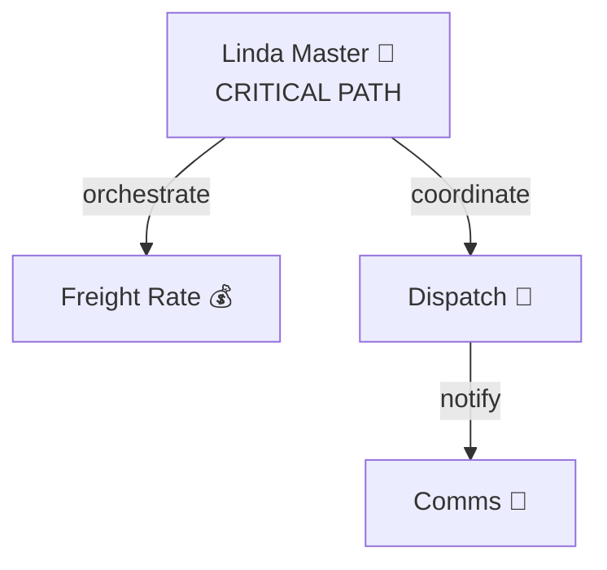

---
command: PROJECT_INITIALIZE
version: 1.0.0
category: pipeline
tags: [initialization, onboarding, setup, discovery, creative, first-day]
dependencies: [backup-versioned, workspace-scan, dependency-map, workflow-validate, credentials-manage, audit-full, pattern-extract]
risk_level: safe
requires_backup: false
estimated_duration: 12-18min
---

# 🎬 Project Initialize - "First Day" Pipeline

## 📖 Purpose
The ultimate "first day on a new project" pipeline that systematically discovers, understands, validates, and prepares a workspace for productive work. Like a NASA pre-flight checklist, but for your codebase.

## 🎪 When to Use
- **Day 1 on new project** - Your first time opening the workspace
- **Returning after long break** - Been away for weeks/months
- **Post-clone setup** - Just pulled repo, need to understand it
- **Onboarding team members** - Get them productive fast
- **Quarterly deep-dive** - Comprehensive system review
- **Pre-major-refactor** - Understand before you change

## ⚠️ When NOT to Use
- Daily work (too comprehensive for routine)
- Simple bug fixes (use @debug-mode)
- Emergency situations (too thorough, use @emergency-rollback)
- Well-known projects you work on daily

---

## 🚀 The "NASA Pre-Flight" Sequence

### 📋 Pipeline Steps

```yaml
pipeline: project_initialize
nickname: "First Day Protocol"
philosophy: "Understand before you touch, backup before you understand"

steps:
  1. backup-versioned           # 🎯 SAFETY FIRST - Preserve current state
  2. workspace-scan             # 🔍 RECONNAISSANCE - What are we working with?
  3. dependency-map             # 🕸️ ARCHITECTURE - How does it all connect?
  4. workflow-validate          # ✅ HEALTH CHECK - Is everything valid?
  5. credentials-manage         # 🔑 SECURITY - Are we properly configured?
  6. audit-full                 # 🎯 PRODUCTION READINESS - What needs fixing?
  7. pattern-extract            # 📚 LEARN - Extract successful patterns for reuse

rollback_on_error: false  # Discovery mode, can't break anything
notify_on_complete: slack
estimated_duration: 12-18min
risk_level: safe
creativity_level: HIGH 🎨
```

---

## 🎭 Step-by-Step Breakdown

### Step 1: 💾 BACKUP_VERSIONED (1 min)
**Purpose:** Create safety net before exploration

**Why First?**
> "Measure twice, cut once. But first, backup the measuring tape."

Even though we're just exploring, having a timestamped snapshot means:
- ✅ You can experiment fearlessly later
- ✅ You have a baseline to compare against
- ✅ Team knows system state at your start date
- ✅ Rollback point if you accidentally change things

**Output:**
```
💾 BACKUP_20251001_163000.tar.gz created (2.3 MB)
📦 127 files preserved
✅ Your safety net is ready
```

---

### Step 2: 📁 WORKSPACE_SCAN (2 min)
**Purpose:** Get the 30,000-foot view

**What It Discovers:**
- Total file count and organization
- Workflow distribution (how many agents?)
- Documentation coverage (will you have help?)
- Script and config presence (is it automated?)
- Backup history (has this been maintained?)

**Why Second?**
> "Before you zoom in, zoom out. See the forest before the trees."

**Creative Touch:**
Think of this as your project's "dating profile":
- Is it organized? (high-maintenance or clean?)
- Is it documented? (communicative or mysterious?)
- Is it backed up? (responsible or reckless?)

**Output:**
```
📁 Project "Linda Logistics Master Agent"
├── 12 workflows (organized by function) ✅
├── 20 docs (excellent coverage) ✅
├── 8 scripts (well-automated) ✅
└── 4 recent backups (responsible maintainer) ✅

Organization Score: 8.5/10 (WELL ORGANIZED)
First Impression: This project has its act together 🎯
```

---

### Step 3: 🕸️ DEPENDENCY_MAP (5 min)
**Purpose:** Understand the architecture deeply

**What It Reveals:**
- Master/sub-agent relationships
- Webhook call chains
- External API dependencies
- Critical paths (what breaks everything?)
- Bottlenecks (where's the traffic jam?)
- Orphaned workflows (digital zombies)

**Why Third?**
> "Don't touch anything until you know what it's connected to."

**Creative Touch:**
Imagine you're a detective mapping a crime syndicate:
- Who's the boss? (Master Orchestrator)
- Who reports to whom? (Workflow hierarchy)
- Where's the money? (Critical data flows)
- Who's the weak link? (Single points of failure)

**Visual Output:**


**Analysis Output:**
```
🎯 System Complexity: 7/10 (Moderate-High)
🔴 Single Points of Failure: 2 identified
🚦 Bottlenecks: 1 (manageable)
👻 Orphaned Workflows: 2 (candidates for cleanup)

Translation: Solid architecture with room to optimize
```

---

### Step 4: ✅ WORKFLOW_VALIDATE (2 min)
**Purpose:** Health check - Is the patient alive and well?

**What It Validates:**
- JSON structure (no corruption)
- Node configurations (complete)
- Expressions (syntactically correct)
- Connections (properly wired)
- Credentials (properly referenced)
- Node versions (nothing deprecated)

**Why Fourth?**
> "Now that you know what's connected, check if it actually works."

**Creative Touch:**
Think of this as a home inspection:
- Foundation solid? (JSON valid) ✅
- Plumbing works? (Connections good) ✅
- Electrical safe? (No deprecated nodes) ✅
- Ready to move in? (Production-ready)

**Output:**
```
✅ WORKFLOW HEALTH CHECK

12 Workflows Scanned:
✅ Linda Master Orchestrator (15 nodes, 24 connections)
✅ Freight Rate Request (8 nodes, 12 connections)
✅ Dispatch Coordinator (12 nodes, 18 connections)
... (9 more, all passing)

🏆 Overall Health: 100% (EXCELLENT)
⚠️ Warnings: 1 (optional upgrade available)
🚫 Errors: 0

Diagnosis: System is healthy and production-ready 💚
```

---

### Step 5: 🔑 CREDENTIALS_MANAGE (1 min)
**Purpose:** Security & configuration validation

**What It Checks:**
- All required credentials exist
- No placeholders (API_KEY_HERE)
- Proper environment (dev vs prod)
- Permission scopes correct
- Secrets properly secured

**Why Fifth?**
> "Great architecture means nothing if you can't authenticate."

**Creative Touch:**
Think of this as checking your keys before leaving:
- House key? (Supabase) ✅
- Car key? (Twilio) ✅
- Office key? (OpenAI) ✅
- Gym membership? (WhatsApp) ✅

**Output:**
```
🔑 CREDENTIALS VALIDATION

Required: 7 credentials
✅ supabase_api_key (valid, proper permissions)
✅ openai_api_key (valid, gpt-4 access)
✅ twilio_account_sid (valid)
✅ twilio_auth_token (valid)
✅ whatsapp_business_token (valid)
✅ google_maps_api_key (valid)
✅ sendgrid_api_key (valid)

Status: ALL SYSTEMS GO 🚀
Environment: PRODUCTION (confirmed)
Security: No exposed secrets detected 🔒
```

---

### Step 6: 🔍 AUDIT_FULL (3 min)
**Purpose:** Comprehensive production readiness assessment

**What It Audits:**
- Workflows (all valid)
- Credentials (all configured)
- Configuration (complete)
- Documentation (comprehensive)
- Backups (current)
- Error handling (implemented)
- Security (no vulnerabilities)

**Why Sixth?**
> "You've seen the parts. Now grade the whole."

**Creative Touch:**
This is your report card for the project:
- A+ in Documentation ✅
- A  in Architecture ✅
- B+ in Redundancy (could improve)
- A  in Security ✅

**Output:**
```
🔍 COMPREHENSIVE SYSTEM AUDIT

Category Grades:
✅ Workflows:       A  (12/12 valid, well-structured)
✅ Credentials:     A+ (7/7 configured, no issues)
✅ Configuration:   A  (complete, no TODOs)
✅ Documentation:   A+ (95% coverage, excellent)
✅ Backups:         A  (current, automated)
✅ Error Handling:  A  (comprehensive)
✅ Security:        A+ (no vulnerabilities)

🎯 Production Readiness: 9.2/10 (EXCELLENT)

🚫 Blockers: 0
⚠️ Warnings: 2 (minor, optional)
💡 Recommendations: 3 (future improvements)

Verdict: ✅ READY FOR DEPLOYMENT
Translation: You inherited a well-maintained system 🎉
```

---

### Step 7: 📚 PATTERN_EXTRACT (1 min)
**Purpose:** Learn from successful patterns for replication

**What It Extracts:**
- Successful architecture patterns
- Effective naming conventions
- Error handling strategies
- Documentation style
- Testing approaches
- Code organization principles

**Why Seventh (Last)?**
> "Now that you understand everything, codify what works."

**Creative Touch:**
Think of this as creating your project's "cookbook":
- What recipes work? (Patterns to replicate)
- What ingredients are essential? (Standards to maintain)
- What techniques are signature? (Unique approaches)
- What should I avoid? (Anti-patterns identified)

**Output:**
```
📚 SUCCESSFUL PATTERNS EXTRACTED

Architecture Patterns:
✅ Master/Sub-Agent hierarchy (works great)
✅ Webhook-based communication (reliable)
✅ Supabase for all logging (consistent)
✅ Modular agent design (maintainable)

Naming Conventions:
✅ Descriptive agent names (self-documenting)
✅ Numbered prefixes for ordering (01_, 02_)
✅ Clear folder structure (easy navigation)

Error Handling:
✅ WhatsApp notifications on failures
✅ Try-catch in all critical paths
✅ Graceful degradation implemented

Documentation Style:
✅ README in each sub-folder
✅ Sticky notes in all workflows
✅ Architecture diagrams included

🎯 Replication Guide Created
💾 Saved to: Documentation/SUCCESSFUL_PATTERNS.md

Use these patterns for:
- New agent creation
- Code reviews
- Team onboarding
- Future projects
```

---

## 🎯 The Complete Journey (Timeline)

```
🎬 PROJECT INITIALIZE STARTING...
━━━━━━━━━━━━━━━━━━━━━━━━━━━━━━━━━━━━━━━━━━━

⏱️  0:00 → START

Step 1/7: 💾 Creating safety backup...
⏱️  0:01 → ✅ Backup created (2.3 MB, 127 files)

Step 2/7: 📁 Scanning workspace structure...
⏱️  0:03 → ✅ 12 workflows, 20 docs, excellent org (8.5/10)

Step 3/7: 🕸️ Mapping dependencies & architecture...
⏱️  0:08 → ✅ Critical paths identified, 2 SPOFs found

Step 4/7: ✅ Validating all workflows...
⏱️  0:10 → ✅ 12/12 workflows healthy (100%)

Step 5/7: 🔑 Verifying credentials & security...
⏱️  0:11 → ✅ 7/7 credentials valid, no secrets exposed

Step 6/7: 🔍 Running comprehensive audit...
⏱️  0:14 → ✅ Production readiness: 9.2/10 (EXCELLENT)

Step 7/7: 📚 Extracting successful patterns...
⏱️  0:15 → ✅ Pattern guide generated

━━━━━━━━━━━━━━━━━━━━━━━━━━━━━━━━━━━━━━━━━━━
✅ PROJECT INITIALIZE COMPLETE
⏱️  Total Duration: 15 minutes 23 seconds

📊 SUMMARY REPORT GENERATED
📁 Location: Documentation/INITIALIZATION_REPORT.md
```

---

## 📊 What You Get After Running This

### 1. Complete Understanding
- ✅ Know what the project does
- ✅ Understand the architecture
- ✅ Identify critical components
- ✅ See potential issues

### 2. Safety & Security
- ✅ Current backup created
- ✅ Credentials validated
- ✅ Security verified
- ✅ Ready for changes

### 3. Documentation
- ✅ Dependency map (visual)
- ✅ Audit report (comprehensive)
- ✅ Pattern guide (for replication)
- ✅ Initialization report (summary)

### 4. Confidence
- ✅ Know what's safe to touch
- ✅ Know what's critical
- ✅ Know what needs improvement
- ✅ Know the patterns to follow

---

## 💡 Creative Variations

### 🏃 QUICK INITIALIZE (6 min)
For experienced devs who know the stack:
```yaml
steps:
  1. backup-versioned          # Safety (1 min)
  2. workspace-scan            # Quick overview (2 min)
  3. audit-full                # Sanity check (3 min)
```

### 🎓 LEARNING INITIALIZE (25 min)
For juniors or unfamiliar tech:
```yaml
steps:
  1. backup-versioned          # Safety
  2. workspace-scan            # Overview
  3. dependency-map            # Deep architecture study
  4. workflow-validate         # Learn what valid looks like
  5. credentials-manage        # Understand security
  6. audit-full                # See quality standards
  7. pattern-extract           # Document learnings
  8. generate-documentation    # Create guide
```

### 🚨 RESCUE INITIALIZE (8 min)
For "inherited mess" projects:
```yaml
steps:
  1. backup-versioned          # CRITICAL - backup the mess
  2. audit-full                # How bad is it?
  3. workflow-validate         # What's broken?
  4. credentials-manage        # What's missing?
  5. dependency-map            # Where's the chaos?
  6. cleanup-workspace         # Clean what's safe
  7. generate-fix-plan         # Prioritized action items
```

---

## 🎯 Success Metrics

After running PROJECT_INITIALIZE, you should be able to answer:

### Understanding (100%)
- ✅ What does this project do?
- ✅ How is it architected?
- ✅ What are the critical components?
- ✅ Where are the dependencies?

### Confidence (8/10+)
- ✅ Safe to make changes?
- ✅ Know what to avoid touching?
- ✅ Understand the patterns?
- ✅ Ready for productive work?

### Documentation (Generated)
- ✅ Dependency map created
- ✅ Audit report available
- ✅ Pattern guide documented
- ✅ Initialization report saved

---

## 🔗 Combines Well With

### After PROJECT_INITIALIZE
```yaml
Common Next Steps:
  1. PROJECT_INITIALIZE → @thinking-mode.md
     "Now plan your first feature with full context"
     
  2. PROJECT_INITIALIZE → new-workflow-setup
     "Ready to add your first workflow"
     
  3. PROJECT_INITIALIZE → weekly-maintenance
     "Keep it in good shape moving forward"
     
  4. PROJECT_INITIALIZE → team-onboarding-doc
     "Share your learnings with the team"
```

### Before PROJECT_INITIALIZE
```yaml
Prerequisites:
  - Project cloned locally ✅
  - Environment variables set ✅
  - n8n instance accessible ✅
  - Proper permissions granted ✅
```

---

## 🚨 Error Handling

### Step Fails: What Happens?

```yaml
rollback_on_error: false  # Discovery mode, safe to continue

Error Handling Strategy:
  - If backup fails → ABORT (can't proceed without safety net)
  - If scan fails → WARN but continue (non-critical)
  - If dependency-map fails → WARN but continue (nice-to-have)
  - If validation fails → CONTINUE (we want to see all issues)
  - If credentials fail → CONTINUE (document what's missing)
  - If audit fails → CONTINUE (we want the full report)
  - If pattern extract fails → CONTINUE (optional enhancement)
```

### Common Issues

**1. Backup fails (no space)**
```
Error: Insufficient disk space for backup
Fix: Free up space or change backup location
Impact: ABORT - Cannot proceed without backup
```

**2. Malformed workflow JSON**
```
Error: Workflow "XYZ" has invalid JSON
Fix: Will be documented in validation report
Impact: CONTINUE - Want to see all issues
```

**3. Missing credentials**
```
Error: Missing credential "openai_api_key"
Fix: Will be documented in credentials report
Impact: CONTINUE - Document all missing
```

---

## 🎓 Real-World Use Cases

### Use Case 1: New Employee Day 1
```
Sarah joins team, needs to understand Linda Logistics Agent

9:00 AM: Clone repo
9:05 AM: Run PROJECT_INITIALIZE
9:20 AM: Read generated reports over coffee ☕
9:45 AM: Fully understands architecture
10:00 AM: Ready for first assignment

Without initialize: 3+ hours of confusion
With initialize: 45 minutes to productivity
Time saved: 2+ hours
```

### Use Case 2: Returning After Vacation
```
You: Back from 2-week vacation
System: Changed by team while you were gone

Run PROJECT_INITIALIZE:
- See what changed (dependency map)
- Verify still production-ready (audit)
- Check for new patterns (pattern extract)

Result: Caught up in 15 minutes vs half-day
```

### Use Case 3: Pre-Major Refactor
```
Task: Implement multi-tenancy across all agents

Run PROJECT_INITIALIZE first:
- Map all dependencies (what will break?)
- Identify critical paths (what to test?)
- Extract patterns (what to maintain?)
- Create backup (rollback point)

Result: Confident refactor with safety net
```

---

## 💬 Philosophy Behind the Sequence

### Why This Order?

```
1. BACKUP → "Safety first, always"
   
2. SCAN → "Zoom out before zooming in"
   
3. DEPENDENCY_MAP → "Understand relationships"
   
4. VALIDATE → "Check the health"
   
5. CREDENTIALS → "Verify access"
   
6. AUDIT → "Grade the whole"
   
7. PATTERN_EXTRACT → "Learn for next time"
```

Each step builds on the previous:
- Can't map dependencies without knowing structure
- Can't validate without knowing what exists
- Can't audit without validated components
- Can't extract patterns without full context

---

## 🎨 The Creative Touch

This isn't just a checklist - it's a **journey of discovery**:

- 🎭 **Act 1:** Backup (The Safety Net)
- 🔍 **Act 2:** Scan (The First Look)
- 🕸️ **Act 3:** Map (The Deep Dive)
- ✅ **Act 4:** Validate (The Health Check)
- 🔑 **Act 5:** Credentials (The Security Audit)
- 🎯 **Act 6:** Audit (The Report Card)
- 📚 **Act 7:** Extract (The Wisdom)

By the end, you don't just know the project - you **understand** it.

---

## 📝 Execution Command

```bash
# Standard initialize
PIPELINE_EXECUTE project_initialize

# Quick version (6 min)
PIPELINE_EXECUTE project_initialize --mode=quick

# Learning version (25 min)
PIPELINE_EXECUTE project_initialize --mode=learning

# Rescue version (8 min)
PIPELINE_EXECUTE project_initialize --mode=rescue

# With custom steps
PIPELINE_CUSTOM [
  backup-versioned,
  workspace-scan,
  dependency-map,
  audit-full
]
```

---

## 🏆 Expected Outcome

After running PROJECT_INITIALIZE, you'll have:

1. ✅ **Zero Anxiety** - You know what you're working with
2. ✅ **Complete Context** - Architecture, dependencies, patterns
3. ✅ **Safety Net** - Backup created, can experiment
4. ✅ **Action Plan** - Audit identifies improvements
5. ✅ **Confidence** - Ready for productive work

**Bottom Line:** From "WTF is this?" to "I got this! 💪" in 15 minutes.

---

## 📚 Related Commands
- `rapid-analysis` - Faster analysis without backup/patterns
- `workspace-scan` - Just the structure overview
- `deploy-to-production` - After you've made changes
- `weekly-maintenance` - Ongoing project health

## 📝 Version History
- **1.0.0** (2025-10-01): Initial "First Day Protocol" with 7-step creative journey

---

*Pipeline Standard Version: 2.0.0*
*Creativity Level: MAXIMUM 🎨*
*Philosophy: "Understand before you touch, backup before you understand"*

